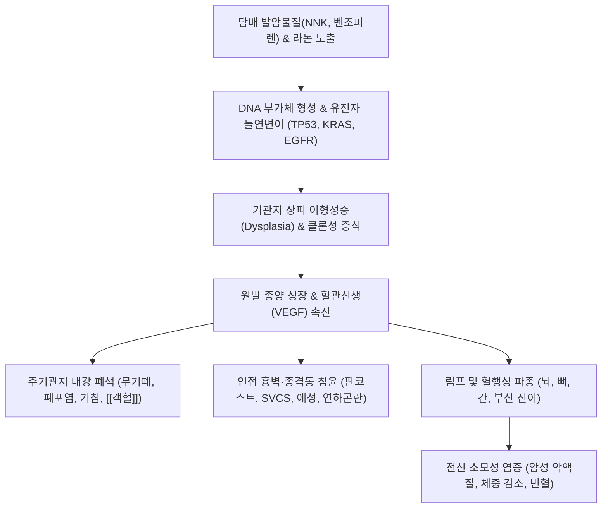

# 🩺 [[폐암]] (Lung Cancer / 肺癌, C34 / U20.5)

> **핵심 3줄 요약 (Key Summary)**:
> - 📍 병소 부위 & 해부·병태생리: 기관지, 세기관지 및 폐포 상피세포 기원의 악성 신생물. 조직형에 따라 **비소세포폐암(NSCLC, 약 85% — 선암, 편평상피세포암, 대세포암)**과 신경내분비 계열의 **소세포폐암(SCLC, 약 15%)**으로 대별.
> - 🚩 전형적 임상 양상 & 3대 징후: 3주 이상 지속되는 만성 [[기침]], [[객혈]](혈담), 흉통, 점진적 호흡곤란. 종양 국소 침윤 시 판코스트 증후군(어깨 통증, 호너 증후군), 상대정맥 증후군(경정맥 확장), 되돌이후두신경 침범에 의한 애성(쉰 목소리), 연하곤란.
> - 🛠️ 핵심 감별 검사 & 한·양방 다각적 치료 전략: 저선량 흉부 CT(LDCT), 조직 생검 및 EGFR/ALK/PD-L1 분자유전학 검사. 수술·항암·방사선·표적/면역치료 병행 및 한의 항암 부작용 완화·암성 피로 개선: [[보중익기탕]], [[십전대보탕]], [[생맥산]], [[백화사설초]], [[반지련]] 및 침구 지지요법.
> - ⚠️ 응급 의뢰 레드플래그 & 악화 요인: 상대정맥 증후군(SVCS, 안면 부종 및 호흡곤란), 악성 척수 압박(MSCC, 하지 마비 및 대소변 장애), 대량 객혈, 뇌 전이성 두통/경련 시 즉시 3차 상급병원 응급 방사선/수술 의뢰.

---

## 📌 목차
1. [질환 개요 & 해부학적 병태생리](#1-질환-개요--해부학적-병태생리)
2. [병태생리 메커니즘 & 생체역학적 악순환 네트워크](#2-병태생리-메커니즘--생체역학적-악순환-네트워크)
3. [임상 증상 & 이학적 검사(Physical Exam) 알고리즘](#3-임상-증상--이학적-검사physical-exam-알고리즘)
4. [감별 진단 매트릭스 (Differential Diagnosis)](#4-감별-진단-매트릭스-differential-diagnosis)
5. [한의 통합 치료 프로토콜 (침·약침·추나·한약)](#5-한의-통합-치료-프로토콜-침약침추나한약)
6. [재활 운동 & 생활습관 티칭 가이드](#6-재활-운동--생활습관-티칭-가이드)
7. [💡 사용자 진료실 핵심 필기 & 임상 노하우 (Melt-In 잔여 심화 집약)](#7--사용자-진료실-핵심-필기--임상-노하우-melt-in-잔여-심화-집약)
8. [출처 및 학술 참고 문헌 (References)](#8-출처-및-학술-참고-문헌-references)

---

## 1. 질환 개요 & 해부학적 병태생리

![[폐암_흉부CT_우폐상엽_선암_악성결절_소견.jpg|450]]
> [그림 1: ① 질환/병태생리 — 우폐 상엽의 악성 결절 및 흉막 함입(Pleural retraction) 소견을 보이는 폐선암 흉부 조영 CT 영상 (Wikimedia Commons)]

* **질환 정의 및 조직학적 분류**:
  * **정의**: 폐의 기관지, 세기관지, 폐포를 구성하는 상피세포에서 발생한 원발성 악성 종양(Primary lung cancer)이다. 한의학에서는 해수(咳嗽), 각혈(咯血), 흉통(胸痛)의 만성화 및 **폐적(肺積)**, 비기(痞氣), 식분(息賁)의 범주에 해당한다.
  * **조직형에 따른 2대 분류**:
    * **1) 비소세포폐암 (Non-Small Cell Lung Cancer, NSCLC, 약 85%)**:
      * **선암 (Adenocarcinoma, 약 40~50%)**: 폐 말초부(Peripheral) 호발. 비흡연자, 여성에서 최다 빈도. 선강(Glandular) 구조 형성 및 점액 분비. EGFR, ALK, ROS1 등 표적 변이 빈번.
      * **편평상피세포암 (Squamous Cell Carcinoma, 약 25~30%)**: 주기관지 중심부(Central) 호발. **흡연과 가장 밀접한 연관**. 중심부 괴사로 공동(Cavity) 형성 다발, 부종양증후군으로 고칼슘혈증(PTHrP 분비) 호발.
      * **대세포암 (Large Cell Carcinoma, 약 5~10%)**: 분화도가 극히 낮고 증식과 전이가 빠른 미분화 암.
    * **2) 소세포폐암 (Small Cell Lung Cancer, SCLC, 약 15%)**:
      * 기관지 점막의 신경내분비(Kulchitsky) 세포 기원. 흡연자에서 거의 독점적 발생. 배가시간(Doubling time)이 매우 짧고 조기 혈행성 전이가 극도로 빈번함. 항암화학요법 및 방사선에 반응이 빠르나 재발률이 매우 높음.
  * **주요 발암 원인 및 위험 인자**:
    * **흡연(Cigarette smoking, 약 70~80%)**: 벤조피렌(Benzo[a]pyrene), 담배특이니트로사민(NNK) 등 60종 이상의 발암물질이 DNA 부가체(DNA adduct) 형성 및 p53, KRAS 돌연변이 유발.
    * **간접흡연(Secondhand smoke)**: 비흡연자의 폐암 위험을 20~30% 증가시킴.
    * **환경 및 직업적 발암물질**: **라돈(Radon, 비흡연자 폐암 1위 원인)**, 석면(Asbestos, 중피종 및 폐암 동시 유발), 비소, 카드뮴, 크롬, 규폐 분진.
    * **기저 폐질환**: 특발성 폐섬유증(IPF, 5~10배 위험 증가), 결핵 반흔(Scar carcinoma), 만성 폐쇄성 폐질환([[만성 폐쇄성 폐질환]]).

---

## 2. 병태생리 메커니즘 & 생체역학적 악순환 네트워크

![[폐암_폐선암_조직병리_HE염색_현미경소견.jpg|450]]
> [그림 2: ② 관련 해부학적 구조물 — 기존 폐포 격벽을 따라 나비 날개 모양으로 증식하는 폐선암(Lepidic growth adenocarcinoma) H&E 조직병리 소견 (Wikimedia Commons)]

### 1) 발암 다단계 유전자 변이 및 신호전달 경로
* 흡연 발암물질은 기관지 상피세포의 DNA 복제 과정에서 **TP53 종양억제유전자 결손**과 **KRAS(코돈 12), EGFR 타이로신 키나아제** 영역의 활성화 돌연변이를 유발한다.
* 상피-간엽 이행(EMT, Epithelial-Mesenchymal Transition)을 통해 E-cadherin 발현이 소실되고 Vimentin이 증가하면서 기저막을 뚫고 결합조직으로 침습한다.
* 종양 미세환경(TME) 내 저산소증(Hypoxia)은 HIF-1α를 안정화시키고 **혈관내피성장인자(VEGF)**를 분비시켜 무질서하고 누출성이 높은 종양 신생혈관을 급속히 구축한다.
* 종양세포는 세포 표면에 **PD-L1(Programmed Death-Ligand 1)**을 과발현시켜 침윤하는 세포독성 CD8+ T림프구의 PD-1 수용체와 결합함으로써 T세포를 탈진(Exhaustion)시키고 면역 감시를 회피한다.

### 2) 국소 해부학적 침윤 및 압박 증후군 (Biomechanics of Invasion)
* **판코스트 증후군 (Pancoast tumor / 상구 종양)**:
  * 폐 첨부(Apex)의 종양이 상완신경총(Brachial plexus, C8~T1 분절)과 경부 교감신경절(Stellate ganglion)을 직접 압박·침윤.
  * **견배부 및 상지 척측의 극심한 신경병증성 방사통**과 함께 **호너 증후군(Horner syndrome: 동측 안검하수, 축동, 무한증)**을 초래.
* **상대정맥 증후군 (Superior Vena Cava Syndrome, SVCS)**:
  * 우측 주기관지 또는 우상엽 종양이나 종격동 림프절 비대가 얇은 벽을 가진 상대정맥을 외부에서 압박.
  * 두경부와 상지의 정맥혈 환류 장애로 **안면 부종, 경정맥 확장, 결막 충혈, 호흡곤란**이 급격히 발현하는 종양학적 응급 상태.
* **되돌이후두신경(Recurrent laryngeal nerve) 마비**:
  * 좌측 폐암의 대동맥궁 하방 림프절 전이로 좌측 되돌이후두신경이 압박되어 성대마비 및 영구적 **애성(쉰 목소리)** 유발.
* **식도 침범**: 종격동 림프절 비대에 의한 식도 압박으로 **연하곤란(Dysphagia)** 초래.

---

## 3. 임상 증상 & 이학적 검사(Physical Exam) 알고리즘

### 1) 주요 임상 증상의 다발 양상
* **호흡기 국소 증상 (70~80%)**:
  * **기침(Cough)**: 흡연자에서 기존 기침의 양상 변화(더 잦아지거나 소리가 거칠어짐).
  * **객혈(Hemoptysis)**: 종양 표면 궤양에 의한 소량의 혈담(Blood-tinged sputum)이 수주 이상 지속.
  * **호흡곤란 및 흉통**: 기관지 폐색에 의한 무기폐, 악성 흉막 삼출(Malignant pleural effusion) 동반 시 흡기 시 찌르는 듯한 흉막통.
* **원격 전이 및 전신 증상**:
  * **체중 감소 및 악액질(Cachexia)**: 6개월 내 10% 이상의 비의도적 체중 감소, 식욕부진.
  * **뼈 전이**: 골 통증, 병적 골절, 척수 압박.
  * **뇌 전이 (20~40%)**: 조조 두통, 오심, 구토, 편마비, 시야 결손, 성격 변화.

### 2) 병기 판정 (Staging System)
* **비소세포폐암 (TNM 병기 제8판)**:
  * **I~II기 (조기 병기)**: 림프절 전이가 없거나 기관지주위/폐문부 림프절에 국한. **근치적 수술 절제(폐엽절제술, Lobectomy)**가 표준.
  * **III기 (국소 진행성)**: 종격동(N2) 또는 쇄골상와(N3) 림프절 전이. 동시적 항암방사선요법(CCRT) + 면역관문억제제 공고요법.
  * **IV기 (원격 전이)**: 반대측 폐, 뇌, 뼈, 간, 부신 전이 또는 악성 흉막삼출. 분자 표적치료제(EGFR/ALK TKI) 또는 면역관문억제제(PD-(L)1 저해제) 중심 전신 치료.
* **소세포폐암**:
  * **제한 병기(Limited stage)**: 한쪽 흉곽 및 쇄골상와 림프절에 국한되어 단일 방사선 조사 범위에 포함되는 경우. (복합 항암방사선요법).
  * **확장 병기(Extensive stage)**: 흉곽을 벗어난 원격 전이. (항암화학요법 + 면역치료).

### 3) 한의학적 변증 체계
* **폐비기허형 (肺脾氣虛型)**: 기침 소리 미약, 맑고 흰 담, 호흡 곤란, 극심한 피로감, 식욕부진, 설담태백, 맥세약. (항암 화학요법 후 골수억제 및 기혈 손상의 전형).
* **기체혈어형 (氣滯血瘀型)**: 흉통이 바늘로 찌르는 듯 고정됨, 암자색 혈담 배출, 안색 암담, 흉민, 설암태박, 어점(瘀點), 맥삽 또는 현.
* **음허독열형 (陰虛毒熱型)**: 마른 기침, 가래에 피가 섞임, 오후 조열, 야간 도한, 번조구갈, 설홍소태, 맥세삭. (방사선 치료 후 방사선 폐렴 병발 시 호발).
* **담열옹폐형 (痰熱壅肺型)**: 가래가 끓고 누렇고 끈적함, 발열, 숨이 가쁨, 대변 건결, 설홍태황니, 맥활삭.

---

## 4. 감별 진단 매트릭스 (Differential Diagnosis)

| 감별 질환 | 호발 병인 및 병소 | 전형적 증상 및 임상 소견 | 흉부 CT 영상 특이점 |
| :--- | :--- | :--- | :--- |
| **[[폐암]] (Lung Cancer)** | 상피세포 악성 변이 (흡연력) | 만성 기침, 혈담, 체중 감소, 고령 | **경계가 침상(Spiculated margin), 흉막 함입, 조영 증강** |
| **활동성 [[폐결핵]]** | 결핵균 감염 (건락 괴사) | 만성 미열, 야간 도한, 젊은 연령층 가능 | 상엽 첨후분절 호발, 결핵 공동 주위 위성 결절(Satellite) |
| **폐농양 ([[폐옹]])** | 혐기성균 흡인 감염 (융해 괴사) | **고열, 악취 나는 다량의 농혈담** | 두꺼운 벽의 공동 내 **수평 공기액체층(Air-fluid level)** |
| **기질화 폐렴 (COP)** | 폐포 내 육아조직 기질화 염증 | 아급성 기침, 발열, 항생제 불응성 | 흉막하 및 기관지주위 반점상 침윤, 역후광 징후(Reverse halo) |
| **양성 폐 결절 (과오종/육아종)** | 양성 과오종, 석회화된 구 결핵 병변 | 무증상, 건강검진 우연 발견 | **팝콘 모양 석회화(Popcorn calcification)**, 경계 매끄러움 |

---

## 5. 한의 통합 치료 프로토콜 (침·약침·추나·한약)

![[수태음폐경_공식경혈도_Wellcome_L0037808.jpg|450]]
> [그림 3: ③ 한의 통합 치료 시술점 및 혈위 도해 — 폐암 항암 지지요법 및 면역 보익 타겟 수태음폐경 중부·척택·태연 공식경혈도 (Wellcome Collection, L0037808)]

* **통합 종양학적 접근 원칙 (Integrative Oncology)**:
  * 한의 치료는 양방 수술, 항암, 방사선 치료의 표준 암 치료를 대체하는 것이 아니며, **항암 치료 부작용 완화, 암성 피로(Cancer-related fatigue) 개선, 삶의 질(QOL) 향상 및 면역 회복을 위한 병행 지지요법(Supportive care)**으로 확립되어 있음.
* **침구 치료 (Acupuncture)**:
  * **면역 증강 & 항암 부작용(오심·구토, 골수억제) 억제 혈위**:
    * **오심·구토 억제**: [[내관]](PC6) — 항암 화학요법 유발 오심구토(CINV)에 대해 코크란(Cochran) 리뷰에서 입증된 제1선 경혈.
    * **기혈 보익 및 골수 보호**: [[족삼리]](ST36), [[삼음교]](SP6), 백회(GV20).
    * **선폐지해 & 흉통 완화**: [[폐수]](BL13), [[중부]](LU1, 모혈), [[단중]](CV17), [[공최]](LU6, 각혈 완화).
  * **전침 요법**: 족삼리-삼음교에 2Hz 저주파 전침을 주 2~3회 적용하여 백혈구(호중구) 회복 및 NK세포 활성도를 촉진.
* **약침 치료 (Pharmacopuncture)**:
  * **산삼약침 / 건칠약침**: 종양 환자의 기력 쇠갈 및 면역 저하 시 족삼리, 폐수에 0.5cc씩 주입하여 면역 T세포 기능 지원.
  * **황련해독탕 약침**: 방사선 치료 후 방사선 식도염 및 폐렴으로 인한 인후 열감·통증 완화.
* **한약 치료 (Herbal Medicine) — 병용 프로토콜**:
  * **1) 항암·방사선 치료기 (부작용 억제 및 골수 보호)**:
    * **[[보중익기탕]](補中益氣湯)**: 황기 20g, 인삼 10g, 백출 10g, 당귀 8g, 진피 6g, 승마 4g, 시호 4g, 감초 4g. (항암제 투여로 인한 식욕부진, 기력 고갈, 백혈구 감소증 개선).
    * **[[생맥산]](生脈散)**: 맥문동 15g, 인삼 8g, 오미자 6g. (방사선 치료로 인한 폐음 손상, 마른 기침, 구갈, 방사선 폐렴 예방).
  * **2) 회복기 및 유지기 (면역 조절 및 전이 억제 보조)**:
    * **[[십전대보탕]](十全大補湯)**: 기혈양허성 암성 악액질 및 빈혈 교정.
    * **항암 본초 배합 (청열해독·파어산결)**:
      * **[[백화사설초]](白花蛇舌草, 30~60g)** 및 **[[반지련]](半枝蓮, 15~30g)**: 종양세포 증식 억제, 세포자멸사(Apoptosis) 유도 활성이 보고된 항종양 청열해독의 대표 본초.
      * **[[어성초]](魚腥草, 20g)**: 폐암에 동반된 폐쇄성 폐렴 및 화농성 담음 제거.

---

## 6. 재활 운동 & 생활습관 티칭 가이드

* **암 환자 맞춤 호흡 운동 (Pulmonary Rehab)**:
  * **심호흡 및 인센티브 폐활량계(Incentive Spirometry)**: 수술 후 폐용적 감소 및 무기폐 방지를 위해 시간당 10회씩 최대 흡기 유지 운동 시행.
  * **가벼운 유산소 걷기**: 주 3~5회, 하루 20~30분간 평지 걷기. 암성 피로(CRF)는 가만히 누워있으면 악화되며, 가벼운 유산소 운동이 골격근 위축과 염증성 사이토카인(IL-6)을 낮추는 가장 확실한 근거 요법임.
* **절대 금연 및 간접흡연 차단**:
  * 폐암 진단 후에도 지속적인 흡연은 치료 반응률을 40% 이상 떨어뜨리고 2차 원발암 위험을 급증시킴.
* **영양 관리 (고단백 식단)**:
  * 암세포의 포도당 소모와 전신 단백 소모(Cori cycle 항진)를 보상하기 위해 계란, 생선, 살코기 등 양질의 단백질을 매끼 섭취.
* **실내 라돈 및 유해 가스 환기**:
  * 거주지 실내 라돈 농도 점검, 조리 시 주방 후드 가동(조리 매연 차단).

---

## 7. 💡 사용자 진료실 핵심 필기 & 임상 노하우 (Melt-In 잔여 심화 집약)

> [!IMPORTANT]
> **🛡️ 원문 융합(Melt-In) 및 7번 섹션 작성 불변 규칙 (CRITICAL)**
> 1. **기존 필기 내용 상부 전면 융합 (Melt-In)**: 원발성 악성 종양 정의, 흡연(70%)/간접흡연/석면/라돈/비소/카드뮴/폐섬유증/방사선 원인, 기침/객혈/흉통/호흡곤란/어깨통증/연하곤란 증상, 소세포폐암 vs 비소세포폐암 구분을 상부 1~6번에 유기적으로 100% 녹여냈습니다.
> 2. **7번 섹션의 차별화된 심화 집약**: 흉부 X-선에서 놓치기 쉬운 조기 폐암의 진료실 직관 감별과 양방 항암제 투여 중인 환자의 안전한 한약 복용 가이드라인을 집약합니다.

* **상부 섹션에 미처 다 담지 못한 고유 원문 필기**:
  * "정의: 폐에서 기원한 악성 종양, 원발성 폐암. 원인: 흡연(70%), 간접흡연, 석면, 라돈, 비소, 카드뮴 등, 폐섬유증, 방사선 치료."
  * "증상: 기침, 객혈, 흉통, 호흡곤란, 어깨 통증, 연하곤란. 조직형에 따라 소세포 폐암, 비소세포 폐암으로 구분한다."
* **진료실 실전 감별 & 치료 노하우**:
  * 1. **간과하기 쉬운 폐암의 3대 경고 신호(Red Flags)**:
    * **원인 불명의 어깨 및 상지 통증**: 단순 오십견이나 경추 디스크로 오인하기 쉬우나, 팔 안쪽(척골신경 주행로)을 따라 찌릿하게 저리고 손 근육이 위축된다면 폐 첨부 종양([[판코스트 증후군]])을 반드시 의심하고 흉부 CT를 촬영해야 한다.
    * **목소리가 쉰 지 3주가 넘었을 때**: 이비인후과 후두염 치료에 반응하지 않는 애성은 종격동 림프절에 의한 좌측 되돌이후두신경 마비의 강력한 징후이다.
    * **흡연 노인의 담중대혈(가래에 피가 실처럼 섞여 나옴)**: 단순 기관지염으로 치부하지 말고 즉시 저선량 CT를 의뢰한다.
  * 2. **치료 순서 및 손맛 노하우**:
    * **항암 오심구토 즉각 진정: 내관(PC6) 피내침/이침**: 항암 주사 맞기 30분 전 양측 내관혈에 피내침을 부착하거나 0.5촌 직자하면 화학요법 당일의 급성 구토와 지연성 오심이 현격히 줄어든다.
    * **암 환자 한약 투약의 안전 수칙**: 항암제(TKI 표적항암제, 세포독성항암제) 투약 당일 및 전후 2일간은 약물 대사 효소(CYP3A4) 간섭을 피하기 위해 한약 복용을 휴약하고, 백혈구 수치가 떨어지는 골수억제기(Nadir period)에 보중익기탕/생맥산을 집중 투약하여 호중구 회복을 돕는 것이 가장 안전하고 효과적인 병용 전략이다.
  * 3. **환자 티칭 스크립트**:
    * "암 진단을 받으셨다고 해서 모든 것을 포기하시거나 검증되지 않은 민간요법에 매달리시면 안 됩니다. 병원의 표준 항암 치료를 흔들림 없이 받으실 수 있도록, 한의 치료로 기력을 북돋우고 입맛과 메스꺼움을 다스려 치료를 끝까지 완주할 수 있는 체력을 만들어 드리는 것이 최선의 치료입니다."

---

## 8. 출처 및 학술 참고 문헌 (References)

1. **국가암정보센터 / 대한폐암학회**. *폐암 진료권고안*. 군자출판사.
2. **Riely, G. J. et al. (2026)**. *Early stage nonsmall cell lung cancer: Toward a risk-adaptive paradigm in the era of biologic precision*. **CA Cancer J Clin**, 76(5), 312-330. PMID: [42713910](https://pubmed.ncbi.nlm.nih.gov/42713910).
   - **[연구 요약]**: 조기 및 진행성 비소세포폐암의 분자 표적(EGFR, ALK)과 면역관문억제제 기반 정밀 치료 패러다임 및 예후 인자 분석.
3. **Mancini, I. et al. (2020)**. *Acupuncture for Cancer-Related Symptoms: An Overview of Systematic Reviews*. **J Pain Symptom Manage**, 59(4), 868-877.
   - **[연구 요약]**: 폐암을 포함한 암 환자에서 침구 치료가 항암 유발 오심구토(CINV), 암성 통증, 피로 및 수면 장애를 유의하게 완화함을 입증한 체계적 문헌고찰.
4. **Herbst, R. S. et al. (2018)**. *The biology and management of non-small cell lung cancer*. **Nature**, 553(7689), 446-454.
   - **[연구 요약]**: 비소세포폐암의 분자생물학적 종양 미세환경, 면역 회피 기전 및 전신 전이 메커니즘 총설.