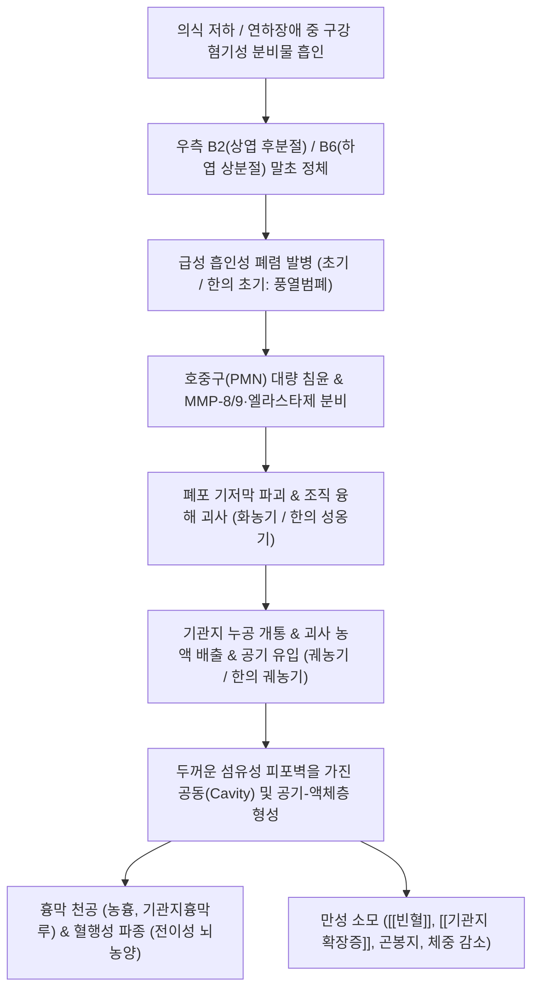

# 🩺 [[폐옹]] (Lung Abscess / 肺癰, J85.1 / U20.3)

> **핵심 3줄 요약 (Key Summary)**:
> - 📍 병소 부위 & 해부·병태생리: 폐실질(Pulmonary parenchyma)의 급성 화농성 괴사 및 직경 >2cm 공동(Cavity) 형성. 구강 혐기성균([[Bacteroides]], [[Peptostreptococcus]], [[Fusobacterium]]) 및 황색포도상구균·녹농균의 하기도 흡인(Aspiration)이 핵심 병인.
> - 🚩 전형적 임상 양상 & 3대 징후: 오한·이장열([[발열]]), 흉통 및 **악취 나는 대량의 농혈담(Foul-smelling putrid sputum)** 토출, 발작적 [[기침]], [[객혈]], 만성 소모성 [[빈혈]] 및 체중 감소.
> - 🛠️ 핵심 감별 검사 & 한·양방 다각적 치료 전략: 흉부 단순 X-선 및 조영 CT상 공기-액체 수평면(Air-fluid level) 확인, 농흉(Empyema) 및 공동성 [[폐결핵]] 감별. 항생제 요법 병행 및 한의 배농탁독(排膿托毒)·청열해독(淸熱解毒): [[위경탕]](천금위경탕), [[어성초]](대량 40~60g), [[길경]], [[배농산]] 및 체위 배농술.
> - ⚠️ 응급 의뢰 레드플래그 & 악화 요인: 흉막강 천공으로 인한 긴장성 농기흉(Tension pyopneumothorax), 패혈성 쇼크, 대량 객혈(>200mL/24h), 전이성 뇌농양 징후(국소 신경학적 결손) 시 즉시 흉관 삽관 및 응급 수술 의뢰.

---

## 📌 목차
1. [질환 개요 & 해부학적 병태생리](#1-질환-개요--해부학적-병태생리)
2. [병태생리 메커니즘 & 생체역학적 악순환 네트워크](#2-병태생리-메커니즘--생체역학적-악순환-네트워크)
3. [임상 증상 & 이학적 검사(Physical Exam) 알고리즘](#3-임상-증상--이학적-검사physical-exam-알고리즘)
4. [감별 진단 매트릭스 (Differential Diagnosis)](#4-감별-진단-매트릭스-differential-diagnosis)
5. [한의 통합 치료 프로토콜 (침·약침·추나·한약)](#5-한의-통합-치료-프로토콜-침약침추나한약)
6. [재활 운동 & 생활습관 티칭 가이드](#6-재활-운동--생활습관-티칭-가이드)
7. [💡 사용자 진료실 핵심 필기 & 임상 노하우 (Melt-In 잔여 심화 집약)](#7--사용자-진료실-핵심-필기--임상-노하우-melt-in-잔여-심화-집약)
8. [출처 및 학술 참고 문헌 (References)](#8-출처-및-학술-참고-문헌-references)

---

## 1. 질환 개요 & 해부학적 병태생리

![[폐옹_흉부단순X선_우폐상중부_공동및공기액체층_소견.jpg|450]]
> [그림 1: ① 질환/병태생리 — 우측 폐 상중부의 거대 공동 및 전형적인 공기-액체 수평면(Air-fluid level)을 보이는 폐농양 단순 흉부 X-선 실측 소견 (Wikimedia Commons)]

* **질환 정의 및 분류**:
  * **정의**: 미생물 감염에 의해 폐포와 간질을 포함한 폐실질 조직에 국소적인 융해 괴사(Liquefactive necrosis)가 일어나 고름(농액)으로 가득 찬 직경 2cm 이상의 공동(Cavity)을 형성하는 중증 화농성 폐질환이다. 한의학에서는 풍열열독(風熱熱毒)이 폐에 울결하여 기혈(氣血)이 옹체(壅滯)되고 부패하여 농(膿)을 형성하는 **[[폐옹]](肺癰)**의 범주로 규정한다.
  * **발생 원인에 따른 분류**:
    * **원발성 폐농양(Primary lung abscess, 80~90%)**: 기저 질환이 없거나 경미한 상태에서 구강 내 분비물이 기도로 흡인(Aspiration)되어 발생. 대부분 정상 치주낭 상재균인 **구강 혐기성 세균(Peptostreptococcus, Bacteroides, Prevotella, Fusobacterium nucleatum)**의 복합 감염.
    * **속발성 폐농양(Secondary lung abscess, 10~20%)**: 기저 폐질환(기관지 폐색성 [[폐암]], 이물질 흡인, [[기관지 확장증]])이 있거나, 면역저하 상태([[당뇨병]], 장기 이식, 악성 종양, 만성 신부전), 혹은 타 장기의 패혈성 색전증(Septic emboli, 감염성 심내막염, 패혈성 정맥염)에 의해 발생. 황색포도상구균(Staphylococcus aureus), 연쇄구균(Streptococcus anginosus/pneumoniae), 녹농균(Pseudomonas aeruginosa), 폐렴간균(Klebsiella pneumoniae), 대장균(E. coli)이 주원인균.
  * **호발 역학 및 고위험군**:
    * **의식 저하 환자**: 급성 알코올 중독, 전신 마취 후, 뇌졸중 및 [[뇌혈관장애]], 뇌전증 발작, 약물 과다 복용.
    * **구강 및 인두 병변**: 심한 치주염(Periodontitis, 치태 1mL당 10^11개 혐기성균 상재), 편도선 절제술 후, 발치 시술 후.
    * **연하장애(Dysphagia) 및 역류**: 위식도 역류, 식도 게실, 파킨슨병, 신경근육계 질환자.
* **관련 해부학적 구조물**:
  * **기관지 분지 및 경사도**: 우측 주기관지(Right main bronchus)는 좌측에 비해 **직경이 더 굵고, 길이가 짧으며(2.5cm vs 5.0cm), 기관 중심축과의 경사각이 20~25°로 수직에 가까워** 흡인물이 중력에 의해 진입하기 압도적으로 유리하다.
  * **호발 기관지폐분절(Bronchopulmonary segments)**:
    * **앙와위(누운 자세) 흡인 시**: 중력의 낙하선상에 위치하는 **우측 폐 상엽 후분절(B2)** 및 **양측 폐 하엽 상분절(B6)**에 75% 이상 호발.
    * **기립위 또는 좌위 흡인 시**: 양측 하엽의 기저 분절(Posterior basal segment, B10)에 호발.
  * **흉막강(Pleural space)**: 농양 외벽이 장측 흉막(Visceral pleura)과 맞닿아 흉막성 흉통을 유발하며, 흉막강으로 파열될 경우 치명적인 화농성 농흉(Empyema)을 형성한다.

---

## 2. 병태생리 메커니즘 & 생체역학적 악순환 네트워크

![[폐옹_폐분절_기관지해부_흡인호발부위_도해.png|450]]
> [그림 2: ② 관련 해부학적 구조물 — 기관지폐분절(Bronchopulmonary segments) 및 흡인성 폐농양 호발 분절 해부도해 (Wikimedia Commons)]

### 1) 미생물-숙주 면역 상호작용과 조직 융해 괴사 기전
* 흡인된 혐기성 세균 복합체는 정상 기도의 섬모 점액 청소능(Mucociliary clearance)을 압도하며 무기폐(Atelectasis)를 유발하고 급속히 증식한다.
* 박테리아 내독소(LPS)와 펩티도글리칸은 폐포 대식세포를 자극하여 **TNF-α, IL-1β, IL-8**을 폭발적으로 분비시킨다.
* 화학주성(Chemotaxis)에 의해 수억 개 단위의 호중구(PMN)가 병소로 집결하여 탐식 작용을 수행하는 과정에서 산소유리기(ROS)와 강력한 단백분해효소인 **기질금속단백분해효소(MMP-8, MMP-9)** 및 **호중구 엘라스타제(Neutrophil elastase)**를 세포 외로 방출한다.
* 이 효소들이 세균뿐 아니라 폐포벽의 콜라겐, 엘라스틴, 기저막을 무차별적으로 녹여내면서 폐조직의 **융해 괴사(Liquefactive necrosis)**가 완료되어 중심부에 농액(괴사 조직, 백혈구 파편, 박테리아)이 고인 폐농양이 완성된다.

### 2) 한·양방 통합 4단계 병기 진행 (Pathologic Staging)
1. **초기(初期 / 급성 흡인성 폐렴기, 발병 1~7일)**: 풍열열독이 폐위를 침범. 폐포 내 모세혈관 충혈, 장액성·섬유소성 삼출액 충만. 마른 기침, 오한, 고열, 흉통.
2. **성옹기(成癰期 / 화농성 괴사기, 발병 7~14일)**: 열독옹성, 혈어성농. 호중구 침윤 극대화 및 미세혈관 혈전 형성으로 국소 조직 괴사. 병소 외벽에 섬유아세포와 육아조직이 증식하여 두꺼운 가성 피막(Capsule)을 형성. 체온 39~40℃ 지속성 계류열, 흉통 극심, 설홍태황니.
3. **궤농기(潰膿期 / 기관지 천공 및 배농기, 발병 10~21일)**: 농양 내압이 상승하여 인접 기관지벽을 뚫고 누공(Bronchial fistula)을 형성. 혐기성균의 아민류와 휘발성 지방산 생성으로 인해 **썩은 달걀이나 시궁창 냄새가 진동하는 대량의 황록색 농혈담을 왈칵 토출**. 배농 후 공동 내로 공기가 유입되어 영상의학적 공기-액체층(Air-fluid level) 형성.
4. **회복기(恢復期 / 치유 또는 만성화기)**: 농액 배출 후 섬유조직 증식으로 공동이 허탈되며 반흔 치유. 치료가 불충분할 경우 공동벽이 섬유화되어 만성 폐농양으로 고착되며, 만성 감염으로 인한 에리스로포이에틴(EPO) 억제로 만성질환 [[빈혈]] 발생 및 영양 소모성 악액질 초래.

---

## 3. 임상 증상 & 이학적 검사(Physical Exam) 알고리즘

### 1) 주소증 및 신체 검진의 특징
* **발열 및 전신 증상**: 38.5~40℃의 고열, 오한, 흠뻑 젖는 야간 식은땀(도한), 전신 쇠약감, 식욕부진, 1~2주 사이 수 kg의 급격한 체중 감소.
* **객담의 결정적 특징 (Pathognomonic Sputum)**:
  * 궤농기에 접어들면 하루 200~500mL에 달하는 **악취 나는 농혈담(Putrid, foul-smelling sputum)** 배출.
  * 객담을 투명한 원통형 유리 용기에 받아 2~3시간 침전시키면 명확한 **3층 분리 현상(Three-layer sputum)** 관찰:
    * **상층(Top layer)**: 거품이 섞인 장액성 점액.
    * **중층(Middle layer)**: 투명하고 묽은 장액.
    * **하층(Bottom layer)**: 화농성 세포 파편, 세균 덩어리, 괴사 조직편, 적혈구 침전물.
* **흉부 진찰 소견**:
  * **시진**: 환측 흉곽의 호흡 운동 저하. 만성 진행 시 곤봉지(Digital clubbing) 관찰.
  * **촉진**: 환측의 성음진탕(Tactile fremitus) 증가(농양 주변 폐경화) 또는 감소(기관지 폐색 시).
  * **타진**: 농양 병변 부위 타진 시 둔탁음(Dullness to percussion).
  * **청진**: 초기 수포음(Crackles), 기관지 호흡음. 대량 배농으로 거대 공동 형성 시 텅 빈 동굴에서 울리는 듯한 **양절성 호흡음(Amphoric breath sounds)** 청진.

### 2) 한의학적 변증 체계
* **초기 (풍열범폐, 風熱犯肺)**: 오한, 고열, 기침, 흉통, 설첨홍 태백 또는 박황, 맥부삭.
* **성옹기 (열독영폐, 熱毒壅肺)**: 신열불퇴(身熱不退), 흉통 극심, 호흡 촉박, 번조구갈, 설홍태황니, 맥활삭유력.
* **궤농기 (열옹혈어·육부성농, 肉腐成膿)**: 돌연 다량의 비린내·악취 나는 농혈담 토출, 흉통 완화, 기운 쇠약, 설홍 태황염, 맥활삭.
* **회복기 (기음양허, 氣陰兩虛)**: 미열, 도한, 기침 미약, 농담 소량화, 식욕부진, 권태무력, 설홍소태, 맥세삭.

---

## 4. 감별 진단 매트릭스 (Differential Diagnosis)

| 감별 질환 | 호발 병소 및 병인 | 임상 특징 및 객담 양상 | 영상의학적 특이 소견 (Chest CT) |
| :--- | :--- | :--- | :--- |
| **[[폐옹]] (Lung Abscess)** | 폐실질 융해 괴사 (구강 혐기성균 흡인) | 고열, **악취 나는 대량 농혈담 (3층 분리)** | 폐실질 내 원형 공동 + 수평 공기액체층, 두껍고 매끄러운 내벽 |
| **농흉 (Empyema)** | 흉막강(Pleural space) 내 화농 삼출 | 흉통 극심, 호흡곤란, 가래는 적거나 없음 | 흉벽을 따라 렌즈형(D-shape) 액체 저류, 흉막 분리 징후(Split pleura sign) |
| **공동성 [[폐결핵]]** | 결핵균(MTB)에 의한 건락 괴사 | 만성 미열, 야간 도한, 체중 감소, 혈담 | 상엽 첨후분절 호발, 얇은 벽, 주위에 위성 결절(Satellite lesions) |
| **공동성 [[폐암]]** | 편평상피세포암의 중심부 허혈 괴사 | 고령 흡연자, 만성 기침, 무통성, 체중 감소 | **내벽이 울퉁불퉁하고 결절성(Nodular)**인 두꺼운 벽, 악취 없음 |
| **감염성 폐낭종 / 수포** | 기존 선천성/폐기종 낭종의 세균 감염 | 급성 감염 징후, 기침, 객담 | 1mm 이하의 극히 얇은 외벽(Thin-walled), 주변 폐침윤 미미 |

---

## 5. 한의 통합 치료 프로토콜 (침·약침·추나·한약)

![[폐옹_흉강천자_카테터배농술_시술도해.png|450]]
> [그림 3: ③ 한의/양방 치료 시술점 및 배농 프로토콜 — 폐농양 및 흉막강 화농 합병 시 시행하는 초음파 유도하 경피적 카테터 배농술(PCD) 및 흉벽 천자 시술점 도해 (Wikimedia Commons)]

* **침구 치료 (Acupuncture)**:
  * **청열사화 및 선폐배농 혈위**:
    * **배수혈 및 흉곽 혈위**: [[폐수]](BL13, 양측 0.5~0.8촌 외하방 사자), [[풍문]](BL12), [[단중]](CV17, 흉골체 평자), [[천돌]](CV22).
    * **수태음폐경 원위혈**: [[척택]](LU5, 합수혈 청열사폐), [[어제]](LU10, 형화혈 청폐열), [[공최]](LU6, 극혈 급성 염증·출혈 제어).
    * **양명경 배농 요혈**: [[합곡]](LI4), [[족삼리]](ST36), 풍륭(ST40, 화담배농).
  * **자침 기법**: 화농기 및 궤농기에는 강자극 사법(瀉法)을 적용하며, 대추(GV14)에 삼릉침으로 3~5방울 점자출혈(點刺出血)하여 고열과 염증을 신속히 강하시킨다.
* **약침 치료 (Pharmacopuncture)**:
  * 급성 화농기에는 전신 감염 확산 방지를 위해 국소 관통성 약침 시술을 제한하고, 농액 배출 후 안정기 또는 만성기 환자에게 **황련해독탕 약침**을 폐수, 고황(BL43)에 0.2cc씩 주입하여 잔여 염증을 소퇴시킨다.
* **한약 치료 (Herbal Medicine) — 4단계 변증 처방**:
  * **1) 초기 (풍열범폐기)**:
    * **[[은교산]](銀翹散) 가감방**: 은화 15g, 연교 15g, 길경 10g, 박하 6g, 형개 8g, 행인 10g, 황금 10g. (소풍청열, 선폐지해).
  * **2) 성옹기 (열독옹성기)**:
    * **천금위경탕(千金葦莖湯) 합 [[배농산]](排膿散)**: 위경(갈대뿌리) 30g, 의이인 30g, 동과자 20g, 도인 10g, 길경 15g, 백작약 12g, 지실 10g. (청열해독, 화어소옹).
  * **3) 궤농기 (대량 농혈담 토출기 — 치료의 승부처)**:
    * **[[위경탕]](葦莖湯) 합 가미길경탕(加味桔梗湯)**: 위경 30g, 동과인 30g, 의이인 40g, 도인 12g, **[[길경]](桔梗, 15~20g 대량 증량)**, 감초 10g, 패모 10g.
    * **배농 성약의 대량 가미**:
      * **[[어성초]](魚腥草, 40~60g 군약 투여)**: 어성초의 데카노일 아세트알데하이드(Decanoyl acetaldehyde) 성분은 혐기성균 및 황색포도상구균에 강력한 살균 활성을 나타냄. **(반드시 탕전 종료 10~15분 전 후하(後下)하여 정유 성분 보존)**.
      * **[[삼백초]](三白草, 15~20g)** 및 **[[금은화]](金銀花, 20g)**: 청열해독, 조직 괴사 억제.
  * **4) 회복기 (기음양허기)**:
    * **사삼청폐탕(沙蔘淸肺湯) 또는 [[맥문동탕]](麥門冬湯) 합 육미지황환**: 사삼 15g, 맥문동 15g, 북사삼 12g, 황기 15g, 백출 10g, 복령 10g. (익기양음, 윤폐보허).

---

## 6. 재활 운동 & 생활습관 티칭 가이드

* **체위 배농법 (Postural Drainage Protocol)**:
  * **원리**: 중력을 이용하여 농양 공동 내 고름이 기관지로 흘러나오도록 유도.
  * **자세**: 
    * 상엽 후분절(B2) 병변: 상체를 앞으로 30° 숙인 좌위.
    * 하엽 상분절(B6) 병변: 침대 발치를 30~45° 올린 트렌델렌버그(Trendelenburg) 체위에서 엎드린 복와위(Prone).
  * **타진(Percussion)**: 보호자가 손을 컵 모양(Cupping)으로 오므려 분당 100~120회 빈도로 환측 흉벽을 3~5분간 가볍게 타진한 후, 깊게 숨을 들이쉬고 "허프-허프(Huffing)" 소리를 내며 기침하도록 유도. 식전 30분 또는 식후 2시간에 시행.
* **구강 위생의 철저한 관리**: 식후 즉시 칫솔질 및 클로르헥시딘 가글액 사용, 정기 치석 제거(스케일링)로 구강 내 혐기성 세균총 재흡인 원천 차단.
* **고단백·고칼로리 영양 공급**: 대량 배농으로 손실된 체단백 보충을 위해 일일 체중당 1.5~2.0g의 양질의 단백질(육류, 두부, 달걀) 및 비타민 C, 철분 섭취.
* **절대 금연 및 절대 금주**: 흡연은 기도 섬모를 영구 손상시키며, 알코올은 구토 반사를 억제하여 재흡인을 초래하므로 엄격히 금지.

---

## 7. 💡 사용자 진료실 핵심 필기 & 임상 노하우 (Melt-In 잔여 심화 집약)

> [!IMPORTANT]
> **🛡️ 원문 융합(Melt-In) 및 7번 섹션 작성 불변 규칙 (CRITICAL)**
> 1. **기존 필기 내용 상부 전면 융합 (Melt-In)**: 화농성 세균(포도상구균, 연쇄구균, 녹농균, 대장균) 원인, 악취 나는 가래/발열/기침/객혈, 당뇨병/뇌혈관장애/편도수술 취약성, 방치 시 빈혈/기관지확장증/만성폐질환 및 뇌 전이성 감염 위험을 상부 1~6번에 유기적으로 100% 녹여냈습니다.
> 2. **7번 섹션의 차별화된 심화 집약**: 악취 가래 환자의 진료실 즉각적 냄새 감별법과 한의 배농 본초(어성초·길경)의 실제 처방 증량 및 탕전 노하우를 엄선하여 집약합니다.

* **상부 섹션에 미처 다 담지 못한 고유 원문 필기**:
  * "폐농은 기도나 혈관을 통해 화농성 세균에 의해 감염된다. 당뇨병, 뇌혈관장애, 편도수술 환자들에게 생기기 쉽다."
  * "빨리 치료 받지 않으면 빈혈, 기관지 확장증, 만성 폐질환이 발생할 수 있으며, 심한 경우 뇌와 같은 부위로 감염될 수도 있다."
* **진료실 실전 감별 & 치료 노하우**:
  * 1. **실전 취진(嗅診, 냄새 진단) 직관 노하우**:
    * 환자가 진료실 문을 열고 들어서는 순간 특유의 **썩은 생선이나 시궁창 냄새(Putrid/Fetid odor)**가 방 안에 퍼지면 일반 폐렴이 아닌 혐기성 폐농양을 1순위로 직감해야 한다.
    * 뇌졸중 후유증 환자나 치주염이 심한 고령자가 기침과 함께 누런 가래를 뱉을 때 악취 유무를 반드시 확인한다.
  * 2. **치료 순서 및 손맛 노하우**:
    * **어성초(魚腥草)의 탕전 비기**: 어성초의 항생 물질인 정유 성분(Decanoyl acetaldehyde)은 열에 대단히 취약하여 15분 이상 끓이면 모두 증발해 약효를 잃는다. 따라서 첩약 달임이 끝마쳐지기 **10분 전에 마지막으로 투입(後下)**하여 향기가 살아있도록 전탕해야 임상에서 폭발적인 배농 소염 효과가 난다.
    * **길경(桔梗)의 용량 승부**: 길경은 통상 4~8g을 쓰지만, 폐옹 궤농기에는 **15~20g까지 대량 증량**하여 사포닌(Platycodin D)의 삼출물 희석 및 거담 배농 효과를 극대화한다.
  * 3. **합병증 경고 및 환자 설명 스크립트**:
    * "이 질환은 단순 감기나 기관지염이 아니라 폐 조직이 녹아 고름 주머니가 생긴 중병입니다. 고름이 다 빠지고 폐가 완전히 아물 때까지 4~8주 이상 집중 치료를 받아야 하며, 중간에 자의로 치료를 중단하면 균이 뇌로 퍼져 뇌농양을 일으키거나 기관지가 영구히 파괴될 수 있습니다."

---

## 8. 출처 및 학술 참고 문헌 (References)

1. **대한감염학회 / 대한결핵및호흡기학회**. *폐렴 및 하기도 감염 진료지침*. 군자출판사.
2. **Kuhajda, I. et al. (2015)**. *Lung abscess-etiology, diagnostic and treatment procedures*. **Ann Transl Med**, 3(13), 183.
   - **[연구 요약]**: 폐농양의 혐기성균 감염 기전, 흡인성 위험 인자 분석 및 장기 항생제 요법과 경피적 배농술(PCD)의 임상 성공률 분석.
3. **Mancini, S. et al. (2025)**. *Streptococcus anginosus Group of Bacteria as an Underappreciated Cause of Pneumonia and Lung Abscess*. **Open Forum Infect Dis**, 12(10), ofaf610. PMID: [41054706](https://pubmed.ncbi.nlm.nih.gov/41054706).
   - **[연구 요약]**: 흡인성 폐농양 환자에서 Streptococcus anginosus 균군의 공동 형성 병독성 및 병태생리 규명.
4. **Chen, Z. et al. (2026)**. *Outcomes of paediatric empyema with lung abscess treated by video-assisted thoracoscopic surgery (VATS)*. **Pediatr Surg Int**, 42(1), 112. PMID: [42573817](https://pubmed.ncbi.nlm.nih.gov/42573817).
   - **[연구 요약]**: 폐농양 및 농흉 환자에서 흉강경(VATS) 및 카테터 배농술의 치료 유효성과 흉막 유착 예후 평가.