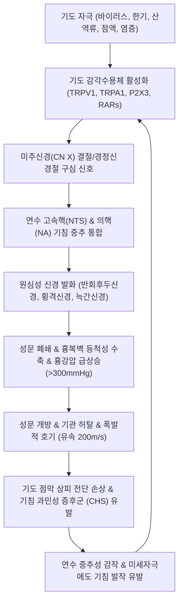

# 🩺 [[해수]] (Cough / 咳嗽, R05 / U20.1)

> **핵심 3줄 요약 (Key Summary)**:
> - 📍 병소 부위 & 해부·병태생리: 후두, 기관 분지부(Carina), 대기관지 점막. 기도 내 이물질 및 병적 분비물을 초속 200m(음속 70~80%)의 폭발적 호기(Expiratory effort)로 배출하는 생체 방어 반사궁.
> - 🚩 전형적 임상 양상 & 3대 징후: 소리만 있고 가래 없음(해, 咳), 가래만 있고 기침 미약(수, 嗽), 소리와 가래 병발(해수, 咳嗽). 유병 기간별 급성(<3주), 아급성(3~8주), 만성(>8주, 성인 호발) 분류.
> - 🛠️ 핵심 감별 검사 & 한·양방 다각적 치료 전략: 만성 기침 3대 원인인 **상기도기침증후군(UACS), 기침이형[[천식]](CVA), [[위식도 역류 질환]](GERD)** 및 비천식성 [[호산구기관지염]](NAEB) 감별. [[소청룡탕]], [[맥문동탕]], [[지해산]], [[청상보하환]] 및 천돌·폐수·정천 침구 치료.
> - ⚠️ 응급 의뢰 레드플래그 & 악화 요인: 대량 [[객혈]](>100mL), 급성 호흡곤란, 원인 불명의 체중 감소, 고열, 흡연력 고령자의 기침 패턴 돌연 변화 시 [[폐암]] 및 [[결핵]] 의뢰.

---

## 📌 목차
1. [질환 개요 & 해부학적 병태생리](#1-질환-개요--해부학적-병태생리)
2. [병태생리 메커니즘 & 생체역학적 악순환 네트워크](#2-병태생리-메커니즘--생체역학적-악순환-네트워크)
3. [임상 증상 & 이학적 검사(Physical Exam) 알고리즘](#3-임상-증상--이학적-검사physical-exam-알고리즘)
4. [감별 진단 매트릭스 (Differential Diagnosis)](#4-감별-진단-매트릭스-differential-diagnosis)
5. [한의 통합 치료 프로토콜 (침·약침·추나·한약)](#5-한의-통합-치료-프로토콜-침약침추나한약)
6. [재활 운동 & 생활습관 티칭 가이드](#6-재활-운동--생활습관-티칭-가이드)
7. [💡 사용자 진료실 핵심 필기 & 임상 노하우 (Melt-In 잔여 심화 집약)](#7--사용자-진료실-핵심-필기--임상-노하우-melt-in-잔여-심화-집약)
8. [출처 및 학술 참고 문헌 (References)](#8-출처-및-학술-참고-문헌-references)

---

## 1. 질환 개요 & 해부학적 병태생리

![[해수_기관지_분지구조_기도해부도해.jpg|450]]
> [그림 1: ① 질환 및 병태생리 — 기관지 수지상 분지 구조 및 기도 염증 병태도해 (Wikimedia Commons)]

* **질환 정의 및 한의학적 정밀 분류**:
  * **정의**: 기도의 이물질이나 과도한 병적 분비물이 하기도로 흡인되는 것을 막고 체외로 방출하기 위해 일어나는 급격하고 폭발적인 호기(呼氣) 반응이자 인체 호흡기계의 가장 중요한 생체 방어 반사이다.
  * **한의학적 개념 구분 (청강의감 및 황제내경)**:
    * **해(咳)**: 유성무담(有聲無痰) — 폐기(肺氣)가 손상되어 소리만 높고 가래는 배출되지 않는 상태 (외감 풍한 초기, 기침이형천식, 음허 화동 건해).
    * **수(嗽)**: 유담무성(有痰無聲) — 비위(脾胃)가 손상되어 기침 소리는 거의 없거나 미약하나 가래만 지속적으로 끓어 나오는 상태 (비허습담, 담음 정체).
    * **해수(咳嗽)**: 유성유담(有聲有痰) — 폐와 비위가 동시에 손상되어 소리와 가래가 병발하는 상태 (전형적 만성 기관지염, 감염성 호흡기 질환).
  * **유병 기간에 따른 현대의학적 분류**:
    * **급성 기침(Acute, < 3주)**: 대부분 [[감모]], 급성 [[기관지염]], 급성 세균성 부비동염.
    * **아급성 기침(Subacute, 3~8주)**: 감염 후 기침(Post-infectious cough, 기도 상피 회복 지연), 백일해(Pertussis).
    * **만성 기침(Chronic, > 8주)**: 흉부 X-ray가 정상인 비흡연 성인의 경우 **상기도기침증후군(UACS, 40~50%), 기침이형[[천식]](CVA, 20~30%), [[위식도 역류 질환]](GERD, 10~20%), 비천식성 [[호산구기관지염]](NAEB, 10~15%)**의 4대 질환이 90% 이상을 차지. 흡연자의 경우 **[[만성 기관지염]](COPD)**이 1위.
* **관련 해부학적 구조물**:
  * **기침 감각 수용체(Cough Receptors)**:
    * 후두, 기관 분지부(Carina), 주기관지 점막에 가장 높은 밀도로 분포.
    * **Aδ-섬유(유수신경)**: 급격한 기계적 자극 및 산/수분에 반응하는 신속적응수용체(RARs, Rapidly adapting receptors).
    * **C-섬유(무수신경)**: 캡사이신, 브라디키닌, 프로스타글란딘, 연기 등 화학적 염증 자극에 반응하는 화학수용체(TRPV1, TRPA1, P2X3).
  * **신경 전도로**: 구심로(미주신경 CN X, 설인두신경 CN IX, 삼차신경 CN V) → 뇌간 연수 기침 중추(NTS, NA) → 원심로(반회후두신경, 횡격신경, 늑간신경, 척수운동신경).
  * **호흡 펌프 근육군**: 횡격막, 내·외늑간근, 복직근, 복사근, 골반저근.

---

## 2. 병태생리 메커니즘 & 생체역학적 악순환 네트워크

![[해수_기침반사궁_미주신경_기침중추_신경해부도해.png|450]]
> [그림 2: ② 관련 해부학적 구조물 — 기침 반사궁(Cough Reflex Arc) 미주신경 구심로·연수 기침중추·원심로 신경전도로 도해 (Wikimedia Commons)]

### 1) 기침 반사궁의 3단계 생체역학 (Biomechanical 3 Phases)
1. **흡기기 (Inspiratory phase)**:
   * 미주신경 자극 후 약 0.5초 이내에 횡격막과 외늑간근이 급격히 수축하여 폐활량의 약 50%에 달하는 대용적 공기(약 2.5L)를 흡입하여 흉강 용적과 폐 탄성 반발력을 극대화.
2. **압축기 (Compressive phase)**:
   * 피열연골과 진성 성대가 단단히 내전하여 성문(Glottis)을 완전히 폐쇄(약 0.2초간).
   * 동시에 복직근, 내·외복사근, 복횡근, 내늑간근이 강력한 등척성 수축을 일으켜 복압과 흉강내압을 **100~300mmHg 이상으로 급격히 상승**시킴.
3. **배출기 (Expulsive phase)**:
   * 성문이 순간적으로 개방되면서 고압의 공기가 방출됨. 이때 기관 후벽막(Membranous wall)이 내강으로 밀려들어와 기도가 좁아지는 **동적 기도 허탈(Dynamic airway collapse)**이 발생.
   * 기도가 좁아짐에 따라 베르누이 원리에 의해 공기 유속이 **초속 200m(시속 700km, 음속의 70~80%)**까지 가속되어 점막에 부착된 점액과 이물질을 전단응력(Shear stress)으로 뜯어내어 체외로 방출.

### 2) 기침 과민성 증후군(Cough Hypersensitivity Syndrome, CHS)의 분자 기전
* 만성 기침 환자의 핵심 병태는 단순한 분비물 과다가 아니라 **신경가소성(Neuroplasticity)에 의한 감각신경 감작**이다.
* 감염이나 염증 후 손상된 기도 상피에서 **신경성장인자(NGF), Substance P, 칼시토닌유전자관련펩타이드(CGRP), ATP**가 지속 방출된다.
* ATP는 C-섬유 말단의 **P2X3 수용체**에 결합하고, NGF는 **TRPV1/TRPA1 수용체**의 발현을 상향 조절한다.
* 결과적으로 말초신경의 감작뿐 아니라 연수 고속핵(NTS)의 억제성 GABA 신경망이 마비되어 **중추 감작(Central sensitization)**이 유발된다. 이에 따라 정상인에게는 기침을 유발하지 않는 미세한 찬 공기, 대화, 웃음, 향수, 옷깃 스침에도 기침이 폭발하는 **알로투시아(Allotussia)** 및 **기침 통각과민(Hypertussia)**이 고착된다.

---

## 3. 임상 증상 & 이학적 검사(Physical Exam) 알고리즘

### 1) 4대 만성 기침 질환별 전형적 임상 증상
* **[[만성 기관지염]] (흡연자)**:
  * 흡연자에서 2년 연속, 연간 3개월 이상 거의 매일 가래와 기침 발생. 이른 아침 끈적한 객담 배출, 운동 시 호흡곤란 점진적 악화.
* **기침이형 [[천식]] (Cough Variant Asthma, CVA)**:
  * 천명음이나 뚜렷한 호흡곤란 없이 **오직 마른 기침(건해)**만 호발.
  * **야간이나 새벽, 운동 후, 찬 공기 노출, 건조한 환경**에서 기침 발작 극심. 기관지확장제(SABA) 흡입 시 기침이 현저히 호전되는 특징.
* **상기도기침증후군 (UACS / 구 후비루증후군)**:
  * 목 뒤로 무언가 넘어가는 후비루감, 목의 이물감(매핵기 유사), **습관적인 헛기침(Throat clearing)**, 아침 기상 시 기침 악화.
* **[[위식도 역류 질환]] (GERD)**:
  * 식후 또는 앙와위(누운 자세), 상체를 숙일 때 악화되는 마른 기침, 신물 올라옴, 가슴 쓰림, 흉골 뒤 작열감. (단, 만성 기침 환자의 40~50%는 전형적인 소화기 속쓰림 없이 오직 기침만 호소함).
* **비천식성 [[호산구기관지염]] (NAEB)**:
  * 기도 과민성은 정상이나 객담 내 호산구가 증가한 상태. 마른 기침, 흡입성 스테로이드(ICS)에 신속히 호전.

### 2) 한의학적 변증 체계
* **외감해수(外感咳嗽)**:
  * **풍한해수(風寒咳嗽)**: 기침 소리 높고 맑음, 묽고 흰 물가래, 오한, 두통, 무한, 설태박백, 맥부긴.
  * **풍열해수(風熱咳嗽)**: 기침 소리 거칠고 잦음, 끈적하고 누런 가래, 인후종통, 구갈, 발열, 설홍태황, 맥부삭.
  * **풍조해수(風燥咳嗽)**: 마른 기침, 뱉어낼 가래 없음, 목구멍이 찢어질 듯 건조함, 입술과 코 마름, 설건소진, 맥삭.
* **내상해수(內傷咳嗽)**:
  * **담습해수(痰濕咳嗽)**: 기침 소리 탁하고 가래가 끓음, 흰 점조담 다량 배출, 가슴 답답함(흉민), 식욕부진, 설태백니, 맥활.
  * **간화범폐(肝火犯肺)**: 분노·스트레스 시 발작하는 격렬한 기침, 기침할 때마다 옆구리가 당겨 결림, 얼굴 붉어짐, 설홍태황, 맥현삭.
  * **폐음허해수(肺陰虛咳嗽)**: 소리 낮고 쉰 마른 기침, 가래 적고 끈적함, 손발바닥 번열(오심번열), 오후 조열, 야간 도한, 설홍소태, 맥세삭.

---

## 4. 감별 진단 매트릭스 (Differential Diagnosis)

| 감별 질환 | 호발 병인 및 병태 | 기침 양상 및 유발 요인 | 확진 검사 및 특이 소견 |
| :--- | :--- | :--- | :--- |
| **기침이형 [[천식]] (CVA)** | 호흡기 점막 호산구성 알레르기 염증 | 야간·새벽 악화, 마른 기침, 찬 공기 노출 | 메타콜린 유발검사 양성 (PC20 < 16mg/mL), FeNO 상승 |
| **상기도기침증후군 (UACS)** | 비인두 분비물의 후두 기침수용체 자극 | 잦은 헛기침, 후비루감, 누울 때 기침 | 후두경 검사상 인두벽 자갈양 점막(Cobblestoning) |
| **[[위식도 역류 질환]] (GERD)** | 위산의 미주신경 역류 반사 / 미세흡인 | 식후, 앙와위 악화, 속쓰림, 흉통 | 24시간 식도 다채널 임피던스-pH 검사, PPI 투약 반응 |
| **비천식성 호산구기관지염** | 천식 기도과민증 없는 호산구성 기도염증 | 기침이형천식과 유사하나 기도연축 없음 | **유도 객담 내 호산구 > 2.5%**, 메타콜린 검사 음성 |
| **ACE 억제제 유발 기침** | 브라디키닌 및 Substance P 분해 차단 | 혈압약 복용 후 수주~수개월 내 발생 건해 | ACE 억제제 중단 후 1~4주 이내 완전 소실 |
| **기관지 확장증 / [[결핵]]** | 기관지 비가역적 확장 및 세균 감염 | 다량의 화농성 객담, 반복되는 [[객혈]] | 흉부 고해상도 CT(HRCT)상 인환 징후(Signet-ring) |

---

## 5. 한의 통합 치료 프로토콜 (침·약침·추나·한약)

![[수태음폐경_공식경혈도_Wellcome_L0037808.jpg|450]]
> [그림 3: ③ 한의 치료 시술점 및 혈위 도해 — 선폐지해 타겟 수태음폐경 중부·척택·열결 공식경혈도 (Wellcome Collection, L0037808)]

* **침구 치료 (Acupuncture)**:
  * **선폐지해(宣肺止咳) 4대 혈위군**:
    * **임맥 국소 혈위**: [[천돌]](CV22) — 흉골병 상연 하방으로 0.5~1.0촌 사자하여 기관지 경련 및 기침 반사를 즉각 차단하는 진해의 요혈. [[단중]](CV17, 심포모혈 순기).
    * **배수혈 및 척추 분절**: [[폐수]](BL13, 직자/외하방 사자 0.5~0.8촌), [[풍문]](BL12), **정천(EX-B1, 경추 7번 극돌기 하 양측 0.5촌)**.
    * **수태음폐경 본경혈**: [[척택]](LU5, 합수혈), [[공최]](LU6, 극혈 급성 기침 발작), [[열결]](LU7, 낙혈 통경락), [[태연]](LU9, 원혈).
    * **거담 혈위**: 풍륭(ST40), [[족삼리]](ST36).
  * **전침 요법 (Electroacupuncture)**: 양측 폐수(BL13)와 정천(EX-B1)에 2Hz/100Hz 혼합파(Dense-disperse wave)를 20분간 적용하여 척수 및 연수 레벨의 내인성 엔도르핀 분비를 촉진하고 기침 반사 역치를 상승시킴.
* **약침 치료 (Pharmacopuncture)**:
  * **태반약침(자하거)**: 만성 허손, 음허 기침, 노인성 기침 환자의 양측 폐수(BL13), 고황(BL43)에 0.2cc씩 주입하여 호흡기 점막 재생 및 면역 안정화.
  * **소염약침 / 황련해독탕 약침**: 풍열 및 인후통, 급성 담열 기침 환자의 정천, 대추, 천돌에 시술.
* **추나 치료 (Chuna Manipulation)**:
  * **상부 흉추(T1~T4) 관절가동 및 교정 추나**: 교감신경절 지배 분절 정렬을 정상화하여 기관지 평활근 과긴장을 해제.
  * **흉곽 전면 늑간근 및 사각근 근막 이완(JS 수기)**: 만성 기침으로 단축된 호흡보조근을 이완하여 흉곽 순응도 회복.
* **한약 치료 (Herbal Medicine) — 병인별 맞춤 처방**:
  * **1) 한음정체 / 외감풍한 (한수, 寒嗽)**:
    * **[[소청룡탕]](小靑龍湯)**: 마황 8g, 백작약 8g, 세신 4g, 건강 4g, 자감초 6g, 계지 6g, 반하 8g, 오미자 4g. (세신과 건강의 온폐화음, 마황·계지의 선폐지해, 오미자의 염폐수렴이 결합하여 맑은 물가래와 찬바람 기침을 즉각 제어).
  * **2) 담열옹폐 / 폐열천촉 (열수, 熱嗽)**:
    * **[[마행감석탕]](麻杏甘石湯)**: 마황 8g, 행인 10g, 석고 20~30g, 감초 6g. (석고의 대한 청열과 행인의 강화강역 작용).
    * **[[청폐탕]](淸肺湯)**: 황갈색 끈적한 가래, 만성 기관지염, 인후 작열감.
  * **3) 음허조해 / 폐위 (건해, 乾咳)**:
    * **[[맥문동탕]](麥門冬湯)**: 맥문동 20g, 반하 6g, 인삼 6g, 감초 4g, 갱미 10g, 대추 6g. (맥문동의 오피오포고닌 성분이 기침 중추 역치를 올리고 진액을 보충하여 인후 건조와 역상성 기침 해소).
    * **[[청상보하환]](淸上補下丸) / [[지해산]](止咳散)**: 감염 후 장기 지속되는 잔여 기침, 천식성 만성 기침 완해.

---

## 6. 재활 운동 & 생활습관 티칭 가이드

* **기침 억제 3단계 훈련 (Cough Suppression Protocol)**:
  * **1단계**: 기침이 터져 나오려는 신호(목의 간질거림)가 올 때 즉시 입술을 다물고 침을 꿀꺽 삼킨다.
  * **2단계**: 코로 4초간 천천히 깊게 들이마신다.
  * **3단계**: 입술을 촛불 끄듯 좁게 오므리고 8초간 천천히 내쉬는 **구순포호흡(Pursed-lip breathing)**을 수행한다. (기도 내 양압을 형성하여 기관지 허탈 및 기침 반사를 억제).
* **금연 및 기도 자극원 완전 차단**:
  * 흡연은 기도 상피 섬모를 마비시키므로 금연은 필수.
  * 향수, 방향제, 락스 청소용 세제, 찬 바람 노출 회피 (외출 시 방한 마스크 착용으로 호기 가온가습 재호흡).
* **미온수 수시 섭취**:
  * 한 번에 많은 양을 마시기보다 한두 모금씩 15~20분 간격으로 자주 삼켜 인후 점막을 지속적으로 보습.
* **역류성 기침(GERD) 생활 티칭**:
  * 취침 3시간 전 금식, 카페인·초콜릿·탄산음료 금지, 수면 시 상체를 15° 거상.

---

## 7. 💡 사용자 진료실 핵심 필기 & 임상 노하우 (Melt-In 잔여 심화 집약)

> [!IMPORTANT]
> **🛡️ 원문 융합(Melt-In) 및 7번 섹션 작성 불변 규칙 (CRITICAL)**
> 1. **기존 필기 내용 상부 전면 융합 (Melt-In)**: 이물질 방어 작용, 흡연자 만성기관지염 가래기침, 천식 환자의 염증/천명/호흡곤란, 해(소리)-수(가래)-해수 정의 구분을 상부 1~6번에 유기적으로 100% 녹여냈습니다.
> 2. **7번 섹션의 차별화된 심화 집약**: 양약 진해제에 반응하지 않는 만성 기침 환자의 진료실 문진 비기와 천돌·어제혈 즉각 진해 손맛 노하우를 엄선하여 집약합니다.

* **상부 섹션에 미처 다 담지 못한 고유 원문 필기**:
  * "가래 없이 기침만 나오는 것이 해(咳), 기침 없이 가래만 나오는 것을 수(嗽), 둘 다 있는 것을 해수(咳嗽)라고 한다."
  * "흡연자는 만성 기관지염이 나타나서 가래가 발생하며, 이로 인해 기침을 한다. 천식 환자는 기관지의 염증으로 인해 기관지가 심하게 좁아져서 기침, 천명, 호흡곤란, 가슴 답답함이 발생한다."
* **진료실 실전 감별 & 치료 노하우**:
  * 1. **실전 문진 3대 핵심 질문**:
    * "혈압약(ACE 억제제)을 드시고 계십니까?" (약물성 기침 즉각 배제).
    * "목구멍에서 간질거리며 시작합니까, 가슴 깊은 곳에서 울려 나옵니까?" (상기도 과민 vs 하기도 기관지 분비물).
    * "누웠을 때 기침이 더 심해집니까?" (후비루 및 위식도 역류 감별).
  * 2. **치료 순서 및 손맛 노하우**:
    * **기침 발작 즉각 정지: 천돌(CV22) 심부 자침**:
      * 환자 턱을 살짝 들게 한 뒤, 흉골병 상연 오목한 곳([[천돌]])에서 먼저 직자로 0.2촌 자입한 후 침병을 흉골병 뒤쪽으로 눕혀 **흉골 후벽을 타고 하방으로 0.8~1.0촌 미끄러지듯 자입**.
      * 환자가 기관이 시원해지는 느낌을 받으며 발작적 기침이 즉시 멎는다.
    * **야간 발작성 마른 기침(건해) 특효 조합**:
      * **어제(LU10) 사혈 + 폐수(BL13) 온구(뜸)**: 야간마다 잠을 못 이루고 기침하는 환자에게 어제혈에서 청구혈을 사혈하고 폐수에 뜸을 뜨면 폐음(肺陰)이 보충되고 기침 과민성이 신속히 완화된다.
  * 3. **환자 티칭 스크립트**:
    * "목에 가래가 낀 것 같다고 해서 '크흠- 칵!' 하고 세게 헛기침을 하시면 성대와 기도 점막이 채찍질을 당해 더 헐게 됩니다. 점막이 헐면 기침 신경이 더 예민해져 기침이 영원히 낫지 않습니다. 목이 간질거릴 때는 기침을 터뜨리지 마시고 따뜻한 물을 꿀꺽 삼키세요."

---

## 8. 출처 및 학술 참고 문헌 (References)

1. **대한결핵및호흡기학회**. *기침 진료지침: 성인 만성 기침의 진단 및 치료*. 군자출판사.
2. **Chung, K. F. et al. (2025)**. *Chronic cough as a disease: implications for practice, research, and health care*. **Lancet Respir Med**, 13(2), 145-158. PMID: [39848267](https://pubmed.ncbi.nlm.nih.gov/39848267).
   - **[연구 요약]**: 기침을 단순 증상이 아닌 '기침 과민성 증후군(Cough Hypersensitivity Syndrome)'이라는 독립된 질환 단위로 규명하고 P2X3 수용체 및 중추 감작 기전 분석.
3. **Song, W. J. et al. (2023)**. *New Insights Into Refractory Chronic Cough and Unexplained Chronic Cough: A 6-Year Ambispective Cohort Study*. **Allergy Asthma Immunol Res**, 15(6), 789-804. PMID: [37957796](https://pubmed.ncbi.nlm.nih.gov/37957796).
   - **[연구 요약]**: 난치성 만성 기침 환자의 표현형 분석 및 한양방 다각적 접근 치료 예후 평가.
4. **Morice, A. H. et al. (2020)**. *ERS guidelines on the diagnosis and treatment of chronic cough in adults and children*. **Eur Respir J**, 55(1), 1901136.
   - **[연구 요약]**: 유럽호흡기학회(ERS) 성인 만성 기침 가이드라인, 기침 반사궁 신경 경로 및 비약물 행동 억제 요법의 근거 제시.