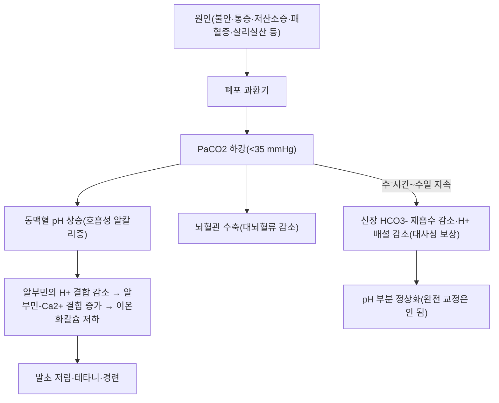

# 🩺 호흡성 알칼리증 (Respiratory Alkalosis)

> **핵심 3줄 요약 (Key Summary)**:
> - 📍 병소 부위 & 해부·병태생리: 과환기(hyperventilation)로 PaCO2가 정상(35~45 mmHg) 아래로 떨어져 동맥혈 pH가 7.45를 넘는 전신 대사 이상. 원인 자체(불안·통증·저산소증·패혈증·약물중독 등)가 예후를 좌우한다.
> - 🚩 전형적 임상 양상 & 3대 징후: 급성기엔 세포외액 완충만 작동해 HCO3−가 약간만 떨어지고(1~2 mEq/L↓/PaCO2 10 mmHg↓), 이온화칼슘 저하에 의한 말초 저림·테타니가 나타날 수 있다.
> - 🛠️ 핵심 감별 검사 & 한·양방 다각적 치료 전략: 동맥혈가스분석(ABGA)으로 PaCO2<35·pH>7.45 확인, 원인 감별(저산소증·패혈증·살리실산 중독 등)이 진단의 핵심. 원인별 치료가 우선이며 심인성 과환기는 저유량 산소·벤조디아제핀이 근거 기반.
> - ⚠️ 응급 의뢰 레드플래그: 저산소증·패혈증 초기·폐색전증·살리실산 중독이 과환기의 원인일 수 있어, '단순 과호흡증후군'으로 단정하기 전 동맥혈가스·산소포화도·감염 징후를 반드시 확인. 중증 알칼리증(pH>7.6)은 이온화칼슘 저하로 혼수·부정맥까지 이를 수 있다.

---

## 📌 목차
1. [질환 개요 & 해부학적 병태생리](#1-질환-개요--해부학적-병태생리)
2. [병태생리 메커니즘 & 생체역학적 악순환 네트워크](#2-병태생리-메커니즘--생체역학적-악순환-네트워크)
3. [임상 증상 & 이학적 검사(Physical Exam) 알고리즘](#3-임상-증상--이학적-검사physical-exam-알고리즘)
4. [감별 진단 매트릭스 (Differential Diagnosis)](#4-감별-진단-매트릭스-differential-diagnosis)
5. [한의 통합 치료 프로토콜 (침·약침·추나·한약)](#5-한의-통합-치료-프로토콜-침약침추나한약)
6. [재활 운동 & 생활습관 티칭 가이드](#6-재활-운동--생활습관-티칭-가이드)
7. [💡 사용자 진료실 핵심 필기 & 임상 노하우 (Melt-In 잔여 심화 집약)](#7--사용자-진료실-핵심-필기--임상-노하우-melt-in-잔여-심화-집약)
8. [출처 및 학술 참고 문헌 (References)](#8-출처-및-학술-참고-문헌-references)

---

## 1. 질환 개요 & 해부학적 병태생리

![[호흡성알칼리증_과환기_병태생리도해.jpg|450]]
> 출처: Wikimedia Commons, BruceBlaus (CC BY-SA 4.0)

> ⚠️ 이 노트는 신규 작성 노트로, 원장님의 수기 필기·이미지가 없습니다. 근골격계 국소 병변이 아닌 전신 대사 이상이라 실제 학술 도해를 아직 확보하지 못했습니다(추후 원장님 자료가 있으면 추가).

* **정의**: 폐포 환기가 대사 요구량보다 과도해 PaCO2가 35 mmHg 미만으로 떨어지고, 이로 인해 동맥혈 pH가 7.45를 초과하는 1차성 산-염기 장애. 호흡성 산증·대사성 산증·대사성 알칼리증과 함께 4대 산-염기 장애를 이룹니다.
* **급성 vs 만성**:
  * **급성**: 발생 수 분~수 시간. 세포내·세포외 완충만 작동해 pH 상승 폭이 큽니다.
  * **만성**: 수일 이상 지속. 신장 보상(HCO3− 배설 증가)으로 pH가 정상에 가깝게 부분 교정되지만, 완전히 정상화되지는 않습니다.
* **관련 "해부학적" 구조물·원인 계통 (⚠️ 국소 병변이 아니라 정직하게 재정의)**:
  * **중추/정신성**: 불안·공황발작(→[[공황장애]]), 통증, 발열, 임신(프로게스테론에 의한 환기 자극), 두개내 병변(뇌졸중·외상·종양)
  * **저산소혈증 유발성**: 고산 등반, 폐렴, 폐색전증, 심한 빈혈, 심부전으로 인한 저산소증 — 말초 화학수용체가 환기를 자극
  * **약물·중독**: 살리실산(아스피린) 중독 초기(호흡중추 직접 자극) → [[아스피린]], 카테콜아민·니코틴, 프로게스테론 제제
  * **패혈증/전신염증**: 패혈증 초기 사이토카인이 환기를 자극해 흔히 가장 먼저 나타나는 산-염기 이상 → [[패혈증]]
  * **인공호흡기 관련**: 기계환기 설정 과다(의인성)
  * **간질환**: 간경변·간부전에서 원인 불명확한 과환기가 흔함

---

## 2. 병태생리 메커니즘 & 생체역학적 악순환 네트워크

![[호흡성알칼리증_산염기평형_Davenport_병태생리도해.jpg|450]]
> 출처: Wikimedia Commons, Davenport diagram (CC BY-SA 3.0)

### 1) 급성 완충 및 만성 신 보상
* **급성 완충**: PaCO2 하강 즉시 세포내 단백질·인산염 완충계가 H+를 방출해 HCO3−가 소폭 감소합니다(대략 PaCO2 10 mmHg 하강당 HCO3− 1~2 mEq/L 하강). 신장 보상은 아직 관여하지 않습니다.
* **만성 신 보상**: 지속되면 근위세뇨관의 HCO3− 재흡수와 원위세뇨관의 H+ 분비가 감소해 HCO3−가 더 크게 떨어집니다(PaCO2 10 mmHg 하강당 약 4~5 mEq/L 하강). 고산 순응 과정에서 실측된 신-호흡 통합 반응이 이 기전을 뒷받침합니다.

### 2) 악순환 네트워크 — 이온화칼슘·뇌심혈관 영향
* **이온화칼슘 저하와 테타니**: 알칼리혈증에서는 알부민의 H+ 결합 부위가 비어 알부민이 Ca2+에 더 강하게 결합하고, 그 결과 총 혈청 칼슘은 정상이거나 상승해도 **이온화칼슘은 떨어져** 입 주위·손발 저림, 근육 경련(테타니), 심한 경우 후두경련까지 나타날 수 있습니다. 실제 응급실 증례에서 과환기증후군 환자의 이온화칼슘 저하·혈청칼슘 상승·테타니·말초혈관연축이 함께 보고되었습니다.
* **뇌·심혈관 영향**: PaCO2 하강은 뇌혈관을 수축시켜 대뇌혈류를 줄입니다. 중증 알칼리증(pH 7.68까지 보고된 증례 있음)에서는 이것이 심근·뇌혈관 수축, 심전도 변화·트로포닌 상승, 혼수까지 이어질 수 있어 단순 '과호흡증후군'으로 가볍게 볼 수 없습니다.
* **저산소혈증 매개 경로**: 고산·폐질환 등에서는 말초 화학수용체가 저산소혈증을 감지해 환기를 늘리는 것이 1차 반응(저산소성 환기반응)이며, 그 부산물로 PaCO2가 떨어져 호흡성 알칼리증이 동반됩니다.

---

## 3. 임상 증상 & 이학적 검사(Physical Exam) 알고리즘

### 1) 주소증 및 신체 징후
* 말초 저림·테타니(이온화칼슘 저하), 중증에서는 혼수·부정맥까지 이를 수 있습니다.

### 2) 필수 검사법 (⚠️ 근골격계 유발 검사가 아닌 검사실 검사로 정직하게 재정의)
* **동맥혈가스분석(ABGA)**: pH>7.45, PaCO2<35 mmHg가 핵심. HCO3− 저하 폭으로 급성/만성을 가늠합니다(급성 완충 공식과 크게 벗어나면 혼합 산-염기 장애를 의심).
* **원인 감별이 진단의 핵심**: 저산소증 여부(산소포화도·흉부영상), 감염 징후(패혈증 스크리닝 → [[패혈증]]), 통증·불안(공황발작 병력 → [[공황장애]]), 약물력(살리실산 과다복용 여부 → [[아스피린]]), 임신 여부, 간질환 병력을 확인합니다.
* **전해질**: 이온화칼슘·인(중증 과환기에서 저인산혈증 증례도 보고됨), 칼륨(알칼리혈증은 세포내 K+ 이동을 유발할 수 있음)을 함께 확인합니다.
* **감별해야 할 함정**: 살리실산 중독 초기에는 호흡성 알칼리증이 먼저 나타나고, 이후 대사성 산증이 겹쳐 '혼합형'이 되는 경우가 많아 중독력 확인이 중요합니다.

---

## 4. 감별 진단 매트릭스 (Differential Diagnosis)

| 감별 질환 | 호발 원인 | 주소증 차이점 | 특이 검사 소견 |
| :--- | :--- | :--- | :--- |
| 호흡성 알칼리증(본 질환) | 불안·통증·저산소증·패혈증·살리실산 등 | 말초 저림·테타니 | PaCO2<35, pH>7.45 |
| [[호흡성 산증]] | 폐포 저환기 | 두통·졸림·의식저하 | PaCO2↑, pH↓ |
| [[대사성 알칼리증]] | 위산 소실·이뇨제 등 | 대개 비특이적 | HCO3−↑, 대상성 PaCO2↑ |
| [[대사성 산증]] | 산 생성 과다·HCO3− 소실 | Kussmaul 호흡 | HCO3−↓ |

---

## 5. 한의 통합 치료 프로토콜 (침·약침·추나·한약)

![[호흡성알칼리증_저유량산소마스크_치료도해.jpg|450]]
> 출처: Wikimedia Commons (Public domain)

* **침구·약침·추나 치료**: 호흡성 알칼리증(과환기)에 특이적인 침·약침·추나 프로토콜은 볼트 내에서 확인하지 못했습니다(⚠️ 확인 안 되어 창작하지 않음).
* **한약 치료 (⚠️ 내용 검토 필요)**: 원인이 불안·공황(氣鬱·心悸怔忡 범주와 연관 가능)이나 발열(→[[발열]])인 경우는 해당 질환 노트의 변증·치법을 참고하되, 이 노트에서 새로 창작하지 않습니다.
* **현대 의학적 치료 (참고)**:
  * **원인 치료가 우선**: 통증 조절, 불안·공황 관리, 저산소증 교정(산소 공급), 패혈증이면 항생제·수액, 살리실산 중독이면 중독 프로토콜(알칼리화 이뇨·투석 고려)을 원인별로 적용합니다 — 호흡성 알칼리증 자체를 직접 '교정'하는 약물은 없습니다.
  * **심인성/공황발작에 의한 과호흡**: 과거 종이봉투 재호흡법이 널리 쓰였으나, 저산소혈증이 원인인 경우 재호흡법이 위험할 수 있어 원인 감별 후에만 고려해야 한다는 것이 최근 관점입니다. 최근 무작위 대조시험에서 저유량 마스크 산소 투여가 호흡훈련(breathing training)과 비교해 심인성 과환기증후군에 더 효과적이고 편하다는 결과가 보고되었습니다. 중증 사례(의식 저하·테타니 동반)는 벤조디아제핀 정맥 투여로 급성 불안·과환기를 조절해 수 시간 내 호전된 증례가 보고되었습니다.

---

## 6. 재활 운동 & 생활습관 티칭 가이드

> ⚠️ 근골격계 재활 운동이 아닌, 원인 질환 관리·생활습관 교육으로 정직하게 재정의합니다.

* 불안·공황 소인 환자는 유발 요인 인지 및 호흡훈련 교육(단, 저산소증 감별 후).
* 살리실산 함유 약물 과다복용 위험군 교육.
* 고산 등반 예정자는 저산소성 환기반응에 의한 생리적 과환기를 사전 안내.

---

## 7. 💡 사용자 진료실 핵심 필기 & 임상 노하우 (Melt-In 잔여 심화 집약)

* 신규 작성 노트로, 이 노트에 옮길 원장님 수기 필기는 없습니다.

---

## 8. 출처 및 학술 참고 문헌 (References)

1. **Tucker AM, Johnson TN (2025)**. *Breathing and balance: Clinical insights and management strategies of respiratory acid-base disorders*. **Nutrition in Clinical Practice**, 40(4):774-792. PMID: [40483586](https://pubmed.ncbi.nlm.nih.gov/40483586/) · DOI: [10.1002/ncp.11328](https://doi.org/10.1002/ncp.11328)
   - **[연구 요약]**: 호흡성 산증·알칼리증의 병태생리와 관리 전략을 다룬 종설.
2. **McGillicuddy C, Molins C (2023)**. *The Effect of Hyperventilation Syndrome on Ionized and Serum Calcium: A Case Presentation in the Emergency Department*. **Cureus**, 15(7):e42310. PMID: [37614278](https://pubmed.ncbi.nlm.nih.gov/37614278/) · DOI: [10.7759/cureus.42310](https://doi.org/10.7759/cureus.42310)
   - **[연구 요약]**: 과환기증후군 환자에서 이온화칼슘 저하·총 혈청칼슘 상승과 함께 테타니·말초혈관연축이 나타난 응급실 증례.
3. **Sepúlveda RA, et al. (2022)**. *[중증 심인성 과환기에 의한 중증 호흡성 알칼리증 증례 1례]*. **Revista Médica de Chile**, 150(4):554-558. PMID: [36155765](https://pubmed.ncbi.nlm.nih.gov/36155765/) · DOI: [10.4067/S0034-98872022000400554](https://doi.org/10.4067/S0034-98872022000400554)
   - **[연구 요약]**: pH 7.68·HCO3− 11.8 mEq/L·PaCO2 10 mmHg의 중증 알칼리증 증례. 혼수·심근허혈 시사 소견·테타니를 동반했고 정맥 벤조디아제핀으로 급속 호전.
4. **Yang L, et al. (2025)**. *The low-flow mask oxygen could be a more effective, comfortable, and easy-to-follow treatment for psychogenic hyperventilation syndrome: A double-blind, randomized controlled trial*. **International Emergency Nursing**, 81:101636. PMID: [40532319](https://pubmed.ncbi.nlm.nih.gov/40532319/) · DOI: [10.1016/j.ienj.2025.101636](https://doi.org/10.1016/j.ienj.2025.101636)
   - **[연구 요약]**: 심인성 과환기증후군에서 저유량 마스크 산소 투여를 호흡훈련과 비교한 이중맹검 RCT(ChiCTR2300072044 등록).
5. **Johnson NA, et al. (2025)**. *Chemistry versus compensation: comparing integrated respiratory-renal blood acid-base responses between acute inspired normobaric hypoxia versus sustained hypobaric hypoxia*. **Journal of Applied Physiology**, 139(2):529-540. PMID: [40526014](https://pubmed.ncbi.nlm.nih.gov/40526014/) · DOI: [10.1152/japplphysiol.01014.2024](https://doi.org/10.1152/japplphysiol.01014.2024)
   - **[연구 요약]**: 저산소성 환기반응으로 인한 급성 저탄산혈증·호흡성 알칼리증과, 지속 노출 시 신장의 HCO3− 재흡수·H+ 배설 감소를 통한 대사성 보상을 실측.
6. **Peketi SH, et al. (2024)**. *Salicylate Poisoning and Rebound Toxicity*. **Cureus**, 16(5):e60241. PMID: [38746490](https://pubmed.ncbi.nlm.nih.gov/38746490/) · DOI: [10.7759/cureus.60241](https://doi.org/10.7759/cureus.60241)
   - **[연구 요약]**: 아스피린 과다복용에서 호흡성 알칼리증과 대사성 산증이 혼합된 증례 — 중탄산염 정맥 투여·혈액투석으로 치료.
7. **Kharsa A, Rout P (2026)**. *Alkalosis*. In: **StatPearls [Internet]**. Treasure Island (FL): StatPearls Publishing. PMID: [31424853](https://pubmed.ncbi.nlm.nih.gov/31424853/)
   - **[연구 요약]**: 호흡성/대사성 알칼리증의 정의·보상 기전을 정리한 개설서 챕터.

<!-- 보관 태그(1회용·링크오류, 필요시 복원): 과호흡 -->
