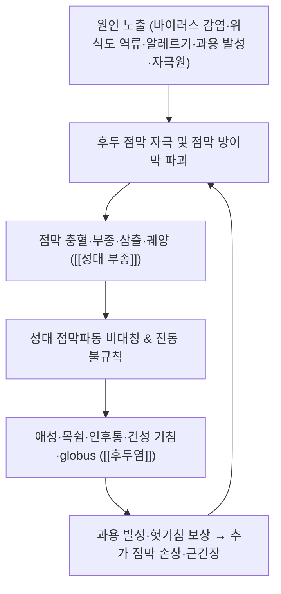

# 🩺 [[후두염]] (Laryngitis / 喉頭炎, ICD-10 J04.0·J37.0 / KCD J04.0·J37.0)

> **핵심 3줄 요약 (Key Summary)**:
> - 📍 **병소 부위 & 해부·병태생리**: 후두 점막·점막하층과 [[성대]](진성대, true vocal cords)를 주 병소로 하며, 병변 위치에 따라 성문상부(supraglottis)·성문(glottis)·[[성문하부]](subglottis)로 구분된다. [[윤상갑상근]]·[[갑상피열근]] 등 후두 내재근과 [[상후두신경]]·[[반회후두신경]]이 진동·긴장을 조절하는데, 점막 염증·부종이 이 진동 체계를 흐트러뜨려 애성(목쉼)이 발생한다.
> - 🚩 **전형적 임상 양상 & 3대 징후**: ① 애성/쉰목소리(dysphonia) ② 인후통·건조감·이물감(globus) ③ 건성(마른) 기침. 여기에 발성 피로, 구갈, 발열이 동반될 수 있다.
> - 🛠️ **핵심 감별 검사 & 한·양방 다각적 치료 전략**: [[후두내시경]](경성/연성) 및 [[후두 스트로보스코피]]가 핵심. 한방에서는 침([[열결]]·[[조해]]·[[척택]]·[[어제]]·[[천돌]]), 약침, [[소청룡탕]]·[[갈근탕]]·[[반하후박탕]]·[[향사양위탕]] 계열 한약, 경추·상흉추 추나를 병용한다.
> - ⚠️ 응급 의뢰 레드플래그 & 악화 요인: 흡기성 협착음(stridor)·함몰 호흡(늑간·흉골상 함몰)·천명·호흡곤란·연하곤란·침흘림·고열은 [[급성 성문하 후두염]](크룹) 및 [[급성 후두개염]]의 기도 폐쇄 적신호로 즉시 응급 이비인후과 의뢰. 절대 금기: 기도 폐쇄 소견에서의 지연 관찰, 강한 도수·추나 압박, 발성 유발 검사 반복.

---

## 📌 목차
1. [질환 개요 & 해부학적 병태생리](#1-질환-개요--해부학적-병태생리)
2. [병태생리 메커니즘 & 생체역학적 악순환 네트워크](#2-병태생리-메커니즘--생체역학적-악순환-네트워크)
3. [임상 증상 & 이학적 검사(Physical Exam) 알고리즘](#3-임상-증상--이학적-검사physical-exam-알고리즘)
4. [감별 진단 매트릭스 (Differential Diagnosis)](#4-감별-진단-매트릭스-differential-diagnosis)
5. [한의 통합 치료 프로토콜 (침·약침·추나·한약)](#5-한의-통합-치료-프로토콜-침약침추나한약)
6. [재활 운동 & 생활습관 티칭 가이드](#6-재활-운동--생활습관-티칭-가이드)
7. [💡 사용자 진료실 핵심 필기 & 임상 노하우 (Melt-In 잔여 심화 집약)](#7--사용자-진료실-핵심-필기--임상-노하우-melt-in-잔여-심화-집약)
8. [출처 및 학술 참고 문헌 (References)](#8-출처-및-학술-참고-문헌-references)

---

## 1. 질환 개요 & 해부학적 병태생리

![[후두염_1.jpg|540]]
> [그림 1: ① 병태생리·영상 — Reflux <b>laryngitis</b>. (A) In a 63-year-old male patient who presents severe globus and chronic coughing, diffuse ery]

* **질환 정의 및 분류**:
  * **정의**: 후두염(Laryngitis)은 후두 점막 및 점막하층에 발생한 염증성 질환이다. 임상적으로 가장 흔한 증상은 성대 진동의 불규칙으로 인한 **애성(hoarseness, 목쉼)**이며, 인후 불편감·기침·통증을 동반한다. 급성 후두염은 상기도 감염의 일환으로 흔히 발생하는 질환군이다(Lynch & Roberti, 2000, PMID: 11933444).
  * **분류**: ① 경과에 따라 **급성 후두염** vs **만성 후두염**, ② 부위에 따라 성문상부염/성문염/[[성문하 후두염]], ③ 원인에 따라 **감염성**(바이러스성·세균성), **역류성 후두염**(gastroesophageal reflux laryngitis)(Sataloff & Speigel, 1993, PMID: 8482250), **알레르기성 후두염**(Stachler & Dworkin-Valenti, 2017, PMID: 28266945), **궤양성 후두염**(ulcerative laryngitis; Reetz & Brockmann-Bauser, 2022, PMID: 34170335 / Romanenko & Kirasirova, 2025, PMID: 40292426), ④ 소아의 급성 폐쇄성 **급성 성문하 후두염**(croup, 크룹)(Mazurek & Bręborowicz, 2019, PMID: 31680234)으로 구분된다. 인두와 후두가 동시에 침범하면 **[[인후두염]](laryngopharyngitis)**이라 부른다.
  * **호발 연령/성별/직업군**: 급성 후두염은 연령·성별 구분 없이 흔하나, 감기 유행철에 증가한다. 급성 성문하 후두염(크룹)은 주로 영·유아 및 소아에서 호발하며 기도가 좁아 폐쇄 위험이 크다(Mazurek & Bręborowicz, 2019, PMID: 31680234). 만성 후두염은 **교사·가수·상담원·통역사 등 음성 과용 직업군**, 흡연자, 만성 역류 환자에서 흔하다(직업별 정량 통계는 근거 미확인).
  * **역학적 특성(정성적)**: 급성 후두염의 다수는 바이러스성 상기도 감염에 뒤따라 발생한다(Lynch & Roberti, 2000, PMID: 11933444). 궤양성 후두염은 통상 치유되지만 일부에서 **병변이 수 주 이상 지속되는 지연 경과(prolonged ulcerative laryngitis)**를 보여 악성 병변과의 감별이 필요하다(Reetz & Brockmann-Bauser, 2022, PMID: 34170335).

* **관련 해부학적 구조물**:
  * **골격 및 연골(관절)**: 후두는 [[갑상연골]](thyroid cartilage), [[윤상연골]](cricoid cartilage), [[후두개]](epiglottis) 및 피열연골로 구성되며, **[[윤상갑상관절]]**·**[[윤상피열관절]]**의 정렬·운동이 성대 긴장과 내전/외전을 좌우한다. 성대는 정면에서 보면 **가성대(false cords)**와 **진성대(true cords, 성대)**로 나뉘고, 그 아래 **성문하부(subglottis)**가 이어진다 — 이 세 층의 정상 해부는 축상 CT에서 가성대/진성대/성문하부로 확인된다(그림 2).
  * **근육 및 근막**: [[윤상갑상근]](cricothyroid, 성대 긴장·음도 상승), [[갑상피열근]](thyroarytenoid, 성대 내전·이완), [[후윤상피열근]](posterior cricoarytenoid, 성대 외전=유일한 개대근) 등 후두 내재근의 협응이 발성의 핵심이다. 만성 과용 발성·역류 자극은 이들 근육의 **긴장 과잉/피로 불균형**을 유발한다(정량적 근전도 데이터는 근거 미확인).
  * **신경 및 혈관**: 미주신경의 가지인 **[[상후두신경]](superior laryngeal nerve)**이 감각 및 윤상갑상근을, **[[반회후두신경]](recurrent laryngeal nerve)**이 성대 내재근 대부분을 지배한다. 후두 점막은 상갑상동맥 가지의 풍부한 혈류를 받아 염증 시 **충혈·부종**이 급격히 진행되기 쉽다.

---

## 2. 병태생리 메커니즘 & 생체역학적 악순환 네트워크

![[후두염_2.jpg|540]]
> [그림 2: ② 관련 해부 구조물 — Axial CT scans through (a) false cords, (b) <b>true cords</b>, (c) subglottis to illustrate normal <b>anatomy</b>. (a) T]

### 1) 해부학적 손상 및 염증 기전
* **감염성 기전**: 바이러스성 상기도 감염이 후두 점막에 파급되며, 점막의 충혈·부종으로 성대 점막파동이 흐트러지고 애성이 발생한다. 세균성 이차 감염은 삼출·화농성 변화를 더한다(Lynch & Roberti, 2000, PMID: 11933444). 이때 성대의 **점막 고유층(superficial lamina propria)** 부종이 진동 효율을 떨어뜨리는 것이 핵심 기전이다.
* **역류성 기전**: 위산·펩신의 후두 접촉(laryngopharyngeal reflux)이 후두 점막을 직접 자극하여 만성 염증·후두 점막 비후를 일으킨다(Sataloff & Speigel, 1993, PMID: 8482250). 야간와상 시 역류가 악화되어 **아침 애성이 심한 패턴**이 특징적이다.
* **알레르기성 기전**: 알레르기 염증이 후두 점막 부종·분비물 과다·후비루를 유발하여 애성·인후 이물감을 일으킨다는 개념이 정리되어 있으나, 병태의 상당 부분이 논쟁적이어서 "미신을 벗겨내는(unraveling the myths)" 재검토가 필요하다(Stachler & Dworkin-Valenti, 2017, PMID: 28266945).
* **궤양성 기전**: 후두 점막에 국소 궤양이 생겨 통증·애성이 지속되며, 병변 특성상 악성 병변·결핵·접촉성 병변과의 감별이 요구된다(Reetz & Brockmann-Bauser, 2022, PMID: 34170335; Romanenko & Kirasirova, 2025, PMID: 40292426).
* **소아 성문하부 기전**: 성문하부는 소아에서 가장 좁은 기도 부위로, 염증성 부종이 조금만 생겨도 기도 저항이 급증하여 **흡기성 협착음**과 호흡곤란을 일으킨다(Mazurek & Bręborowicz, 2019, PMID: 31680234).

### 2) 기능적·연쇄 반응 (Kinetic Chain of Voice)
* 후두 점막 염증 → 성대 접촉·진동 이상 → **과보상적 근긴장성 발성(muscle tension dysphonia)** → 인후 주변근(설골상근군·경부근) 과긴장 → 경추·상흉추 자세 이상 및 턱·목 통증으로 이어지는 악순환이 형성된다. 즉 후두 국소 염증이 **경추·견갑대 자세 및 호흡 패턴**과 상호 악화되는 순환 구조를 갖는다(연쇄 반응의 정량적 검증은 근거 미확인).
* 만성화되면 성대 점막 비후·[[성대 결절]]·폴립 등 구조적 병변으로 진행할 수 있어, 단순 염증기를 넘긴 애성은 반드시 내시경으로 재평가한다.

---

## 3. 임상 증상 & 이학적 검사(Physical Exam) 알고리즘

### 1) 주소증 및 신경학적 증상
* **음성 증상(핵심)**: 애성/쉰목소리, 발성 시 음역 축소, 발성 피로, 고음 불안정. 만성화 시 목소리 지속 변화.
* **감각 이상**: 인후통, 인후 건조감·이물감(globus), 목에 걸린 느낌, 연하 시 이물감. 역류성에서는 **아침 애성·잦은 헛기침·인후 클리어링(clearing)**이 특징.
* **기침·분비물**: 건성 기침, 후비루, 가래. 알레르기성에서는 재채기·콧물 동반.
* **전신 증상**: 발열, 오한, 근육통(감염성 급성기).
* **기도 폐쇄 경고 증상**: 흡기성 협착음, 숨참, 늑간·흉골상 함몰, 천명, 침흘림, 연하곤란, 안절부절 — 소아 크룹 및 후두개염에서 응급.

### 2) 필수 이학적 검사법 (Physical Examination)
* [[후두내시경]](Laryngoscopy): **핵심 검사**. 성대·가성대·성문하부의 충혈·부종·삼출·궤양·종괴를 직접 확인한다. 축상 CT에서 정상 해부(가성대/진성대/성문하부)를 파악해 두면 내시경 소견 해석에 도움이 된다(그림 2).
* [[후두 스트로보스코피]](Videostroboscopy): 성대 점막파동·진동 대칭성·폐쇄 정도를 평가해 **기질적 병변 vs 기능성(근긴장성) 애성**을 감별한다.
* **경부 촉진 및 시진**: 갑상연골·설골·경부 림프절 촉진(종괴·압통 감별), 경추 자세·경부근 긴장 평가.
* **음성 평가**: 최대발성시간(MPT), 음향분석(jitter/shimmer) — 정상 수치 범위는 기관별 기준에 따라 다르므로 **근거 미확인**.
* **흡기 협착음 청진**: 상기도 폐쇄 여부를 즉시 판정. 협착음이 있으면 검사실 이동 전에 응급 대응을 우선한다.

![[후두염_정상_염증_후두비교_도해.png|540]]
> [그림 3: ② 해부 구조물 — 정상 후두와 염증으로 충혈·부종된 후두(성대) 비교 도해 (Wikimedia Commons · Blausen Medical, CC BY-SA 4.0)]

---

## 4. 감별 진단 매트릭스 (Differential Diagnosis)

| 감별 질환 | 호발 병소 및 원인 | 주소증 차이점 | 특이적 이학적 검사 소견 |
| :--- | :--- | :--- | :--- |
| [[후두염]] (본 질환) | 후두 점막 전반(성문·성문상·성문하) | 애성+인후통+건성 기침, 감기 전후 발생 | [[후두내시경]]상 미만성 충혈·부종 |
| [[역류성 후두염]] | 후두 후방(피열후두부) | **아침 애성**, globus, 잦은 clearing | 후두 후방 점막 비후·홍반, 생활력상 야식·역류 병력(Sataloff & Speigel, 1993, PMID: 8482250) |
| [[알레르기성 후두염]] | 후두 점막 + 비강·인두 | 재채기·콧물·후비루 동반 애성 | 알레르기 병력·비점막 소견, 진단 자체가 논쟁적(Stachler & Dworkin-Valenti, 2017, PMID: 28266945) |
| [[궤양성 후두염]] | 성대·후두 점막 국소 궤양 | 통증·애성이 **수 주 지속** | 내시경상 궤양성 병변, 악성·결핵과 감별 필수(Reetz & Brockmann-Bauser, 2022, PMID: 34170335; Romanenko & Kirasirova, 2025, PMID: 40292426) |
| [[급성 성문하 후두염]](크룹) | 성문하부, 주로 소아 | **개 짖는 듯한(barking) 기침**·흡기성 협착음·야간 악화 | 협착음·함몰 호흡, 기도 폐쇄 위험(Mazurek & Bręborowicz, 2019, PMID: 31680234) |
| [[급성 후두개염]] | 후두개 | 고열·연하통·침흘림·급속 호흡곤란 | 후두경상 후두개 종창, **응급 기도 확보 대상** |
| [[성대 결절]]·[[성대 폴립]] | 성대 전중간부 | 지속 애성, 음성 과용 직업력 | 스트로보스코피상 국소 병변 |
| [[후두암]]·[[후두 결핵]] | 성대·후두 | 흡연력+**지속 애성(수 주~수 개월)**, 체중감소 | 내시경 병변+조직검사로 확진 |
| [[성대마비]] | 반회후두신경 지배 | 발성·호흡 이상, 갑상선 수술력 등 | 성대 운동 마비 고정 |

![[후두염_후두내시경_역류성_소견.png|540]]
> [그림 4: ① 병태생리·영상 — 후두내시경 소견 — 후두 후방 점막의 충혈·부종(후두인두 역류, LPR) (Wikimedia Commons · Phoni, CC BY-SA 3.0)]

---

## 5. 한의 통합 치료 프로토콜 (침·약침·추나·한약)

* **침구 치료 (Acupuncture)**:
  * **국소 취혈**: [[천돌]](CV22)·[[염천]](CV23) — 천돌은 천자 방향(흉골 후방으로 사자)을 엄수하여 기도를 손상시키지 않도록 한다.
  * **원위 취혈**: [[열결]](LU7, 팔맥교회혈·인후 통치), [[조해]](KI6), [[척택]](LU5), [[어제]](LU10), [[합곡]](LI4), [[소상]](LU11, 급성 인후통·열증 자혈).
  * **발성 관련**: 경부 과긴장 시 흉쇄유돌근·설골상근군 트리거포인트([[TP]]) 자극, 전침은 저주파(2 Hz)·고주파(100 Hz) 병용 또는 환자 내성에 맞춰 설정한다. **정확한 전침 주파수별 후두염 RCT 근거는 미확인**.
* **약침 치료 (Pharmacopuncture)**:
  * 상부 경부·후두 주변은 **해부학적 위험 구역**(경동맥·기관·미주신경)이므로 자침 깊이·각도에 각별히 주의한다. 혈위 약침(예: [[천돌]]·[[합곡]])을 소량·천자 위주로 적용하고, 급성 열증에는 청열 계열, 만성에는 보익 계열을 선택한다(약침별 후두염 특이 RCT는 **근거 미확인**).
* **추나 치료 (Chuna Manipulation)**:
  * 경추·상흉추부의 관절 가동/교정 추나로 경부 근긴장을 완화하고 호흡·발성 자세를 개선한다. 근막 이완 수기(JS)를 경부·견갑대에 적용. **급성 기도 폐쇄·고열·경추 불안정 시 금기**.
* **한약 치료 (Herbal Medicine)**:
  * **급성 풍열/풍한기**: [[갈근탕]], [[은교산]], [[소청룡탕]](알레르기·기침 동반).
  * **역류·담습형**: [[반하후박탕]], [[향사양위탕]](위장 조절 겸함).
  * **만성 음허·기허**: [[맥문동탕]], [[청인탕]], [[보중익기탕]].
  * 처방 선택·용량은 개별 변증에 따르며, 후두염에 대한 특정 처방의 RCT 근거는 **근거 미확인**.

---

## 6. 재활 운동 & 생활습관 티칭 가이드

* **발성 휴식 및 음성 위생 (Voice Rest/Hygiene)**: 급성기에는 **속삭임도 성대에 부담**이므로 완전 속삭임 대신 짧은 정상 음성·충분한 휴식을 권한다. 소리 지르기·과도한 노래·헛기침을 줄인다.
* **이완 및 스트레칭 (Stretching)**: 경부·설골상근군·흉쇄유돌근·견갑거근의 부드러운 정적 스트레칭으로 발성 시 과긴장을 완화한다.
* **호흡·안정화 운동 (Breathing Stabilization)**: 복식(횡격막) 호흡 훈련으로 성대에 가해지는 과부하를 줄이고 발성 효율을 높인다.
* **역류 관리 (Reflux Hygiene)**: 야식·카페인·알코올·기름진 음식·탄산 회피, 취침 전 3시간 금식, 베개를 높여 두부 상승. 역류가 의심되면 이 습관 교정이 애성 개선에 특히 중요하다(Sataloff & Speigel, 1993, PMID: 8482250).
* **자극원 회피**: 금연·절주, 건조 환경 가습, 충분한 수분 섭취, 먼지·연기·찬 공기 노출 최소화.
* **일상생활 티칭 (Ergonomics)**: 화상회의·긴 통화·강의 전후 음성 휴식, 모니터 높이 조정으로 목 전방 자세 교정, 알레르기 병력 시 비강 관리 병행.

---

## 7. 💡 사용자 진료실 핵심 필기 & 임상 노하우 (Melt-In 잔여 심화 집약)

* **상부 섹션에 미처 다 담지 못한 고유 원문 필기**:
  * **"3주 규칙(3-week rule)"**: 애성이 **3주 이상 지속**되면 단순 후두염으로 단정하지 않고 반드시 내시경·악성 병변 감별로 넘긴다. 특히 흡연력·음주력·체중감소 동반 시 최우선 의뢰. (이 병변 지속성 개념은 궤양성 후두염의 지연 경과 문헌과 정합; Reetz & Brockmann-Bauser, 2022, PMID: 34170335 / Romanenko & Kirasirova, 2025, PMID: 40292426)
  * **"소아 크룹은 시간과 싸움"**: 야간에 개 짖는 기침·협착음으로 내원한 영유아는 한의원에서 지연 관찰하지 않고 즉시 상급 병원 이송을 원칙으로 한다(Mazurek & Bręborowicz, 2019, PMID: 31680234).
* **진료실 실전 감별 & 치료 노하우**:
  * **1. 실전 문진 체크리스트**:
    * ① 애성이 **언제 심한가?** — 아침 심함 → 역류 시사 / 하루 종일·사용 후 심함 → 과용·근긴장성 / 급성 발열 후 발생 → 감염성.
    * ② **직업·발성량**(교사·가수·상담사) 및 최근 과용 여부.
    * ③ **동반 증상**: 콧물·재채기(알레르기), 가슴쓰림·신물(역류), 연하통·침흘림(응급).
    * ④ **지속 기간**: 3주 이상이면 내시경 의뢰.
    * ⑤ **흡연·음주력** 및 체중 변화.
  * **2. 치료 순서 및 손맛 노하우**:
    * 자침은 원위혈([[열결]]·[[합곡]]·[[조해]]) → 국소혈([[천돌]]·[[염천]]) 순으로, 천돌은 **사자(oblique)로 흉골 후방**, 깊이를 보수적으로 잡아 기도 자극을 피한다.
    * 경부 추나·근막 이완은 앙와위에서 경부를 중립으로 두고 시행, **경동맥 압박·강한 회전은 금기**.
    * 음성 과용형에서는 경추 상단·상흉추 이완 후 발성 재교육을 병행하면 환자 체감 개선이 빠르다.
  * **3. 환자 티칭 스크립트**:
    * "목소리는 '성대 점막의 상처'입니다. 감기 후 애성은 대개 1~2주면 좋아지지만, **3주가 넘으면 반드시 후두 내시경으로 확인**해야 합니다."
    * "속삭이면 오히려 성대에 더 무리가 갑니다. 완전히 소리를 죽이기보다 **짧게, 편안한 음성으로 말하고 자주 쉬어 주세요.**"
    * "아침마다 목이 잠기고 목에 뭐가 걸린 느낌이면 역류가 원인일 수 있으니, **잠들기 3시간 전 금식**과 금연·금주부터 시작해 봅시다."
  * **_의학/04_임상 감별 직관 팁**: 애성 + 후두개 종창 의심(고열·침흘림·연하통) → 후두개염 응급 / 애성 + 콧물·재채기 → 알레르기성 고려 / 애성 + 아침 악화 + globus → 역류성 우선 의심 / 애성 + 수 주 지속 + 흡연 → 악성 병변 최우선 배제.

---

## 8. 출처 및 학술 참고 문헌 (References)

1. **한의학 교과서(이비인후과학·침구학) 및 대한이비인후과학회 진료 지침** — 후두염의 변증·침구 혈위·처방 구성의 일반 원칙 참고(개별 처방의 후두염 RCT 근거는 미확인).
2. **Lynch JS, Roberti CG (2000)**. *Acute laryngitis*. **Lippincotts Prim Care Pract**. PMID: 11933444
   - **[연구 요약]**: 급성 후두염은 상기도 감염의 흔한 형태로, 대부분 바이러스성이며 임상 진단이 중심이 된다는 개요를 제시.
3. **Sataloff RT, Speigel JR (1993)**. *Gastroesophageal reflux laryngitis*. **Ear Nose Throat J**. PMID: 8482250
   - **[연구 요약]**: 위식도 역류가 후두 점막을 자극하여 만성 후두염·애성을 일으키는 기전과 역류 관리의 중요성을 정리.
4. **Stachler RJ, Dworkin-Valenti JP (2017)**. *Allergic laryngitis: unraveling the myths*. **Curr Opin Otolaryngol Head Neck Surg**. PMID: 28266945
   - **[연구 요약]**: 알레르기성 후두염 개념의 논쟁점과 실제 염증 기전을 재검토하여 진단·감별의 주의점을 제시.
5. **Reetz S, Brockmann-Bauser M (2022)**. *[Prolonged ulcerative laryngitis]*. **HNO**. PMID: 34170335
   - **[연구 요약]**: 수 주 이상 지속되는 궤양성 후두염 증례로, 병변 지속 시 악성·기타 원인과의 감별 필요성을 시사.
6. **Romanenko SG, Kirasirova EA (2025)**. *[Clinical features of ulcerative laryngitis]*. **Vestn Otorinolaringol**. PMID: 40292426
   - **[연구 요약]**: 궤양성 후두염의 임상 특징을 정리하여 진단·경과 관찰의 임상적 지표를 제시.
7. **Mazurek H, Bręborowicz A (2019)**. *Acute subglottic laryngitis. Etiology, epidemiology, pathogenesis and clinical picture*. **Adv Respir Med**. PMID: 31680234
   - **[연구 요약]**: 소아 급성 성문하 후두염(크룹)의 원인·역학·병태·임상상을 정리, 성문하부 부종에 의한 기도 폐쇄 위험을 강조.

<!-- 보관 태그(1회용·링크오류, 필요시 복원): 후두염, 인후두염, 성대 -->
