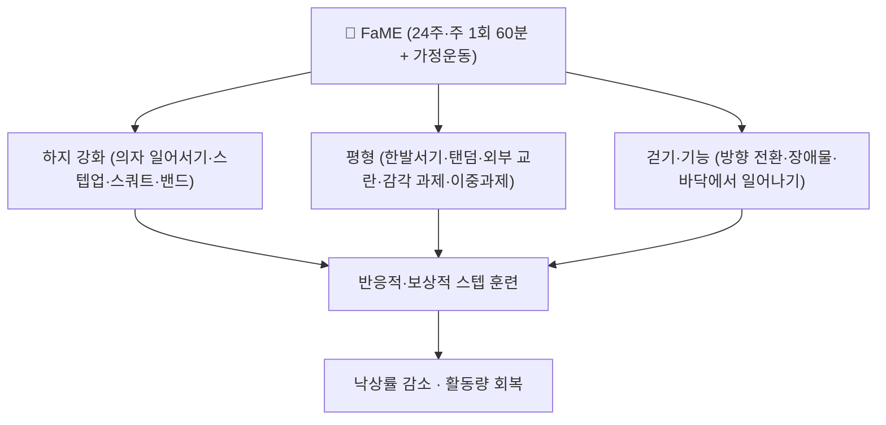

# 📍 FaME (Falls Management Exercise Programme, 낙상관리 운동 프로그램)

> **핵심 요약 (Key Summary)**:
> **영국 Later Life Training이 만든 지역사회 노인 낙상 예방 그룹 운동 프로그램.** 24주(연장 시 36주) 구조화 다성분 프로그램으로, **주 1회 60분 그룹 세션(6~12인) + 가정 운동**을 결합하며 유효 용량은 **총 50시간 이상**이다. 자세안정 강사(PSI)가 3단계로 진행한다. 최근 네트워크 메타분석에서 낙상 관련 결과의 **SUCRA 1위(68.56%)** 로, 단일 평형훈련(0.58%)보다 훨씬 우월했다 — Ageing Res Rev 2026;113:102924, [PMID 41110662](https://pubmed.ncbi.nlm.nih.gov/41110662/).

---

## 📌 목차
1. [중재 기본 정보](#1-중재-기본-정보)
2. [적용 기전 (신경근·행동)](#2-적용-기전-신경근행동)
3. [단계별 시행법 (환자 지도 가능 수준)](#3-단계별-시행법-환자-지도-가능-수준)
4. [효과 판정 및 용량 원칙](#4-효과-판정-및-용량-원칙)
5. [연관 중재 비교](#5-연관-중재-비교)
6. [한의 임상 연계](#6-한의-임상-연계)
7. [💡 진료실 핵심 필기 & 임상 노하우](#7--진료실-핵심-필기--임상-노하우)
8. [출처 및 학술 참고 문헌](#8-출처-및-학술-참고-문헌)

---

## 1. 중재 기본 정보

| 항목 | 내용 |
| :--- | :--- |
| **중재 분류** | 다성분 그룹 운동 프로그램 (중재 로테이션 A. 운동) |
| **적응증** | 지역사회 노인, 특히 **낙상력·낙상 두려움이 있는 고위험군** |
| **금기·선행** | 급성 관절염·미치유 골절·비보상성 심부전·조절되지 않는 혈압 |
| **구조** | 주 1회 60분 그룹 세션(6~12인) + 가정 운동 |
| **기간·용량** | 24주(연장 36주), 유효 용량 **총 ≥50시간** |
| **강사 요건** | 자세안정 강사(PSI, Postural Stability Instructor) |
| **구성** | 웜업 8~10분 · 하지 강화 12~15분 · 평형 12~15분 · 걷기·기능 8~10분 |
| **참고 자료** | [Later Life Training — FaME](https://www.laterlifetraining.co.uk/) |

---

## 2. 적용 기전 (신경근·행동)

* **반응적·보상적 스텝과 바닥에서 일어나기**를 특히 강조한다 — 실제로 넘어졌을 때 스스로 일어날 수 있다는 자신감이 활동량 회복의 관문이다 → [[낙상 효능감]]
* **이중과제(dual-task)** 를 도입해 인지-운동 동시 수행 능력을 훈련한다 → [[이중과제 훈련]]

---

## 3. 단계별 시행법 (환자 지도 가능 수준)

### 3단계 구성
| 단계 | 기간 | 목표 | 세션 예시 |
| :--- | :--- | :--- | :--- |
| 1단계 적응 | 1~8주 | 동작 학습·안전·기초 신경근 이득 | 의자 일어서기, 보조 스쿼트, 한발서기(지지) |
| 2단계 부하·복잡성 증가 | 9~16주 | 부하·난이도 상향, 이중과제 도입 | 탄력밴드 3세트×8~15회, 외부 교란, 이중과제 |
| 3단계 통합·실생활 적용 | 17~24주 | 실생활 전이 | 방향 전환·장애물 보행·바닥에서 일어나기 |

### 전형적 세션(60분)
- **웜업 8~10분** → **하지 강화 12~15분**(의자 일어서기·스텝업·보조 스쿼트·탄력밴드, 3세트×8~15회) → **평형 12~15분**(한발서기 3×10~20초·탠덤·외부 교란·감각 과제·이중과제) → **걷기·기능 8~10분**(방향 전환·장애물·바닥에서 일어나기)

### 중단·전환 기준
- 운동 중 급성 통증·호흡곤란·협심증 증상·지속 어지럼증 → **즉시 중단**
- 낙상력이 있는 환자는 첫 회기를 전문가 평가로 시작하고, 중증 허약·인지 저하는 감독 하에 시행한다

---

## 4. 효과 판정 및 용량 원칙

| 지표 | 내용 |
| :--- | :--- |
| **1차 결과** | 낙상 발생률·낙상 위험 |
| **NMA 순위** | SUCRA **68.56%(1위)** — FaME > OEP(57.58%) > 수중운동(43.96%) > 태극권(41.52%) > 평형훈련 단독(0.58%) |
| **유효 용량** | 총 **≥50시간**(24주 기준) — 누적 용량이 임계치처럼 작동한다 |
| **총량 상한** | 총 운동량과 낙상 결과는 역U자 관계(최적 약 420 MET·min/week) → [[대사당량(MET)]] |

---

## 5. 연관 중재 비교

| 중재 | 위치 | 특징 |
| :--- | :--- | :--- |
| **FaME** | SUCRA 1위 | 그룹·전문 강사 필요, 총 ≥50시간 확보가 관건 |
| [[오타고 운동 프로그램]] | SUCRA 2위 | 가정 기반·개별 처방, 자원 부담 낮아 국내 현실적 |
| [[수중운동]] | SUCRA 3위 | 관절 부하 적음 |
| [[태극권]] | SUCRA 4위 | 심신운동, 균형·낙상 두려움에 중간 정도 근거 |
| [[평형훈련]] 단독 | SUCRA 최하위 | 다성분 점진적 프로그램이 단일 평형훈련보다 우월 |

---

## 6. 한의 임상 연계

* **국내 적용의 한계**: FaME는 그룹·전문 강사 자원이 필요해 개인 진료실에서 그대로 운영하기 어렵다. **OEP로 대체하고 FaME 구성요소(반응적 스텝·바닥에서 일어나기·이중과제)만 발췌**해 넣는 것이 현실적이다
* **침·약침**: 낙상 위험 노인의 하지 근력·평형 개선을 목표로 하는 교과서적 배혈(족삼리 ST36·양릉천 GB34 등, 순수 텍스트)을 병행할 수 있다
* **주의**: 골다공증 동반 시 강한 고속저진폭 추나 술기는 피하고, 운동과 병행해 골다공증 약물 치료 여부를 확인한다 → [[골다공증]]

---

## 7. 💡 진료실 핵심 필기 & 임상 노하우

* **'총 50시간'을 환자에게 숫자로 말한다**: 24주 주 1회 60분만으로는 24시간이므로, **가정 운동을 반드시 붙여야** 50시간에 도달한다. 세션만 하고 끝내면 용량이 부족하다
* **이중과제를 생활 동작으로**: "걸으면서 100에서 7씩 빼기", "물건 들고 방향 전환"처럼 일상 과제로 바꿔 지도하면 순응도가 올라간다
* **낙상 두려움 우선 처리**: 두려움이 큰 환자는 총량을 늘리기 전에 **바닥에서 일어나기 훈련**을 먼저 가르친다
* **말 한마디**: "근력만, 균형만 따로 하면 효과가 작습니다. 두 가지를 같이 하고, 넘어졌을 때 일어나는 연습까지 해야 합니다."

---

## 8. 출처 및 학술 참고 문헌

1. **Ageing Research Reviews (2026)**. *Optimal type and dose of exercise to improve fall behavior in older adults: A systematic evaluation and network meta-analysis*. **Ageing Res Rev**, 113:102924. [PMID 41110662](https://pubmed.ncbi.nlm.nih.gov/41110662/)
   - **[연구 요약]**: RCT 21편·3,387명 NMA — FaME SUCRA 68.56%(1위), 최적 총량 약 420 MET·min/week.
2. **Later Life Training — FaME(Falls Management Exercise)** — [Later Life Training](https://www.laterlifetraining.co.uk/)
   - **[임상 교육자료]**: PSI 강사 자격, 24주·3단계 구성, 세션 프로토콜 요약.
3. **Campbell AJ, et al. (1997)**. *Randomised controlled trial of a general practice programme of home based exercise to prevent falls in elderly women*. **BMJ**, 315(7115):1065-1069. [PMID 9366737](https://pubmed.ncbi.nlm.nih.gov/9366737/)
   - **[연구 요약]**: OEP의 원 시험으로, 다성분 가정 기반 프로그램이 낙상 위험을 약 35% 낮춘 근거 — FaME와 같은 계열의 다성분 설계를 뒷받침한다.

---

## 함께 보기
- [[오타고 운동 프로그램]] · [[평형훈련]] · [[수중운동]] · [[태극권]] · [[대사당량(MET)]] · [[낙상 효능감]] · [[이중과제 훈련]] · [[TUG 검사]] · [[골다공증]] · [[근감소증]] · [[허약]] · [[점진적 과부하]] · [[2026-10-03_대사노인질환_심층리뷰]]
