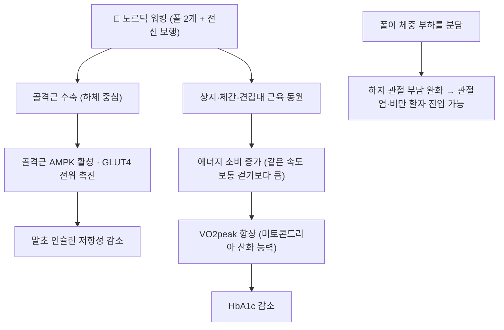

# 📍 노르딕 워킹 (Nordic Walking)

> **핵심 요약 (Key Summary)**:
> **폴 두 개를 짚고 걷는 전신 유산소 운동**으로, 겨울 스키 동작에서 유래했다. 폴을 뒤로 밀며 상지·체간·하지를 함께 쓰기 때문에 약 70~90%의 골격근이 동원되고, 같은 속도의 보통 걷기보다 에너지 소비가 크다.
> [[내당능장애]]·[[제2형 당뇨병]] 성인 321명(무작위시험 6편) 메타분석에서 체중 **-0.79 kg**(p=0.02), [[HbA1c]] **-0.37%**(이질성 높음), [[HDL]] **+0.07 mmol/L**(p=0.005)가 관찰됐다 — Chen S 등, *J Diabetes Res* 2026;2026:5886930, [PMID 41523744](https://pubmed.ncbi.nlm.nih.gov/41523744/).
> 재현성 있는 표준 처방은 **회당 60분 · 주 3회 · 12주(주 180분)** 이다. 약물을 대체하지 않는 **병용 처방**으로 위치시킨다.

---

## 📌 목차
1. [중재 기본 정보](#1-중재-기본-정보)
2. [적용 기전 (대사·생체역학)](#2-적용-기전-대사생체역학)
3. [단계별 시행법 (환자 지도 가능 수준)](#3-단계별-시행법-환자-지도-가능-수준)
4. [효과 판정 및 용량 원칙](#4-효과-판정-및-용량-원칙)
5. [연관 중재 비교](#5-연관-중재-비교)
6. [한의 임상 연계](#6-한의-임상-연계)
7. [💡 진료실 핵심 필기 & 임상 노하우](#7--진료실-핵심-필기--임상-노하우)
8. [출처 및 학술 참고 문헌](#8-출처-및-학술-참고-문헌)

---

## 1. 중재 기본 정보

| 항목 | 내용 |
| :--- | :--- |
| **중재 분류** | 폴을 이용한 전신 보행 운동 (중재 로테이션 A. 운동 — 보행·유산소 처방) |
| **적응증** | [[내당능장애]]·[[제2형 당뇨병]]·[[비만]] 성인의 유산소 처방. 중·고령층 포함 |
| **금기·선행** | 불안정 협심증, 조절되지 않는 고혈압, 중증 대동맥판 협착, 급성 심부전·급성 감염기에는 시행하지 않는다 |
| **구성** | 워밍업(관절 가동·발목·고관절) 5~10분 + 본운동 + 정리(하지 정적 스트레칭) 5분, 회당 총 45~60분 |
| **용량** | 회당 60분 · 주 3회 · 12주 (주 180분, 약 3시간) |
| **강도** | 원문 특성표에 강도 미기재 — 임상에서는 RPE 12~14(약간 힘들다~힘들다) 또는 최대심박수 60~75%에서 대화가 가능한 속도 |
| **시연 영상 (Video Guide)** | [🎥 Nordic Walk Store — Learn to Nordic Walk in 4 simple steps](https://www.youtube.com/watch?v=oHksVVU6A_s) · [🎥 SIKANA English — Learning the Basic Technique](https://www.youtube.com/watch?v=zAmsHhc2zCw) |

---

## 2. 적용 기전 (대사·생체역학)

* **폴의 역할**: 폴이 체중 부하를 나눠 가지면서 보폭과 추진력이 늘어난다 → 하지 관절 부담이 큰 비만·관절염 환자도 진입할 수 있다
* **상지 참여의 이득**: 체간·견갑대 근육을 동시에 동원해 같은 속도의 보통 걷기보다 에너지 소비가 크다
* **대사 축**: 골격근 수축이 [[AMPK]] 경로를 통해 [[GLUT4]] 전위를 촉진하고, 유산소 능력(VO2peak) 향상이 [[HbA1c]] 감소에 기여한다
* **지질 축**: [[HDL]] 상승은 지질단백질 리파제 활성·체지방 감소와 연관된다. 반면 LDL·중성지방 개선에는 더 높은 강도·용량이 필요하다는 논의가 원문에 있었다

---

## 3. 단계별 시행법 (환자 지도 가능 수준)

### ① 시작 전 평가
- 심혈관 위험(흉통·호흡곤란 병력)·혈압·하지 관절 상태와 **발 감각**을 확인한다
- [[당뇨병성 말초신경병증]]이 있으면 [[당뇨발]] 여부를 살피고 **접촉면이 넓은 신발**을 착용하게 한다

### ② 폴 준비
- **폴 길이**: 팔꿈치를 90도로 굽혔을 때 손잡이가 바닥과 수평이 되는 길이로 맞춘다. 길면 상체가 뒤로 젖혀져 허리가 과신전되고, 짧으면 추진력이 떨어진다
- **사용법**: 팔이 아니라 **팔꿈치를 뒤로 밀며** 보폭을 늘린다. 진료실에서 1회 시연한다

### ③ 운동 처방 (환자 지도표)
| 순서 | 항목 | 용량 | 진행 규칙 |
| :--- | :--- | :--- | :--- |
| 1 | 워밍업 | 5~10분 | 관절 가동·발목·고관절 준비 |
| 2 | 본운동(노르딕 워킹) | 회당 60분 · 주 3회 · 12주 | 체력이 낮으면 15~20분씩 하루 2회로 시작 → 4주에 걸쳐 60분 연속 |
| 3 | 정리 운동 | 5분 | 하지 정적 스트레칭 |
| 병행 | 저항운동(노인·[[근감소증]]) | 주 2회, 하체 중심 | 유산소만으로는 근력 개선이 제한적이라 반드시 병행 |

### ④ 중단·전환 기준
- 보행 중 **흉통·호흡곤란·어지럼·비정상적 심계항진** → 즉시 중단
- **발 저림·감각 저하에 따른 상처, 간헐성 파행** → 즉시 중단. 매 세션 후 족부 피부를 점검한다
- 인슐린 또는 설폰요소제 복용자는 **운동 전후 저혈당 확인**이 필요하다
- 어깨 외전 제한·회전근개 질환이 있으면 폴이 오히려 부담이 될 수 있다 → **일반 걷기부터** 시작한다

---

## 4. 효과 판정 및 용량 원칙

| 지표 | 내용 |
| :--- | :--- |
| **체중** | 대조군 대비 -0.79 kg (p=0.02) |
| **허리둘레** | -0.82 cm (p=0.07, 감소 경향) |
| **HbA1c** | -0.37% (I²=69%). 하위군: [[제2형 당뇨병]] -0.49%(p<0.00001) > [[내당능장애]] -0.2%(p=0.001) |
| **HDL 콜레스테롤** | +0.07 mmol/L (p=0.005) |
| **무변화** | 총콜레스테롤·중성지방·LDL, 공복혈당·[[HOMA-IR]]·혈압 |
| **VO2peak** | 개선 양상 |

* **표준 처방**: 회당 60분·주 3회·12주가 가장 근거가 명확한 조합이다. 포함 시험은 4~16주·주 1~5회로 이질적이었다
* **용량-반응 불명**: 강도가 보고되지 않아 용량-반응 관계는 알 수 없다

---

## 5. 연관 중재 비교

| 중재 | 특징 | 위치 |
| :--- | :--- | :--- |
| **노르딕 워킹** | 상지 동원·전신 대사, 폴이 체중 분담 | HbA1c·체중·[[HDL]] 개선. 어깨 문제 시 부적합 |
| [[걷기 운동]] | 진입 장벽 최저, 기기 불필요 | 기반 처방. 상지 동원은 없음 |
| [[수중운동]] | 부력·온열, 관절 부담 최소 | 비만·관절염 노인 진입 경로 |
| [[저항운동]] | 근력·근육량 | 노인·[[근감소증]]에서는 **필수 병행** |
| [[유산소운동]] | 일반 원칙 | 운동 강도·총량 설계의 상위 개념 |

---

## 6. 한의 임상 연계

* **한의 접점**: [[제2형 당뇨병]]·[[비만]] 환자에게 약물·침 치료와 함께 **생활처방**으로 운동을 처방한다. "약효를 보강하는 3시간"으로 설명한다
* **침·약침**: 혈당 조절 보조를 목표로 하는 교과서적 배혈(족삼리 ST36·삼음교 SP6·비수 BL20 등, 순수 텍스트)과 병행 가능하다
* **족부 관리**: [[당뇨병성 말초신경병증]] 환자는 운동 전후 발 점검이 진료 루틴에 포함되어야 한다
* **주의**: 운동 단독으로 약물을 대체하지 않는다. HbA1c -0.37%는 [[메트포르민]] 단독(-0.5~-1.0%)보다 작다

---

## 7. 💡 진료실 핵심 필기 & 임상 노하우

* **'용량'이 이 근거의 실전 가치다**: 회당 60분·주 3회·12주(총 36세션)를 기준선으로 인쇄해 준다. 체력이 낮은 노인은 15~20분씩 하루 2회로 시작해 4주에 걸쳐 60분 연속으로 늘린다
* **폴 길이와 사용법을 꼭 시연한다**: 팔꿈치 90도 기준 길이, 팔꿈치를 뒤로 미는 동작. 이 한 가지만 잡아도 허리 과신전과 추진력 상실을 막는다
* **어깨를 먼저 본다**: 회전근개 질환·어깨 외전 제한이 있으면 폴이 부담이 된다 → 일반 걷기부터 시작
* **노인은 근력운동을 반드시 얹는다**: 노르딕 워킹만으로는 근력 개선이 제한적이다. 주 2회 하체 저항운동을 병행해 [[근감소증]]·낙상 위험을 함께 관리한다
* **말 한마디**: "폴을 짚고 조금 빠르게 걸으면, 같은 시간에 더 많은 근육을 씁니다. 일주일에 세 번, 한 시간씩, 12주만 해보십시오."

---

## 8. 출처 및 학술 참고 문헌

1. **Chen S, et al. (2026)**. *Effect of Nordic Walking on Anthropometrics, Glycemia, and Lipid Profile in Adults With Prediabetes or Diabetes: A Systematic Review and Meta-Analysis of Randomized Controlled Trials*. **Journal of Diabetes Research**, 2026:5886930. [PMID 41523744](https://pubmed.ncbi.nlm.nih.gov/41523744/) · [PMC12782928](https://pmc.ncbi.nlm.nih.gov/articles/PMC12782928/)
   - **[연구 요약]**: 무작위시험 6편·321명 메타분석 — 체중 -0.79 kg(p=0.02), HbA1c -0.37%(I²=69%), HDL +0.07 mmol/L(p=0.005). T2DM 하위군에서 HbA1c 감소폭이 더 컸다. 강도는 원문 미기재.
2. **Nordic Walk Store**. *Learn to Nordic Walk in 4 simple steps* — [영상](https://www.youtube.com/watch?v=oHksVVU6A_s)
   - **[임상 교육자료]**: 폴 길이 선택과 팔꿈치 사용 리듬, 발 디딤 순서를 4단계로 보여주는 입문 영상.
3. **SIKANA English**. *Learning the Basic Technique | Nordic Walking* — [영상](https://www.youtube.com/watch?v=zAmsHhc2zCw)
   - **[임상 교육자료]**: 상체 회전과 폴 지지(폴에 체중을 싣는 느낌)를 정면·측면에서 촬영. 잘못된 자세(폴을 앞으로 찍는 동작)를 비교해 준다.

---

## 함께 보기
- [[유산소운동]] · [[걷기 운동]] · [[저항운동]] · [[수중운동]] · [[HbA1c]] · [[HDL]] · [[내당능장애]] · [[제2형 당뇨병]] · [[당뇨병성 말초신경병증]] · [[당뇨발]] · [[근감소증]] · [[VO2peak]] · [[AMPK]] · [[GLUT4]] · [[HOMA-IR]]
- 관련 논문: [[2026-10-10_대사노인질환_심층리뷰]] 2번 · [[2026-10-10_대사노인질환_개념학습]]
