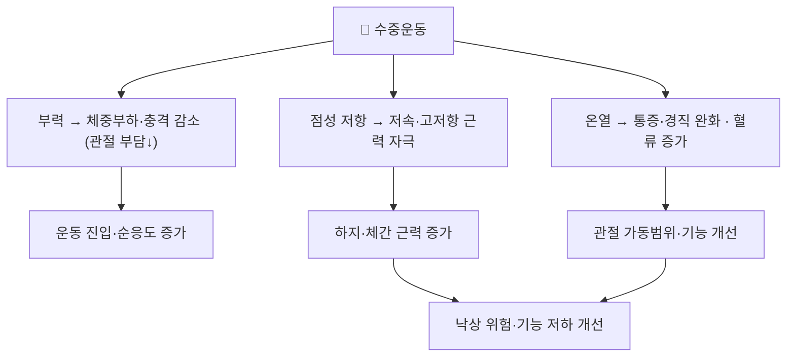

# 📍 수중운동 (Aquatic Exercise, 수중재활)

> **핵심 요약 (Key Summary)**:
> **물의 부력·점성·온열을 이용해 관절 부하를 줄이면서 근력·평형·유산소 능력을 기르는 운동.** 체중부하 관절에 가해지는 충격이 작아 [[퇴행성 슬관절염]]·[[퇴행성 관절염]]·비만 노인에게 유리하다. 노인 낙상 예방 네트워크 메타분석에서 **SUCRA 43.96%(3위)** 로 중간 정도 위치를 차지했다 — Ageing Res Rev 2026;113:102924, [PMID 41110662](https://pubmed.ncbi.nlm.nih.gov/41110662/). 물의 저항은 부하를, 온열은 통증·경직을 완화해 **운동을 시작하지 못하는 환자의 진입 경로**로 유용하다.

---

## 📌 목차
1. [중재 기본 정보](#1-중재-기본-정보)
2. [적용 기전 (부력·점성·온열)](#2-적용-기전-부력점성온열)
3. [단계별 시행법 (환자 지도 가능 수준)](#3-단계별-시행법-환자-지도-가능-수준)
4. [효과 판정 및 용량 원칙](#4-효과-판정-및-용량-원칙)
5. [연관 중재 비교](#5-연관-중재-비교)
6. [한의 임상 연계](#6-한의-임상-연계)
7. [💡 진료실 핵심 필기 & 임상 노하우](#7--진료실-핵심-필기--임상-노하우)
8. [출처 및 학술 참고 문헌](#8-출처-및-학술-참고-문헌)

---

## 1. 중재 기본 정보

| 항목 | 내용 |
| :--- | :--- |
| **중재 분류** | 수중(수영장) 기반 운동 (중재 로테이션 A. 운동) |
| **적용증** | 퇴행성 관절염·비만·노인 허약·만성 요통·섬유근통, 체중부하 통증으로 육상운동이 어려운 환자 |
| **금기** | 개방창·감염성 피부질환, 조절되지 않는 심부전·협심증, 요실금(물의 압력이 증상 유발), 심한 물 공포 |
| **환경** | 수온 대개 28~33℃, 흉부 깊이 또는 어깨 깊이 |
| **용량(일반)** | 회당 45~60분, 주 2~3회, 8~12주 |
| **강도 조절** | 이동 속도·물 저항 기구(부력 보조/저항 기구)·수심으로 조절 |

---

## 2. 적용 기전 (부력·점성·온열)

* **부력**: 체중부하가 줄어 통증 없이 움직일 수 있다 — 육상에서 못 하는 환자를 운동으로 끌어들이는 진입 효과
* **점성 저항**: 물의 저항은 속도가 빠를수록 커져 저부하~중부하 근력 자극을 만든다
* **온열**: 근경직·통증을 낮춰 가동범위 훈련이 가능해진다

---

## 3. 단계별 시행법 (환자 지도 가능 수준)

### ① 기본 구성 (회당 45~60분)
1. **입수 적응·워밍업 5~10분**: 제자리 걷기, 팔·다리 흔들기
2. **근력 15~20분**: 수중 스쿼트, 벽 짚고 다리 들기, 물 저항 기구 사용
3. **평형·기능 10~15분**: 수중 한발서기, 옆으로 걷기, 방향 전환
4. **유산소 10~15분**: 수중 걷기·조깅, 수심을 낮춰 강도 상향
5. **정리운동 5분**: 스트레칭, 호흡

### ② 안전 수칙 (환자 지도용)
- 미끄럼 방지 신발, 입수 전 후 체온 관리, 단독 입수 금지
- 어지럼·흉통·호흡곤란 시 즉시 중단하고 부축해 물 밖으로 나온다

### ③ 중단·전환 기준
- 어지럼·실신 전구증상, 흉통, 심한 피로 → 중단
- 피부 감염·개방창 발병 시 재개 보류

---

## 4. 효과 판정 및 용량 원칙

| 지표 | 내용 |
| :--- | :--- |
| **평가도구** | [[WOMAC]] · [[TUG 검사]] · [[6분 보행검사]] · 한발서기 · 통증 [[시각아날로그척도(VAS)]] |
| **NMA 순위** | SUCRA **43.96%(3위)** — FaME(68.56%)·OEP(57.58%)보다 낮고 평형단독(0.58%)보다 높다 |
| **해석** | 순위는 낙상 관련 결과 기준이다. **관절염 통증·기능에서는 수중운동의 근거가 별도로 강하다** — 목적을 구분해 읽는다 |
| **총량** | 총 운동량-낙상 결과는 역U자(최적 약 420 MET·min/week) → [[대사당량(MET)]] |

---

## 5. 연관 중재 비교

| 중재 | 위치 | 특징 |
| :--- | :--- | :--- |
| [[FaME]] | 다성분 1위 | 그룹·전문 강사 필요 |
| [[오타고 운동 프로그램]] | 다성분 2위 | 가정 기반 |
| **수중운동** | 3위 | 관절 부하 최소, 순응도 높음. 시설 접근성이 제약 |
| [[태극권]] | 4위 | 심신운동 |
| [[평형훈련]] 단독 | 최하위 | 단독 처방 부적합 |

---

## 6. 한의 임상 연계

* **한의 접점**: 습비(濕痹)·한습(寒濕) 변증의 관절통 환자에게 온수 수중운동은 온경산한(溫經散寒) 개념과 맞닿는다
* **침·약침·[[뜸]]** 병행: 관절통·근경직 완화를 목표로 병행하고, 수중운동 후 체온 저하에 주의한다
* **[[퇴행성 슬관절염]]·[[요통]]** 환자의 운동 진입 단계로 권장할 수 있다 — 육상 운동이 통증으로 어려울 때 대안이 된다

---

## 7. 💡 진료실 핵심 필기 & 임상 노하우

* **진입 전략으로 쓴다**: 육상 걷기조차 무릎이 아픈 환자는 수중에서 시작해 통증 없이 활동량을 올린 뒤 육상 운동으로 전환한다
* **시설 제약을 정직하게 말한다**: 효과는 있지만 수영장 접근성이 관건이다 — 이용 가능한 시설·시간을 함께 확인하고, 없으면 가정형 OEP로 대체한다
* **낙상 예방 목적이라면 단독으로 쓰지 않는다**: 다성분 프로그램(FaME·OEP)이 우월하다는 근거를 환자에게 설명한다
* **말 한마디**: "물속에서는 무릎에 부담이 적어 운동을 시작할 수 있습니다. 대신 균형·근력 운동과 함께 하세요."

---

## 8. 출처 및 학술 참고 문헌

1. **Ageing Research Reviews (2026)**. *Optimal type and dose of exercise to improve fall behavior in older adults: A systematic evaluation and network meta-analysis*. **Ageing Res Rev**, 113:102924. [PMID 41110662](https://pubmed.ncbi.nlm.nih.gov/41110662/)
   - **[연구 요약]**: RCT 21편·3,387명 NMA — 수중운동 SUCRA 43.96%(3위), 다성분 프로그램보다는 낮고 평형단독보다는 높음.
2. **Chen LK, Woo J, Assantachai P, et al. (2020)**. *Asian Working Group for Sarcopenia: 2019 Consensus Update*. **J Am Med Dir Assoc**, 21(3):300-307. [PMID 32033882](https://pubmed.ncbi.nlm.nih.gov/32033882/)
   - **[연구 요약]**: 낙상·기능 저하 평가의 표준 3축(악력·기능·근육량) — 수중운동 효과 판정의 지표 틀로 참조한다.

---

## 함께 보기
- [[오타고 운동 프로그램]] · [[FaME]] · [[평형훈련]] · [[태극권]] · [[대사당량(MET)]] · [[낙상 효능감]] · [[퇴행성 슬관절염]] · [[요통]] · [[WOMAC]] · [[TUG 검사]] · [[6분 보행검사]] · [[점진적 과부하]] · [[2026-10-03_대사노인질환_심층리뷰]]
