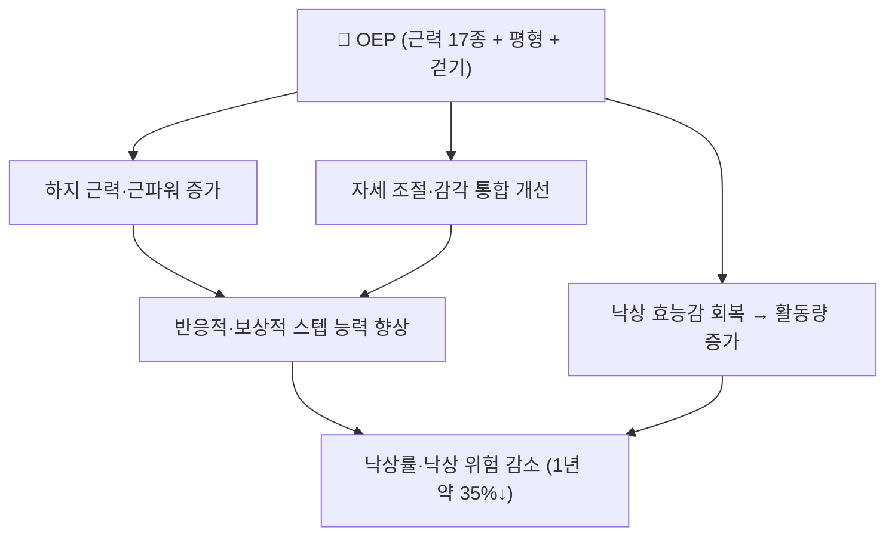

# 📍 오타고 운동 프로그램 (Otago Exercise Programme, OEP)

> **핵심 요약 (Key Summary)**:
> **지역사회 노인의 낙상 예방을 위해 뉴질랜드 오타고대에서 개발된 가정 기반 근력·평형 운동 프로그램.** 근력·평형 운동 17종 + 걷기 계획으로 구성되고, 숙련 강사의 **가정방문 4~5회 + 월 1회 전화 점검**으로 개별 처방된다. 원 시험에서 1년 낙상 위험이 약 **35% 감소**했고, 80세 이상·낙상력이 있는 고위험군에서 이득이 가장 컸다 — Campbell AJ 등, BMJ 1997;315(7115):1065-9, [PMID 9366737](https://pubmed.ncbi.nlm.nih.gov/9366737/). 최근 네트워크 메타분석에서는 낙상 관련 결과에서 **SUCRA 2위(57.58%)** 로, 다성분 점진적 프로그램의 대표로 꼽혔다 — [PMID 41110662](https://pubmed.ncbi.nlm.nih.gov/41110662/).

---

## 📌 목차
1. [중재 기본 정보](#1-중재-기본-정보)
2. [적용 기전 (신경근·생체역학)](#2-적용-기전-신경근생체역학)
3. [단계별 시행법 (환자 지도 가능 수준)](#3-단계별-시행법-환자-지도-가능-수준)
4. [효과 판정 및 용량 원칙](#4-효과-판정-및-용량-원칙)
5. [연관 중재 비교](#5-연관-중재-비교)
6. [한의 임상 연계](#6-한의-임상-연계)
7. [💡 진료실 핵심 필기 & 임상 노하우](#7--진료실-핵심-필기--임상-노하우)
8. [출처 및 학술 참고 문헌](#8-출처-및-학술-참고-문헌)

---

## 1. 중재 기본 정보

| 항목 | 내용 |
| :--- | :--- |
| **중재 분류** | 가정 기반 근력·평형 운동 프로그램 (중재 로테이션 A. 운동) |
| **적응증** | 65세 이상 지역사회 노인 중 낙상력·보행 불안정·낙상 두려움이 있는 사람 |
| **금기·선행** | 급성 감염, 비보상성 심부전, 최근 미치유 골절, 조절되지 않는 혈압에서는 시작하지 않는다 |
| **구성** | 워밍업(유연성 5종) + 근력·평형 운동 17종 + 걷기 계획 |
| **용량** | 회당 약 30분 · 주 3회(격일, 휴식일을 둠) · 걷기 주 2회 최대 30분 |
| **감독 체계** | 숙련 강사가 1·2·4·8주와 6개월에 가정방문(총 4~5회), 방문 사이 월 1회 전화 |
| **증량** | 발목 모래주머니 1 kg에서 시작해 단계적으로 증량 |
| **시연 영상 (Video Guide)** | [🎥 UNC CGWEP — Otago Exercise Program video library](https://www.med.unc.edu/aging/cgwep/courses/otago-exercise-program/otago-videos/) · [🎥 The Otago Exercise Programme — George Ampat](https://www.youtube.com/watch?v=BWGCAMg2ILQ) |
| **공개 매뉴얼** | [ACC Otago Exercise Programme 매뉴얼 (PDF)](https://ncchamp.org/files/Otagoexerciseprogramme.pdf) |

---

## 2. 적용 기전 (신경근·생체역학)

* **근력·파워 축**: [[대퇴사두근]]·[[둔근]]·[[가자미근]] 강화로 기립·보행 안정성이 올라간다
* **평형·감각 통합 축**: 한발서기·탠덤·외부 교란·감각 과제로 자세 조절 회로를 재훈련한다
* **행동 축**: "넘어질 것 같다"는 두려움을 줄여 활동량을 회복시킨다 — 활동 위축이 낙상 위험을 키우는 고리를 끊는다 → [[낙상 효능감]]

---

## 3. 단계별 시행법 (환자 지도 가능 수준)

### ① 초기 평가 (1주차)
- 1년 내 낙상력, 보행 보조기 사용, 의자 일어서기, [[TUG 검사]]·한발서기 시간을 기록한다
- 약물(수면제·혈압약)·시력·발(발톱·신발)을 점검한다 — 낙상 원인은 운동 부족만이 아니다

### ② 운동 처방 (환자 지도표)
| 순서 | 항목 | 용량 | 진행 규칙 |
| :--- | :--- | :--- | :--- |
| 1 | 워밍업(유연성 5종) | 5분 | 목·어깨·허리·발목 천천히 |
| 2 | 근력 운동(의자 일어서기·무릎 신전·발목 배굴/저굴·고관절 외전 등) | 각 8~10회 × 1~3세트 | 발목 모래주머니 1 kg 시작 → 8주마다 증량 |
| 3 | 평형 운동(한발서기·탠덤·뒤로 걷기·옆으로 걷기·발뒤꿈치/발끝 서기) | 각 10~20초 또는 10회 | 지지대를 잡고 시작 → 손을 떼며 난이도 상향 |
| 4 | 걷기 | 주 2회 최대 30분 | 안전하면 실시, 익숙해지면 방향 전환·장애물 추가 |

### ③ 감독·점검
- 가정방문 4~5회(1·2·4·8주, 6개월) + 월 1회 전화로 자세·강도·순응도를 점검한다
- 운동일지를 받아 실제 수행 횟수를 확인한다 — 처방만 하고 방치하면 효과가 사라진다 → [[디트레이닝]]

### ④ 중단·전환 기준
- 운동 중 급성 통증·호흡곤란·협심증 증상·지속 어지럼증 → **즉시 중단**
- 인지 저하·중증 허약·보행 보조기 필수 환자는 **감독 하에만** 시행하고, 낙상력이 있으면 첫 회기를 전문가 평가로 시작한다

---

## 4. 효과 판정 및 용량 원칙

| 지표 | 내용 |
| :--- | :--- |
| **1차 결과** | 낙상 발생률·낙상 위험(1년) |
| **원 시험 결과** | 1년 낙상 위험 약 **35% 감소**, 80세 이상·낙상력 고위험군에서 이득 최대 |
| **총량 원칙** | 총 운동량과 낙상 결과는 **역U자 관계**, 최적 반응은 약 **420 MET·min/week** 부근 → [[대사당량(MET)]] |
| **진료실 환산 예** | 회당 30분(약 4.5 MET) × 주 3회 ≈ 405 MET·min/week → 최적치에 근접 |
| **상한 주의** | 여기에 걷기 주 2회를 더하면 총량이 상한을 넘어 이득이 줄 수 있다 — **처음 8~12주는 주 3회 30분에 집중** |

---

## 5. 연관 중재 비교

| 중재 | 위치 | 특징 |
| :--- | :--- | :--- |
| [[FaME]] | SUCRA 1위(68.56%) | 주 1회 60분 그룹 + 가정운동, 총 ≥50시간. 전문 강사·그룹 자원 필요 |
| **오타고(OEP)** | SUCRA 2위(57.58%) | 가정 기반·개별 처방, 자원 부담이 가장 낮아 국내 개원가에 현실적 |
| [[수중운동]] | SUCRA 3위(43.96%) | 관절 부하 적음, 관절염 동반 시 유리 |
| [[태극권]] | SUCRA 4위(41.52%) | 심신운동, 균형·낙상 두려움에 중간 정도 근거 |
| [[평형훈련]] 단독 | SUCRA 최하위(0.58%) | 단일 평형훈련보다 **다성분 점진적 프로그램이 우월** |

---

## 6. 한의 임상 연계

* **한의 접점**: 낙상 위험 노인은 골다공증·[[근감소증]]·[[허약]]이 겹치는 경우가 많다. 운동 처방과 함께 골밀도·약물 치료 여부를 확인한다
* **침·약침**: 하지 근력·평형 개선을 목표로 하는 교과서적 배혈(족삼리 ST36·양릉천 GB34·삼음교 SP6 등, 순수 텍스트)을 운동 프로그램과 병행할 수 있다
* **뜸·추나**: 온중 목적의 뜸, 관절가동성 확보를 위한 도수 접근은 운동을 **대체하지 않고 보조**한다
* **주의**: 낙상 두려움이 큰 환자는 총량을 늘리기 전에 **바닥에서 일어나기 훈련**을 먼저 가르친다

---

## 7. 💡 진료실 핵심 필기 & 임상 노하우

* **'권고'가 아니라 '프로토콜'로 준다**: 1년 내 낙상력·보행 불안정·의자 일어서기 지연·낙상 두려움 중 하나라도 있으면, 17개 운동을 그림으로 인쇄해 주고 주 3회 30분·격일 원칙, 걷기 주 2회, 8주마다 모래주머니 1 kg 증량을 명시한다
* **총량 관리가 핵심**: 6개월 이상 유지하게 하고 12주·24주에 [[TUG 검사]]·5회 의자 일어서기·한발서기로 재평가한다. "더 많이"가 아니라 **'적정 총량'** 이 목표임을 분명히 말한다
* **국내 개원가 적용**: FaME는 전문 강사·그룹 자원이 필요해 어렵다. **OEP를 기본으로 하고 FaME 구성요소(반응적 스텝·바닥에서 일어나기)만 발췌**해 넣는 것이 현실적이다
* **말 한마디**: "넘어지는 걸 막는 건 약이 아니라 다리와 균형입니다. 일주일에 세 번, 30분씩, 6개월만 해보십시오."

---

## 8. 출처 및 학술 참고 문헌

1. **Campbell AJ, Robertson MC, Gardner MM, Norton RN, Tilyard MW, Buchner DM (1997)**. *Randomised controlled trial of a general practice programme of home based exercise to prevent falls in elderly women*. **BMJ**, 315(7115):1065-1069. [PMID 9366737](https://pubmed.ncbi.nlm.nih.gov/9366737/)
   - **[연구 요약]**: 80세 이상 여성 대상 가정 기반 근력·평형 운동 프로그램 RCT — 1년 낙상 위험 약 35% 감소, OEP의 원 시험.
2. **Ageing Research Reviews (2026)**. *Optimal type and dose of exercise to improve fall behavior in older adults: A systematic evaluation and network meta-analysis*. **Ageing Res Rev**, 113:102924. [PMID 41110662](https://pubmed.ncbi.nlm.nih.gov/41110662/)
   - **[연구 요약]**: RCT 21편·3,387명 NMA — OEP SUCRA 57.58%(2위), 최적 총량 약 420 MET·min/week.
3. **ACC(Otago Exercise Programme 매뉴얼)** — [매뉴얼 PDF](https://ncchamp.org/files/Otagoexerciseprogramme.pdf)
   - **[임상 교육자료]**: 17개 운동 삽화, 처방표, 가정방문 스케줄(1·2·4·8주·6개월).
4. **UNC CGWEP Otago Exercise Program 영상 라이브러리** — [영상 목록](https://www.med.unc.edu/aging/cgwep/courses/otago-exercise-program/otago-videos/)
   - **[환자 교육자료]**: 각 운동을 개별 영상으로 제공.

---

## 함께 보기
- [[FaME]] · [[평형훈련]] · [[수중운동]] · [[태극권]] · [[대사당량(MET)]] · [[낙상 효능감]] · [[TUG 검사]] · [[5회 의자 일어서기 검사]] · [[악력]] · [[골다공증]] · [[근감소증]] · [[허약]] · [[걷기 운동]] · [[점진적 과부하]] · [[디트레이닝]] · [[2026-10-03_대사노인질환_심층리뷰]]
