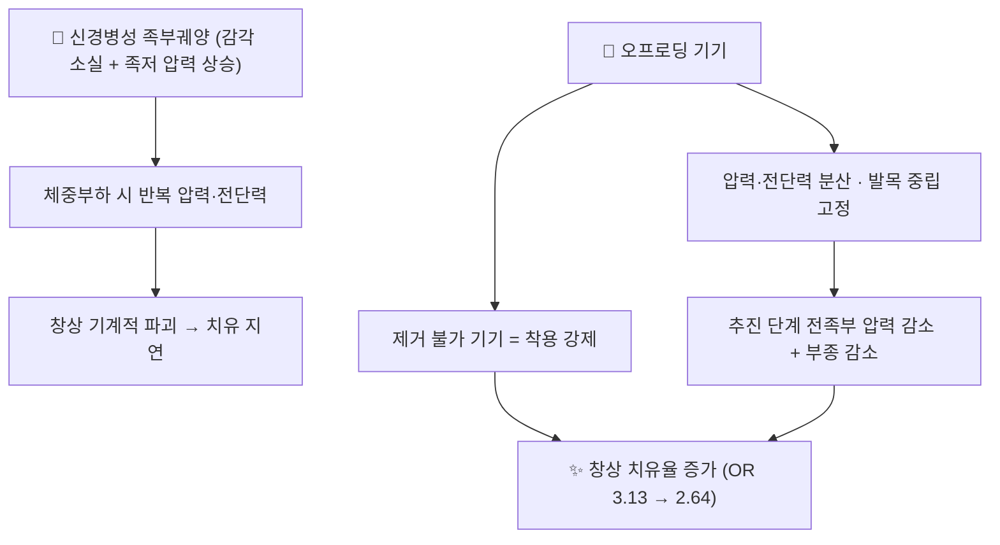

# 📍 오프로딩 (Offloading, 감압)

> **핵심 요약 (Key Summary)**:
> **당뇨병성 신경병성 족부궤양 치료에서 '기계적 응력을 제거하는' 중재.** 국제당뇨발실무그룹(IWGDF)은 여러 치료 중에서도 **오프로딩을 궤양 치유의 '가장 중요한 단일 중재'** 로 규정한다. 즉 소독·드레싱보다 **그 부위에 체중이 실리지 않게 하는 것**이 먼저다 → [[당뇨발]]
> **1차 선택은 비제거식 무릎높이 기기(전접촉석고 TCC 또는 공급자가 분리 불가능하게 고정한 워커)**, 금기·불내성이면 제거식 무릎높이·발목높이 기기, 그것도 어려우면 felted foam + 치료용 신발 순이다.
> 근거(메타분석): 어떤 감압이든 **무(無)감압보다 치유율이 높고(MH-OR 3.13)**, **TCC·비제거식 무릎높이 기기는 다른 감압기기보다 우수(MH-OR 2.64)**. 무엇보다 **'벗고 다니는 시간'을 없애는 것이 효과의 핵심**이다.

---

## 📌 목차
1. [검사·중재 기본 정보](#1-검사중재-기본-정보)
2. [적용 기전 (생체역학)](#2-적용-기전-생체역학)
3. [단계별 시행법 (환자 지도 가능 수준)](#3-단계별-시행법-환자-지도-가능-수준)
4. [양성 반응·효과 판정](#4-양성-반응효과-판정)
5. [연관 중재 비교](#5-연관-중재-비교)
6. [한의 임상 연계](#6-한의-임상-연계)
7. [💡 진료실 핵심 필기 & 임상 노하우](#7--진료실-핵심-필기--임상-노하우)
8. [출처 및 학술 참고 문헌 (References)](#8-출처-및-학술-참고-문헌-references)

---

## 1. 검사·중재 기본 정보

| 항목 | 내용 |
| :--- | :--- |
| **중재 분류** | 보조기·기기 기반 감압 (중재 로테이션 카테고리 E. 주사·보조기·기타) |
| **적응증** | 당뇨병 + **비감염성 신경병성 족부궤양**(족저 전족부·중족부), 샤르코족의 활동성 병변 |
| **금기·선행 치료** | 중등도 이상 **감염 또는 허혈** 동반 시 비제거식 기기 대신 제거식 기기를 적용하고 감염·허혈을 우선 치료 |
| **치유 소요** | 신경병성 족저 궤양의 완전 치유에 통상 **6~12주**. 이후에도 재발 예방용 치료용 신발·인솔 지속 |
| **시연 영상 (Video Guide)** | [🎥 IU Health — Total Contact Cast for Diabetic Foot Ulcers](https://www.youtube.com/watch?v=jHZt0naRnbM) (조회 확인 2026-09-26) |
| **국제 지침** | [IWGDF 2023 Offloading Guideline (PDF)](https://iwgdfguidelines.org/wp-content/uploads/2023/07/IWGDF-2023-06-Offloading-Guideline.pdf) |

![[오프로딩_01_캐스트워커_실사.jpg|400]]
> [그림 1: 하지 감압 기기 실사 — 발목을 중립으로 고정하고 발바닥 전체를 받치는 워커형 감압기(로커 솔 포함). 실제 임상에서 '제거식 무릎높이·발목높이 기기'로 쓰이는 형태 — Wikimedia Commons, CC BY-SA 4.0]

![[오프로딩_02_보행부츠_실사.jpg|400]]
> [그림 2: 캐스트 워커(보행 부츠) 실사 — 벨크로 고정식 제거식 기기. **환자가 스스로 벗을 수 있다는 점이 치유 실패의 최대 원인**이다 — Wikimedia Commons, CC BY-SA 4.0]

---

## 2. 적용 기전 (생체역학)

* **압력·전단력 차단**: 창상은 '계속 밟으면 낫지 않는다'. 반복 하중이 창상을 기계적으로 다시 열어 염증·치유 과정을 되돌린다
* **발목 중립 고정**: 발목을 중립으로 잡으면 보행 추진 단계에서 전족부에 걸리는 압력이 줄고, 하지 부종도 감소한다
* **순응도가 곧 기전**: 제거식 기기의 치유 실패는 대부분 **환자가 벗고 다니는 시간**에서 발생한다. OR 2.64의 상당 부분은 생체역학 차이보다 **착용 시간 차이**가 설명한다

---

## 3. 단계별 시행법 (환자 지도 가능 수준)

> ⚠️ **TCC·수술적 감압은 정형외과·족부클리닉·당뇨발 클리닉의 시술 영역**이다. 한의원에서는 ① 선별·의뢰 ② 기기 착용 순응도 관리 ③ 창상·피부 감시 ④ 최소 감압 확보(felted foam + 치료용 신발)까지 담당한다.

### ① 선별 (한의원에서 먼저 할 일)
- 당뇨병 환자에서 **10 g 모노필라멘트 검사 · 진동각 검사 · 발등맥/후경골동맥 촉지**를 세트로 시행해 감각저하·말초동맥질환을 선별한다
- 굳은살 아래 출혈·수포·홍조(전구 병변) 또는 개방 창상 → **감압 의뢰가 침·약침 조정보다 먼저**

### ② 기기 선택 (IWGDF 2023 권고 순서)
1. **1차 — 비제거식 무릎높이 기기**: 전접촉석고(TCC) 또는 공급자가 분리 불가능하게 고정한 무릎높이 워커(instant TCC 포함)
2. **2차 — 제거식 무릎높이·발목높이 기기**: 제거식 캐스트 워커·발목높이 워커·후방 반깁스 — **모든 체중부하 활동 중 착용**하도록 교육
3. **3차 — 기기 없는 감압**: felted foam(껍질형 감압 패드) + 적합한 치료용 신발 — **일반 신발·표준 치료용 신발을 감압 기기 위에 겹쳐 신지 않도록** 교육

### ③ 기기 관리 (제공 자료 기준)
- 궤양부에 흡수성 드레싱 → **족저면을 손으로 성형해 밀착** → 족부–기기 인터페이스(맞춤 인솔 또는 felted foam 도넛) 배치
- 캐스트는 **수일 내(3~4일) 첫 교체**로 창상·피부를 점검하고, 이후 **통상 주 1회 교체하며 창상 확인**
- 균형이 나빠지면 **보행보조기** 사용, 반대측 하지에 **신발 리프트** 추가를 고려

### ④ 중단·전환 기준 (즉시 행동)
- ① 새 압박 병변·피부 손상 ② 감염 징후 악화 ③ 낙상·보행 불안정 ④ 환자 불내성 → **즉시 기기를 제거·전환**
- 중등도 이상 감염·허혈이 확인되면 **비제거식 기기 금지**

---

## 4. 양성 반응·효과 판정

| 지표 | 판정 |
| :--- | :--- |
| **1차 결과** | 창상 **완전 치유율**(6~12주), 치유까지 걸린 시간 |
| **보강 근거** | 섬유유리 TCC는 제거식 캐스트 워커보다 치유시간 **−5.42일(95% CI −9.66~−1.17)** |
| **최신 RCT** | 후방 반깁스가 TCC보다 6개월 치유율 **72.9% vs 49%(HR 1.30, 1.03~1.73, p=0.024)**, 3개월 50% vs 25.5%, 환자 만족도 4.0 vs 2.5 |
| **⚠️ 주의** | 창상 면적 감소만 보고 '호전'이라 판단하지 않는다 — **가장자리 상피화와 삼출·육아조직**을 함께 본다. 창상이 커지면 감압이 부족하거나 감염이 진행 중이다 |

---

## 5. 연관 중재 비교

| 중재 | 위치 | 특징 |
| :--- | :--- | :--- |
| **비제거식 무릎높이 기기(TCC·iTCC)** | 1차 | 착용 강제로 순응도 최상, 치유율 최고. 관리·교체 필요, 낙상·피부 손상 감시 |
| **제거식 캐스트 워커·후방 반깁스** | 2차 | 적용·관리 쉬움, 만족도 높음. **벗는 시간**이 최대 약점 |
| **felted foam + 치료용 신발** | 3차 | 기기 사용이 불가할 때 최소 감압 확보. 단독 효과는 제한적 |
| **수술적 감압**(아킬레스건 연장·중족골두 절제 등) | 특수 | 활동성 궤양에서 기기 단독보다 치유율 우수(MH-OR 6.77, CI 1.64~27.93) — **신뢰구간이 매우 넓어 과대해석 금지** |
| [[견인치료]]·[[치료적 초음파]] 등 물리중재 | 병용 | 창상 치유의 주 중재가 아니다 — 감압을 대체하지 못한다 |

---

## 6. 한의 임상 연계

* **변증 관점**: 궤양은 대개 **기허 + 어혈·습열**의 복합으로 본다. 다만 **국소 열감·분비물·악취가 있으면 습열·감염 우선**이며, 자극적 국소 처치(봉침·강한 자극 약침)는 피한다
* **침·약침**: 감압이 확보된 상태에서 **궤양 주위를 피해** 원위 혈위 자극으로 순환·통증 관리. 궤양면 직접 자극 금지
* 한약: 보기활혈 계열(예: [[황기계지오물탕]]·[[보양환오탕]] 계열)이 미세순환 개선 축으로 연구되어 있으나, 감압·창상 처치를 대체하지 않는 보조임을 환자에게 명시한다 → [[당뇨병성 말초신경병증]]
* **주의 약물**: SGLT2 억제제 복용 환자는 탈수·케톤 위험이 있어 감염 동반 시 더 보수적으로 판단 → [[정상혈당 케톤산증]]

---

## 7. 💡 진료실 핵심 필기 & 임상 노하우

> 🛡️ **Melt-In 원칙**: 원장님 필기는 상부 섹션에 녹여내고, 여기엔 상부에 담기지 않은 노하우만 남긴다. (원장님 기존 필기 없음 — 신규 개념)

* **환자 지도 5수칙 (그대로 읽어 주면 된다)**
  1. 맨발·슬리퍼·샌들 금지
  2. 실내에서도 감압 인솔이 들어간 치료용 신발 착용
  3. 매일 발을 거울로 확인 — 발바닥·발가락 사이까지
  4. 중등도 이상 위험군은 하루 1회 발 피부 온도 자가 확인
  5. 발열·분비물·악취·검은 변색·통증 악화 시 즉시 내원
* **협진 설계가 성패를 가른다**: TCC 적용·수술적 오프로딩은 우리 범위 밖이다. **정형외과·족부·당뇨발 클리닉 협진선을 미리 만들어 두고**, 협진까지의 공백 기간에는 *"제거식 워커라도 있으면 무(無)감압보다 낫다(OR 3.13)"* 는 근거로 최소 감압을 확보한다
* **말 한마디**: "상처 소독보다 **그 자리에 체중이 안 실리게 하는 것**이 치료의 핵심입니다. 편하다고 벗을 수 있는 제품만 쓰시면 벗고 다니는 시간만큼 상처가 늦게 납니다."

---

## 8. 출처 및 학술 참고 문헌 (References)

1. **Monami M, et al. (2024)**. *Offloading systems for the treatment of neuropathic foot ulcers in patients with diabetes mellitus: a meta-analysis of randomized controlled trials for the development of the Italian guidelines for the treatment of diabetic foot syndrome*. **Acta Diabetol**, 61(6):693-703. [PMID 38489054](https://pubmed.ncbi.nlm.nih.gov/38489054/) · [doi:10.1007/s00592-024-02262-9](https://doi.org/10.1007/s00592-024-02262-9)
   - **[연구 요약]**: RCT 18편 정량합성 — **어떤 감압이든 무감압 대비 치유 우수(MH-OR 3.13, 1.08~9.11)**, **TCC·비제거식 무릎높이 워커가 다른 기기보다 우수(MH-OR 2.64, 1.43~4.89)**, 수술적 감압 MH-OR 6.77(1.64~27.93).
2. **IWGDF (2023)**. *Guidelines on the prevention and management of foot problems in diabetes — Offloading Guideline*. [지침 PDF](https://iwgdfguidelines.org/wp-content/uploads/2023/07/IWGDF-2023-06-Offloading-Guideline.pdf)
   - **[임상 가이드라인]**: 비제거식 무릎높이 기기 1차 권고, 감염·허혈 시 전환, 주 1회 캐스트 교체·창상 점검 원칙.
3. **Lee JS, et al. (2026)**. *Comparison of posterior slab cast with total contact cast in the management of diabetic foot ulcers: A randomized controlled trial*. **Diabetes Res Clin Pract**. [PMID 41692325](https://pubmed.ncbi.nlm.nih.gov/41692325/)
   - **[연구 요약]**: 제2형 당뇨 + Wagner 2~3기 족저 궤양 RCT — **후방 반깁스가 6개월 치유율 72.9% vs 49%(HR 1.30, p=0.024)**, 환자 만족도 우수. (원본 심층리뷰가 인용한 2026년 RCT)
4. **Bus SA, et al./관련 리뷰 (2021)**. *Knee-High Devices Are Gold in Closing the Foot Ulcer Gap: A Review of Offloading Treatments to Heal Diabetic Foot Ulcers*. **Medicina (Kaunas)**. [PMID 34577864](https://pubmed.ncbi.nlm.nih.gov/34577864/)
   - **[연구 요약]**: 무릎높이 비제거식 기기가 왜 표준인지(순응도·치유율)를 정리한 서술적 리뷰.
5. **YouTube 시연**: [IU Health — Total Contact Cast for Diabetic Foot Ulcers](https://www.youtube.com/watch?v=jHZt0naRnbM)
   - **[연구 요약]**: 전접촉석고의 제작·교체·치료 전 과정을 실제 시술 장면으로 보여 주는 임상 교육 영상(링크 유효 확인 2026-09-26).
6. **BOFAS Hyperbook** — [Total Contact Casting](https://www.bofas.org.uk/hyperbook/systemic/diabetic-foot/total-contact-casting)
   - **[임상 교육자료]**: 체위·패딩·층별 적용·주 1회 교체 원칙의 단계별 정리.
7. **이미지 출처**
   - 감압 워커 실사: [Total Contact Cast (Wikimedia Commons)](https://commons.wikimedia.org/wiki/File:Total_Contact_Cast.jpg) — CC BY-SA 4.0
   - 보행 부츠 실사: [Aircast walking boot (Wikimedia Commons)](https://commons.wikimedia.org/wiki/File:Aircast_walking_boot.JPG) — CC BY-SA 4.0

---

## 📎 개념 학습 보충 (2026-09-26 논문 연계)

- 이 노트는 **2026-09-26 회차에서 신규 생성**된 치료기법 개념 파일이며, **중재 로테이션 카테고리 E(보조기·기타)** 에 해당한다(🧪 [[2026-09-26_대사노인질환_심층리뷰]] 2번).
- **미확보 이미지 보고**: 감압 인솔 실사 1장 미확보(Commons 레이트리밋 HTTP 429 · 후보 이미지 부적합) — 2장으로 수록.
