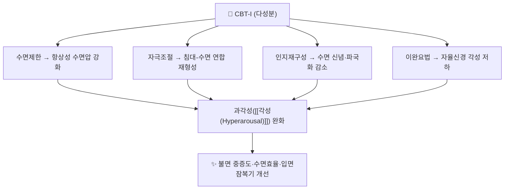

# 📍 인지행동치료(CBT-I) (Cognitive Behavioral Therapy for Insomnia)

> **핵심 요약 (Key Summary)**:
> **만성 불면증의 1차 표준 치료.** 수면제한(sleep restriction)·자극조절(stimulus control)·인지재구성·이완요법·수면교육을 묶은 다성분 프로그램이다. AASM 2021 진료지침은 다성분 CBT-I를 **강력 권고**하고 수면위생 단독 요법은 **권고 반대**로 분류한다 — [PMID 33164742](https://pubmed.ncbi.nlm.nih.gov/33164742/). 만성질환자를 대상으로 한 메타분석(RCT 67편·5,232명)에서 불면 중증도 **Hedges g=0.98**, 수면효율 g=0.77, 입면잠복기 g=0.64로 큰 효과를 보였고 중도탈락률은 13.3%로 낮았다 — JAMA Intern Med 2025;185(11):1350-1361, [PMID 40982264](https://pubmed.ncbi.nlm.nih.gov/40982264/).

---

## 📌 목차
1. [중재 기본 정보](#1-중재-기본-정보)
2. [적용 기전](#2-적용-기전)
3. [단계별 시행법 (환자 지도 가능 수준)](#3-단계별-시행법-환자-지도-가능-수준)
4. [효과 판정 및 용량 원칙](#4-효과-판정-및-용량-원칙)
5. [연관 중재 비교](#5-연관-중재-비교)
6. [한의 임상 연계](#6-한의-임상-연계)
7. [💡 진료실 핵심 필기 & 임상 노하우](#7--진료실-핵심-필기--임상-노하우)
8. [출처 및 학술 참고 문헌](#8-출처-및-학술-참고-문헌)

---

## 1. 중재 기본 정보

| 항목 | 내용 |
| :--- | :--- |
| **중재 분류** | 다성분 심리·행동 중재 (중재 로테이션 E. 기타) |
| **적응증** | 만성 불면장애, 만성질환(암·만성 통증·과민성 장 증후군·뇌졸중) 동반 불면 |
| **구성** | ① 수면제한 ② 자극조절 ③ 인지재구성 ④ 이완요법 ⑤ 수면교육 |
| **회기·기간** | 전문가 제공 표준형 **4~8회기**, 단축형(BTI) **1~4회기** |
| **전달 형태** | 대면·전화·그룹·웹/앱 기반(dCBT-I)·자가 시행 — 효과는 대체로 유사 |
| **금기·주의** | [[양극성 장애]]·경련성 질환(수면 부족이 증상 악화), 조절되지 않는 중증 내과질환, 직업상 각성 필수(운전·고소작업) |
| **환자 안내** | [AASM 환자용 안내문 (PDF)](https://aasm.org/wp-content/uploads/2021/08/Behavioral-and-Psychological-Treatments-for-Insomnia-Patient-Guide.pdf) |

---

## 2. 적용 기전

* **불면증의 핵심 병태생리는 각성 과활성(hyperarousal)** 이다. CBT-I는 각성을 네 방향에서 낮춘다 → [[각성(Hyperarousal)]]
* 만성질환자에서는 **통증-불면-피로의 악순환**을 끊어 질환 관리 자체를 돕는다 — 다만 이 메타분석은 기전을 직접 검증하지 않았다

---

## 3. 단계별 시행법 (환자 지도 가능 수준)

### ① 도입 (1회기)
- **2주 수면일지**: 취침·잠든 시각, 각성 횟수, 최종 기상, 총 수면시간, 낮잠을 기록한다
- 평균 총 수면시간을 구해 **초기 침대 체류 시간 = 평균 총 수면시간 + 30분**으로 설정한다(교과서적 접근)

### ② 수면제한 (핵심)
- 침대 체류 시간을 위에서 정한 값으로 줄이고, **수면효율 85% 이상이면 주 단위로 15~30분 연장**한다
- 주간 졸림이 심하면 강도를 낮춘다 — 노인·직업상 각성 필수 환자에서 특히 주의

### ③ 자극조절 (핵심)
- 10~20분 이상 깨어 있으면 **침대에서 나와** 다른 공간에서 이완하고, 졸릴 때만 다시 눕는다
- 침대는 수면(과 성생활)에만 사용, 기상 시간을 매일 고정, 낮잠 회피 → [[자극조절]]

### ④ 인지재구성·이완
- "잠을 못 자면 큰일 난다"는 파국화 신념을 다룬다. 복식호흡·점진적 근이완을 지도한다

### ⑤ 안전·중단 기준
- 수면제한은 주간 졸림을 일시적으로 악화시킨다. 중증 우울·자살사고 동반 시 정신건강의학과 협진이 우선이다
- 수면제·수면진정제 장기 복용자는 **갑자기 끊지 말고** 감량 계획을 세운다 → [[벤조디아제핀]]

---

## 4. 효과 판정 및 용량 원칙

| 지표 | 내용 |
| :--- | :--- |
| **1차 결과** | 불면 중증도(Hedges g=0.98, 95% CI 0.81~1.16) |
| **2차 결과** | [[수면효율]](g=0.77) · 입면잠복기(g=0.64) |
| **수용도** | 치료 만족도 높음, 평균 중도탈락률 13.3%, 치료 관련 이상반응 드묾 |
| **기간 효과** | 하위군 분석에서 **치료 기간이 길수록** 수면효율·입면잠복기 개선폭이 컸다 |
| **비교** | 효과 크기는 비만성질환군 보고값과 유사, 질환군별로도 비슷 |

---

## 5. 연관 중재 비교

| 중재 | 위치 | 특징 |
| :--- | :--- | :--- |
| **CBT-I (다성분)** | 1차 표준 | 강력 권고, 약물 없이 효과 |
| 수면위생 단독 | 권고 반대 | AASM이 단독 요법으로 권고하지 않음 |
| [[벤조디아제핀]]·Z-드러그 | 단기 대증 | 내성·의존·낙상 위험, 노인에서 특히 주의 |
| 한의 침·한약 | 보조 | 표준 교과서 범위 병행(아래 §6) |

---

## 6. 한의 임상 연계

* **병행 구조**: 자극조절·수면제한을 축으로 4~8회기 상담 구조를 만들고 침·한약을 병행한다
* **침구(표준 혈위, 순수 텍스트)**: 신문(HT7)·삼음교(SP6)·사신총(EX-HN1)·백회(GV20)·안면(EX-HN16)
* **한약**: 변증에 맞춰 심비양허 → [[귀비탕]], 음허내열 → [[산조인탕]]·[[천왕보심단]], 심담허겁 → 온담탕
* **노인 감량기**: 수면제 감량기에는 야간 낙상 위험이 커지므로 침실 조명·야간 조명·보행 보조기를 점검한다 → [[낙상 효능감]]

---

## 7. 💡 진료실 핵심 필기 & 임상 노하우

* **수면위생 조언만 반복하지 않는다**: 카페인·휴대폰·규칙적 기상을 반복하는 것은 AASM이 단독 요법으로 권고하지 않는 접근이다. **자극조절과 수면제한**을 축으로 삼는다
* **수면일지가 치료의 절반**: 첫 회기에 2주 수면일지를 받고, 평균 총 수면시간 + 30분을 초기 침대 체류 시간으로 설정한다
* **'누워 있는 시간'과 '잔 시간'을 분리한다**: 8시간 누웠는데 4시간 잔 환자는 '수면 부족'이 아니라 **[[수면효율]] 저하**다 — 이 구분이 치료의 출발점이다
* **양약 복용력 전수 조사**: 졸피뎀·[[벤조디아제핀]] 복용 기간을 확인하고, 4~8주에 걸쳐 감량 계획을 세운다
* **말 한마디**: "잠은 억지로 자는 게 아니라 조건을 만드는 것입니다. 침대에서 뒤척이면 일어나세요."

---

## 8. 출처 및 학술 참고 문헌

1. **JAMA Internal Medicine (2025)**. *Cognitive Behavioral Therapy for Insomnia in People With Chronic Disease: A Systematic Review and Meta-Analysis*. **JAMA Intern Med**, 185(11):1350-1361. [PMID 40982264](https://pubmed.ncbi.nlm.nih.gov/40982264/) · [doi:10.1001/jamainternmed.2025.4610](https://doi.org/10.1001/jamainternmed.2025.4610)
   - **[연구 요약]**: RCT 67편·5,232명 — 만성질환자 불면에서 CBT-I가 불면 중증도 g=0.98, 수면효율 g=0.77, 입면잠복기 g=0.64로 유의 개선, 중도탈락 13.3%.
2. **Edinger JD, et al. (2021)**. *Behavioral and psychological treatments for chronic insomnia disorder in adults: an American Academy of Sleep Medicine clinical practice guideline*. **J Clin Sleep Med**, 17(2):255-262. [PMID 33164742](https://pubmed.ncbi.nlm.nih.gov/33164742/)
   - **[연구 요약]**: 다성분 CBT-I '강력 권고', 수면위생 단독 요법 '권고 반대', 회기 수·전달 형태 권고 정리.
3. **Spielman AJ, Caruso LS, Glovinsky PB (1987)**. *A behavioral perspective on insomnia treatment*. **Psychiatr Clin North Am**, 10(4):541-553. [PMID 3332317](https://pubmed.ncbi.nlm.nih.gov/3332317/)
   - **[연구 요약]**: 불면의 3P 모델(소인·촉발·지속 요인)을 제시한 고전으로, CBT-I의 이론적 뼈대다.

---

## 함께 보기
- [[자극조절]] · [[수면효율]] · [[각성(Hyperarousal)]] · [[불면증]] · [[벤조디아제핀]] · [[산조인탕]] · [[귀비탕]] · [[우울증]] · [[양극성 장애]] · [[만성 통증]] · [[과민성 장 증후군]] · [[뇌졸중]] · [[낙상 효능감]] · [[2026-10-03_대사노인질환_심층리뷰]]
