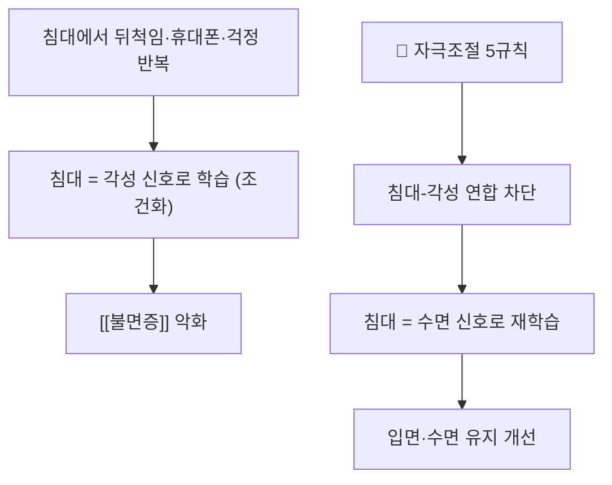

# 📍 자극조절 (Stimulus Control)

> **핵심 요약 (Key Summary)**:
> **'침대'라는 자극과 '잠'이라는 반응을 다시 짝지어 주는 행동요법.** 뒤척임·휴대폰·걱정이 반복되면 침대가 각성의 신호로 학습된다. 자극조절은 ① 침대는 수면(과 성생활)에만 ② 10~20분 이상 깨어 있으면 침대에서 나와 다른 공간에서 이완 ③ 졸릴 때만 다시 눕기 ④ 기상 시간 매일 고정 ⑤ 낮잠 회피 — 다섯 규칙으로 이 학습을 되돌린다. **다성분 [[인지행동치료(CBT-I)]]의 핵심 축**이며, AASM 2021 지침에서 다성분 CBT-I가 강력 권고되는 근거의 한 축이다 — [PMID 33164742](https://pubmed.ncbi.nlm.nih.gov/33164742/). 수면위생 단독 요법은 권고 반대이고, **자극조절은 그 상위 층위**다.

---

## 📌 목차
1. [중재 기본 정보](#1-중재-기본-정보)
2. [적용 기전](#2-적용-기전)
3. [단계별 시행법 (환자 지도 가능 수준)](#3-단계별-시행법-환자-지도-가능-수준)
4. [효과 판정 및 용량 원칙](#4-효과-판정-및-용량-원칙)
5. [연관 중재 비교](#5-연관-중재-비교)
6. [한의 임상 연계](#6-한의-임상-연계)
7. [💡 진료실 핵심 필기 & 임상 노하우](#7--진료실-핵심-필기--임상-노하우)
8. [출처 및 학술 참고 문헌](#8-출처-및-학술-참고-문헌)

---

## 1. 중재 기본 정보

| 항목 | 내용 |
| :--- | :--- |
| **중재 분류** | 행동요법 (중재 로테이션 E. 기타) |
| **적응증** | 입면 곤란·수면 유지 장애형 불면, 침대에서 뒤척이는 습관 |
| **핵심 5규칙** | ① 침대는 수면·성생활 전용 ② 10~20분 뒤척이면 침대 밖으로 ③ 졸릴 때만 복귀 ④ 기상 시간 고정 ⑤ 낮잠 회피 |
| **주의** | 야간 낙상 위험(노인), 보행 보조 필요, 인지 저하 환자는 조명·안전 확보 후 적용 |
| **병용** | 수면제한·인지재구성과 함께 다성분 CBT-I로 시행 |

---

## 2. 적용 기전

* **고전적 조건화 원리**: 수면과 무관한 활동이 침대에서 반복되면 침대 자체가 각성 조건자극이 된다. 반대로 졸릴 때만 침대에 들어가면 침대가 수면 신호로 재학습된다
* **[[각성(Hyperarousal)]] 조절**: 침대 밖 이완은 '잠들어야 한다'는 수행 압박을 낮춘다

---

## 3. 단계별 시행법 (환자 지도 가능 수준)

1. **침대 용도 제한**: 침대에서 책·휴대폰·TV·업무 금지. 수면(과 성생활)만
2. **20분 규칙**: 잠들기 어렵거나 10~20분 이상 깨어 있으면 침대에서 나온다
3. **다른 공간 이완**: 어둑한 조명에서 단순 활동(조용한 독서·복식호흡)을 하다가 **졸릴 때만** 침대로 돌아간다
4. **기상 시간 고정**: 주말에도 같은 시각에 일어난다(생체시계 안정)
5. **낮잠 회피**: 부득이하면 20분 이내, 오후 3시 이전
6. **2주 수면일지**로 뒤척인 시간·각성 횟수를 기록해 순응도를 점검 → [[수면효율]]

---

## 4. 효과 판정 및 용량 원칙

| 지표 | 내용 |
| :--- | :--- |
| **평가도구** | [[수면효율]] · 입면잠복기 · 야간 각성 횟수 (2주 수면일지) |
| **위치** | 다성분 CBT-I의 핵심 축 — 불면 중증도 g=0.98 개선의 구성요소 |
| **용량** | 회기 4~8회(표준형), 매 회기마다 5규칙 점검·재교육 |
| **금기** | 조절되지 않는 중증 내과질환, 직업상 각성 필수, 중증 우울·자살사고 |

---

## 5. 연관 중재 비교

| 중재 | 위치 | 특징 |
| :--- | :--- | :--- |
| **자극조절** | CBT-I 핵심 축 | 침대-수면 연합 재형성 |
| 수면제한 | CBT-I 핵심 축 | 항상성 수면압 강화, 주간 졸림 주의 |
| 수면위생 단독 | 권고 반대 | 카페인·조명·규칙성만으로는 부족 |
| [[벤조디아제핀]]·Z-드러그 | 단기 대증 | 각성은 낮추나 조건화는 고치지 못함 |

---

## 6. 한의 임상 연계

* **병행 구조**: 자극조절 상담 + 침·한약. 침은 각성 저하·이완 축을 담당한다(신문 HT7·삼음교 SP6·백회 GV20 등, 순수 텍스트)
* **변증**: 심비양허·음허내열·담열요심에 따라 처방을 달리한다 → [[산조인탕]] · [[귀비탕]]
* **주의**: 야간에 자주 깨는 노인은 화장실 동선 조명·미끄럼 방지를 함께 점검한다 → [[낙상 효능감]]

---

## 7. 💡 진료실 핵심 필기 & 임상 노하우

* **가장 어려운 지시는 '일어나기'다**: "침대에서 나오라"는 말에 환자가 거부감을 갖는다. *"눕는 것보다 일어나는 게 잠에는 낫습니다"* 라고 이유를 설명한다
* **환경을 먼저 만든다**: 침대 밖에서 지낼 공간의 조명·의자·담요를 미리 준비하게 한다(겨울철 추위 대비)
* **수면위생과 구분해 설명한다**: 규칙적 기상·카페인 회피는 기본이고, **자극조절은 그 위의 치료**임을 분명히 한다
* **말 한마디**: "잠이 안 오면 침대와 싸우지 말고 나오세요. 졸릴 때 다시 들어가면 됩니다."

---

## 8. 출처 및 학술 참고 문헌

1. **Edinger JD, et al. (2021)**. *Behavioral and psychological treatments for chronic insomnia disorder in adults: an American Academy of Sleep Medicine clinical practice guideline*. **J Clin Sleep Med**, 17(2):255-262. [PMID 33164742](https://pubmed.ncbi.nlm.nih.gov/33164742/)
   - **[연구 요약]**: 다성분 CBT-I(자극조절 포함) 강력 권고, 수면위생 단독 요법 권고 반대.
2. **JAMA Internal Medicine (2025)**. *Cognitive Behavioral Therapy for Insomnia in People With Chronic Disease: A Systematic Review and Meta-Analysis*. **JAMA Intern Med**, 185(11):1350-1361. [PMID 40982264](https://pubmed.ncbi.nlm.nih.gov/40982264/)
   - **[연구 요약]**: 자극조절을 포함한 다성분 CBT-I가 만성질환자 불면 중증도·수면효율을 크게 개선.

---

## 함께 보기
- [[인지행동치료(CBT-I)]] · [[수면효율]] · [[각성(Hyperarousal)]] · [[불면증]] · [[벤조디아제핀]] · [[산조인탕]] · [[귀비탕]] · [[낙상 효능감]] · [[2026-10-03_대사노인질환_심층리뷰]]
