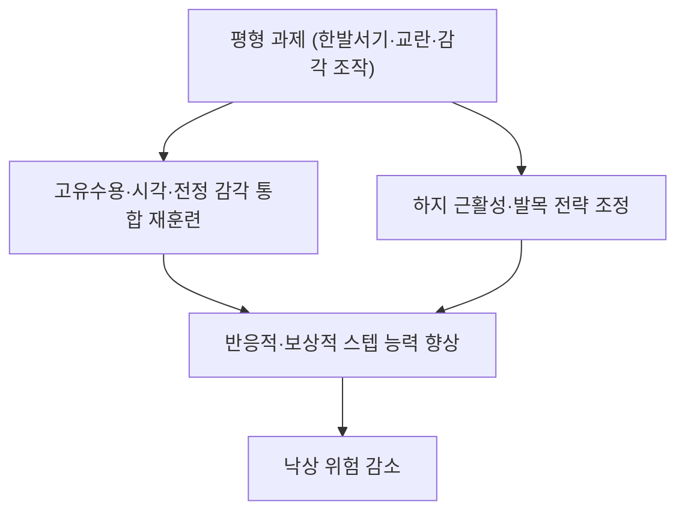

# 📍 평형훈련 (Balance Training, 균형훈련)

> **핵심 요약 (Key Summary)**:
> **자세 조절 능력을 직접 겨냥하는 운동.** 한발서기·탠덤·체중 이동·외부 교란·감각 과제·이중과제로 구성되며, 고유수용감각·시각·전정감각의 통합과 반응적 스텝을 훈련한다. 다만 **단독 평형훈련은 노인 낙상 예방에서 효과 순위가 최하위(SUCRA 0.58%)** 였고, 근력·평형을 함께 하는 **다성분 점진적 프로그램이 우월**했다 — Ageing Res Rev 2026;113:102924, [PMID 41110662](https://pubmed.ncbi.nlm.nih.gov/41110662/). 따라서 평형훈련은 낙상 예방의 **필수 구성요소이지만 단독 처방은 권하지 않는다**.

---

## 📌 목차
1. [중재 기본 정보](#1-중재-기본-정보)
2. [적용 기전](#2-적용-기전)
3. [단계별 시행법 (환자 지도 가능 수준)](#3-단계별-시행법-환자-지도-가능-수준)
4. [효과 판정 및 용량 원칙](#4-효과-판정-및-용량-원칙)
5. [연관 중재 비교](#5-연관-중재-비교)
6. [한의 임상 연계](#6-한의-임상-연계)
7. [💡 진료실 핵심 필기 & 임상 노하우](#7--진료실-핵심-필기--임상-노하우)
8. [출처 및 학술 참고 문헌](#8-출처-및-학술-참고-문헌)

---

## 1. 중재 기본 정보

| 항목 | 내용 |
| :--- | :--- |
| **중재 분류** | 자세조절·평형 운동 (중재 로테이션 A. 운동) |
| **적응증** | 낙상 위험·보행 불안정·어지럼·[[만성 발목 불안정증]]·노인 허약 |
| **금기·선행** | 급성 어지럼(중추성 감별 필요), 미치유 골절, 급성 관절염 |
| **핵심 과제** | 한발서기 · 탠덤 · 체중 이동 · 외부 교란 · 감각 조작(눈 감기·폼패드) · 이중과제 |
| **용량(일반)** | 주 3회 이상, 과제당 10~20초 또는 10회 반복, 점진적 난이도 상향 |
| **단독 vs 병용** | **단독 처방 금지** — 근력 운동과 반드시 병용(다성분 프로그램) |

---

## 2. 적용 기전

* **감각 통합 축**: [[고유수용감각]] 입력을 다시 가중해 자세 흔들림을 줄인다 → [[고유수용감각]] · [[근방추]]
* **운동 전략 축**: 발목 전략 → 고관절 전략 → 스텝 전략으로 난이도를 올려 반응 능력을 키운다
* **주의**: 평형 과제만 반복하면 근력·총량이 부족해 낙상 결과가 개선되지 않는다 — 이 회차 NMA가 이를 정량적으로 보여줬다

---

## 3. 단계별 시행법 (환자 지도 가능 수준)

### ① 난이도 사다리 (지지대를 잡고 시작 → 손을 떼며 상향)
1. **한발서기**: 지지대 잡고 10초 → 손 떼고 10~20초 → 눈 감고 5~10초
2. **탠덤(발뒤꿈치-발끝 붙이기)**: 양발 탠덤 → 탠덤으로 서서 걷기
3. **체중 이동**: 좌우·전후 체중 이동, 원 그리기
4. **외부 교란**: 검사자가 가볍게 밀거나 당겨 반응적 스텝 유도(안전 확보 필수)
5. **감각 조작**: 눈 감기, 폼패드 위 서기
6. **이중과제**: 걷거나 서면서 숫자 세기·말하기 → [[이중과제 훈련]]

### ② 진행 규칙
- 과제당 **10~20초 또는 10회**, 주 3회 이상, 매 2주 1단계씩 상향
- 각 과제는 **벽·의자 옆에서** 시행하고, 지지대를 확보한 상태에서만 난이도를 올린다

### ③ 중단·전환 기준
- 지속 어지럼증·실신 전구증상·급성 통증 → **즉시 중단하고 중추성 원인을 감별**한다(이학적 검사·필요시 의뢰)

---

## 4. 효과 판정 및 용량 원칙

| 지표 | 내용 |
| :--- | :--- |
| **평가도구** | [[TUG 검사]] · [[5회 의자 일어서기 검사]] · 한발서기 시간 · [[SEBT]] |
| **NMA 순위** | **단독 평형훈련 SUCRA 0.58%(최하위)** vs FaME 68.56%·OEP 57.58% |
| **해석** | 순위 자체가 기전의 우열은 아니다. 다만 **'평형만 하면 충분하다'는 통념을 반박**하는 근거로 쓴다 |
| **총량** | 총 운동량과 낙상 결과는 역U자(최적 약 420 MET·min/week) → [[대사당량(MET)]] |

---

## 5. 연관 중재 비교

| 중재 | 위치 | 특징 |
| :--- | :--- | :--- |
| [[FaME]] | 다성분 1위 | 평형 + 근력 + 기능 통합, 총 ≥50시간 |
| [[오타고 운동 프로그램]] | 다성분 2위 | 평형 + 근력 + 걷기, 가정 기반 |
| **평형 단독** | 최하위 | 낙상 예방 단독 처방에는 부적합 |
| [[수중운동]] | 3위 | 관절 부하 적음 |
| [[태극권]] | 4위 | 평형을 포함한 심신운동 |

---

## 6. 한의 임상 연계

* **한의 접점**: 어지럼·이명·요슬산연을 동반한 노인은 신허 변증으로 보고, 평형훈련과 보익 처방을 병행한다 → [[비신허증]]
* **경부 심부굴곡근 훈련·[[견갑 안정화 운동]]** 과 함께 시행하면 상부 체간 안정성까지 다룰 수 있다
* **주의**: 급성 회전성 어지럼은 [[이석증]] 등 중추·말초 감별이 우선이다 — 운동 처방보다 감별이 먼저다

---

## 7. 💡 진료실 핵심 필기 & 임상 노하우

* **환자 오해를 바로잡는다**: "균형 운동만 열심히 하면 넘어지지 않는다"는 통념은 근거가 약하다. **근력과 균형을 같이** 해야 한다고 설명한다
* **측정으로 보여준다**: 한발서기 시간·[[TUG 검사]]로 4~12주마다 수치를 기록해 개선을 확인시킨다
* **두려움 관리**: [[낙상 효능감]]이 낮으면 활동이 줄어 오히려 위험이 커진다 — 과제 난이도를 낮춰 성공 경험을 쌓게 한다
* **말 한마디**: "균형만 잡는 운동은 효과가 제일 약했습니다. 다리 힘 기르는 운동과 같이 하세요."

---

## 8. 출처 및 학술 참고 문헌

1. **Ageing Research Reviews (2026)**. *Optimal type and dose of exercise to improve fall behavior in older adults: A systematic evaluation and network meta-analysis*. **Ageing Res Rev**, 113:102924. [PMID 41110662](https://pubmed.ncbi.nlm.nih.gov/41110662/)
   - **[연구 요약]**: RCT 21편·3,387명 NMA — 평형훈련 단독 SUCRA 0.58%(최하위), 다성분 프로그램(FaME·OEP) 우월.
2. **Campbell AJ, et al. (1997)**. *Randomised controlled trial of a general practice programme of home based exercise to prevent falls in elderly women*. **BMJ**, 315(7115):1065-1069. [PMID 9366737](https://pubmed.ncbi.nlm.nih.gov/9366737/)
   - **[연구 요약]**: 평형을 포함한 다성분 가정 기반 프로그램이 1년 낙상 위험을 약 35% 낮춤.

---

## 함께 보기
- [[오타고 운동 프로그램]] · [[FaME]] · [[수중운동]] · [[태극권]] · [[대사당량(MET)]] · [[낙상 효능감]] · [[이중과제 훈련]] · [[고유수용감각]] · [[근방추]] · [[TUG 검사]] · [[SEBT]] · [[만성 발목 불안정증]] · [[비신허증]] · [[2026-10-03_대사노인질환_심층리뷰]]
