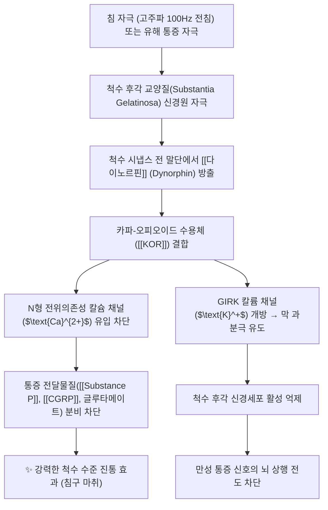

# 다이노르핀 (Dynorphin)

> **핵심 요약**: **프로다이노르핀(prodynorphin) 유래 내인성 오피오이드 펩타이드**로, **κ(kappa) 오피오이드 수용체**에 높은 친화력을 가진다. 척수후각·뇌간·시상하부에 분포하며, 척수 수준에서 통각 입력을 억제하는 한편 **과량·만성 상태에서는 통각과민·이질통을 유발하는 양면성**을 보인다. 저주파 전기자극·[[전침]]·[[TENS]]의 진통 기전에 **메트-엔케팔린과 함께** 관여하는 것으로 보고된다.

> ⚠️ 근거 수준: 다이노르핀은 본초 함유 성분이 아닌 내인성 펩타이드입니다. KOR 선택적 리간드라는 점(Chavkin 1982)과 침 자극 주파수별 신경펩타이드 유리(Han 2003)는 문헌으로 확인되나, 구체적 임상 적응증(IBS 복통 등)의 인체 근거는 이 노트에서 확인하지 못했습니다.

---

## 1. 합성과 분포
- **전구체**: 프로다이노르핀 → 다이노르핀 A(17 aa)·다이노르핀 B·α-네오엔도르핀 등
- **분포**: 척수후각 표재층, 뇌간(봉수주위회백질·솔기핵), 시상하부, 해마, 말초 염증 조직
- **수용체**: **κ 수용체** 선호(μ·δ에도 약한 작용) — κ 작용은 진통과 함께 **불쾌감·환각·이뇨 억제** 등 특유의 프로파일

## 2. 화학 정보 · 분자 구조

> [!abstract]+ 🧪 3D 약리 분자 구조 (Interactive 3D Viewer)
> <iframe src="https://molecule-viewer-rho.vercel.app/?cid=16133805" width="100%" height="450px" frameborder="0" allow="webgl" style="border-radius: 8px;"></iframe>
> *(Dynorphin A(1-17) 기준)*

| 항목 | 상세 내용 |
| :--- | :--- |
| **일반명 (Generic)** | [[다이노르핀]] (Dynorphin, Dyn) |
| **분자 구조군** | 내인성 신경펩타이드 (전구체: Pro-dynorphin / Prodynorphin) |
| **주요 활성 형태** | • **Dynorphin A (1-17)**: Tyr-Gly-Gly-Phe-Leu-Arg-Arg-Ile-Arg-Pro-Lys-Leu-Lys-Trp-Asp-Asn-Gln • **Dynorphin B (Rimorphin)**, Big Dynorphin, Dynorphin A (1-8) |
| **PubChem CID (Dynorphin A(1-17))** | [16133805](https://pubchem.ncbi.nlm.nih.gov/compound/16133805) — C₉₉H₁₅₅N₃₁O₂₃ / 약 2147.5 g/mol (PubChem 등록명: Dynorphin A (swine)) |
| **표적 수용체** | 카파-오피오이드 수용체 ([[KOR]], $\kappa$-opioid receptor)에 초고친화력 결합 |
| **신호전달계** | $\text{G}_{\text{i/o}}$ 단백질 결합 수용체 (GPCR) 경로 → 아데닐릴 시클라아제(AC) 억제, cAMP 감소, 칼슘 채널 억제, 칼륨 채널(GIRK) 개방 |

---

## 3. 작용 기전
- **척수 수준 진통**: 척수후각에서 1차 구심성 종말의 흥분성 신경전달물질 유리를 억제 → 통각 신호 감소
- **하행성 조절 참여**: 뇌간 [[하행성 통증억제계]] 회로에서 κ 수용체를 통해 통증 억제에 관여
- **양면성(중요)**: 만성 통증·신경 손상 상태에서는 **척수 다이노르핀 증가가 오히려 통각과민·이질통을 유지**시키는 요인으로 지목된다 — '내인성 진통 물질'이 항상 진통 방향은 아니라는 대표 사례
- **전기자극과의 관계**: 인체 뇌척수액 연구에서 **저주파 전기자극 후 메트-엔케팔린과 다이노르핀 A 면역반응이 증가** — 저주파 세팅 진통의 분자적 근거 → [[엔케팔린]]

### 분자약리 표적 & 신호전달 네트워크

* **척수 시냅스 전 억제를 통한 통증 전달 차단**:
  * 척수 후각(Dorsal horn)의 일차 구심성 C-섬유 말단에 위치한 [[KOR]]에 결합하여 칼슘 유입을 억제함으로써, 유해 자극 신호를 전달하는 [[Substance P]]와 [[CGRP]]의 분비를 물리적으로 차단.
* **시냅스 후 막 과분극(Hyperpolarization)**:
  * 칼륨 채널을 개방하여 세포 내 양이온을 유출시킴으로써 척수 신경세포의 흥분 역치를 높여 통증 감작(Central sensitization)을 방지.
* **보상 회로 및 정서 조절(스트레스 반응)**:
  * 중뇌 도파민성 신경원 말단의 도파민 분비를 억제하여, 뮤-오피오이드 수용체([[MOR]])와 달리 도취감(Euphoria) 대신 불쾌감(Dysphoria)을 매개하며 약물 중독 갈망을 억제하는 역작용 수행.

⚠️ 검증 메모: 다이노르핀이 카파 오피오이드 수용체의 특이적 내인성 리간드임은 1982년 Science 논문으로 확인됩니다(Chavkin 1982). 다이노르핀이 오피오이드 펩타이드 계열이며 KOR에 우선 결합하고, 간질·중독·우울증·조현병 등의 병태에 관여할 수 있다는 점은 종설에 정리되어 있습니다(Schwarzer 2009). N형 칼슘 채널 차단·GIRK 개방·Substance P/CGRP 유리 차단 등 세부 신호전달 서술은 이 노트에서 개별 논문으로 확인하지 못해 **내용 검토 필요**입니다.

---

## _의학/04_임상 의의 (치료 연계)
- **침·전침 진통 기전의 한 축**: 저주파 전침·저주파 TENS 진통에서 엔케팔린(δ)·다이노르핀(κ)·엔돌핀(μ) 계가 함께 동원된다 → [[오피오이드]]·[[전침]]·[[TENS]]
- **κ 작용제 약물의 한계**: κ 진통제 개발이 어려운 이유(불쾌감·환각·이뇨 억제)를 이해하는 배경
- **만성화 해석**: 신경병증성 통증에서 내인성 오피오이드 계의 기능 변화(억제계 저하 + 다이노르핀 증가)가 [[중추 감작]] 유지에 관여한다는 해석
- **한의 임상 포인트**: 저주파 전침(2~4 Hz) 세팅을 지속 진통 목적으로 선택할 때, 이 계(κ)의 양면성을 감안해 **치료 기간·강도를 무작정 늘리지 않는다**(임상적·이론적 균형)

### 전침 주파수별 신경펩타이드 (Han 2003)
| 자극 | 방출 신경펩타이드(원문) | 수용체 |
| :--- | :--- | :--- |
| 저주파 2Hz [[전침]] | 엔돌핀·엔케팔린 | [[MOR]], DOR |
| 고주파 100Hz [[전침]] | 다이노르핀 | [[KOR]] |
| 2Hz/100Hz 교번 | 엔돌핀 + 다이노르핀 | MOR + KOR |

⚠️ 검증 메모: 전침 자극 주파수에 따라 서로 다른 신경펩타이드가 유리된다는 개념은 Han(2003, *Trends Neurosci*)의 종설 제목("Acupuncture: neuropeptide release produced by electrical stimulation of different frequencies")으로 확인되며, 이 노트에서는 초록 본문을 확인하지 못해 주파수별 구체 서술은 원문 그대로 보존합니다. 난치성 신경병증성 통증(CRPS 등)에 대한 임상 적용 서술도 문헌으로 확인하지 못했습니다(**내용 검토 필요**).

## 5. 논문 연결
- 2026-09-18 심층리뷰 3번(J NeuroEngineering Rehabil 2025;22:88, PMID 40253366, 당뇨병성 신경병증 NMA): TENS 진통 기전으로 **저주파 자극 시 척수 내 메트-엔케팔린과 다이노르핀 A 면역반응 증가**(인체 뇌척수액 연구) 및 척수후각 세포 활성 억제가 제시됨 — TENS가 10개 중재 중 유일하게 통증·수면 모두 유의했던 결과의 기전적 배경
- 2026-09-04 심층리뷰 1번(PHN 전침 RCT, PMID 42189557)의 분절성 진통 기전과 연결 → [[대상포진후신경통]]
- 관련: [[2026-09-18_신경계통증의학_심층리뷰]] 3번

## 6. 참고 문헌
1. **Han JS (2003)**. *Acupuncture: neuropeptide release produced by electrical stimulation of different frequencies*. **Trends Neurosci**, 26(1):17-22. PMID: [12495858](https://pubmed.ncbi.nlm.nih.gov/12495858/)
   - **[연구 요약]**: 서로 다른 주파수의 전기자극이 서로 다른 신경펩타이드 유리를 일으켜 침 진통에 관여함을 정리한 종설.
2. **Chavkin C, James IF, Goldstein A (1982)**. *Dynorphin is a specific endogenous ligand of the kappa opioid receptor*. **Science**, 215(4531):413-415. PMID: [6120570](https://pubmed.ncbi.nlm.nih.gov/6120570/)
   - **[연구 요약]**: 다이노르핀이 카파-오피오이드 수용체의 특이적 내인성 리간드임을 보인 고전적 연구.
3. **Schwarzer C (2009)**. *30 years of dynorphins—new insights on their functions in neuropsychiatric diseases*. **Pharmacol Ther**, 123(3):353-370. PMID: [19481570](https://pubmed.ncbi.nlm.nih.gov/19481570/) · DOI: [10.1016/j.pharmthera.2009.05.006](https://doi.org/10.1016/j.pharmthera.2009.05.006)
   - **[연구 요약]**: 다이노르핀이 KOR에 우선 결합하며 해마·편도체·시상하부·선조체·척수에 분포해 학습·기억, 정서 조절, 스트레스 반응, 통증과 관련되고 간질·중독·우울증·조현병 등에 관여할 수 있음을 정리한 종설.

## 함께 보기
- [[엔케팔린]] · [[엔돌핀]] · [[오피오이드]] · [[전침]] · [[TENS]] · [[하행성 통증억제계]] · [[중추 감작]] · [[당뇨병성 말초신경병증]]

> 통합 메모: 2026-09-22 `_의학/02_약리/약리성분/다이노르핀.md`(약리성분 템플릿)와 중복이어서 **호르몬·신호전달물질 폴더로 병합**했습니다. 본초 기원·ADME·양약 상호작용 섹션은 내인성 펩타이드라 해당 없음으로 판단해 제외했습니다.

<!-- 보관 태그(1회용·링크오류, 필요시 복원): 다이노르핀, 카파수용체, 내인성진통물질, KOR -->
