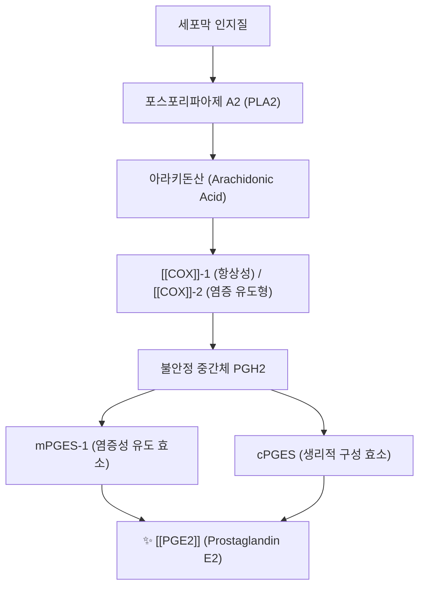
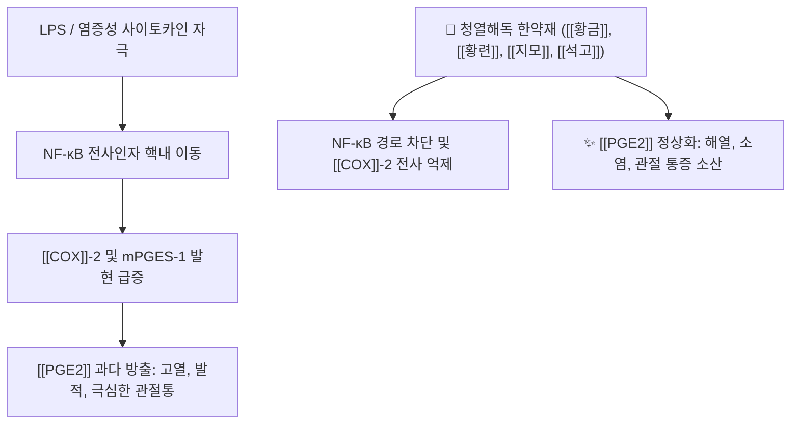

---
aliases:
  - Prostaglandin E2
  - 프로스타글란딘 E2
  - Dinoprostone
  - 디노프로스톤
tags:
  - 의학개념
  - 호르몬
  - 신호전달물질
  - 프로스타글란딘
  - PGE2
  - 염증
  - 월경통
---

# 🧬 [[PGE2]] (Prostaglandin E2, 프로스타글란딘 E2)

> **핵심 3줄 요약 (Key Summary)**:
> 🧪 생합성: 세포막 인지질 유래 아라키돈산에서 [[COX]]-1, [[COX]]-2 및 PGE 합성효소(mPGES-1)에 의해 생성되는 대표적인 에이코사노이드 지질 매개체.
> 📍 수용체 작용: EP1~EP4 수용체를 통해 시상하부 발열 유도(EP3), 말초 통각신경 감작(EP1/EP4), 위점막 세포 보호(EP2/EP4), 자궁근 이완·진통(PGF2α 길항) 조절.
> 🎯 임상·한의 연계: [[NSAIDs]]의 주 억제 표적이며, 청열해독 한약재([[황금]], [[황련]])의 핵심 약리 타깃이자 월경통 한의 중재([[통경첩]], 침치료)의 객관적 바이오마커.
> ⚠️ 주의사항: COX-1 억제 시 위점막 보호 PGE2 고갈로 소화성 궤양·출혈 위험 급증.

---

## 1. 분자 구조 및 생합성 경로 (Arachidonic Acid Cascade)

| 항목 | 상세 정보 |
| :--- | :--- |
| **성분명** | Prostaglandin E2 (PGE2, Dinoprostone) |
| **화학식 / 분자량** | $C_{20}H_{32}O_5$ / 352.47 g/mol |
| **합성 전구체** | 아라키돈산 (Arachidonic Acid, AA) |
| **합성 관여 효소** | 사이클로옥시게나아제([[COX]]-1, [[COX]]-2) $\rightarrow$ PGH2 $\rightarrow$ 미세소체 PGE 합성효소(mPGES-1) |

---

## 2. 4대 EP 수용체(EP1~EP4) 신호전달 네트워크

[[PGE2]]는 7회 막관통 G단백질 결합 수용체(GPCR)인 EP1, EP2, EP3, EP4를 통해 표적 조직마다 상이한 생리·병리 반응을 매개합니다.

| 수용체 | 결합 G단백질 | 2차 전달자 | 주된 조직 분포 및 생리 작용 |
| :--- | :--- | :--- | :--- |
| **EP1** | Gq/11 | IP3 / DAG $\uparrow$, 세포내 Ca2+ $\uparrow$ | 기관지 및 위장관 평활근 수축, 말초 통각신경 흥분성 증대 |
| **EP2** | Gs | cAMP $\uparrow$, PKA 활성화 | 혈관 및 기관지 확장, 자궁경부 숙개(소실), 면역세포 억제 |
| **EP3** | Gi (일부 G12/13) | cAMP $\downarrow$, Rho 활성화 | 시상하부 발열 유도(체온 설정점 상승), 위산 분비 억제, 자궁근 수축 |
| **EP4** | Gs / PI3K | cAMP $\uparrow$, Akt 신호 활성화 | 신장 혈관 확장, 관절 골 흡수 촉진, 대장 점막 상피 재생 |

---

## 3. 주요 생리활성 및 병태생리

* **시상하부 발열 반응 (Pyrogenesis)**:
  * 세균 내독소(LPS)나 염증성 사이토카인([[IL-1]], [[TNF-B]])이 뇌 미세혈관 내피세포의 [[COX]]-2/mPGES-1을 자극하여 [[PGE2]] 방출.
  * [[PGE2]]가 시상하부 시신경전구역(Preoptic area)의 EP3 수용체에 작용하여 체온 설정점을 상승시켜 오한 및 발열을 촉발.
* **말초 통각수용기 감작 (Hyperalgesia)**:
  * 손상 부위 감각 신경 말단의 EP 수용체에 결합하여 나트륨 및 TRPV1 통로의 역치를 낮춤으로써 [[히스타민]], 브라디키닌에 대한 통증 민감도를 극대화.
* **위점막 세포 보호 (Cytoprotection)**:
  * 위점막 상피의 EP2/EP4 수용체를 통해 점액(Mucin) 및 중탄산염($HCO_3^-$) 분비를 촉진하고, EP3 수용체로 위산 분비를 억제하여 궤양 형성을 방어.
* **자궁 평활근 및 월경통 병태생리**:
  * 자궁내막에서는 배란 후 프로게스테론 하강기에 PG 합성이 급증.
  * 극심한 혈관수축 및 자궁 허혈성 경련통을 유발하는 [[PGF2a]]와 달리, [[PGE2]]는 자궁근 이완 및 진통 방향으로 작용하여 길항적 균형을 이룸.
  * 따라서 원발성 월경통 환자에서는 **[[PGF2a]] / [[PGE2]] 비율의 상승**이 핵심 병태역학 지표가 됨.

---

## 4. 양방 약리학적 조절 (NSAIDs / Coxibs / Dinoprostone)

* **비선택적 [[NSAIDs]]**:
  * [[이부프로펜]], [[나프록센]], [[아스피린]] 등은 [[COX]]-1/[[COX]]-2를 차단하여 [[PGE2]] 합성을 억제함으로써 강력한 해열·진통·항염 효과를 나타냄.
  * 그러나 COX-1 억제로 인한 위점막 [[PGE2]] 고갈 시 위염, 소화성 궤양, 위장관 출혈이 동반됨.
* **선택적 COX-2 억제제 (Celecoxib)**:
  * 위점막 보호 기능(COX-1)은 보존하면서 염증 국소의 [[PGE2]]만 차단하나, 혈관 내피의 [[PGI2]] 억제에 따른 혈전 위험 모니터링 필요.
* **외인성 제제 (Dinoprostone)**:
  * 합성 [[PGE2]] 제제로 산부인과에서 만삭 임산부의 유도분만(자궁경부 연화 및 질식 분만 유도)에 사용.

---

## 5. 한의학적 청열해독 및 활혈조경 처방 연계

* **청열사화·해독제의 PGE2 차단 메커니즘**:
  * [[황금]](Baicalin) 및 [[황련]](Berberine): 대식세포와 활액막세포에서 NF-κB 활성화를 억제하여 [[COX]]-2 및 mPGES-1 단백질 발현을 전사 수준에서 강력히 차단.
  * [[석고]]·[[지모]] ([[백호탕]]): 시상하부 [[PGE2]] 생산을 급격히 억제하여 고열(壯熱)과 번갈(煩渴)을 신속히 해소.
* **부인과 월경통 활혈화어 처방 연계**:
  * [[포황]], [[유향]], [[몰약]] ([[통경첩]], [[현부이경탕]]): 원발성 월경통 환자에서 자궁 미세순환을 개선하고 말초 [[PGF2a]] / [[PGE2]] 균형을 정상화하여 자궁 평활근의 과도한 연축을 완화.

---

## 6. 출처 및 학술 참고 문헌 (References)

* Ricciotti E, FitzGerald GA. Prostaglandins and inflammation. *Arterioscler Thromb Vasc Biol*. 2011;31(5):986-1000.
  * `[연구 요약]` PGE2의 생합성 경로, 4가지 EP 수용체 하류 신호 전달 및 심혈관·염증성 질환에서의 복합 병태생리 총람.
* Legler DF, et al. Prostaglandin E2 at new glance: Novel insights in functional diversity offer therapeutic chances. *Int J Biochem Cell Biol*. 2010;42(2):198-201.
  * `[연구 요약]` 면역 조절, 발열, 통각 신경계 감작에서 PGE2-EP 수용체 축의 기능적 다형성 분석.
* PMID 41821745 (2026-09-06 심층리뷰): 원발성 월경통 환자에서 한약 경혈 부착 요법([[통경첩]])의 혈청 PGE2 조절 및 PGF2α/PGE2 비 개선 효과.
