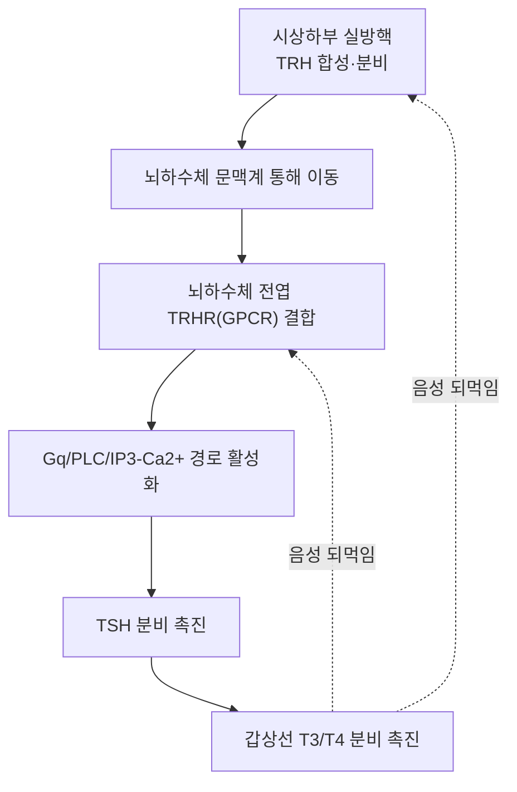

---
aliases:
  - Thyrotropin-Releasing Hormone
  - 갑상선자극호르몬방출호르몬
  - Protirelin
  - Thyroliberin
tags:
  - 약리성분
  - 호르몬
  - 시상하부
  - 갑상선축
---

# 🧠 TRH (Thyrotropin-Releasing Hormone, 갑상선자극호르몬방출호르몬)

> **핵심 3줄 요약 (Key Summary)**:
> 🩸 분비 기원 & 화학 계열: 시상하부 실방핵(paraventricular nucleus)의 신경분비세포에서 합성·분비되는 트리펩타이드(pyroGlu-His-Pro-NH₂) 호르몬.
> 🎯 표적 수용체 & 신호전달: 뇌하수체 전엽의 TRH 수용체(TRHR, GPCR)에 결합해 Gq/PLC/IP3 경로를 통해 갑상선자극호르몬(TSH)과 프로락틴 분비를 촉진.
> 🩺 주요 생리 활성 & 관련 질환: 시상하부-뇌하수체-갑상선(HPT) 축의 최상위 조절 인자로, 갑상선호르몬(T3/T4)의 음성 되먹임을 받아 TSH 분비를 정밀 조절. TRH 자극검사는 뇌하수체·시상하부성 갑상선기능 이상 감별에 활용됨.
> ⚠️ 임상 연계 & 약물 표적: 합성 TRH 제제(protirelin)가 진단용 자극검사에 사용되며, 항경련·신경보호 효과에 대한 연구도 진행 중이나 일반 치료제로서의 임상 활용은 제한적.

---

## 📌 목차
1. [기본 생화학 정보](#1-기본-생화학-정보-biochemical-identity)
2. [분비 기관 & 생합성 경로](#2-분비-기관--생합성-경로)
3. [수용체 & 세포 내 신호전달 경로](#3-수용체--세포-내-신호전달-경로)
4. [주요 생리 활성: 시상하부-뇌하수체-갑상선(HPT) 축](#4-주요-생리-활성-시상하부-뇌하수체-갑상선hpt-축)
5. [관련 질환 & 임상 활용](#5-관련-질환--임상-활용)
6. [한의학적 연계](#6-한의학적-연계)
7. [출처 및 학술 참고 문헌 (References)](#7-출처-및-학술-참고-문헌-references)

---

## 1. 기본 생화학 정보 (Biochemical Identity)

| 항목 | 상세 정보 |
| :--- | :--- |
| **분자명** | TRH (Thyrotropin-Releasing Hormone) / Protirelin(합성 의약품명) |
| **화학 분류** | 시상하부 방출호르몬, 트리펩타이드 아미드 |
| **구조** | L-피로글루타밀-L-히스티딜-L-프롤린아미드 (pGlu-His-Pro-NH₂) |
| **분자식 / 분자량** | C₁₆H₂₂N₆O₄ / 약 362.4 g/mol (Protirelin 기준) |
| **PubChem CID** | [638678](https://pubchem.ncbi.nlm.nih.gov/compound/638678) (Protirelin) |
| **주요 분비 기관** | 시상하부 실방핵(PVN) 신경분비세포 |

---

## 2. 분비 기관 & 생합성 경로

- **전구체**: 프리프로TRH(prepro-TRH) 유전자가 코딩하는 큰 전구단백질에서 여러 개의 TRH 분자가 효소적 절단을 거쳐 생성됩니다.
- **분비 부위**: 시상하부 실방핵의 신경분비세포에서 합성되어 정중융기(median eminence)로 축삭 수송된 뒤, 뇌하수체 문맥계(hypophyseal portal system)를 통해 뇌하수체 전엽으로 분비됩니다.
- **분비 조절**: 저온 노출, 스트레스, 갑상선호르몬(T3) 농도 등에 의해 분비량이 조절됩니다.

---

## 3. 수용체 & 세포 내 신호전달 경로

- **표적 수용체**: 뇌하수체 전엽 갑상선자극세포(thyrotrope)의 TRH 수용체(TRHR)는 G단백질 연결 수용체(Gq/11)입니다.
- **세포 내 신호전달**: TRH-TRHR 결합 → 포스포리파아제 C(PLC) 활성화 → IP3/DAG 생성 → 세포 내 Ca²⁺ 증가 및 PKC 활성화 → TSH(및 프로락틴) 분비 소포의 세포외 유출(exocytosis) 촉진.

---

## 4. 주요 생리 활성: 시상하부-뇌하수체-갑상선(HPT) 축

2006년 *Journal of Biological Chemistry*에 발표된 Nikrodhanond 등의 연구는 TRH가 갑상선호르몬 항상성 유지에서 지배적(dominant) 조절 인자임을 마우스 모델로 입증했습니다. TRH는 TSH 분비뿐 아니라 갑상선호르몬 농도에 대한 음성 되먹임 감수성을 뇌하수체에 부여하는 핵심 축으로 기능하며, 갑상선호르몬(T3)은 시상하부와 뇌하수체 양쪽에서 TRH 및 TRHR 발현을 억제해 HPT 축의 항상성을 유지합니다.

TRH는 TSH 외에도 뇌하수체 프로락틴 분비세포(lactotrope)를 자극해 프로락틴 분비를 촉진하는 작용도 가지고 있습니다.

---

## 5. 관련 질환 & 임상 활용

* **원발성 갑상선기능저하증**: 갑상선 자체 기능 저하로 T3/T4가 낮아지면 음성 되먹임 감소로 TRH·TSH가 대상성으로 상승합니다.
* **중추성(시상하부/뇌하수체성) 갑상선기능저하증**: TRH 또는 TSH 분비 결함으로 인한 갑상선기능저하증으로, TRH 자극검사가 병소가 시상하부인지 뇌하수체인지 감별하는 데 활용될 수 있습니다.
* **TRH 자극검사**: 합성 TRH(protirelin)를 정맥 주사한 뒤 TSH 반응을 관찰하는 진단검사로, 과거 갑상선기능 평가에 사용되었으나 현재는 초민감 TSH 측정법의 발전으로 임상 사용 빈도가 줄었습니다.

---

## 6. 한의학적 연계

TRH-TSH-갑상선호르몬 축은 현대 내분비학의 개념으로, 한의학의 신정(腎精)·명문화(命門火) 등 개념과 직접적인 대응 관계가 학술적으로 확립되어 있지는 않습니다. 갑상선기능 이상 환자를 한의학적으로 변증할 때 TRH/TSH 등 혈액검사 수치를 참고 정보로 활용할 수 있으나, 특정 본초·처방이 TRH 분비를 직접 조절한다는 개별 주장은 ⚠️ 내용 검토 필요로 표기하며 근거 확인이 필요합니다.

---

## 7. 출처 및 학술 참고 문헌 (References)

1. **Nikrodhanond AA, Ortiga-Carvalho TM, Shibusawa N, Hashimoto K, Liao XH, Refetoff S, Yamada M, Mori M, Wondisford FE. (2006)**. Dominant role of thyrotropin-releasing hormone in the hypothalamic-pituitary-thyroid axis. *Journal of Biological Chemistry*, 281(9), 5000–5007. PMID: [16339138](https://pubmed.ncbi.nlm.nih.gov/16339138/)
   - **[연구 요약]**: TRH 결핍 마우스 모델을 통해 TRH가 HPT 축에서 갑상선호르몬 항상성을 유지하는 지배적 조절 인자임을 입증한 연구.
2. PubChem Compound Summary — Protirelin (CID 638678): [https://pubchem.ncbi.nlm.nih.gov/compound/638678](https://pubchem.ncbi.nlm.nih.gov/compound/638678)
