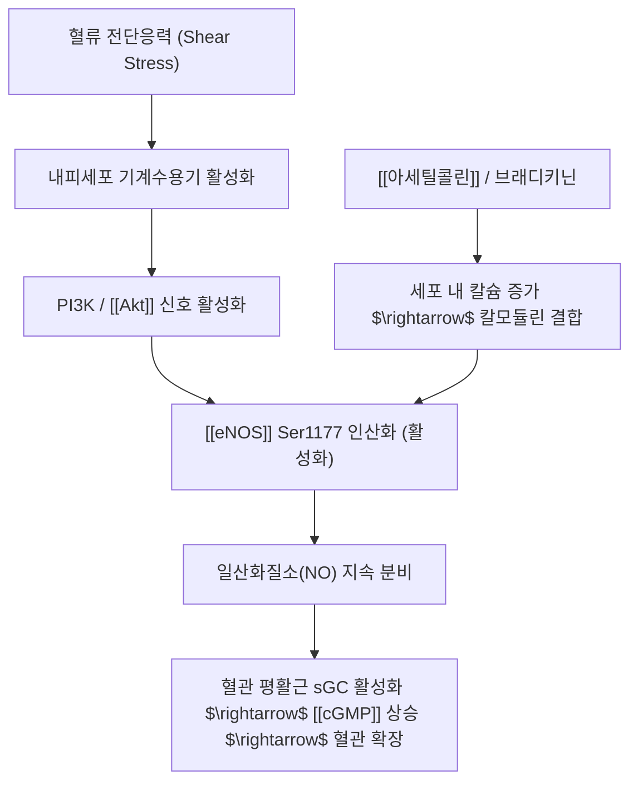
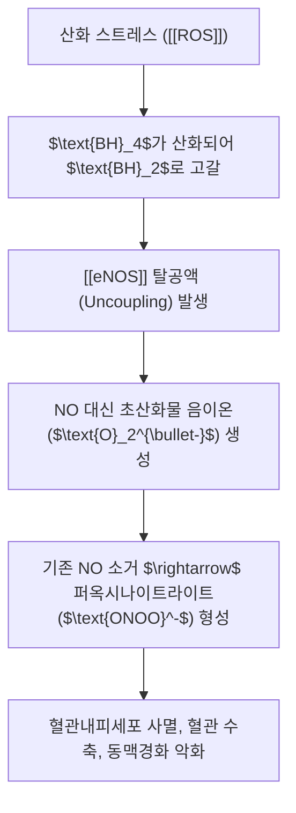

# 🔬 [[eNOS]] (Endothelial Nitric Oxide Synthase, NOS3)

> **핵심 요약 (Key Summary)**:
> 혈관내피세포의 소와(Caveolae)에 주로 발현되어 L-아르기닌으로부터 혈관 확장 신경전달물질인 일산화질소(NO)를 생성하는 핵심 효소입니다.
> 혈류 전단응력(Shear stress)과 [[Akt]] 인산화(Ser1177) 및 칼슘-칼모듈린 결합에 의해 활성화되어 혈관 평활근의 [[cGMP]] 경로를 자극해 혈관을 확장합니다.
> BH4 고갈 시 탈공액(Uncoupling)되어 활성산소를 뿜어내며 한의학적 단삼·천궁 등 활혈거어약의 미세순환 개선 핵심 분자 표적입니다.

---

## 📌 목차
1. [기본 효소 정보 & 생화학적 반응 (Biochemistry)](#1-기본-효소-정보--생화학적-반응-biochemistry)
2. [활성화 및 인산화 조절 네트워크 (Regulation)](#2-활성화-및-인산화-조절-네트워크-regulation)
3. [eNOS 탈공액(Uncoupling)과 내피기능부전](#3-enos-탈공액uncoupling과-내피기능부전)
4. [생리적 작용 및 혈관 보호 기능 (Functions)](#4-생리적-작용-및-혈관-보호-기능-functions)
5. [관련 심혈관 질환 병태생리](#5-관련-심혈관-질환-병태생리)
6. [활혈거어(活血祛瘀) 한약 및 침치료 연계](#6-활혈거어活血祛瘀-한약-및-침치료-연계)
7. [출처 및 학술 참고 문헌 (References)](#7-출처-및-학술-참고-문헌-references)

---

## 1. 기본 효소 정보 & 생화학적 반응 (Biochemistry)

* **효소 분류**: 산화질소 합성효소(Nitric Oxide Synthase, NOS) 계열 중 제3형 (NOS3).
* **촉매 반응**:
  $$\text{L-Arginine} + 2\text{O}_2 + 1.5\text{NADPH} + 1.5\text{H}^+ \xrightarrow{\text{eNOS}} \text{L-Citrulline} + \text{NO} + 1.5\text{NADP}^+$$
* **필수 조효소 및 보조인자**:
  * 헴(Heme), FAD, FMN, **테트라하이드로비옵테린(Tetrahydrobiopterin, $\text{BH}_4$)**, 칼모듈린(Calmodulin).

---

## 2. 활성화 및 인산화 조절 네트워크 (Regulation)

* **인산화 스위치**:
  * **Ser1177 인산화 (활성화)**: [[Akt]], PKA, AMPK 등에 의해 인산화되면 칼슘 농도가 높지 않아도 eNOS의 전자 이동 속도가 가속되어 NO 생성 급증.
  * **Thr495 인산화 (억제)**: PKC(단백질 키나아제 C) 등에 의해 인산화되면 칼모듈린 결합이 차단되어 효소 불활성화.

---

## 3. eNOS 탈공액(Uncoupling)과 내피기능부전

* **기전**:
  * 정상 상태에서 $\text{BH}_4$는 eNOS의 이량체(Dimer) 구조를 지지하고 산소 환원을 L-아르기닌 산화와 결합(Coupling)시킵니다.
  * 고혈당, 이상지질혈증, 만성 염증 등으로 산화 스트레스가 증가하면 $\text{BH}_4$가 산화되어 떨어져 나가며, 이때 eNOS는 NO 대신 합니다.

---

## 4. 생리적 작용 및 혈관 보호 기능 (Functions)

* **혈관 확장 및 혈압 조절**:
  * 기저 혈관 긴장도를 낮추고 전신 말초 저항을 감소시켜 정상 혈압 유지.
* **항혈전 및 혈소판 응집 억제**:
  * 혈소판 표면의 cGMP를 상승시켜 혈소판 활성화 및 혈관벽 부착 차단.
* **항염증 및 백혈구 유착 억제**:
  * 혈관내피세포의 접착 분자(VCAM-1, ICAM-1) 발현을 억제하여 단핵구의 혈관벽 침투 방지.
* **혈관 평활근 증식 억제**:
  * 동맥경화 플라크 형성 및 혈관 재협착 억제.

---

## 5. 관련 심혈관 질환 병태생리

* **고혈압 (Hypertension)**: eNOS 유래 NO 생체이용률 저하로 인한 전신 혈관 저항 증가.
* **죽상동맥경화증 (Atherosclerosis)**: 내피세포 기능부전으로 인한 LDL 침착 및 염증 반응 심화.
* **발기부전 (Erectile Dysfunction)**: 음경해면체 내피세포 eNOS 기능 장애로 인한 혈류 충만 불능.
* **당뇨병성 혈관합병증**: 고혈당 매개 eNOS 탈공액으로 인한 미세혈관병증.

---

## 6. 활혈거어(活血祛瘀) 한약 및 침치료 연계

* **단삼(丹參)의 eNOS 활성화**:
  * 단삼의 탄시논 IIA(Tanshinone IIA) 및 살비아놀산 B(Salvianolic acid B)는 PI3K/Akt 경로를 자극하여 eNOS Ser1177 인산화를 강력히 촉진하고 eNOS 발현을 상향 조절.
* **천궁(川芎) 및 은행엽**:
  * 천궁의 페룰산 및 테트라메틸피라진, 은행엽 플라보노이드가 혈류 전단응력을 모방하여 eNOS 매개 NO 분비를 증대.
* **대표 처방**:
  * [[혈부축어탕]], [[당귀수산]], [[관심2호방]] 등이 협심증 및 말초혈관 순환장애를 개선하는 핵심 분자 기전.
* **침 치료**:
  * [[족삼리]](ST36), 곡지(LI11) 전침 자극이 혈관내피 eNOS 발현을 증가시켜 국소 미세순환을 개선함이 학술적으로 확인됨.

---

## 7. 출처 및 학술 참고 문헌 (References)
* Förstermann U, Sessa WC. Nitric oxide synthases: regulation and function. *Eur Heart J*. 2012;33(7):829-837.
  * `[연구 요약]`: eNOS의 번역 후 조절(인산화, 세포 내 위치), eNOS 탈공액 기전 및 심혈관계 기능 총괄 리뷰.
* Palmer RM, Ashton DS, Moncada S. Vascular endothelial cells synthesize nitric oxide from L-arginine. *Nature*. 1988;333(6174):664-666.
  * `[연구 요약]`: 혈관내피유래 이완인자(EDRF)가 L-아르기닌 유래 일산화질소(NO)임을 최초 증명한 기념비적 논문.
