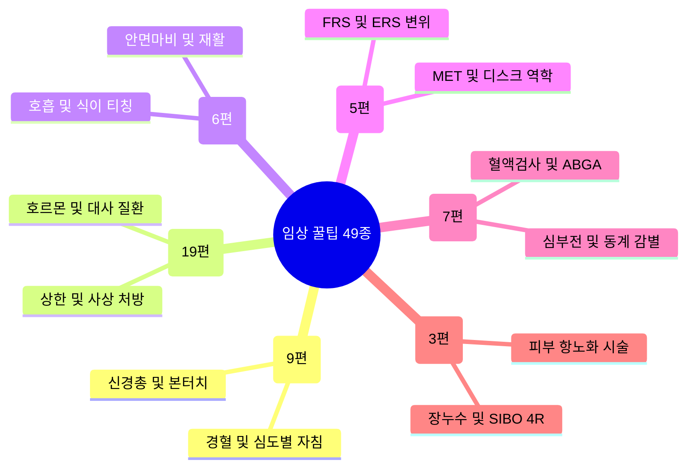

# 💡 Simbio 임상 꿀팁 & 실전 노하우 MOC (총 49종)

> 개요: 정윤봉 원장님 임상 강의록 및 최신 임상 지식에서 추출된 핵심 진료 비기, 즉효 침구·도침술, 한약 가감 비법, 환자 티칭, 추나·진단 및 기능의학 노하우를 6대 영역으로 집대성한 마스터 인덱스 허브입니다.

---

## 🧭 6대 임상 꿀팁 분류 체계

---

## 1. 💉 질환별 즉효 침구 & 도침 팁 (9편)
* [[4. 임상/임상 꿀팁 & 실전 노하우/1. 질환별 즉효 침구 & 도침 팁/4대 신경총(경·상완·요·천골) 포착점 & 장요근·TLJ 증후군과 횡격막신경(C3~C5) 소화불량 감별| 4대 신경총(경·상완·요·천골) 포착점 & 장요근·TLJ 증후군과 횡격막신경(C3~C5) 소화불량 감별]]
* [[4. 임상/임상 꿀팁 & 실전 노하우/1. 질환별 즉효 침구 & 도침 팁/구조·신경학으로 접근하는 내과 질환(연하장애·역류·딸꾹질·체기) 침구 치료점| 구조·신경학으로 접근하는 내과 질환(연하장애·역류·딸꾹질·체기) 침구 치료점]]
* [[4. 임상/임상 꿀팁 & 실전 노하우/1. 질환별 즉효 침구 & 도침 팁/실전 무통 자침의 생체역학(키네틱 체인) & 압수(押手)·침관 타격 및 체중 진침 테크닉| 실전 무통 자침의 생체역학(키네틱 체인) & 압수(押手)·침관 타격 및 체중 진침 테크닉]]
* [[4. 임상/임상 꿀팁 & 실전 노하우/1. 질환별 즉효 침구 & 도침 팁/위장관 평활근 5대 조절계 & 카할간질세포(ICC·위기)와 배수혈 자침 메커니즘| 위장관 평활근 5대 조절계 & 카할간질세포(ICC·위기)와 배수혈 자침 메커니즘]]
* [[4. 임상/임상 꿀팁 & 실전 노하우/1. 질환별 즉효 침구 & 도침 팁/척수원추(L1 레벨) 신경세포체와 척수경막(Dura) 견인성 통증 기전 & 대뇌-기저핵-소뇌 운동 제어망| 척수원추(L1 레벨) 신경세포체와 척수경막(Dura) 견인성 통증 기전 & 대뇌-기저핵-소뇌 운동 제어망]]
* [[4. 임상/임상 꿀팁 & 실전 노하우/1. 질환별 즉효 침구 & 도침 팁/협척혈(華佗夾脊) 심도별 4단계 층위 자침술 & 다열근·후관절 본터치(Bone-Touch) 관절 감압 테크닉| 협척혈(華佗夾脊) 심도별 4단계 층위 자침술 & 다열근·후관절 본터치(Bone-Touch) 관절 감압 테크닉]]
* [[4. 임상/임상 꿀팁 & 실전 노하우/1. 질환별 즉효 침구 & 도침 팁/환자의 중증 진단명(디스크·협착증) 호소 심리 분석 & 영상 소견 불일치와 기능적 연부조직 치료 프레이밍| 환자의 중증 진단명(디스크·협착증) 호소 심리 분석 & 영상 소견 불일치와 기능적 연부조직 치료 프레이밍]]
* [[음양 혼합 자침의 상쇄 작용과 균형의 원리]]
* [[중풍체침혈 32혈 및 주요 취혈 자침 가이드]]

---

## 2. 🍵 내과·부인과 처방 가감 비기 (19편)
* [[4. 임상/임상 꿀팁 & 실전 노하우/2. 내과·부인과 처방 가감 비기/기능성 소화불량(FD) 3대 병태생리 & 트림·구토 다용 한약재 매핑| 기능성 소화불량(FD) 3대 병태생리 & 트림·구토 다용 한약재 매핑]]
* [[4. 임상/임상 꿀팁 & 실전 노하우/2. 내과·부인과 처방 가감 비기/남성 HPG축·발기 NO-cGMP 경로 & 음양곽(Icariin PDE5 억제)과 오자환(五子丸) 조루·발기부전 치료 공식| 남성 HPG축·발기 NO-cGMP 경로 & 음양곽(Icariin PDE5 억제)과 오자환(五子丸) 조루·발기부전 치료 공식]]
* [[4. 임상/임상 꿀팁 & 실전 노하우/2. 내과·부인과 처방 가감 비기/단당류 3형제(갈락토스·포도당·과당) 흡수 대사와 과당의 지방간·요산 병리 & 교이(膠飴)·소건중탕 완급지통 약리| 단당류 3형제(갈락토스·포도당·과당) 흡수 대사와 과당의 지방간·요산 병리 & 교이(膠飴)·소건중탕 완급지통 약리]]
* [[4. 임상/임상 꿀팁 & 실전 노하우/2. 내과·부인과 처방 가감 비기/변비·설사 유형별 원인 감별 및 한약·양약 약리 매핑| 변비·설사 유형별 원인 감별 및 한약·양약 약리 매핑]]
* [[4. 임상/임상 꿀팁 & 실전 노하우/2. 내과·부인과 처방 가감 비기/부신 3층 피질(명문·상화) 생리와 칼슘 대사 3대 호르몬(비타민D·PTH·칼시토닌) & 모려·석고·용골의 진경 안신 약리| 부신 3층 피질(명문·상화) 생리와 칼슘 대사 3대 호르몬(비타민D·PTH·칼시토닌) & 모려·석고·용골의 진경 안신 약리]]
* [[4. 임상/임상 꿀팁 & 실전 노하우/2. 내과·부인과 처방 가감 비기/사춘기 4단계 발달 시퀀스 & 초경 임계체중(41kg·체지방17%)과 시상하부성 무월경 치료 공식| 사춘기 4단계 발달 시퀀스 & 초경 임계체중(41kg·체지방17%)과 시상하부성 무월경 치료 공식]]
* [[4. 임상/임상 꿀팁 & 실전 노하우/2. 내과·부인과 처방 가감 비기/상부위장관 질환별 실전 한약 처방 및 약리 매핑| 상부위장관 질환별 실전 한약 처방 및 약리 매핑]]
* [[4. 임상/임상 꿀팁 & 실전 노하우/2. 내과·부인과 처방 가감 비기/소아 성장판 미세혈관망 생리와 GH-IGF-1 축 & 녹용(鹿茸)·우슬(牛膝) 배오 및 비만형 vs 마른형 맞춤 성장 공식| 소아 성장판 미세혈관망 생리와 GH-IGF-1 축 & 녹용(鹿茸)·우슬(牛膝) 배오 및 비만형 vs 마른형 맞춤 성장 공식]]
* [[4. 임상/임상 꿀팁 & 실전 노하우/2. 내과·부인과 처방 가감 비기/식물 4대 2차대사산물(테르펜·페놀·플라보노이드·알칼로이드) 화학분류 & 사상체질별 본초 매핑과 태음인 마황(麻黃) 처방 공식| 식물 4대 2차대사산물(테르펜·페놀·플라보노이드·알칼로이드) 화학분류 & 사상체질별 본초 매핑과 태음인 마황(麻黃) 처방 공식]]
* [[4. 임상/임상 꿀팁 & 실전 노하우/2. 내과·부인과 처방 가감 비기/야간 저혈당성 새벽 불면증 감별 & 스트레스 근경결(젖산 축적)과 갈근(葛根)의 지방산 대사 약리| 야간 저혈당성 새벽 불면증 감별 & 스트레스 근경결(젖산 축적)과 갈근(葛根)의 지방산 대사 약리]]
* [[4. 임상/임상 꿀팁 & 실전 노하우/2. 내과·부인과 처방 가감 비기/여성 HPO축 4단계 호르몬 동역학(LH Surge 50시간) & PCOS(LH-FSH 불균형)와 생리통(PGF2a) 표적 처방 공식| 여성 HPO축 4단계 호르몬 동역학(LH Surge 50시간) & PCOS(LH-FSH 불균형)와 생리통(PGF2a) 표적 처방 공식]]
* [[4. 임상/임상 꿀팁 & 실전 노하우/2. 내과·부인과 처방 가감 비기/이제마 성명론·사단론의 뇌과학(변연계-전두엽) 매핑 & 4사분면 체질 감별과 대각선 처방 금기 공식| 이제마 성명론·사단론의 뇌과학(변연계-전두엽) 매핑 & 4사분면 체질 감별과 대각선 처방 금기 공식]]
* [[4. 임상/임상 꿀팁 & 실전 노하우/2. 내과·부인과 처방 가감 비기/지근(적근)·속근(백근) 생리 대사 감별 & 갈근(葛根)·작약감초탕(芍藥甘草湯) 표적 배오 공식| 지근(적근)·속근(백근) 생리 대사 감별 & 갈근(葛根)·작약감초탕(芍藥甘草湯) 표적 배오 공식]]
* [[4. 임상/임상 꿀팁 & 실전 노하우/2. 내과·부인과 처방 가감 비기/지모(知母)의 Na-K 펌프 차단 청열 약리 & 사역산(四逆散) 수족다한증 치법| 지모(知母)의 Na-K 펌프 차단 청열 약리 & 사역산(四逆散) 수족다한증 치법]]
* [[4. 임상/임상 꿀팁 & 실전 노하우/2. 내과·부인과 처방 가감 비기/팔체질 8대 장부 허실과 곡류·육류 배제 식이 티칭(Minus Nutrition) & 진료실 체질 문진 비기| 팔체질 8대 장부 허실과 곡류·육류 배제 식이 티칭(Minus Nutrition) & 진료실 체질 문진 비기]]
* [[4. 임상/임상 꿀팁 & 실전 노하우/2. 내과·부인과 처방 가감 비기/허혈성 허열(虛熱) 환자의 UCP 단백질 차단 및 치자(梔子)의 약리| 허혈성 허열(虛熱) 환자의 UCP 단백질 차단 및 치자(梔子)의 약리]]
* [[다낭성 난소 증후군(PCOS)의 한방 진단과 치료 전략]]
* [[복부 수술 후 변비 및 장기 유착 한방 치료]]
* [[역류성 식도질환의 임상 양상 및 접근법]]

---

## 3. 🗣️ 환자 티칭 & 라포 형성 스크립트 (6편)
* [[4. 임상/임상 꿀팁 & 실전 노하우/3. 환자 티칭 & 라포 형성 스크립트/비만·다이어트 4대 체형(흑돼지·백돼지·흑마름·백마름) 감별 및 한약 처방 공식| 비만·다이어트 4대 체형(흑돼지·백돼지·흑마름·백마름) 감별 및 한약 처방 공식]]
* [[4. 임상/임상 꿀팁 & 실전 노하우/3. 환자 티칭 & 라포 형성 스크립트/자율신경 안정 이상적 호흡법(분당 8~10회) & 과호흡 교정 티칭| 자율신경 안정 이상적 호흡법(분당 8~10회) & 과호흡 교정 티칭]]
* [[4. 임상/임상 꿀팁 & 실전 노하우/3. 환자 티칭 & 라포 형성 스크립트/한의원 조직 관리와 대표원장 리더십 & 맹목적 수평 구조의 함정과 표준 SOP 경영 공식| 한의원 조직 관리와 대표원장 리더십 & 맹목적 수평 구조의 함정과 표준 SOP 경영 공식]]
* [[림프부종 예방 및 감염 관리]]
* [[말초성 vs 중추성 안면마비 감별 및 티칭]]
* [[이명 및 돌발성 난청 진단과 소리 재활 훈련]]

---

## 4. 🦴 추나·도수 & 척추관절 진단 팁 (5편)
* [[경추 및 흉요추 추나요법 핵심 스탠스와 자침 이완 기법]]
* [[경추 후관절 변위(FRS, ERS)의 진단과 커플링 모션]]
* [[다열근 척추 분절별 내과 질환 매핑과 통증 문진법(LMNOPQRSTAH)]]
* [[추나요법 MET 원칙과 근막 장력 평가]]
* [[허리 디스크 역학적 부하 기전과 만성 염증 세포주기(건생병사)]]

---

## 5. 🔬 검사치 해석 & 양방 감별 팁 (7편)
* [[4. 임상/임상 꿀팁 & 실전 노하우/5. 검사치 해석 & 양방 감별 팁/ABGA 동맥혈가스분석 4대 산염기 불균형 & 식후 피로(알칼리 조수) 감별| ABGA 동맥혈가스분석 4대 산염기 불균형 & 식후 피로(알칼리 조수) 감별]]
* [[4. 임상/임상 꿀팁 & 실전 노하우/5. 검사치 해석 & 양방 감별 팁/복부 동계(심하계·제상계·제부계·제하계) 감별 및 혈류역학| 복부 동계(심하계·제상계·제부계·제하계) 감별 및 혈류역학]]
* [[4. 임상/임상 꿀팁 & 실전 노하우/5. 검사치 해석 & 양방 감별 팁/양방 혈압약 5대 부작용 역추적 감별 및 감초(甘草)의 글리시리진 약리| 양방 혈압약 5대 부작용 역추적 감별 및 감초(甘草)의 글리시리진 약리]]
* [[복부 수술 후 환자 문진 및 하혈 관리]]
* [[심부전 부종 감별 및 위장관-심장 연관성]]
* [[일차의료기관 혈액검사 해석 및 간 신장 수치 감별]]
* [[후종인대 골화증 및 이행성 척추 논문 검색 및 연구 동향]]

---

## 6. 🌿 기능의학 & 특수클리닉(피부·난치) 팁 (3편)
* [[위장관 4R 프로그램과 한의학적 매핑 (SIBO 극복)]]
* [[장 누수 증후군(Leaky Gut)과 조눌린 기전에 따른 크론병 치료]]
* [[피부 항노화 시술 원리와 체질별 주의점]]

---

## 🔗 백링크 및 연관 허브
* [[00_Simbio_프로젝트_대시보드]]
* [[5. 독서, 노트/강의록/00_강의록_MOC|강의록 MOC]]
* [[_AI_OS/00_Master_Dashboard|AI OS 마스터 대시보드]]
