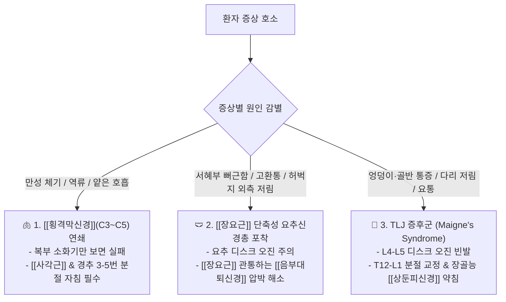

---
aliases:
  - 4대신경총포착점
  - 횡격막신경소화불량
  - 장요근음부대퇴신경
  - TLJ상둔피신경요통
tags:
  - clinical-tip
  - peripheral-nerve
  - nerve-entrapment
  - differential-diagnosis
---
# 💡  4대 신경총(경·상완·요·천골) 포착점 & 장요근·TLJ 증후군과 횡격막신경(C3~C5) 소화불량 감별

> **핵심 요약 (Key Summary)**:
> 경신경총, 상완신경총, 요추신경총, 천골신경총의 4대 말초신경총이 주행 중 근육·인대 터널에서 압박받는 **핵심 포착 부위(Entrapment Points)**를 총괄 분석합니다.
> 경추 C3~C5 [[횡격막신경]] 포착으로 인한 호흡 얕아짐 및 만성 체기·소화불량 연쇄, 오래 앉아있는 현대인의 [[장요근]] 단축성 [[음부대퇴신경]]·외측대퇴피신경통, 요추 디스크로 오진하기 쉬운 흉요추이행부(TLJ) [[상둔피신경]] 포착을 규명합니다.
> 원인 불명의 서혜부 통증, 둔부 저림, 만성 역류·체기 환자의 진료실 침구·약침·추나 치료 표적을 확립합니다.

---

## 🎯 1. 3대 핵심 오진 방지 감별 포인트

---

## 📍 2. 4대 신경총별 필수 치료 타깃 총괄표

| 신경총 | 핵심 신경 분지 | 다발 포착 부위 (Entrapment Site) | 주요 호소 증상 | 즉효 치료점 (침구/약침/추나) |
| :--- | :--- | :--- | :--- | :--- |
| 경신경총 | [[횡격막신경]] (C3~C5) | [[전사각근]] 전면 및 쇄골상와 | 호흡 곤란, 만성 체기, 연하곤란, 딸꾹질 | C3-C5 경추 횡돌기 후결절, 사각근 삼각공간 |
| **상완신경총** | **정중/척골/요골신경** | 사각근 삼각, 늑쇄간극, [[소흉근]] 하공간 | 상지 방사통, 손가락 저림, 손목 힘 빠짐 | 흉곽출구 3대 포인트, 원회내근, 주관, 수근관 |
| 요추신경총 | [[음부대퇴신경]] / LFCN | [[장요근]] 실질 내부, 서혜인대 외측 | 서혜부 통증, 고환/음순통, 허벅지 외측 작열감 | ASIS 내측하방(장골근), 대요근 복부 심부자침 |
| **천골·TLJ** | [[상둔피신경]] / [[좌골신경]] | T12-L1 척추관절, 장골능 능선, [[이상근]] 하공간 | 장골능 상방 극심한 압통, 둔부 통증, 좌골신경통 | T12-L1 협척혈, 장골능 외측 7cm 압통점, 이상근 환도혈 |

---

## 💡 3. 실전 진료실 원포인트 임상 팁

### 📌 Tip 1. "소화제를 먹어도 안 내려가는 체기" $\rightarrow$ 목을 보라!
* 거북목으로 고개가 앞으로 빠지면 [[전사각근]]이 긴장하여 그 앞을 주행하는 [[횡격막신경]]을 압박함.
* 횡격막이 굳어 호흡이 얕아지고 식도열공의 밸브 기능이 상실되므로, **경추 C3~C5 횡돌기 부위와 [[사각근]]에 침/약침을 시술하면 즉시 트림이 나오며 가슴이 뻥 뚫림**.

### 📌 Tip 2. "허리 디스크라는데 허리는 안 아프고 엉덩이만 아파요" $\rightarrow$ TLJ를 눌러라!
* T12-L1 부위의 회전 부하로 [[상둔피신경]]이 장골능을 넘어갈 때 끼임.
* 장골능 외측(허리띠 라인 아래 엉덩이 위쪽)을 엄지로 강하게 문질렀을 때 **"악!" 소리가 나는 압통점**이 있다면, 요추 디스크가 아닌 **T12-L1 흉요추 이행부 추나 교정 및 장골능 약침**으로 1~2회 만에 종결 가능.

---

## 🔗 관련 백링크
* **출처 강의록**: [[말초신경]]
* **근육학 통합 지도**: [[00_Simbio_근육학_임상_지도]]
* **연관 근육**: [[사각근]], [[장요근]], [[이상근]], [[소흉근]]
* **연관 꿀팁**: [[ 구조·신경학으로 접근하는 내과 질환(연하장애·역류·딸꾹질·체기) 침구 치료점]]
