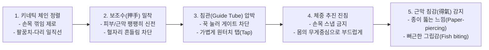

---
aliases:
  - 무통자침생체역학
  - 침관타격압수테크닉
  - 키네틱체인자침술
  - 체중추진진침
tags:
  - clinical-tip
  - acupuncture-technique
  - painless-needling
  - ergonomics
---
# 💡  실전 무통 자침의 생체역학(키네틱 체인) & 압수(押手)·침관 타격 및 체중 진침 테크닉

> **핵심 요약 (Key Summary)**:
> 손목 꺾임을 원천 차단하고 [엄지·검지 $\rightarrow$ 요골 $\rightarrow$ 팔꿈치 $\rightarrow$ 어깨 $\rightarrow$ 지지 다리]를 일직선으로 정렬하는 **키네틱 체인(Kinetic Chain) 기반의 무통 자침 생체역학**을 규명합니다.
> 침관을 피부에 강하게 압박하여 통각 역치를 높인 뒤 탭하는 **게이트 컨트롤(Gate Control) 무통 천침술**, 베드 허벅지 지지를 통한 술자 피로도 제로화 및 몸통 체중으로 밀어 넣는 부드러운 진침법을 제시합니다.
> 침 공포증(Needle phobia) 환자 안심 치료 및 원장의 일일 다빈도 자침 관절 보호를 위한 실전 침술에 즉각 활용합니다.

---

## ⚡ 1. 실전 무통 자침 5대 핵심 공식 (정윤봉 원장님 비기)

---

## 🎯 2. 진료실 즉각 적용 임상 노하우

### 📌 1. "침 맞을 때 너무 아파요" 환자 대응법: 침관 압박의 마법
* ❌ 침관을 살짝 대고 침병을 세게 때리면 침관이 흔들리며 피부를 긁어 극심한 통증 발생.
* ⭕ **침관(플라스틱 관)을 피부에 2~3초간 지그시 꾹 눌러 통각 수용체(A$\delta$, C 섬유)를 압박 자극으로 둔화시킨 뒤, 검지로 침관 상단을 '톡' 튕겨주면 환자는 침이 들어갔는지도 모름**.

### 📌 2. 원장의 손목 건초염/테니스 엘보 예방 비결: 베드 지지
* 자침 시 허공에 서서 손목 힘으로만 침을 놓으면 하루 30~40명 진료 시 수근관증후군 및 외측상과염 발생.
* **베드 옆면에 술자의 대퇴부(허벅지)를 안정적으로 기대어 체중을 분산**하고, 팔꿈치와 몸통으로 지그시 밀어 넣으면 하루 100명을 침 놓아도 손목에 피로가 전혀 없음.

---

## 🔗 관련 백링크
* **출처 강의록**: [[자침법]]
* **연계 강의록**: [[골격근 메커니즘]], [[근골격계 강의]]
* **연관 꿀팁**: [[ 협척혈(華佗夾脊) 심도별 4단계 층위 자침술 & 다열근·후관절 본터치(Bone-Touch) 관절 감압 테크닉]]
