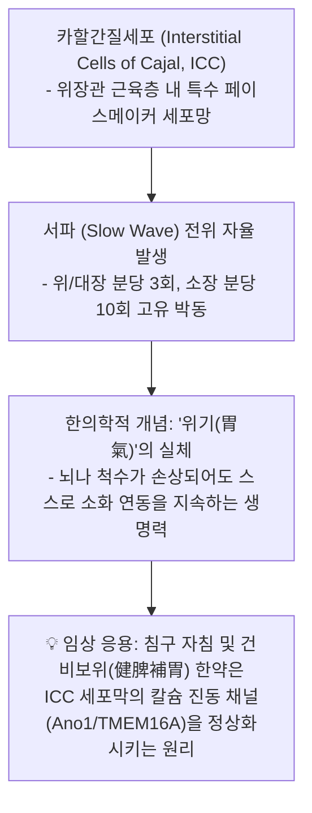
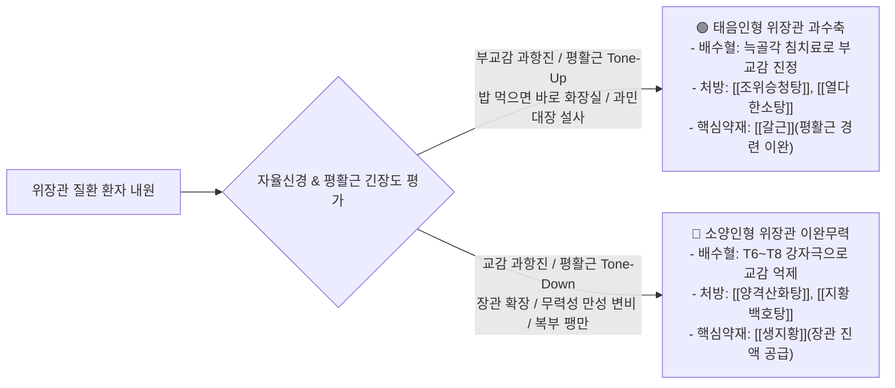

---
aliases:
  - 위장관평활근조절
  - 카할간질세포위기실체
  - 배수혈내장반사자침
tags:
  - clinical-tip
  - smooth-muscle
  - acupuncture-mechanism
  - enteric-nervous-system
---
# 💡  위장관 평활근 5대 조절계 & 카할간질세포(ICC·위기)와 배수혈 자침 메커니즘

> **핵심 요약 (Key Summary)**:
> 뇌변연계(감정/스트레스), 자율신경계(미주신경 vs 교감신경), 척수-장신경계(ENS) 및 내장 페이스메이커인 **카할간질세포(ICC, 위기 胃氣의 실체)**의 5대 계층 제어 네트워크를 규명합니다.
> 흉추 T6~T8 척수 분절 외측각의 내장감각-내장운동 반사궁을 활성화하는 **배수혈(위수·비수·간수) 자침의 신경학적 기전**과 사상체질별(태음인 부교감 과항진성 설사 vs 소양인 교감 과항진성 변비) 평활근 조절 치법을 제시합니다.
> 스트레스성 기능성 소화불량, 식후 즉시 복통·설사, 위무력증 환자의 원스톱 진료실 침구·한약 감별에 즉각 활용합니다.

---

## 🫁 1. 카할간질세포(ICC)와 한의학 '위기(胃氣)'의 현대적 일치

---

## 📍 2. 척수-장신경계(ENS)와 흉추 배수혈 자침 메커니즘

### 📌 왜 등 뒤의 배수혈(위수·비수·간수)을 찌르면 위장관이 즉각 편안해지는가?
1. **척수 분절 내장반사궁 (Viscero-somatic & Somato-visceral Reflex)**:
   * 위장관의 교감신경 지배는 **흉추 T5~T9 척수 외측각**에서 기시하여 대내장신경(Greater Splanchnic Nerve)을 거쳐 복강신경절로 이어짐.
   * 등 뒤 **T6~T8 척추 극돌기 하방 외측(위수, 비수, 격수, 간수)** 부위의 기립근 심부 다열근과 늑골간 신경을 자침하면:
     * 체성 감각 자극이 척수 후각 $\rightarrow$ 외측각으로 전달되어 **과항진된 교감신경 톤을 억제하고 혈류를 개선**.
     * 척수 레벨에서 즉각적인 **위장관 평활근 이완 및 괄약근 경련 해소**가 일어남.

---

## 🎯 3. 사상체질별 평활근 긴장도(Tone)와 실전 진료실 감별법

---

## 🔗 관련 백링크
* **출처 강의록**: [[평활근 메커니즘]]
* **연관 질환**: [[기능성 소화불량]], [[과민대장증후군]]
* **연관 처방**: [[조위승청탕]], [[양격산화탕]], [[열다한소탕]]
* **연관 본초**: [[갈근]], [[생지황]]
