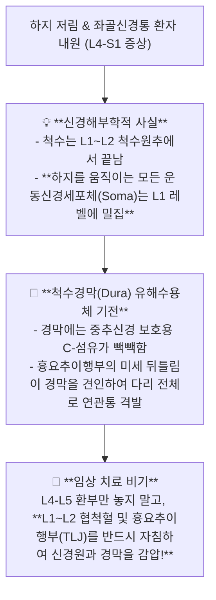

---
aliases:
  - 척수원추L1신경세포체
  - 척수경막견인통증
  - 기저핵소뇌운동제어
  - 흉요추이행부하지방사통
tags:
  - clinical-tip
  - neuroanatomy
  - spinal-cord-dura
  - basal-ganglia-cerebellum
  - acupuncture-points
---
# 💡  척수원추(L1 레벨) 신경세포체와 척수경막(Dura) 견인성 통증 기전 & 대뇌-기저핵-소뇌 운동 제어망

> **핵심 요약 (Key Summary)**:
> 척수원추(Conus Medullaris, L1~L2)에 위치한 **하지·[[좌골신경]] 운동신경원 세포체(Soma)의 해부학적 특성과 척수경막(Dura Mater) 유해수용성 긴장에 의한 원위부 방사통 기전**을 규명합니다.
> 대뇌피질 감각통합(후두/두정/측두 $\rightarrow$ 전두엽 운동계획)과 **기저핵(운동 시작/억제)·소뇌(정밀 오차 보정)의 이중 운동 제어 루프**, 그리고 **흉요추이행부(TLJ/L1) 협척혈 및 두개천골 경막 릴리즈(Dural Release) 침구 치료 공식**을 제시합니다.
> 원인 불명의 만성 좌골신경통, 요통, 난치성 하지 저림 및 파킨슨/진전 환자의 진료실 감압 치료에 즉각 활용합니다.

---

## ⚡ 1. 척수원추(L1) 신경세포체와 경막(Dura) 통증의 반전 진실

---

## 🧠 2. 기저핵 vs 소뇌 운동 조절계 감별

| 뇌 신경 영역 | 핵심 조절 메커니즘 | 기능 장애 시 임상 양상 | 침구 & 한약 표적 |
| :---: | :--- | :--- | :--- |
| **기저핵 (선조체/창백핵)** | 도파민/GABA 신호로 **운동의 시작과 불필요한 떨림 억제** | 파킨슨병(서동, 안정시장전, 근강직), 무도병 | 뇌혈류 개선: [[억간산]], [[조등산]], 풍지/천주 전침 |
| **소뇌 (Cerebellum)** | 대뇌-고유수용기 신호 실시간 비교 $\rightarrow$ **오차 정밀 보정** | 소뇌실조증(의도진전, 비틀거림, 보행불안), 어지럼 | 고유수용성 자극: 두침(소뇌구역), 사신총, 백회 |

---

## 🎯 3. 진료실 즉각 활용 경막 릴리즈 2대 자침 포인트

1. **상부 경막 앵커(C0-C2 후두하부)**:
   * **풍지(風池), 천주(天柱), 아문(啞門)** 심부 자침 $\rightarrow$ 후두하삼각 근막과 대후두공 경막 부착부 이완 $\rightarrow$ 뇌척수액 순환 촉진.
2. **하부 척수원추 및 천골 앵커(L1-L2 & Sacrum)**:
   * **L1-L2 협척혈(華佗夾脊)** 및 **차료(次髎), 중료(中髎)** $\rightarrow$ 척수경막 종말끈(Filum terminale) 긴장 해소.

---

## 🔗 관련 백링크
* **출처 강의록**: [[뇌과학]]
* **연계 강의록**: [[말초신경]], [[근골격계 강의]]
* **연관 혈자리**: `풍지`, `천주`, `협척혈`, `차료`
* **연관 처방**: [[억간산]], [[조등산]]
