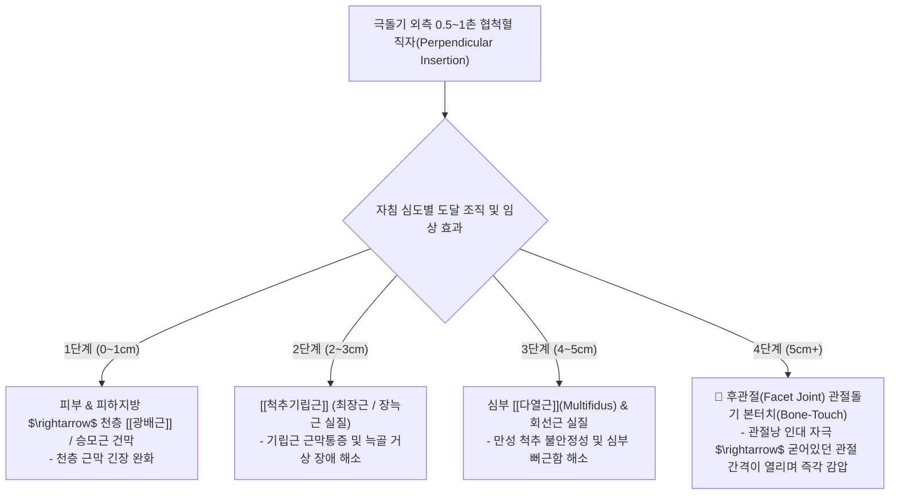
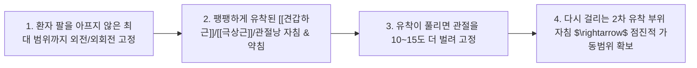

---
aliases:
  - 협척혈심도별자침
  - 후관절본터치감압술
  - 다열근심부자침
  - 오십견점진적릴리즈
tags:
  - clinical-tip
  - acupuncture-technique
  - facet-joint
  - jiaji-points
  - spine-biomechanics
---
# 💡  협척혈(華佗夾脊) 심도별 4단계 층위 자침술 & 다열근·후관절 본터치(Bone-Touch) 관절 감압 테크닉

> **핵심 요약 (Key Summary)**:
> 척추 극돌기 외측 0.5~1촌 부위의 **협척혈(華佗夾脊)을 4단계 심도(천층 건막 $\rightarrow$ 기립근 $\rightarrow$ 다열근 $\rightarrow$ 후관절 관절낭 본터치)**로 진침하는 정밀 해부학적 자침술을 규명합니다.
> 침 첨단이 후관절(Facet joint) 골막 및 관절낭 인대에 닿는 순간 발생하는 **수동적 인대 이완 및 척추 관절 감압(Decompression) 기전**과 오십견(유착성 관절낭염)의 외전-자침-외전 단계별 릴리즈 테크닉을 제시합니다.
> 만성 요통, 척추 후관절증후군, 디스크성 방사통 및 어깨 가동제한 환자의 즉효 침구 임상에 즉각 활용합니다.

---

## 🎯 1. 협척혈(華佗夾脊) 4단계 심도별 해부학적 자침 층위

---

## 💡 2. 후관절 본터치(Bone-Touch) 침술의 진료실 핵심 노하우

### 📌 왜 뼈(후관절)에 닿을 때까지 깊이 찔러야 하는가?
1. **신경 지배의 해부학적 실체**:
   * 척수에서 나오는 척수신경 후지(Dorsal ramus)의 내측지(Medial branch)는 바로 **후관절 관절낭 바로 위를 주행하며 관절 통증을 뇌로 전달**함.
2. **인대 긴장도 리셋 (Ligamentous Release)**:
   * 침 첨단이 후관절낭 인대(Capsular ligament)를 톡 건드리는(Bone-touch) 순간:
     * 관절을 비틀며 꽉 조이고 있던 인대의 방어적 수축이 해제됨.
     * 척추 분절 간의 미세 압력이 떨어지며 **"허리가 시원하게 펴진다"**는 극적인 감압 반응이 나타남.
3. **안전 가이드**:
   * 극돌기에서 외측 0.5~1촌 범위 내에서 수직 또는 약간 내측 10도 각도로 직자 시, 척추 후관절 돌기(Articular process)가 단단한 뼈 방어벽 역할을 하므로 **척수강(Spinal canal) 침범 위험 없이 안전하게 본터치 가능**.

---

## 🧘 3. 오십견(유착성 관절낭염) 단계별 릴리즈(Step-by-step Release) 공식

### 🚫 건 파열(Tendon Tear) 급성기 절대 금기 티칭
* 회전근개 부분 파열 환자에게 "팔을 억지로 쭉쭉 늘리는 스트레칭"을 시키면 파열 부위가 찢어져 완전 파열로 악화됨.
* **급성기 2주간 원칙**: 스트레칭 금기, 통증 없는 범위 내 경미한 등척성 운동 + 관절 주위 침구/소염약침/부항 치료.

---

## 🔗 관련 백링크
* **출처 강의록**: [[근골격계 강의]]
* **근육학 통합 지도**: [[00_Simbio_근육학_임상_지도]]
* **연관 근육**: [[척추기립근]], [[견갑하근]], [[극상근]], [[소흉근]]
* **연관 꿀팁**: [[ 구조·신경학으로 접근하는 내과 질환(연하장애·역류·딸꾹질·체기) 침구 치료점]]
