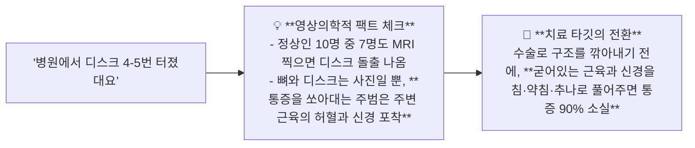

---
aliases:
  - 진료상담프레이밍
  - 영상의학불일치티칭
  - 디스크협착증환자심리
  - 만성통증공포완화
tags:
  - clinical-tip
  - patient-communication
  - imaging-mismatch
  - pain-psychology
  - reframing
---
# 💡  환자의 중증 진단명(디스크·협착증) 호소 심리 분석 & 영상 소견 불일치와 기능적 연부조직 치료 프레이밍

> **핵심 요약 (Key Summary)**:
> 무증상 일반인의 60~80%에서 디스크 돌출/협착이 발견되는 **영상의학적 이상 소견과 실제 임상 통증 사이의 구조-증상 불일치(Imaging Mismatch)** 원리를 규명합니다.
> 환자가 "저 디스크/협착증이래요"라며 중증 질환명을 강조하는 **자기연민적 불안 심리를 분석하고, 병명에 갇히지 않고 기능적 가역 연부조직(근막·신경·인대)으로 치료의 관점을 전환시키는 3단계 진료실 프레이밍(Reframing)**을 제시합니다.
> 척추 관절 만성 통증 환자의 통증 공포증 완화, 초진 라포 형성 및 비급여 치료 동의율 향상에 즉각 활용합니다.

---

## 📸 1. 영상의학의 함정과 기능적 가역성의 진실

---

## 🗣️ 2. 진료실 즉각 활용 3단계 상담 스크립트

### 📌 1단계: 환자의 아픔과 진단명 인정 (공감)
> *"환자분, 그동안 병원에서 디스크라는 말 듣고 수술해야 하나 얼마나 무섭고 고생이 많으셨어요."*

### 📌 2단계: 구조 $\rightarrow$ 기능 프레이밍 전환 (안심과 원리 설명)
> *"그런데 다행인 건, 지금 다리에 힘이 빠지거나 대소변을 못 가리는 응급 상황이 아니라면, 지금 환자분을 찌르듯이 아프게 만드는 건 디스크 뼈 자체가 아니라 **디스크 주변에서 비명을 지르고 있는 굳은 근육과 붓고 눌린 신경**입니다."*

### 📌 3단계: 명쾌한 3단계 치료 로드맵 제시 (신뢰)
> *"디스크는 그대로 있어도 주변 근육의 긴장을 풀고 신경 부종을 가라앉히면 통증은 완전히 사라질 수 있습니다. 오늘부터 침과 약침으로 신경 압박을 풀고, 추나로 관절을 정렬해 드릴 테니 저만 믿고 편안하게 치료받아 보세요."*

---

## 🔗 관련 백링크
* **출처 강의록**: [[진료스킬]]
* **연계 강의록**: [[근골격계 강의]], [[자침법]]
