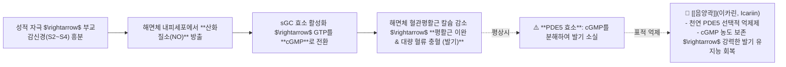

---
aliases:
  - 발기부전음양곽이카린
  - NO_cGMP경로
  - 조루증골반저근오자환
  - 사정후프로락틴피로쌍화탕
tags:
  - clinical-tip
  - male-reproductive
  - erectile-dysfunction
  - premature-ejaculation
  - icariin-pde5
---
# 💡  남성 HPG축·발기 NO-cGMP 경로 & 음양곽(Icariin PDE5 억제)과 오자환(五子丸) 조루·발기부전 치료 공식

> **핵심 요약 (Key Summary)**:
> 부교감신경(S2~S4) 유래 **일산화질소(NO) $\rightarrow$ sGC 활성화 $\rightarrow$ cGMP 생성 $\rightarrow$ 해면체 평활근 이완 및 충혈**로 이어지는 음경 발기 분자경로를 규명합니다.
> cGMP를 분해하는 PDE5 효소를 천연 차단하는 [[음양곽]](Icariin)의 발기부전 치료 약리, 사정 후 프로락틴 급상승 피로에 대한 [[쌍화탕]]·[[십전대보탕]], 그리고 [[외요도괄약근]]·골반저근 약화 및 신정(腎精) 부족성 [[조루증]]에 대한 [[오자환]](五子丸) 처방 공식을 제시합니다.
> 남성 갱년기 성기능 감퇴, 발기부전, 조루증 및 만성 성교 후 피로 환자의 원스톱 진료실 처방에 즉각 활용합니다.

---

## ⚡ 1. 음경 발기의 NO-cGMP 경로 & [[음양곽]](이카린)의 분자 표적

---

## 🎯 2. 남성 3대 성기능 장애별 맞춤 한약 처방 공식

| 질환군 | 핵심 병태생리 | 진료실 1순위 표적 처방 | 구성 및 약리 포인트 |
| :--- | :--- | :--- | :--- |
| **발기부전 (ED)** | 골반 미세혈류 저하 & cGMP 분해 가속 | [[육미지황탕]] + [[음양곽]], [[우슬]], [[두충]] | 신수(腎水)를 보하고 이카린(Icariin)으로 PDE5 차단 & 골반강 혈류 확장 |
| 조루증 (PE) | 골반저근 밸브 약화 & 신정(테스토스테론) 고갈 | [[오자환]](五子丸) 가감방 | [[구기자]], [[토사자]], [[복분자]], [[사상자]], [[오미자]] (정자 형성 촉진, 사정 중추 수렴, 안드로겐 전구물질 보충) |
| 성교 후 피로 (현자타임) | 사정 후 [[프로락틴]](Prolactin) 급상승 & 기혈 소모 | [[쌍화탕]] / [[십전대보탕]] | 중추 도파민 회복, 간/신장 기혈 재생, 전신 근육통 해소 |

---

## 🧘 3. 조루증 환자를 위한 골반저근 & 코어 재활 티칭

1. **케겔 운동(골반저근 수축 훈련)**:
   * 소변을 끊을 때 사용하는 [[외요도괄약근]]과 항문괄약근을 5초간 강하게 조였다가 5초간 푸는 동작을 1일 3회(회당 20회) 반복.
2. **골반 비틀림 교정**:
   * 골반 부정렬로 인해 [[음부신경]](Pudendal Nerve)이 포착되면 사정 밸브 감각이 과민해지므로, 골반 교정 추나 및 이상근/장요근 이완 병행.

---

## 🔗 관련 백링크
* **출처 강의록**: [[성기 관련 질환]]
* **연관 본초**: [[음양곽]], [[구기자]], [[토사자]], [[복분자]], [[사상자]], [[오미자]]
* **연관 처방**: [[육미지황탕]], [[쌍화탕]], [[십전대보탕]]
