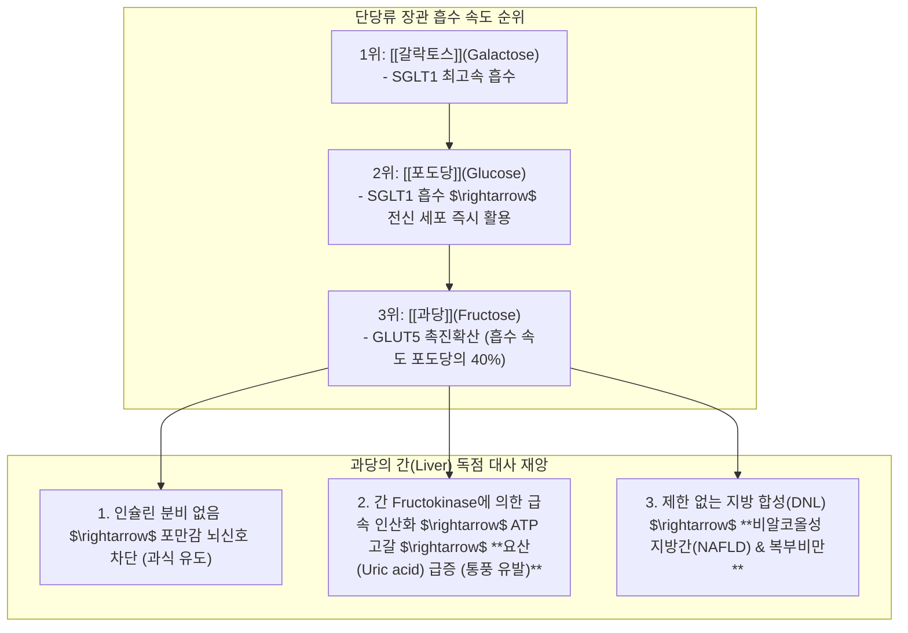

---
aliases:
  - 단당류흡수속도
  - 과당지방간통풍병리
  - 교이소건중탕약리
  - 액상과당의위험성
tags:
  - clinical-tip
  - carbohydrate-metabolism
  - fructose-fatty-liver
  - maltose-herbal-medicine
  - pediatric-abdominal-pain
---
# 💡  단당류 3형제(갈락토스·포도당·과당) 흡수 대사와 과당의 지방간·요산 병리 & 교이(膠飴)·소건중탕 완급지통 약리

> **핵심 요약 (Key Summary)**:
> 단당류 3형제의 장관 흡수 속도(갈락토스 > 포도당 > 과당)와 **과당(Fructose)이 인슐린 조절을 우회하여 간에서 직접 중성지방(NAFLD) 및 요산(통풍)을 폭발시키는 분자병리**를 규명합니다.
> 천연 이당류 맥아당 제제인 [[교이]](膠飴)의 비위 온중보허(溫中補虛)·완급지통(緩急止痛) 작용 및 [[소건중탕]](小建中湯)의 소아 복통·야제증 치료 원리, 그리고 사상체질별 과일/당류 티칭 공식을 제시합니다.
> 비알코올성 지방간, 통풍, 대사증후군 환자의 식이 지도 및 허약 체질 소아·만성 복통 환자의 즉효 한약 처방에 즉각 활용합니다.

---

## 🧪 1. 단당류 3형제의 흡수 속도 & 과당(Fructose)의 치명적 함정

---

## 🍯 2. 한의학의 온화한 에너지원: [[교이]](膠飴, Maltose) & [[소건중탕]]

### 📌 왜 소아 허약 복통과 성장통에 [[소건중탕]](교이)인가?
* **정제당(설탕/과당)의 문제점**: 혈당 스파이크 후 급격한 저혈당 및 간 부담 유발.
* [[교이]](맥아당)의 완충 효과:
  * 엿기름으로 전분을 천천히 발효 당화시킨 포도당 2분자 결합체.
  * 소장에서 매우 부드럽고 완만하게 분해되어 **장관 평활근의 긴장을 풀어주고(완급지통, 緩急止痛)**, 비위 허냉으로 인한 복통을 진정시킴.
* [[소건중탕]](小建中湯) 처방 공식:
  * [[작약]] 12g, [[계지]] 6g, [[교이]] 20~30g, [[생강]] 6g, [[대추|대조]] 6g, [[감초]] 3g
  * 밥 안 먹고 배 아프다고 칭얼대는 소아, 마른 체형의 성장통, 신경과민성 복통의 특효방.

---

## 🎯 3. 진료실 대사증후군 환자 식이 티칭 스크립트

1. **"과일 주스와 액상과당 음료는 술보다 간에 더 해롭습니다!"**:
   * 생과일을 씹어 먹으면 식이섬유가 과당 흡수를 늦추지만, 주스로 갈아 마시면 과당이 간으로 쏟아져 들어가 **알코올 없이도 지방간과 통풍**을 만듭니다.
2. **"통풍 환자는 맥주뿐만 아니라 탄산음료/과일주스를 끊어야 합니다!"**:
   * 과당이 간에서 대사될 때 ATP가 분해되면서 혈중 요산 수치가 즉각 치솟습니다.

---

## 🔗 관련 백링크
* **출처 강의록**: [[당류]]
* **연계 강의록**: [[혈당]], [[소화흡수 시나리오]]
* **연관 처방**: [[소건중탕]], [[대건중탕]], [[열다한소탕]]
* **연관 본초**: [[교이]], [[작약]], [[갈근]]
