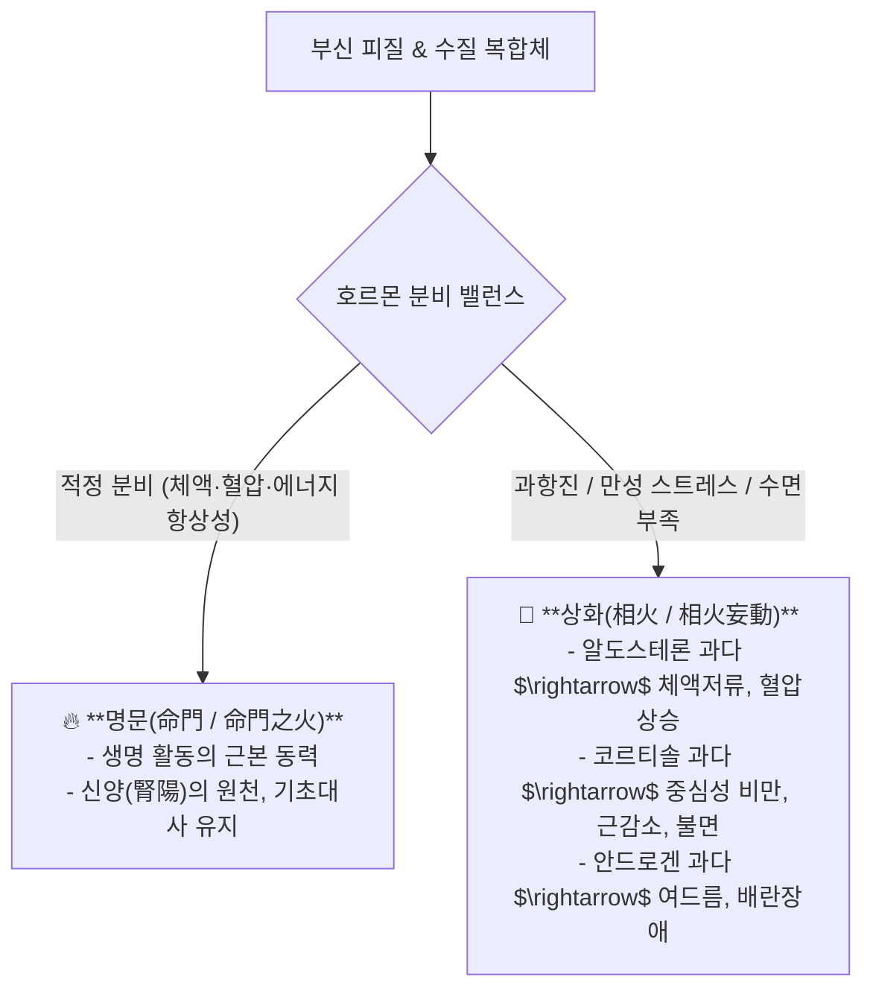

---
aliases:
  - 부신피질명문상화
  - 칼슘대사호르몬
  - 모려석고용골약리
  - 수족냉증감각과민감별
tags:
  - clinical-tip
  - adrenal-cortex
  - calcium-homeostasis
  - mineral-herbs
  - pharmacology
---
# 💡  부신 3층 피질(명문·상화) 생리와 칼슘 대사 3대 호르몬(비타민D·PTH·칼시토닌) & 모려·석고·용골의 진경 안신 약리

> **핵심 요약 (Key Summary)**:
> 부신피질 3개 층(사구대: [[알도스테론]], 속상대: [[코르티솔]], 망상대: [[안드로겐]])과 **한의학 명문(命門)·상화(相火)의 생리학적 매핑**을 총괄 분석합니다.
> 비타민 D, 부갑상선 호르몬(PTH), 칼시토닌의 칼슘 항상성 축과 **말초 감각신경 과민(수족냉증·저림)의 이온화 칼슘 저하 기전**, 그리고 세포막을 안정화시키는 **천연 칼슘 제제인 [[모려]]($CaCO_3$), [[석고]]($CaSO_4$), [[용골]]의 진경·안신(鎭驚安神) 분자약리**를 제시합니다.
> 부신피로, 골다공증, 불안·불면·가슴 두근거림 및 신경과민 환자의 즉효 처방 감별에 즉각 활용합니다.

---

## 🏛️ 1. 부신(Adrenal)과 한의학 '명문(命門) vs 상화(相火)' 매핑

---

## 🦴 2. 칼슘($Ca^{2+}$) 대사와 감각신경 과민(수족냉증)의 반전 진실

### 📌 "손발이 차갑고 시려요" $\rightarrow$ 혈관 문제만이 아니다!
* **통념**: 손발이 시리면 혈액순환 장애(수족냉증)로만 생각하기 쉬움.
* **생리학적 진실**:
  * 혈중 이온화 칼슘($Ca^{2+}$)은 신경세포막의 전압개폐성 $Na^+$ 채널을 안정화시키는 핵심 인자임.
  * 소화 흡수 장애나 만성 설사, 비타민 D 결핍으로 혈중 칼슘이 떨어지면, **감각신경의 탈분극 역치가 낮아져 사소한 온도 변화에도 극심한 냉감과 저림 신호를 뇌로 쏘아 올림 (Hypocalcemic Sensory Hyperesthesia)**.
* **임상 해결책**:
  * 소화기능을 보강하여 장관 칼슘 흡수를 촉진하고, [[모려]], [[용골]], [[시호가용골모려탕]]으로 신경막을 직접 안정화.

---

## 💊 3. 천연 칼슘/광물류 3대 한약재의 분자약리 및 처방 공식

| 한약재 | 주성분 화학식 | 분자약리 기전 | 대표 처방 및 주치증 |
| :--- | :--- | :--- | :--- |
| [[모려]](굴껍질) | 탄산칼슘 ($CaCO_3$) | 세포막 안정화, 중추신경 흥분 억제, 위산 중화 | [[시호가용골모려탕]], [[계지가용골모려탕]] (불안, 가슴 두근거림, 자한·도한) |
| [[석고]](천연광물) | 황산칼슘 수화물 ($CaSO_4 \cdot 2H_2O$) | 시상하부 체온조절중추 진정, 대뇌피질 과흥분 억제 | [[백호탕]], [[마행감석탕]], [[지황백호탕]] (고열, 번갈, 번조, 폐열 기침) |
| [[용골]](포유류 화석골) | 인산칼슘 ($Ca_3(PO_4)_2$) | 신경전달물질 과다 분출 억제, 진경, 수렴 | [[시호가용골모려탕]] (악몽, 불면, 경기, 신경쇠약) |

---

## 🔗 관련 백링크
* **출처 강의록**: [[호르몬 강의]]
* **연관 처방**: [[시호가용골모려탕]], [[계지가용골모려탕]], [[백호탕]]
* **연관 본초**: [[모려]], [[석고]], [[용골]]
