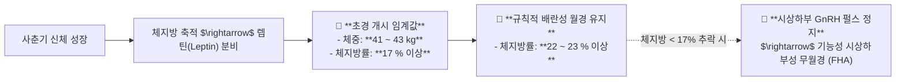

---
aliases:
  - 초경임계체중체지방
  - 사춘기발달단계
  - 시상하부성무월경
  - 다이어트무월경온경탕
tags:
  - clinical-tip
  - puberty-endocrinology
  - amenorrhea
  - leptin-frisch
  - formula-selection
---
# 💡  사춘기 4단계 발달 시퀀스 & 초경 임계체중(41kg·체지방17%)과 시상하부성 무월경 치료 공식

> **핵심 요약 (Key Summary)**:
> 사춘기 여아의 신체 발달 4단계(성장급증 $\rightarrow$ 유방발육 $\rightarrow$ 음모성장 $\rightarrow$ 초경) 시퀀스와 **Frisch의 초경 임계 체중(41~43kg, 체지방률 17%) 및 규칙적 배란 유지 체지방률(23%)** 생리학을 규명합니다.
> 극단적 다이어트나 운동선수 3징후(Energy Deficiency, Amenorrhea, Osteoporosis)로 인한 기능성 시상하부성 무월경(FHA)의 HPO 셧다운 기전과 이를 소생시키는 [[온경탕]](溫經湯)·[[조경종옥탕]](調經種玉湯)의 자궁·난소 혈류 복원 한약 공식을 제시합니다.
> 청소년 생리불순, 무월경, 성조숙증 및 사춘기 다이어트 부작용 환자의 원스톱 진료실 치료에 즉각 활용합니다.

---

## 🎯 1. 초경과 배란의 생체역학 임계 지표 (Frisch Hypothesis)

---

## 🩺 2. 다이어트성 무월경(FHA) 환자 진료실 3단계 대응 프로토콜

### 📌 1단계: 체성분 인바디 검사 & 렙틴 결핍 확인
* 최근 2~3개월간 급격한 체중 감량(5kg 이상) 여부 확인.
* 체지방률이 **20% 미만**으로 떨어져 있다면, 호르몬제(피임약)를 써도 소퇴성 출혈만 나올 뿐 자발적 배란은 회복되지 않음을 환자와 보호자에게 명확히 설명.

### 📌 2단계: 식단 티칭 (탄수화물/지방 복원)
* 매 끼니 양질의 복합 탄수화물(현미, 고구마)과 불포화 지방(견과류, 올리브유)을 섭취하여 **체지방률을 최소 22% 수준으로 복원**하도록 지도.

### 📌 3단계: 표적 한약 처방 (자궁 난소 혈류 복원)
* **1순위 처방: [[온경탕]](溫經湯)**
  * [[맥문동]], [[당귀]], [[작약]], [[천궁]], [[인삼]], [[육계]], [[아교]], [[오수유]]
  * 차가워지고 위축된 난소와 자궁내막으로의 미세순환을 재개통하고 HPO축의 리듬을 재점화.
* **스트레스/불안 동반 시: [[귀비탕]](歸脾湯) 합방**.

---

## 🔗 관련 백링크
* **출처 강의록**: [[사춘기]]
* **연계 강의록**: [[성장]], [[월경]]
* **연관 처방**: [[온경탕]], [[조경종옥탕]], [[귀비탕]]
* **연관 본초**: [[당귀]], [[작약]], [[오수유]], [[아교]]
