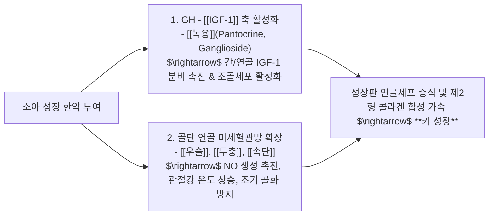
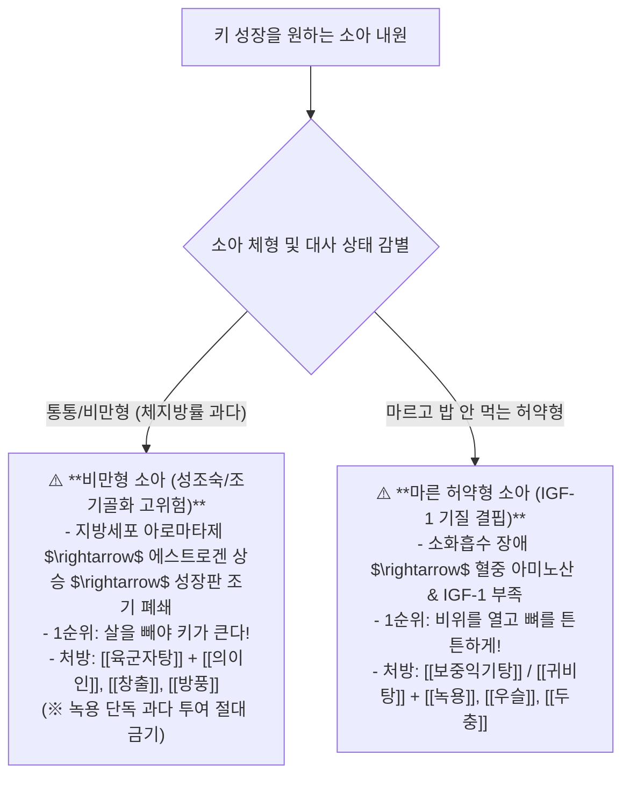

---
aliases:
  - 소아성장한약공식
  - 성장판미세혈관생리
  - 녹용IGF1약리
  - 비만형마른형성장감별
tags:
  - clinical-tip
  - pediatric-growth
  - gh-igf1-axis
  - antler-pharmacology
  - formula-selection
---
# 💡  소아 성장판 미세혈관망 생리와 GH-IGF-1 축 & 녹용(鹿茸)·우슬(牛膝) 배오 및 비만형 vs 마른형 맞춤 성장 공식

> **핵심 요약 (Key Summary)**:
> 성장판 골단연골의 연골세포 분화와 **골단 미세혈관망(Epiphyseal Microvasculature) 혈류 유지 및 국소 관절온도의 상관관계**를 규명합니다.
> 성장호르몬(GH)과 인슐린양 성장인자-1([[IGF-1]]) 분비를 촉진하는 [[녹용]](鹿茸)의 분자약리와 골단 혈류를 확장하는 [[우슬]](牛膝)·[[두충]](杜沖) 배오 원리, 그리고 비만형(성조숙증·조기골화 위험 $\rightarrow$ 감중습담) vs 마른형(소화흡수 불량 $\rightarrow$ 건비보신) 맞춤 처방 공식을 제시합니다.
> 소아 저신장증, 성장판 조기 폐쇄 우려 아동의 진료실 성장 클리닉 한약 처방 및 수면·운동 티칭에 즉각 활용합니다.

---

## 🔬 1. 소아 성장 한약의 2대 분자약리 메커니즘

---

## 🎯 2. 비만형 vs 마른 허약형 소아의 2대 성장 처방 공식

---

## 🌙 3. 부모 상담용 핵심 티칭 스크립트 3원칙

1. **"밤 9시 이후 야식은 성장의 적입니다!"**:
   * 야식을 먹고 혈당이 올라간 상태로 자면 **인슐린이 성장호르몬 분비를 차단**합니다. 배가 약간 고픈 상태(공복)로 잠들어야 깊은 수면 중 성장호르몬이 뿜어져 나옵니다.
2. **"줄넘기/트램펄린 점핑 500회"**:
   * 성장판을 수직으로 쿵쿵 자극하면 연골세포의 미세 손상 후 재생 과정에서 IGF-1 활성도가 최고조에 달합니다.
3. **"스마트폰 블루라이트 차단"**:
   * 멜라토닌 분비 저하는 깊은 4단계 서파 수면을 방해하여 성장호르몬 분비를 50% 이상 감소시킵니다.

---

## 🔗 관련 백링크
* **출처 강의록**: [[성장]]
* **연관 질환**: [[사춘기]]
* **연관 본초**: [[녹용]], [[우슬]], [[두충]], [[속단]]
* **연관 처방**: [[보중익기탕]], [[육군자탕]], [[귀비탕]]
