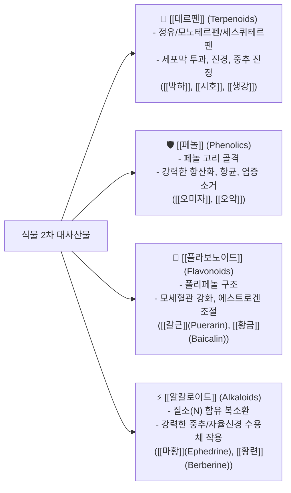
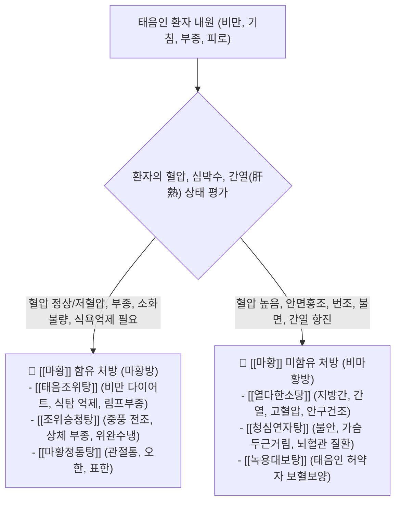

---
aliases:
  - 이차대사산물화학분류
  - 사상체질본초매핑
  - 태음인마황방비마황방
  - 본초약리화학
tags:
  - clinical-tip
  - herbal-pharmacology
  - secondary-metabolites
  - sasang-herbs
  - ephedra-matrix
---
# 💡  식물 4대 2차대사산물(테르펜·페놀·플라보노이드·알칼로이드) 화학분류 & 사상체질별 본초 매핑과 태음인 마황(麻黃) 처방 공식

> **핵심 요약 (Key Summary)**:
> 한약재의 유효 약리 물질인 **4대 2차 대사산물([[테르펜]]·[[페놀]]·[[플라보노이드]]·[[알칼로이드]])의 화학적 골격과 수용체 작용 특성**을 규명합니다.
> 사상 4대 체질별 표적 본초군과 **태음인 한약 선택의 핵심 분기점인 [[마황]](Ephedrine) 유무에 따른 2대 처방군(마황방: 태음조위탕/조위승청탕 vs 비마황방: 열다한소탕/청심연자탕)** 배오 공식을 제시합니다.
> 다이어트 감중탕 처방, 태음인 만성 대사증후군/심혈관 질환 및 소양인·소음인 체질별 표적 한약 구성에 즉각 활용합니다.

---

## 🧪 1. 식물 4대 2차 대사산물의 화학적 골격 및 약리 특성

---

## 🎯 2. 태음인 [[마황]](麻黃) 유무 2대 처방 감별 공식

---

## 🔗 관련 백링크
* **출처 강의록**: [[본초 강의]]
* **연계 강의록**: [[동의수세보원]], [[팔체질]]
* **연관 본초**: [[마황]], [[갈근]], [[황금]], [[석고]], [[인삼]]
* **연관 처방**: [[태음조위탕]], [[열다한소탕]], [[청심연자탕]], [[양격산화탕]]
