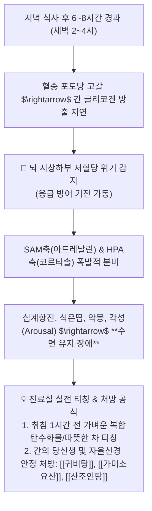

---
aliases:
  - 야간저혈당불면증
  - 스트레스젖산갈근약리
  - 코리회로근막통증
  - 인슐린글루카곤임상
tags:
  - clinical-tip
  - glucose-homeostasis
  - insomnia
  - herbal-pharmacology
  - puerarin-lactate
---
# 💡  야간 저혈당성 새벽 불면증 감별 & 스트레스 근경결(젖산 축적)과 갈근(葛根)의 지방산 대사 약리

> **핵심 요약 (Key Summary)**:
> 식후 8시간이 지난 새벽 2~4시에 발생하는 **야간 저혈당(Nocturnal Hypoglycemia)으로 인한 교감신경·아드레날린 폭발성 조기 각성/불면증**의 병태생리를 규명합니다.
> 스트레스 시 시상하부 명령으로 근육 톤이 강제 상승하며 발생하는 **혐기성 젖산 축적성 항배강수(項背强輸)와 이를 호기성 지방산 대사로 스위칭하는 [[갈근]](Puerarin)의 분자약리**를 제시합니다.
> 수면유지장애 환자의 저녁 식단/복약 티칭 및 만성 스트레스성 승모근·사각근 굳어짐 환자의 즉효 처방 감별에 즉각 활용합니다.

---

## 🌙 1. "새벽 2~4시에 가슴이 두근거리며 깨요" $\rightarrow$ 야간 저혈당 감별

---

## 🧪 2. 스트레스성 근경결(젖산 축적)과 [[갈근]](Puerarin)의 분자 기전

### 📌 왜 스트레스를 받으면 목과 어깨가 돌처럼 굳는가?
1. **시상하부의 비상 에너지 동원 명령**:
   * 스트레스/긴장 상황에서 뇌는 혈당을 올리기 위해 골격근 톤을 강제로 올림.
   * 산소 공급이 미처 따라가지 못해 **무산소 해당과정이 가동 $\rightarrow$ 젖산(Lactate)이 대량 생성**되어 근막에 축적됨.
   * 근육에서 빠져나온 젖산은 간의 코리 회로(Cori Cycle)에서 포도당으로 재생되지만, 지속적인 스트레스는 **목·어깨 근육(지근)의 만성 산증 및 허혈성 경결**을 유발함.

2. [[갈근]](Puerarin)의 구원 투수 역할:
   * [[갈근]]의 이소플라본(Puerarin) 성분은:
     * ① **미세혈관 확장**: 근육 조직으로의 산소 및 혈류 공급을 급격히 증가시킴.
     * ② **대사 스위칭**: 근육의 대사를 젖산 생성 혐기성 경로에서 **호기성 유산소 대사 및 지방산 산화 경로로 전환**.
     * ③ **임상 효능**: 목 뒤와 어깨가 뻣뻣하게 굳은 **항배강수(項背强輸)가 몇 포 복용만으로 드라마틱하게 부드러워지는 이유**임.

---

## 🎯 3. 진료실 실전 한약 배오 공식

| 임상 상황 | 주소증 및 환자 상태 | 표적 배오 공식 |
| :--- | :--- | :--- |
| **스트레스성 항강통** | 스트레스 받으면 뒷목이 굳고 혈압 오름 | [[갈근탕]] + [[황금]], [[치자]] (상초 열 해소 및 근막 산소공급) |
| **야간 저혈당 불면** | 새벽에 식은땀 흘리며 깨고 불안, 소화불량 | [[육군자탕]] + [[산조인]], [[용안육]] (비위 포도당 흡수 개선 및 안신) |
| **태음인 대사증후군** | 비만, 목덜미 굳음, 지방간, 혈당 상승 | [[열다한소탕]] (갈근 증량으로 인슐린 감수성 개선 및 간열 청소) |

---

## 🔗 관련 백링크
* **출처 강의록**: [[혈당]]
* **연관 질환**: [[불면증]], [[자율신경 실조증]], [[근막통증증후군]]
* **연관 본초**: [[갈근]], [[산조인]], [[황금]]
* **연관 처방**: [[갈근탕]], [[육군자탕]], [[열다한소탕]]
