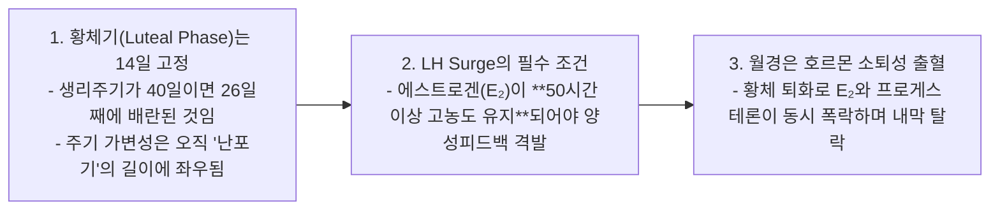
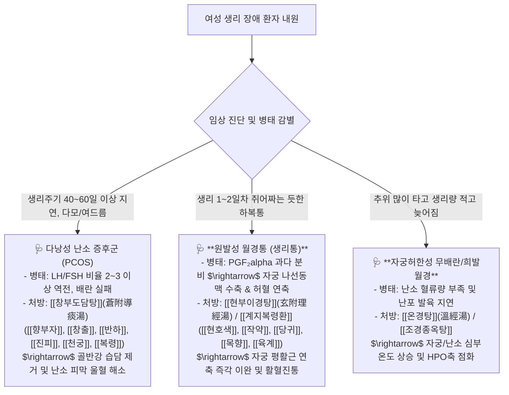

---
aliases:
  - HPO축호르몬동역학
  - LHSurge조건
  - PCOS치료창부도담탕
  - 생리통PGF2a현부이경탕
tags:
  - clinical-tip
  - menstrual-cycle
  - hpo-axis
  - pcos
  - dysmenorrhea
---
# 💡  여성 HPO축 4단계 호르몬 동역학(LH Surge 50시간) & PCOS(LH-FSH 불균형)와 생리통(PGF2a) 표적 처방 공식

> **핵심 요약 (Key Summary)**:
> 난포기(주기 가변성 결정) $\rightarrow$ 배란기($E_2$ 50시간 유지 시 LH Surge) $\rightarrow$ 황체기(14일 불변) $\rightarrow$ 월경기(호르몬 급락성 소퇴성 출혈)의 **여성 생식 내분비 4단계 동역학**을 규명합니다.
> 미성숙 난포 잔존으로 FSH 억제 & LH 고농도가 지속되는 **다낭성 난소 증후군(PCOS)의 [[창부도담탕]](蒼附導痰湯) 기전**과 프로스타글란딘($PGF_{2\alpha}$) 나선동맥 경련성 **원발성 생리통에 대한 [[현부이경탕]](玄附理經湯)·[[계지복령환]](桂枝茯苓丸)** 처방 공식을 제시합니다.
> 생리주기 불규칙, 희발월경, 무배란성 불임 및 극심한 생리통 환자의 진료실 감별과 처방에 즉각 활용합니다.

---

## 🌸 1. 생리주기의 3대 불변 법칙

---

## 🎯 2. 부인과 다빈도 3대 질환별 임상 처방 공식

---

## 🔗 관련 백링크
* **출처 강의록**: [[월경]]
* **연계 강의록**: [[사춘기]], [[성기 관련 질환]]
* **연관 처방**: [[창부도담탕]], [[현부이경탕]], [[계지복령환]], [[온경탕]]
* **연관 본초**: [[향부자]], [[현호색]], [[작약]], [[당귀]]
