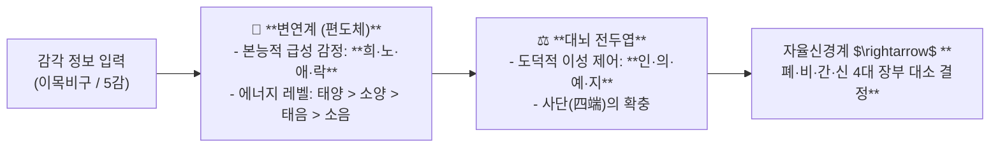
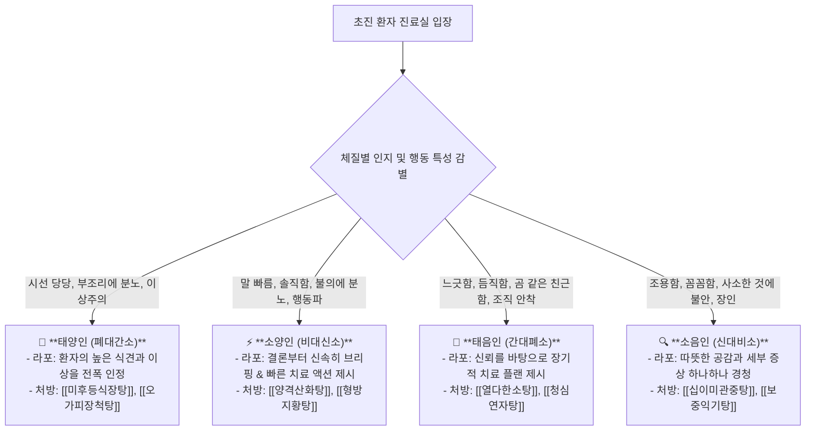
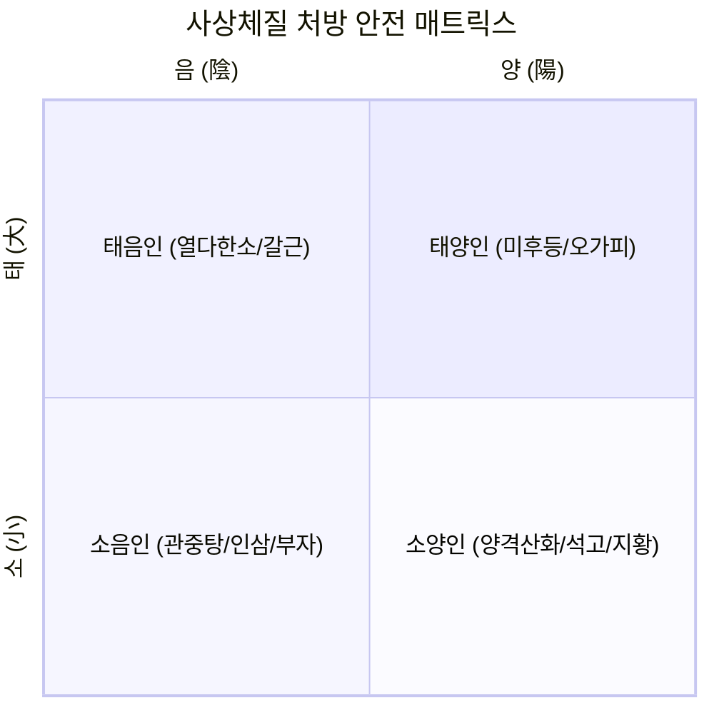

---
aliases:
  - 성명론사단론뇌과학
  - 사상체질4사분면감별
  - 대각선체질처방금기
  - 사상체질환자라포
tags:
  - clinical-tip
  - sasang-medicine
  - constitutional-typology
  - neuro-limbic
  - formula-selection
---
# 💡  이제마 성명론·사단론의 뇌과학(변연계-전두엽) 매핑 & 4사분면 체질 감별과 대각선 처방 금기 공식

> **핵심 요약 (Key Summary)**:
> 사단론의 희노애락(喜怒哀樂)을 **변연계(Limbic system) 본능 정서로, 인의예지(仁義禮智)를 전두엽(Prefrontal cortex) 이성 판단으로 해석**하는 사상의학 뇌과학 모델을 규명합니다.
> 이목비구 정보 입력 및 폐비간신 장부 반응에 기반한 **4사분면 체질 감별(태양인·소양인·태음인·소음인)과 환자 유형별 진료실 라포 형성법**, 그리고 **대각선 정반대 체질(소양인 $\leftrightarrow$ 소음인, 태양인 $\leftrightarrow$ 태음인) 약재 교차 투여 절대 금기 공식**을 제시합니다.
> 초진 환자 체질 감별, 문진 라포 형성 및 한약 처방 부작용 방지 프로토콜에 즉각 활용합니다.

---

## 🧠 1. 이제마 사단론의 현대 뇌과학 매핑 모델

---

## 🎯 2. 진료실 4대 체질별 문진 & 라포 형성 스크립트

---

## 🚫 3. 4사분면 체질 처방의 대각선 교차 투여 절대 금기

### ⚠️ 절대 주의 규칙
* **소양인에게 소음인 약재([[인삼]], [[부자]], [[육계]]) 투여 금기**:
  * 소양인의 위열(胃熱)과 상화(相火)를 폭발시켜 두통, 흉민, 뇌출혈 위험.
* **소음인에게 소양인 약재([[석고]], [[지모]]) 투여 금기**:
  * 소음인의 찬 비위를 극도로 손상시켜 설사, 복통, 허탈 유발.

---

## 🔗 관련 백링크
* **출처 강의록**: [[동의수세보원]]
* **연계 강의록**: [[팔체질]], [[감정]]
* **연관 처방**: [[양격산화탕]], [[열다한소탕]], [[형방지황탕]], [[보중익기탕]]
* **연관 본초**: [[갈근]], [[석고]], [[인삼]], [[부자]]
