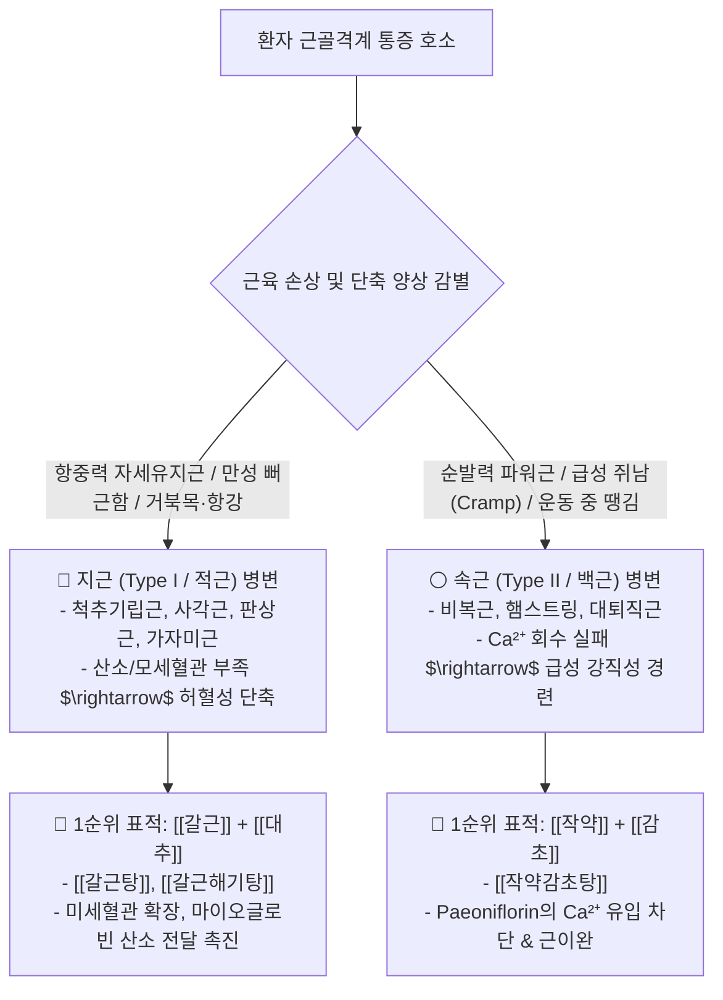

---
aliases:
  - 지근속근약리공식
  - 갈근작약감초배오
  - 적근백근처방감별
tags:
  - clinical-tip
  - muscle-physiology
  - herbal-pharmacology
  - formula-selection
---
# 💡  지근(적근)·속근(백근) 생리 대사 감별 & 갈근(葛根)·작약감초탕(芍藥甘草湯) 표적 배오 공식

> **핵심 요약 (Key Summary)**:
> 척추기립근·가자미근 등 자세 유지 항중력근인 **지근(Type I, 적근)**과 대퇴직근·비복근 등 순발력 파워근인 **속근(Type II, 백근)**의 생화학적 대사 경로를 규명합니다.
> 지근의 만성 허혈성 단축에는 **미세순환 및 산소 공급을 촉진하는 [[갈근]](Puerarin) + [[대추]] 배오**, 속근의 급성 $Ca^{2+}$ 과부하 경련에는 **세포내 칼슘 재흡수와 근막을 이완하는 [[작약]](Paeoniflorin) + [[감초]] 배오([[작약감초탕]])**의 절대 공식을 제시합니다.
> 만성 경항통(항강), 거북목, 급성 쥐(Cramp), 스포츠 근육 파열 환자의 맞춤 처방 감별에 즉각 활용합니다.

---

## 🔬 1. 지근(적근) vs 속근(백근)의 생체역학·분자약리 감별 매트릭스

---

## 🌿 2. 지근 vs 속근 핵심 비교 총괄표

| 구분 | 🔴 지근 (적근 / Type I / Slow-twitch) | ⚪ 속근 (백근 / Type II / Fast-twitch) |
| :--- | :--- | :--- |
| **해부학적 위치** | 심부 자세유지근 (척추기립근, 판상근, 장요근, 가자미근) | 천부 순발력근 (비복근, 대퇴사두근, 햄스트링, 상완이두근) |
| **미토콘드리아 / 혈류** | **매우 풍부함** (적색 마이오글로빈 다량 함유) | **상대적으로 적음** (백색, 모세혈관 망 성김) |
| **주요 대사 경로** | **호기성 산화적 인산화** (지방산/포도당 완전 연소) | **혐기성 해당과정** (글리코겐 급속 분해 $\rightarrow$ 젖산 축적) |
| **임상 주소증** | "목·어깨가 몇 달째 돌처럼 굳고 묵직해요" | "자다가 갑자기 종아리에 쥐가 나서 꼼짝 못해요" |
| **병태생리 핵심** | 만성적인 미세순환 장애 및 산소 결핍성 허혈 단축 | $Ca^{2+}$ 펌프 과부하로 인한 액틴-미오신 결합 고착(Rigor) |
| **표적 지표성분** | **푸에라린(Puerarin)** : 모세혈관 확장, 혈류량 증대 | **파에오니플로린(Paeoniflorin)** : 근형질세망 $Ca^{2+}$ 흡수 촉진 |
| **대표 처방** | [[갈근탕]], [[갈근해기탕]], [[서경탕]] | [[작약감초탕]], [[작약감초부자탕]] |

---

## 🎯 3. 실전 진료실 원클릭 처방 감별 공식

### 📌 Case 1. 하루 종일 컴퓨터를 보며 목·어깨가 돌처럼 굳은 사무직 환자
* **진단**: 경항부 지근([[승모근]] 상부섬유, [[두판상근]], [[사각근]])의 만성 산소결핍성 허혈 단축.
* **처방 공식**: [[갈근탕]] 가미방
  * [[갈근]] 12~16g (지근의 모세혈관을 열고 혈류 공급) + [[대추]] 6g (cAMP 공급으로 세포 에너지 활성화) + [[작약]] 6g.

### 📌 Case 2. 축구/러닝 중 종아리가 뭉치거나 야간에 장딴지 쥐가 나는 환자
* **진단**: 천부 속근([[비복근]], [[대퇴이두근]])의 급성 칼슘 대사 이상성 강직.
* **처방 공식**: [[작약감초탕]] (단 2미로 즉효 발휘)
  * [[작약]] 12~20g (Paeoniflorin으로 $Ca^{2+}$ 채널 차단 및 근이완) + [[감초]](자감초) 8~12g (체액 및 포도당 전해질 공급).
  * 💡 한랭 자극 동반 시: [[부자]](포부자 4g) 가미 $\rightarrow$ [[작약감초부자탕]].

---

## 🔗 관련 백링크
* **출처 강의록**: [[골격근 메커니즘]]
* **근육학 통합 지도**: [[00_Simbio_근육학_임상_지도]]
* **연관 처방**: [[갈근탕]], [[작약감초탕]], [[갈근해기탕]]
* **연관 본초**: [[갈근]], [[작약]], [[감초]], [[대추]]
