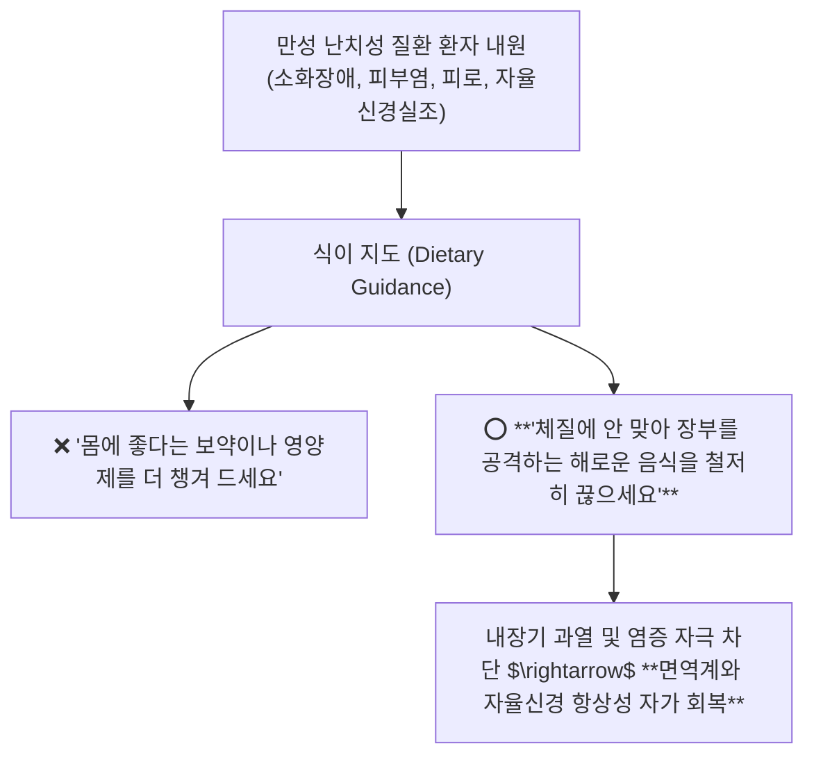

---
aliases:
  - 팔체질식이티칭비기
  - 마이너스영양학
  - 체질별금기음식
  - 태음인연변문진
tags:
  - clinical-tip
  - eight-constitution
  - dietary-counseling
  - minus-nutrition
  - food-allergy
---
# 💡  팔체질 8대 장부 허실과 곡류·육류 배제 식이 티칭(Minus Nutrition) & 진료실 체질 문진 비기

> **핵심 요약 (Key Summary)**:
> 목(태음)·토(소양)·금(태양)·수(소음)의 **팔체질 8대 장부 대소 배열과 전 체질 안전 주식인 백미(White Rice)**의 임상적 가치를 규명합니다.
> "보양식을 더 먹는 것보다 해로운 음식을 확실히 끊는 것(Minus Nutrition)"이 핵심인 **체질별 곡류·육류 배제 식이 티칭 매트릭스**와 소아 아토피/비염의 체질식 역추적 기전을 제시합니다.
> 소양인(현미/닭고기 금기), 소음인(보리/돼지고기/생야채 금기), 태음인(메밀 금기 및 연변 문진 팁)의 진료실 원스톱 식이 지도에 즉각 활용합니다.

---

## 🚫 1. 체질 식이 티칭의 제1원칙: 마이너스 영양학 (Minus Nutrition)

---

## 🌾 2. 체질별 곡류·육류 적합성 & 절대 금기 매트릭스

| 체질군 | 주식 및 추천 음식 (Good) | 🚫 **반드시 끊어야 할 음식 (Bad / 금기)** | 위반 시 유발 증상 |
| :---: | :--- | :--- | :--- |
| **토체질 (소양인)** | **백미, 보리, 메밀, 녹두, 돼지고기, 오리고기, 배추, 오이** | ❌ **현미, 찹쌀, 닭고기, 인삼, 꿀, 고추, 생강** | 위열(胃熱) 폭발, 두통, 불면, 피부 가려움증 |
| **수체질 (소음인)** | **백미, 찹쌀, 현미, 옥수수, 닭고기, 소고기, 사과, 마늘** | ❌ **보리, 메밀, 돼지고기, 맥주, 찬 생야채(샐러드)** | 비위 냉각, 소화불량, 만성 설사, 복부 팽만 |
| **목체질 (태음인)** | **백미, 수수, 밀가루, 율무, 쇠고기, 무, 도라지, 콩류** | ❌ **메밀, 조개류, 게, 새우, 포도, 찬 맥주** | 폐한(肺寒), 피부 건조, 알레르기 비염, 묽은 변 |
| **금체질 (태양인)** | **백미, 메밀, 메조, 녹두, 푸른 잎채소, 해산물, 포도** | ❌ **현미, 율무, 쇠고기, 마늘, 사골국, 녹용** | 간기능 과부하, 만성 피로, 근육 무력감, 아토피 |

---

## 🎯 3. 진료실 실전 체질 문진 비기 3선

1. **태음인 대변 문진**:
   * "설사하나요?"라고 묻지 말고 **"평소 변이 약간 무르거나(연변), 하루 2~3회씩 자주 가나요?"**라고 물어 태음인의 간대폐소성 장 흡수 불량을 감별.
2. **소음인 샐러드 다이어트 역풍 감별**:
   * 눈빛이 차분하고 섬세한 소음인 여성이 다이어트를 위해 **찬 샐러드와 닭가슴살만 먹다 복부 팽만과 생리불순**이 왔을 때, 익힌 채소와 따뜻한 온비(溫脾) 한약([[보중익기탕]])으로 즉각 교정.
3. **소아 만성 비염·아토피 음식 역추적**:
   * 토체질 아이가 이유식으로 닭고기·홍삼을 많이 먹었거나, 금체질 아이가 사골국·소고기를 과식했는지 확인하여 해당 단백질을 차단.

---

## 🔗 관련 백링크
* **출처 강의록**: [[팔체질]]
* **연계 강의록**: [[동의수세보원]]
* **연관 처방**: [[양격산화탕]], [[보중익기탕]], [[열다한소탕]]
