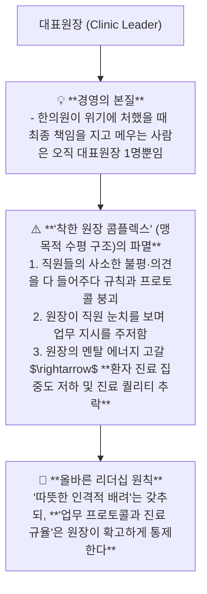
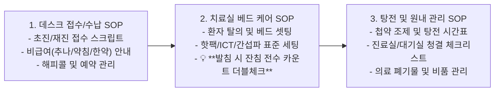

---
aliases:
  - 한의원조직관리리더십
  - 대표원장단일책임
  - 수평구조의함정
  - 한의원SOP시스템경영
tags:
  - clinical-tip
  - clinic-management
  - leadership
  - sop-system
  - staff-training
---
# 💡  한의원 조직 관리와 대표원장 리더십 & 맹목적 수평 구조의 함정과 표준 SOP 경영 공식

> **핵심 요약 (Key Summary)**:
> 의료기관의 법적·재정적·임상적 최종 책임을 지는 **대표원장의 단일 책임(Single Responsibility)과 맹목적 수평 구조가 초래하는 규율 붕괴 및 의사결정 마비의 위험성**을 규명합니다.
> 감정적 친밀함 대신 **프로페셔널한 상호 존중과 전 과정 표준 업무 매뉴얼(SOP: 접수 $\rightarrow$ 치료실 $\rightarrow$ 발침 $\rightarrow$ 수납) 기반의 자율 구동 시스템 구축법**을 제시합니다.
> 순천 개원 및 일일 다빈도 진료 체제에서 직원 이직률 최소화, 직원-원장 간 감정 소모 제로화 및 원장의 진료 몰입도 극대화에 즉각 활용합니다.

---

## 🏛️ 1. 대표원장의 고독한 단일 책임과 수평 구조의 함정

---

## 📋 2. 한의원 자율 구동 3대 표준 업무 매뉴얼(SOP) 공식

---

## 🎯 3. 진료실 직원 관리 실전 액션 팁 3선

1. **"신규 직원이 와도 3일 만에 80%를 해내는 체크리스트"**:
   * 구두 설명 대신 사진과 체크리스트가 포함된 1-Page 매뉴얼을 베드/데스크에 비치.
2. **"사적 친밀함보다 공적인 프로페셔널리즘"**:
   * 업무 시간에는 철저히 직책과 존칭을 사용하고, 감정적인 친목보다 공정한 보상과 명확한 업무 분담으로 신뢰 구축.
3. **"원장의 에너지(Zone)는 오직 환자에게만 쏟아라"**:
   * 비품 구매, 청소 검사 등 사소한 운영 업무는 팀장/데스크에 전권을 위임하고 결과만 보고받음으로써, 원장은 **진단, 자침, 처방, 환자 티칭에만 100% 몰입**.

---

## 🔗 관련 백링크
* **출처 강의록**: [[한의원 운영]]
* **연계 프로젝트**: [[A-2_Clinic_Workflow_Automation]], [[A-3_Clinic_Protocol_Engine]], [[A-7_Patient_Handout_Builder]]
