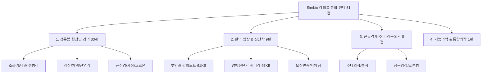

# 🎓 Simbio 임상 강의록 통합 MOC (Master Lecture Map)

> **Simbio 강의록 통합 아카이브 v1.0**  
> 볼트 내 흩어져 있던 모든 명의(정윤봉 원장님, 학회, 임상 대가) 강의록 51편을 4대 핵심 분야로 단일 통합하였습니다.

---

## 🗂️ 1. 4대 분야별 강의록 구성 현황

---

## 📚 2. 세부 분류별 원클릭 바로가기

### 🥇 1. 정윤봉 원장님 생병리 & 임상 강의 (총 33편)
* **소화기 생병리 & 위장관 (완결)**:
  * [[5. 독서, 노트/강의록/1. 정윤봉 원장님 강의/상부 위장관|상부 위장관]] · [[5. 독서, 노트/강의록/1. 정윤봉 원장님 강의/하부 위장관|하부 위장관]] · [[5. 독서, 노트/강의록/1. 정윤봉 원장님 강의/하부 위장관(대변)|하부 위장관(대변)]] · [[5. 독서, 노트/강의록/1. 정윤봉 원장님 강의/소화 생병리 및 위장약|소화 생병리 및 위장약]] · [[5. 독서, 노트/강의록/1. 정윤봉 원장님 강의/위 기능성 소화불량(소화와 흡수)|위 기능성 소화불량(소화와 흡수)]]
* **소화흡수 & 구조내과 / 약리 (완결)**:
  * [[5. 독서, 노트/강의록/1. 정윤봉 원장님 강의/소화흡수 시나리오|소화흡수 시나리오]] · [[5. 독서, 노트/강의록/1. 정윤봉 원장님 강의/구조로 접근하는 내과질환|구조로 접근하는 내과질환]] · [[5. 독서, 노트/강의록/1. 정윤봉 원장님 강의/양방 위장약 약리|양방 위장약 약리]] · [[5. 독서, 노트/강의록/1. 정윤봉 원장님 강의/포도당 대사+기초 화학 개념|포도당 대사+기초 화학 개념]]
* **심장·체액량·산염기 & 호흡기 (진행 예정)**:
  * [[5. 독서, 노트/강의록/1. 정윤봉 원장님 강의/심장 및 체액량|심장 및 체액량]] · [[5. 독서, 노트/강의록/1. 정윤봉 원장님 강의/체액|체액]] · [[5. 독서, 노트/강의록/1. 정윤봉 원장님 강의/산염기 불균형|산염기 불균형]] · [[5. 독서, 노트/강의록/1. 정윤봉 원장님 강의/폐 환기|폐 환기]] · [[5. 독서, 노트/강의록/1. 정윤봉 원장님 강의/호흡|호흡]] · [[5. 독서, 노트/강의록/1. 정윤봉 원장님 강의/체온|체온]]
* **근신경 & 자침 메커니즘**:
  * [[5. 독서, 노트/강의록/1. 정윤봉 원장님 강의/골격근 메커니즘|골격근 메커니즘]] · [[5. 독서, 노트/강의록/1. 정윤봉 원장님 강의/평활근 메커니즘|평활근 메커니즘]] · [[5. 독서, 노트/강의록/1. 정윤봉 원장님 강의/말초신경|말초신경]] · [[5. 독서, 노트/강의록/1. 정윤봉 원장님 강의/근골격계 강의|근골격계 강의]] · [[5. 독서, 노트/강의록/1. 정윤봉 원장님 강의/자침법|자침법]]
* **내분비·호르몬·혈당 & 성장/생식**:
  * [[5. 독서, 노트/강의록/1. 정윤봉 원장님 강의/혈당|혈당]] · [[5. 독서, 노트/강의록/1. 정윤봉 원장님 강의/호르몬 강의|호르몬 강의]] · [[5. 독서, 노트/강의록/1. 정윤봉 원장님 강의/당류|당류]] · [[5. 독서, 노트/강의록/1. 정윤봉 원장님 강의/성장|성장]] · [[5. 독서, 노트/강의록/1. 정윤봉 원장님 강의/사춘기|사춘기]] · [[5. 독서, 노트/강의록/1. 정윤봉 원장님 강의/월경|월경]] · [[5. 독서, 노트/강의록/1. 정윤봉 원장님 강의/성기 관련 질환|성기 관련 질환]]
* **사상의학/팔체질 & 진료스킬/뇌과학**:
  * [[5. 독서, 노트/강의록/1. 정윤봉 원장님 강의/동의수세보원|동의수세보원]] · [[5. 독서, 노트/강의록/1. 정윤봉 원장님 강의/팔체질|팔체질]] · [[5. 독서, 노트/강의록/1. 정윤봉 원장님 강의/본초 강의|본초 강의]] · [[5. 독서, 노트/강의록/1. 정윤봉 원장님 강의/진료스킬|진료스킬]] · [[5. 독서, 노트/강의록/1. 정윤봉 원장님 강의/한의원 운영|한의원 운영]] · [[5. 독서, 노트/강의록/1. 정윤봉 원장님 강의/뇌과학|뇌과학]]

---

### 🥈 2. 한의 임상 및 진단학 (부인과·내과) (총 9편)
* [[5. 독서, 노트/강의록/2. 한의 임상 및 진단학 (부인과·내과)/부인과 강의노트|부인과 강의노트 (61KB 대작)]]
* [[5. 독서, 노트/강의록/2. 한의 임상 및 진단학 (부인과·내과)/부인과 실습 강의|부인과 실습 강의]]
* [[5. 독서, 노트/강의록/2. 한의 임상 및 진단학 (부인과·내과)/양방진단학 써머리|양방진단학 써머리 (45KB 대작)]]
* [[5. 독서, 노트/강의록/2. 한의 임상 및 진단학 (부인과·내과)/심계 강의노트|심계 강의노트]] · [[5. 독서, 노트/강의록/2. 한의 임상 및 진단학 (부인과·내과)/비계 강의노트|비계 강의노트]] · [[5. 독서, 노트/강의록/2. 한의 임상 및 진단학 (부인과·내과)/간계 강의노트|간계 강의노트]]
* [[5. 독서, 노트/강의록/2. 한의 임상 및 진단학 (부인과·내과)/사암|사암침법 강의]]
* [[5. 독서, 노트/강의록/2. 한의 임상 및 진단학 (부인과·내과)/피부 미용 강의(임명진)|피부 미용 강의 (임명진)]]
* [[5. 독서, 노트/강의록/2. 한의 임상 및 진단학 (부인과·내과)/이명과 난청 치료 강의|이명과 난청 치료 강의]]

---

### 🥉 3. 근골격계·추나·침구의학 (총 8편)
* [[5. 독서, 노트/강의록/3. 근골격계·추나·침구의학/추나 강의노트|추나 강의노트]]
* [[5. 독서, 노트/강의록/3. 근골격계·추나·침구의학/추나의학 강의노트|추나의학 강의노트]]
* [[5. 독서, 노트/강의록/3. 근골격계·추나·침구의학/통사 강의|통사(통증치료사관학교) 강의]]
* [[5. 독서, 노트/강의록/3. 근골격계·추나·침구의학/침구의학 유튜브 강의|침구의학 유튜브 강의]]
* [[5. 독서, 노트/강의록/3. 근골격계·추나·침구의학/침구의학 크론병|침구의학 크론병 임상]]
* [[5. 독서, 노트/강의록/3. 근골격계·추나·침구의학/원추연 논문 작성|원추연 논문 작성]]
* [[5. 독서, 노트/강의록/3. 근골격계·추나·침구의학/전침구 마지막 써머리|전침구 마지막 써머리]]
* [[5. 독서, 노트/강의록/3. 근골격계·추나·침구의학/첫째날|임상 실습 첫째날 노트]]

---

### 🏅 4. 기능의학 & 통합의학 (총 1편)
* [[5. 독서, 노트/강의록/4. 기능의학 & 통합의학/기능의학 강의|기능의학 강의]]

---

## 🧭 관련 링크 바로가기
* [[4. 임상 꿀팁 & 실전 노하우|💡 임상 꿀팁 & 실전 노하우 센터]]
* [[00_Simbio_근육학_임상_지도|🗺️ 임상 근육학 통합 지도]]
* [[00_Simbio_프로젝트_대시보드|📊 Simbio 프로젝트 종합 대시보드]]
* [[00_독서_노트_MOC|📚 독서·노트 MOC (5. 독서, 노트 총괄)]]
