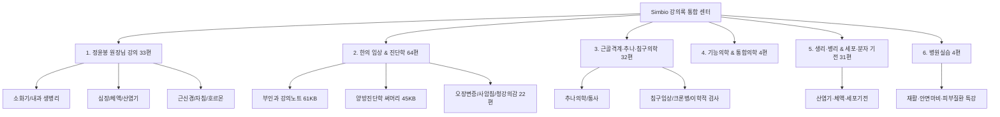

# 🎓 Simbio 임상 강의록 통합 MOC (Master Lecture Map)

> **Simbio 강의록 통합 아카이브 v1.0**  
> 볼트 내 흩어져 있던 모든 명의(정윤봉 원장님, 학회, 임상 대가) 강의록 51편을 4대 핵심 분야로 단일 통합하였습니다.
> 
> ⚠️ **(09-09 다빈치 갱신)** "기타-" 폴더 강의록이 5·6번 두 개 신규 하위폴더(5. 생리·병리 & 세포·분자 기전 31편, 병원실습 4편)로 실이동되어 아래 §2 목록에 추가 등재했습니다. 위 v1.0 총계(51편)는 이 신규 2개 분야를 반영하기 전 수치이며, 실측 폴더 기준 전체는 2번(64)+3번(32)+4번(4)+5번(31)+6번(4)=135편입니다(1번 정윤봉 계열 33편은 폴더 미분리·중복 산정 가능성이 있어 재계수는 다음 순찰로 이월).

---

## 🗂️ 1. 4대 분야별 강의록 구성 현황

---

## 📚 2. 세부 분류별 원클릭 바로가기

### 🥇 1. 정윤봉 원장님 생병리 & 임상 강의 (총 33편)
* **소화기 생병리 & 위장관 (완결)**:
  * [[상부 위장관|상부 위장관]] · [[하부 위장관|하부 위장관]] · [[하부 위장관(대변)|하부 위장관(대변)]] · [[소화 생병리 및 위장약|소화 생병리 및 위장약]] · [[위 기능성 소화불량(소화와 흡수)|위 기능성 소화불량(소화와 흡수)]]
* **소화흡수 & 구조내과 / 약리 (완결)**:
  * [[소화흡수 시나리오|소화흡수 시나리오]] · [[구조로 접근하는 내과질환|구조로 접근하는 내과질환]] · [[양방 위장약 약리|양방 위장약 약리]] · [[포도당 대사+기초 화학 개념|포도당 대사+기초 화학 개념]]
* **심장·체액량·산염기 & 호흡기 (진행 예정)**:
  * [[심장 및 체액량|심장 및 체액량]] · [[체액|체액]] · [[산염기 불균형|산염기 불균형]] · [[폐 환기|폐 환기]] · [[호흡|호흡]] · [[체온|체온]]
* **근신경 & 자침 메커니즘**:
  * [[골격근 메커니즘|골격근 메커니즘]] · [[평활근 메커니즘|평활근 메커니즘]] · [[말초신경|말초신경]] · [[근골격계 강의|근골격계 강의]] · [[자침법|자침법]]
* **내분비·호르몬·혈당 & 성장/생식**:
  * [[혈당|혈당]] · [[호르몬 강의|호르몬 강의]] · [[당류|당류]] · [[성장|성장]] · [[사춘기|사춘기]] · [[월경|월경]] · [[성기 관련 질환|성기 관련 질환]]
* **사상의학/팔체질 & 진료스킬/뇌과학**:
  * [[동의수세보원|동의수세보원]] · [[팔체질|팔체질]] · [[본초 강의|본초 강의]] · [[진료스킬|진료스킬]] · [[한의원 운영|한의원 운영]] · [[뇌과학|뇌과학]]

---

### 🥈 2. 한의 임상 및 진단학 (부인과·내과) (총 9편)
* [[5. 독서, 노트/강의록/2. 한의 임상 및 진단학 (부인과·내과)/부인과 강의노트|부인과 강의노트 (61KB 대작)]]
* [[5. 독서, 노트/강의록/2. 한의 임상 및 진단학 (부인과·내과)/부인과 실습 강의|부인과 실습 강의]]
* [[5. 독서, 노트/강의록/2. 한의 임상 및 진단학 (부인과·내과)/양방진단학 써머리|양방진단학 써머리 (45KB 대작)]]
* [[5. 독서, 노트/강의록/2. 한의 임상 및 진단학 (부인과·내과)/심계 강의노트|심계 강의노트]] · [[5. 독서, 노트/강의록/2. 한의 임상 및 진단학 (부인과·내과)/비계 강의노트|비계 강의노트]] · [[5. 독서, 노트/강의록/2. 한의 임상 및 진단학 (부인과·내과)/간계 강의노트|간계 강의노트]]
* [[5. 독서, 노트/강의록/2. 한의 임상 및 진단학 (부인과·내과)/사암|사암침법 강의]]
* [[5. 독서, 노트/강의록/2. 한의 임상 및 진단학 (부인과·내과)/피부 미용 강의(임명진)|피부 미용 강의 (임명진)]]
* [[5. 독서, 노트/강의록/2. 한의 임상 및 진단학 (부인과·내과)/이명과 난청 치료 강의|이명과 난청 치료 강의]]
* [[5. 독서, 노트/강의록/2. 한의 임상 및 진단학 (부인과·내과)/부인과_월경·자궁 질환 처방(청강의감 33).md|청강의감 처방 스터디 33 (부인과: 月經·子宮 질환 처방)]]
* [[5. 독서, 노트/강의록/2. 한의 임상 및 진단학 (부인과·내과)/부인과_대하·질염 처방(청강의감 32).md|청강의감 처방 스터디 32 (부인과: 帶下 대하·질염 처방)]]
* [[5. 독서, 노트/강의록/2. 한의 임상 및 진단학 (부인과·내과)/피부병_옹저창양·외상 처방(청강의감 31).md|청강의감 처방 스터디 31 (皮膚病: 피부병·옹저창양·외상 처방)]]
* [[5. 독서, 노트/강의록/2. 한의 임상 및 진단학 (부인과·내과)/오관계_눈·귀·코·구강 처방(청강의감 30).md|청강의감 처방 스터디 30 (五官系: 눈·귀·코·구강 처방)]]
* [[5. 독서, 노트/강의록/2. 한의 임상 및 진단학 (부인과·내과)/허손병_육미 보약 처방(청강의감 29).md|청강의감 처방 스터디 29 (虛損病: 육미·보약 처방)]]
* [[5. 독서, 노트/강의록/2. 한의 임상 및 진단학 (부인과·내과)/통풍·역절풍·비풍_관절·신경 처방(청강의감 28).md|청강의감 처방 스터디 28 (痛風·歷節風·痺風: 관절·신경 처방)]]
* [[5. 독서, 노트/강의록/2. 한의 임상 및 진단학 (부인과·내과)/흉협통·요통·하지통_동통 처방(청강의감 27).md|청강의감 처방 스터디 27 (胸脇痛·腰痛·下肢痛: 동통 처방)]]
* [[5. 독서, 노트/강의록/2. 한의 임상 및 진단학 (부인과·내과)/두통·현훈·항강·견비통_상부 통증·신경 처방(청강의감 26).md|청강의감 처방 스터디 26 (頭痛·眩暈·項强·肩臂痛: 상부 통증·신경 처방)]]
* [[5. 독서, 노트/강의록/2. 한의 임상 및 진단학 (부인과·내과)/유정·양위_조루·발기부전 처방(청강의감 25).md|청강의감 처방 스터디 25 (遺精·陽痿: 조루·발기부전 처방)]]
* [[5. 독서, 노트/강의록/2. 한의 임상 및 진단학 (부인과·내과)/비뇨생식기_소변불리·요삽·백탁·뇨혈 처방(청강의감 24).md|청강의감 처방 스터디 24 (小便不利·尿澁·白濁·尿血 처방)]]
* [[5. 독서, 노트/강의록/2. 한의 임상 및 진단학 (부인과·내과)/신계_부종 처방(청강의감 23).md|청강의감 처방 스터디 23 (腎系: 부종 처방)]]
* [[5. 독서, 노트/강의록/2. 한의 임상 및 진단학 (부인과·내과)/신계_신장 병태생리 입문(청강의감 22).md|청강의감 처방 스터디 22 (腎系: 신장 병태생리 입문)]]
* [[5. 독서, 노트/강의록/2. 한의 임상 및 진단학 (부인과·내과)/정충·심계·불면·건망 처방(청강의감 21).md|청강의감 처방 스터디 21 (怔忡·心悸·不眠·健忘 처방)]]
* [[5. 독서, 노트/강의록/2. 한의 임상 및 진단학 (부인과·내과)/심혈관계_심장 생리·병태생리 이해(청강의감 20).md|청강의감 처방 스터디 20 (心血管系: 심장 생리·병태생리)]]
* [[5. 독서, 노트/강의록/2. 한의 임상 및 진단학 (부인과·내과)/중풍후유증_감각·운동·인지·정서 장애 처방(청강의감 19).md|청강의감 처방 스터디 19 (中風後遺症: 감각·운동·인지·정서 처방)]]
* [[5. 독서, 노트/강의록/2. 한의 임상 및 진단학 (부인과·내과)/중풍_발병 시 처방(청강의감 18).md|청강의감 처방 스터디 18 (中風: 발병 시 처방)]]
* [[5. 독서, 노트/강의록/2. 한의 임상 및 진단학 (부인과·내과)/중풍전조증_유풍탕·제습순기탕·가미온담탕 처방(청강의감 17).md|청강의감 처방 스터디 17 (中風前兆: 愈風湯·除濕順氣湯·加味溫膽湯 처방)]]
* [[5. 독서, 노트/강의록/2. 한의 임상 및 진단학 (부인과·내과)/간계_복수·창만·황달 처방(청강의감 16).md|청강의감 처방 스터디 16 (肝系: 腹水·腹脹·黃疸 처방)]]
* [[5. 독서, 노트/강의록/2. 한의 임상 및 진단학 (부인과·내과)/간계_간 생리·병태생리 입문(청강의감 15).md|청강의감 처방 스터디 15 (肝系: 간 생리·병태생리 입문)]]
* [[5. 독서, 노트/강의록/2. 한의 임상 및 진단학 (부인과·내과)/위장관_변혈·변비·충병 처방(청강의감 14).md|청강의감 처방 스터디 14 (胃腸管: 便血·便秘·蟲病 처방)]]
* [[5. 독서, 노트/강의록/2. 한의 임상 및 진단학 (부인과·내과)/소화기_설사·이질 처방(청강의감 13).md|청강의감 처방 스터디 13 (消化器: 泄瀉·下痢 처방)]]
* [[5. 독서, 노트/강의록/2. 한의 임상 및 진단학 (부인과·내과)/소화기_오심구토·관격·위기하함 처방(청강의감 12).md|청강의감 처방 스터디 12 (消化器: 嘔心嘔吐·關格·胃氣下陷 처방)]]
* [[5. 독서, 노트/강의록/2. 한의 임상 및 진단학 (부인과·내과)/소화기_만성위염·상부위장관 처방(청강의감 11).md|청강의감 처방 스터디 11 (消化器: 慢性胃炎·上部胃腸管 처방)]]
* [[5. 독서, 노트/강의록/2. 한의 임상 및 진단학 (부인과·내과)/복통·산통_복통 처방(청강의감 10).md|청강의감 처방 스터디 10 (腹痛·疝痛 처방)]]
* [[5. 독서, 노트/강의록/2. 한의 임상 및 진단학 (부인과·내과)/소화기_식체·주체·서체·식독반진 처방(청강의감 9).md|청강의감 처방 스터디 9 (消化器: 食滯·酒滯·暑滯·食毒斑疹 처방)]]
* [[5. 독서, 노트/강의록/2. 한의 임상 및 진단학 (부인과·내과)/천식_치효산·가미금수전·삼자화담전(청강의감 8).md|청강의감 처방 스터디 8 (喘息: 治哮散·加味金水煎·三子化痰煎 처방)]]
* [[5. 독서, 노트/강의록/2. 한의 임상 및 진단학 (부인과·내과)/객혈_청폐복령탕·보폐온청음(청강의감 7).md|청강의감 처방 스터디 7 (喀血: 淸肺茯苓湯·保肺溫淸飮 처방)]]
* [[5. 독서, 노트/강의록/2. 한의 임상 및 진단학 (부인과·내과)/폐옹·협옹_청폐길경탕·시경반하탕·궁출화담전(청강의감 6).md|청강의감 처방 스터디 6 (肺癰·脇癰: 淸肺桔梗湯·柴梗半夏湯·芎朮化痰煎 처방)]]
* [[5. 독서, 노트/강의록/2. 한의 임상 및 진단학 (부인과·내과)/폐로_가미지황탕·청폐별갑전·조위보폐탕 처방(청강의감 5).md|청강의감 처방 스터디 5 (肺勞: 加味地黃湯·淸肺鼈甲煎·調胃補肺湯 처방)]]
* [[5. 독서, 노트/강의록/2. 한의 임상 및 진단학 (부인과·내과)/咳嗽_청폐화담전·시경반하탕·청폐자윤탕·보폐양영전(청강의감 4).md|청강의감 처방 스터디 4 (咳嗽: 淸肺化痰煎·柴梗半夏湯·淸肺滋潤湯·保肺養榮煎 처방)]]
* [[5. 독서, 노트/강의록/2. 한의 임상 및 진단학 (부인과·내과)/인후부_喉風·咽腫·聲嘶 가미현근탕·행갈청량산 처방(청강의감 3).md|청강의감 처방 스터디 3 (咽喉部: 喉風·咽腫·聲嘶 처방)]]
* [[5. 독서, 노트/강의록/2. 한의 임상 및 진단학 (부인과·내과)/일반감기_가미보정산·형방청해산·도씨보익탕·가미화정음(청강의감 1).md|청강의감 처방 스터디 1 (一般感氣: 加味補正散·荊防淸解散·陶氏補益湯·加味和情飮 처방)]]
* [[5. 독서, 노트/강의록/2. 한의 임상 및 진단학 (부인과·내과)/상한·장병·온병 발열 처방_시갈해기탕·달원음·가감시호탕(청강의감 2).md|청강의감 처방 스터디 2 (傷寒·長病·瘟疫: 柴葛解肌湯·達原飮·加味柴胡湯 처방)]]
* **기타 미분류 강의·임상 메모(09-09 다빈치 보강)**: [[5. 독서, 노트/강의록/2. 한의 임상 및 진단학 (부인과·내과)/간기능검사|간기능검사]] · [[5. 독서, 노트/강의록/2. 한의 임상 및 진단학 (부인과·내과)/기본방 정리|기본방 정리]] · [[5. 독서, 노트/강의록/2. 한의 임상 및 진단학 (부인과·내과)/난소|난소]] · [[5. 독서, 노트/강의록/2. 한의 임상 및 진단학 (부인과·내과)/대맥, 충맥 관련 병증|대맥, 충맥 관련 병증]] · [[5. 독서, 노트/강의록/2. 한의 임상 및 진단학 (부인과·내과)/분만|분만]] · [[5. 독서, 노트/강의록/2. 한의 임상 및 진단학 (부인과·내과)/임상 팁|임상 팁]] · [[5. 독서, 노트/강의록/2. 한의 임상 및 진단학 (부인과·내과)/진료팁|진료팁]] · [[5. 독서, 노트/강의록/2. 한의 임상 및 진단학 (부인과·내과)/폐경기|폐경기]] · [[5. 독서, 노트/강의록/2. 한의 임상 및 진단학 (부인과·내과)/피임|피임]]

---

### 🥉 3. 근골격계·추나·침구의학 (총 8편)
* [[5. 독서, 노트/강의록/3. 근골격계·추나·침구의학/추나 강의노트|추나 강의노트]]
* [[5. 독서, 노트/강의록/3. 근골격계·추나·침구의학/추나의학 강의노트|추나의학 강의노트]]
* [[5. 독서, 노트/강의록/3. 근골격계·추나·침구의학/통사 강의|통사(통증치료사관학교) 강의]]
* [[5. 독서, 노트/강의록/3. 근골격계·추나·침구의학/침구의학 유튜브 강의|침구의학 유튜브 강의]]
* [[5. 독서, 노트/강의록/3. 근골격계·추나·침구의학/침구의학 크론병|침구의학 크론병 임상]]
* [[5. 독서, 노트/강의록/3. 근골격계·추나·침구의학/원추연 논문 작성|원추연 논문 작성]]
* [[5. 독서, 노트/강의록/3. 근골격계·추나·침구의학/전침구 마지막 써머리|전침구 마지막 써머리]]
* [[5. 독서, 노트/강의록/3. 근골격계·추나·침구의학/첫째날|임상 실습 첫째날 노트]]
* **이학적 검사·자세·보행 분석**: [[5. 독서, 노트/강의록/3. 근골격계·추나·침구의학/LPHC 개인 변수 기반 이학적 검사 해석|LPHC 개인 변수 기반 이학적 검사 해석]] · [[5. 독서, 노트/강의록/3. 근골격계·추나·침구의학/Pelvic incidence|Pelvic incidence]] · [[5. 독서, 노트/강의록/3. 근골격계·추나·침구의학/TMJ와 자세|TMJ와 자세]] · [[5. 독서, 노트/강의록/3. 근골격계·추나·침구의학/근골격계 환자 진단|근골격계 환자 진단]] · [[5. 독서, 노트/강의록/3. 근골격계·추나·침구의학/근골격계와 물리(정리 예정)|근골격계와 물리(정리 예정)]] · [[5. 독서, 노트/강의록/3. 근골격계·추나·침구의학/근육의 단축, 긴장과 통증|근육의 단축, 긴장과 통증]] · [[5. 독서, 노트/강의록/3. 근골격계·추나·침구의학/링맥 초음파 강의|링맥 초음파 강의]] · [[5. 독서, 노트/강의록/3. 근골격계·추나·침구의학/성룡이 보행분석|성룡이 보행분석]] · [[5. 독서, 노트/강의록/3. 근골격계·추나·침구의학/슬관절 움직임|슬관절 움직임]] · [[5. 독서, 노트/강의록/3. 근골격계·추나·침구의학/원추연 발목 키네시올로기 피드백|원추연 발목 키네시올로기 피드백]] · [[5. 독서, 노트/강의록/3. 근골격계·추나·침구의학/전신자세 교정치료|전신자세 교정치료]]
* **통증 기전·프로토콜·임상 고찰**: [[5. 독서, 노트/강의록/3. 근골격계·추나·침구의학/좌골신경통과 체형|좌골신경통과 체형]] · [[5. 독서, 노트/강의록/3. 근골격계·추나·침구의학/진통 기전|진통 기전]] · [[5. 독서, 노트/강의록/3. 근골격계·추나·침구의학/짝운동|짝운동]] · [[5. 독서, 노트/강의록/3. 근골격계·추나·침구의학/침술과 비염|침술과 비염]] · [[5. 독서, 노트/강의록/3. 근골격계·추나·침구의학/턱관절에 대한 고찰|턱관절에 대한 고찰]] · [[5. 독서, 노트/강의록/3. 근골격계·추나·침구의학/통증의 종류|통증의 종류]] · [[5. 독서, 노트/강의록/3. 근골격계·추나·침구의학/허리 치료 프로토콜|허리 치료 프로토콜]] · [[5. 독서, 노트/강의록/3. 근골격계·추나·침구의학/허리 통증 환자에 대한 임상적 고찰|허리 통증 환자에 대한 임상적 고찰]] · [[5. 독서, 노트/강의록/3. 근골격계·추나·침구의학/허리를 삐고 나서 숙이기 힘들어요|허리를 삐고 나서 숙이기 힘들어요]] · [[5. 독서, 노트/강의록/3. 근골격계·추나·침구의학/횡격막과 갈비 형태|횡격막과 갈비 형태]]

---

### 🏅 4. 기능의학 & 통합의학 (총 1편)
* [[5. 독서, 노트/강의록/4. 기능의학 & 통합의학/기능의학 강의|기능의학 강의]]

---

### 🎖️ 5. 생리·병리 & 세포·분자 기전 (총 31편, 09-09 다빈치 신규 등재)
> "기타-" 폴더에서 실이동된 정윤봉 원장님 계열 세포·분자·생리병리 강의 노트 모음입니다.
* [[5. 독서, 노트/강의록/5. 생리·병리 & 세포·분자 기전/MAPK pathway|MAPK pathway]] · [[5. 독서, 노트/강의록/5. 생리·병리 & 세포·분자 기전/갑상선 호르몬 고찰|갑상선 호르몬 고찰]] · [[5. 독서, 노트/강의록/5. 생리·병리 & 세포·분자 기전/골격근 메커니즘|골격근 메커니즘]] · [[5. 독서, 노트/강의록/5. 생리·병리 & 세포·분자 기전/뇌과학|뇌과학]] · [[5. 독서, 노트/강의록/5. 생리·병리 & 세포·분자 기전/당류|당류]] · [[5. 독서, 노트/강의록/5. 생리·병리 & 세포·분자 기전/리튬의 작용 기전|리튬의 작용 기전]] · [[5. 독서, 노트/강의록/5. 생리·병리 & 세포·분자 기전/비만에 대한 견해|비만에 대한 견해]] · [[5. 독서, 노트/강의록/5. 생리·병리 & 세포·분자 기전/사상체질과 산염기불균형|사상체질과 산염기불균형]] · [[5. 독서, 노트/강의록/5. 생리·병리 & 세포·분자 기전/사춘기|사춘기]] · [[5. 독서, 노트/강의록/5. 생리·병리 & 세포·분자 기전/산염기 불균형|산염기 불균형]] · [[5. 독서, 노트/강의록/5. 생리·병리 & 세포·분자 기전/산염기 정의|산염기 정의]] · [[5. 독서, 노트/강의록/5. 생리·병리 & 세포·분자 기전/산화 환원과 전자|산화 환원과 전자]] · [[5. 독서, 노트/강의록/5. 생리·병리 & 세포·분자 기전/산화제와 단백질 채널|산화제와 단백질 채널]] · [[5. 독서, 노트/강의록/5. 생리·병리 & 세포·분자 기전/상피세포|상피세포]] · [[5. 독서, 노트/강의록/5. 생리·병리 & 세포·분자 기전/성장|성장]] · [[5. 독서, 노트/강의록/5. 생리·병리 & 세포·분자 기전/소화흡수 시나리오|소화흡수 시나리오]] · [[5. 독서, 노트/강의록/5. 생리·병리 & 세포·분자 기전/스트레스|스트레스]] · [[5. 독서, 노트/강의록/5. 생리·병리 & 세포·분자 기전/신경 섬유|신경 섬유]] · [[5. 독서, 노트/강의록/5. 생리·병리 & 세포·분자 기전/신경 전달 기전|신경 전달 기전]] · [[5. 독서, 노트/강의록/5. 생리·병리 & 세포·분자 기전/신계 비만 과제|신계 비만 과제]] · [[5. 독서, 노트/강의록/5. 생리·병리 & 세포·분자 기전/심과 비의 관계성|심과 비의 관계성]] · [[5. 독서, 노트/강의록/5. 생리·병리 & 세포·분자 기전/심장 및 체액량|심장 및 체액량]] · [[5. 독서, 노트/강의록/5. 생리·병리 & 세포·분자 기전/인슐린과 만성염증|인슐린과 만성염증]] · [[5. 독서, 노트/강의록/5. 생리·병리 & 세포·분자 기전/중탄산염 고찰|중탄산염 고찰]] · [[5. 독서, 노트/강의록/5. 생리·병리 & 세포·분자 기전/체액|체액]] · [[5. 독서, 노트/강의록/5. 생리·병리 & 세포·분자 기전/체온|체온]] · [[5. 독서, 노트/강의록/5. 생리·병리 & 세포·분자 기전/파이토스테롤 추가|파이토스테롤 추가]] · [[5. 독서, 노트/강의록/5. 생리·병리 & 세포·분자 기전/평활근 메커니즘|평활근 메커니즘]] · [[5. 독서, 노트/강의록/5. 생리·병리 & 세포·분자 기전/폐 환기|폐 환기]] · [[5. 독서, 노트/강의록/5. 생리·병리 & 세포·분자 기전/포도당 대사+기초 화학 개념|포도당 대사+기초 화학 개념]] · [[5. 독서, 노트/강의록/5. 생리·병리 & 세포·분자 기전/호흡|호흡]]

---

### 🏥 6. 병원실습 (총 4편, 09-09 다빈치 신규 등재)
* [[5. 독서, 노트/강의록/병원실습/광주 재활과 피드백|광주 재활과 피드백]] · [[5. 독서, 노트/강의록/병원실습/안면마비 특강|안면마비 특강]] · [[5. 독서, 노트/강의록/병원실습/재활 특강|재활 특강]] · [[5. 독서, 노트/강의록/병원실습/피부질환 특강|피부질환 특강]]

---

## 🧭 관련 링크 바로가기
* [[4. 임상 꿀팁 & 실전 노하우|💡 임상 꿀팁 & 실전 노하우 센터]]
* [[00_Simbio_근육학_임상_지도|🗺️ 임상 근육학 통합 지도]]
* [[00_Simbio_프로젝트_대시보드|📊 Simbio 프로젝트 종합 대시보드]]
* [[00_독서_노트_MOC|📚 독서·노트 MOC (5. 독서, 노트 총괄)]]
