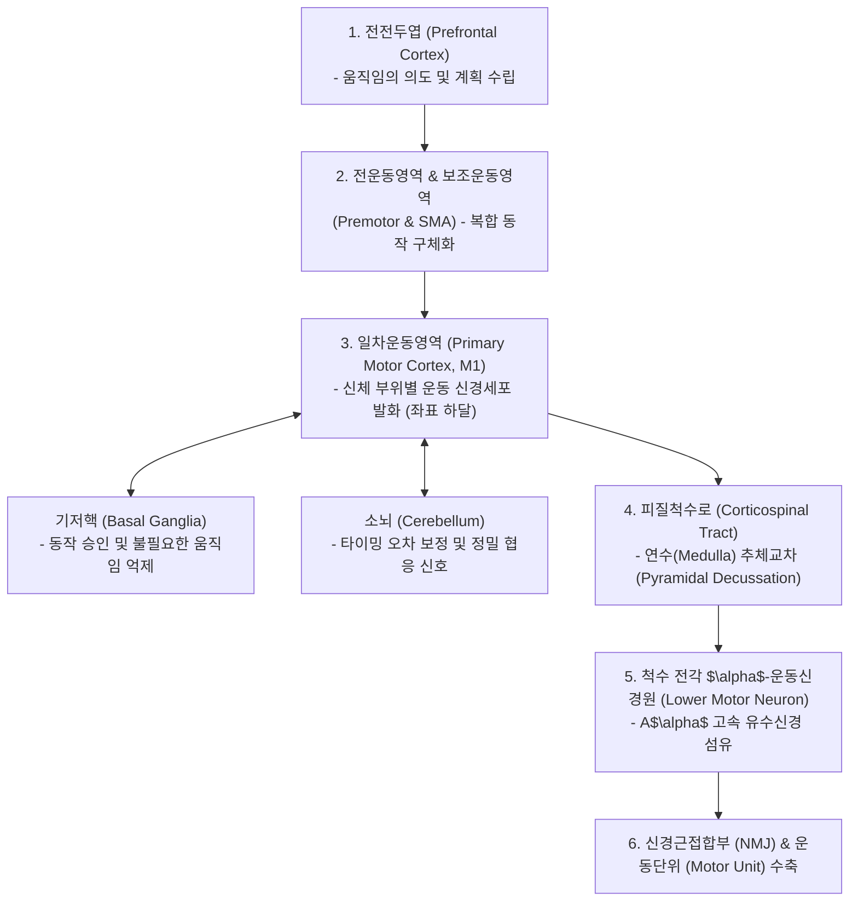
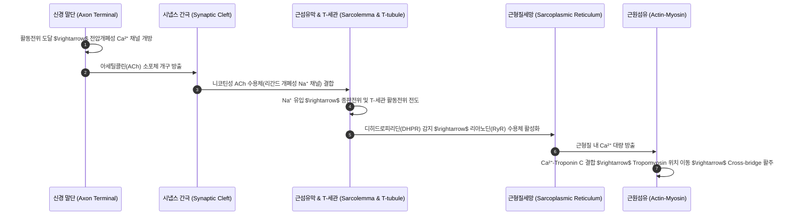
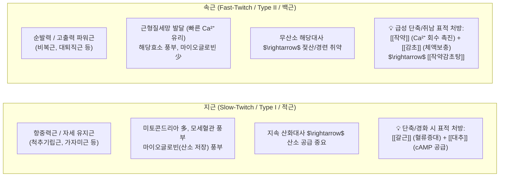

---
aliases:
  - 골격근메커니즘
  - 정윤봉골격근
  - 액틴미오신수축
  - 지근속근약리
---
# 🩺 [[골격근 메커니즘]](Skeletal Muscle Contraction, Sliding Filament & Neuro-Motor Control)

> **핵심 요약 (Key Summary)**:
> 대뇌피질 일차운동영역부터 연수 추체교차, 척수 전각 $\alpha$-운동신경원을 거쳐 신경근접합부(NMJ)에 도달하는 중추-말초 운동 제어 회로를 총괄 분석하는 영역입니다.
> 아세틸콜린 방출과 $Ca^{2+}$-트로포닌 결합, ATP 가수분해 기반 액틴-미오신 활주설(Sliding Filament Theory) 및 **지근(적근, 갈근·대조 표적) vs 속근(백근, 작약·감초 표적) 분자약리 기전**을 규명합니다.
> 근방추·골지건기관(GTO)의 고유수용 감각과 **길항근(Antagonist) 브레이크 제어 원리를 통해 급·만성 근경련, 체형 변위 교정 추나 및 자침 치료의 표적**을 확립합니다.

---

## 1. 중추 신경계의 운동 계획 및 하행 운동 경로 (Motor Pathway)

* **뇌의 운동 제어 분업**:
  * **전전두엽**: "무엇을 할 것인가" 움직임 계획.
  * **전운동영역**: 움직임의 시퀀스 및 공간적 궤적 구체화.
  * **기저핵**: 움직임의 시작과 정지, 불필요한 근긴장 억제.
  * **소뇌**: 감각 피드백을 실시간 비교하여 움직임의 오차 보정.
* **신경 전도 특징**:
  * 운동신경은 **$A\alpha$ 섬유**로 직경이 가장 크고 수초화가 발달하여 신경계 중 가장 빠른 전도 속도(70~120 m/s)를 가짐.

![[골격근 수축-20240920233342066.png|481]]
> [그림 설명: 대뇌피질 운동영역에서 연수 추체교차를 거쳐 척수 전각 $\alpha$-운동신경원으로 이어지는 피질척수로 하행 경로]

---

## 2. 신경근접합부(NMJ) 흥분-수축 결합 (Excitation-Contraction Coupling)

* **액틴과 미오신의 상호작용 (비유)**:
  * **미오신(Myosin)**: 미오신 꼬리와 헤드로 구성 (남성에 비유).
  * **액틴(Actin)**: 구형 액틴이 나선상으로 꼬여 있으며, **트로포마이오신(Tropomyosin, 가림막 끈)**으로 결합 부위가 덮여 있음 (여성에 비유).
  * **트로포닌(Troponin)**: $Ca^{2+}$가 결합하는 조절 단백질 복합체.
  * $Ca^{2+}$가 트로포닌 C에 결합하면 트로포마이오신을 잡아당겨 액틴의 결합 부위를 노출시키고, 자석처럼 미오신 헤드가 액틴에 부착(Cross-bridge Formation)됨.

![[골격근 수축-20240920230856430.png|296]]
> [그림 설명: 근육의 계층 구조 - 근외막 $\rightarrow$ 근속 $\rightarrow$ 근섬유(단일세포) $\rightarrow$ 근원섬유 $\rightarrow$ 액틴/미오신 필라멘트]

![[골격근 수축-20240920231015268.png|479]]
> [그림 설명: 액틴-트로포마이오신-트로포닌 복합체와 미오신 헤드의 상호작용 구조]

![[골격근 수축-20240920234100236.png|326]] ![[골격근 수축-20240920234200310.png|296]]
> [그림 설명: 시냅스 말단 아세틸콜린 방출 및 T-세관 전도 메커니즘]

![[골격근 수축-20240920234445188.png|359]]
> [그림 설명: 전압 개폐성 채널 및 근형질세망(SR)의 칼슘 이온 유리 회로]

![[골격근 수축-20240920234531001.png|395]]
> [그림 설명: 칼슘 결합에 따른 트로포마이오신 변위 및 액틴-미오신 파워 스트로크]

---

## 3. 근수축 에너지원: ATP 공급 4단계 시스템

| 단계 | 에너지원 공급 기전 | 지속 시간 | 생화학적 특징 및 임상 포인트 |
| :---: | :--- | :---: | :--- |
| **1단계** | **근세포 내 잔여 ATP** | 약 1~2초 | 순간적인 수축 개시에 소모 |
| **2단계** | **크레아틴 인산 (Phosphocreatine)** | 약 10초 | $ADP + CP \xrightarrow{CK} ATP + Creatine$ (고강도 운동 시 혈중 크레아티닌 상승 가능) |
| **3단계** | **혐기성 해당과정 (코리 회로)** | 약 1~2분 | 포도당 $\rightarrow$ 피루브산 $\rightarrow$ 젖산(Lactate) 생성. 산증 유발 및 근육 피로 발생 |
| **4단계** | **호기성 산화적 인산화 (TCA 회로)** | 수시간 지속 | 미토콘드리아 내 지방산/포도당 완전 산화 $\rightarrow$ 36~38 ATP 생성 (장시간 항중력 유지) |

---

## 4. 이온 채널의 4대 분류 체계

1. **리간드 개폐형 (Ligand-gated)**: 아세틸콜린 등 화학물질 결합 시 개방 (NMJ의 $Na^+$ 채널).
2. **전압 개폐형 (Voltage-gated)**: 막전위 변화 감지 시 개방 (축삭 $Na^+/K^+$ 채널, 말단 $Ca^{2+}$ 채널).
3. **기계적 개폐형 (Mechanosensitive)**: 신장, 압력, 비틀림 등 물리적 변형에 개방 (근방추, 메르켈 촉각 소체).
4. **오픈형 (Leak/Non-gated)**: 항상 열려 있어 휴지전위(-70mV) 유지에 기여 (칼륨 누출 채널).

![[골격근 수축-20240920233657465.png|479]]
> [그림 설명: 세포막을 통과하는 4대 이온 채널의 개폐 메커니즘]

---

## 5. 지근(적근, Type I) vs 속근(백근, Type II)의 생리·약리 비교

### 📌 지근과 속근의 한방 약리 매핑 총괄표

| 항목 | 지근 (적근, Slow-twitch, Type I) | 속근 (백근, Fast-twitch, Type II) |
| :--- | :--- | :--- |
| **주요 역할** | 중력에 저항하는 자세 유지, 장시간 지구력 | 순간적인 파워, 순발력, 도약 및 던지기 |
| **신경 지배** | 작은 $\alpha$-운동신경원 (피로 저항성) | 큰 $\alpha$-운동신경원 (쉽게 피로) |
| **모세혈관 / 색상** | 매우 풍부함 (붉은색 - 적근) | 상대적으로 적음 (백색 - 백근) |
| **에너지 대사** | 산화적 인산화 (지방산/호기성 포도당 대사) | 혐기성 해당과정 (글리코겐 신속 분해) |
| **병리 양상** | 만성 뻐근함, 항강증, 체형 굳어짐 | 급성 쥐(Muscle Cramp), 근육 파열, 근경련 |
| **한방 표적 약재** | [[갈근]](미세순환 확장), [[대추]](기혈 보충) | [[작약]](근이완, $Ca^{2+}$ 억제), [[감초]] |
| **대표 처방** | [[갈근탕]], [[갈근해기탕]] | [[작약감초탕]] |

![[골격근 수축-20240920235626473.png|395]]
> [그림 설명: 지근(Type I)과 속근(Type II)의 단면 모세혈관 분포 및 대사 경로 비교]

---

## 6. 근육의 이완 메커니즘 & 길항근 브레이크 제어 원리

### 💡 1) 근육의 디지털 상태 (0 or 1)
* **근육은 '수축(ON)'과 '비수축(OFF)' 두 가지 상태값만 가진다.**
* 능동적 '이완(Relaxation)'이란 존재하지 않으며, 이완은 $Ca^{2+}$가 근형질세망으로 능동 재흡수(SERCA 펌프)되고 **길항근(Antagonist)이 수축하여 반대 방향으로 잡아당겨질 때** 달성된다.

### 💡 2) 브레이크를 거는 길항근 타깃팅 원리 (정윤봉 원장님 핵심 임상 철학)
* 근수축의 속도와 강도는 주동근 자체의 힘뿐만 아니라, **길항근이 반대 벡터에서 얼마나 정밀하게 브레이크(Eccentric Braking)를 걸어주느냐**에 의해 결정된다.
* **임상 적용**:
  * 척추/관절의 체형 변위나 관절 가동제한(ROM 제한)이 발생했을 때, 뭉친 주동근만 찌르는 것은 하수다.
  * **반대편에서 가동을 억제하고 브레이크를 걸고 있는 길항근(Antagonist)과 안정근(Stabilizer)을 반드시 찾아내어 자침/추나 치료의 목표로 삼아야 한다.**

### 💡 3) 근방추(Muscle Spindle)와 골지건기관(GTO)의 고유수용 감각 재설정
* 근육은 시각 정보가 없으므로 **근방추(길이 및 신장 속도 감지 $\rightarrow$ 신장반사)**와 **골지건기관(GTO, 장력 감지 $\rightarrow$ 역신장반사/자가억제)**을 통해 신체 위치를 뇌로 전달한다.
* 잘못된 자세나 과도한 부하를 장시간 유지하면, 근방추의 민감도 기준점(Set-point)이 단축된 상태를 정상값으로 오인식하게 된다.
* **치료 원리**: PIR(수축 후 이완기법) 추나 및 심부 자침을 통해 근방추와 GTO의 고유수용 감각 기준점을 리셋(Reset)해야 재발 없는 완치가 가능하다.

---

## 🔗 관련 백링크 및 참고 문서
* **독립 임상 꿀팁**: [[ 지근(적근)·속근(백근) 생리 대사 감별 & 갈근(葛根)·작약감초탕(芍藥甘草湯) 표적 배오 공식]]
* **임상 강의록 MOC**: [[00_강의록_MOC]]
* **근육학 임상 지도**: [[00_Simbio_근육학_임상_지도]]
* **연관 처방**: [[작약감초탕]], [[갈근탕]]
* **연관 본초**: [[작약]], [[감초]], [[갈근]], [[대추]]