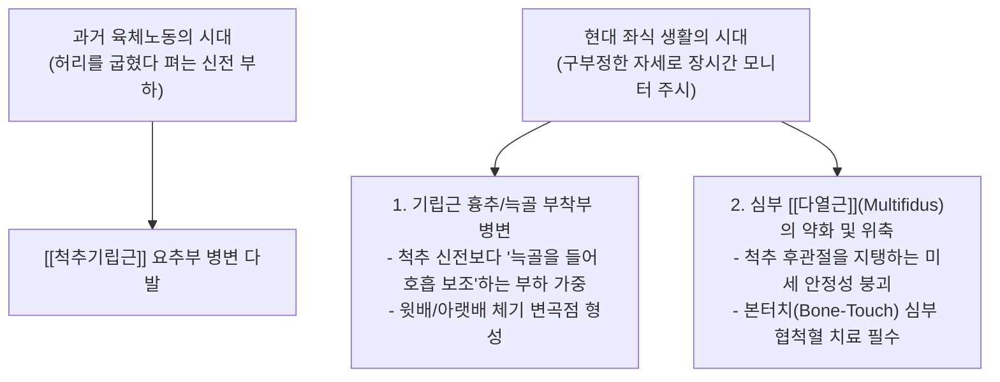
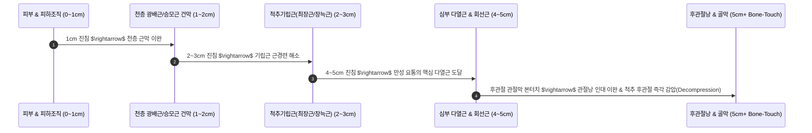

---
aliases:
  - 근골격계강의
  - 정윤봉근골격계
  - 협척혈심도별자침
  - 후관절본터치
  - 오십견관절와순
---
# 🩺 [[근골격계 강의]](Musculoskeletal Biomechanics, Jiaji Point Depth & Shoulder Joint Care)

> **핵심 요약 (Key Summary)**:
> 현대 좌식 생활자의 흉요추 생체역학과 **협척혈(華佗夾脊) 4단계 심도별(광배근 $\rightarrow$ 기립근 $\rightarrow$ 다열근 $\rightarrow$ 후관절 본터치) 침술 기전**을 총괄 분석하는 영역입니다.
> 억지로 허리를 펴는 것이 아닌 "어깨를 내리고 목을 가볍게 뽑아 올리는" 자세 역학과, **오훼돌기(3대 부착근) 및 상완이두근 장두-관절와순 복합체 손상 관리**를 규명합니다.
> 만성 척추 후관절증후군, 디스크 협척혈 감압침, 오십견(유착성 관절낭염) 단계별 릴리즈 및 건 파열 급성기 티칭의 임상 표적을 확립합니다.

---

## 1. 진료실 환자 팔로업(Follow-up) 4대 핵심 문진 원칙

* **일주일 단위 내원 시 필수 체크리스트**:
  1. **복약 순응도**: "처방해 드린 한약을 하루 몇 번, 식전/식후에 제때 잘 챙겨 드셨습니까?"
  2. **식단 및 수면 패턴**: "소화에 부담 주는 야식이나 찬 음식을 피하고, 밤 12시 전에 숙면을 취하셨습니까?"
  3. **금기 자세 준수 여부**: "알려드린 금기 동작(목 꺾기, 다리 꼬기, 무거운 것 들기)을 철저히 피하셨습니까?"
  4. **통증 호전도(VAS) 대면 평가**: 증상의 변화를 환자가 스스로 체감하도록 구체적으로 질문.

---

## 2. 현대 좌식 생활자의 척추 생체역학: 기립근과 다열근의 역할 분담

* **올바른 척추 자세의 진정한 정의**:
  * ❌ 단순히 허리를 과도하게 꺾어 젖히는(Over-lordosis) 자세는 척추 후관절 압박을 심화시킴.
  * ⭕ **어깨를 아래로 편안하게 내리고(견갑골 하강), 목을 위로 가볍게 쑥 뽑아 올린(경추 견인) 중립 정렬 자세**가 이상적임.

---

## 3. 협척혈(華佗夾脊) 심도별 4단계 층위 구조 & 후관절 본터치 침술

![[Pasted image 20241118174314-1.jpg]]
> [그림 설명: 협척혈 자침 시 피부부터 후관절 관절돌기까지의 해부학적 단면 및 침 첨단 도달 층위]

### 💡 후관절(Facet Joint) 본터치 침술의 핵심 기전
* **인대와 관절막의 수동적 잠금 해제**:
  * 후관절을 꽉 붙잡고 있던 관절낭 인대(Capsular ligament)에 침 첨단을 정확히 접촉(Bone-touch)시키는 것만으로도, 인대의 신장 수용체가 자극되어 **굳어있던 관절 간격이 열리고 척수신경 후지의 압박이 즉시 풀리는 극적인 감압 효과**를 발휘함.

---

## 4. 견관절 복합체: 오훼돌기, 관절와순 및 오십견 치료법

### 💡 1) 상지의 닻: 오훼돌기(Coracoid Process) 3대 부착근
* 오훼돌기는 상지 전체의 장력을 지탱하는 핵심 랜드마크임.
* 부착 근육 3총사: [[소흉근]], [[오훼완근]], [[상완이두근]] 단두(Short head).
* 오훼돌기 주변 압통 해소 시 둥근어깨(Round Shoulder)와 흉곽출구 압박이 즉각 개선됨.

### 💡 2) 관절와순(Labrum)과 상완이두근 장두(LHBT)
* 관절와순 상단에 [[상완이두근]] 장두건이 부착되어 주행하므로, 야구 투구/배드민턴 스매싱 등 오버헤드 동작 시 **슬랩(SLAP) 병변과 이두건염이 동반 발생**함.

### 💡 3) 유착성 관절낭염(오십견)의 단계별 릴리즈 테크닉
* **진료실 시술법**:
  1. 환자의 팔을 통증이 없는 한도까지 외전/외회전으로 벌려 고정.
  2. 유착이 걸려 있는 관절낭 전하방 및 [[견갑하근]]/[[극상근]] 부위에 침/약침 시술.
  3. 유착이 풀리면 관절을 조금 더 열어 벌리고, 다시 걸리는 부위를 찾아 이완시키는 **점진적 릴리즈(Step-by-step Release) 반복**.

### 💡 4) 건 파열(Tendon Tear) 급성기 티칭 금기
* 회전근개 건이 파열된 급성기에는 섬유화 정렬이 완료되지 않았으므로 **과도한 스트레칭이나 쭉쭉이 운동은 절대 금기**임.
* 초기에는 **염증 완화(소염약침, 냉찜질, 부항 사혈)**와 통증 없는 범위 내의 경미한 등척성 운동만 허용.

---

## 🔗 관련 백링크 및 참고 문서
* **독립 임상 꿀팁**: [[ 협척혈(華佗夾脊) 심도별 4단계 층위 자침술 & 다열근·후관절 본터치(Bone-Touch) 관절 감압 테크닉]]
* **임상 강의록 MOC**: [[00_강의록_MOC]]
* **근육학 임상 지도**: [[00_Simbio_근육학_임상_지도]]
* **연관 근육**: [[척추기립근]], [[소흉근]], [[견갑하근]], [[극상근]], [[상완이두근]]