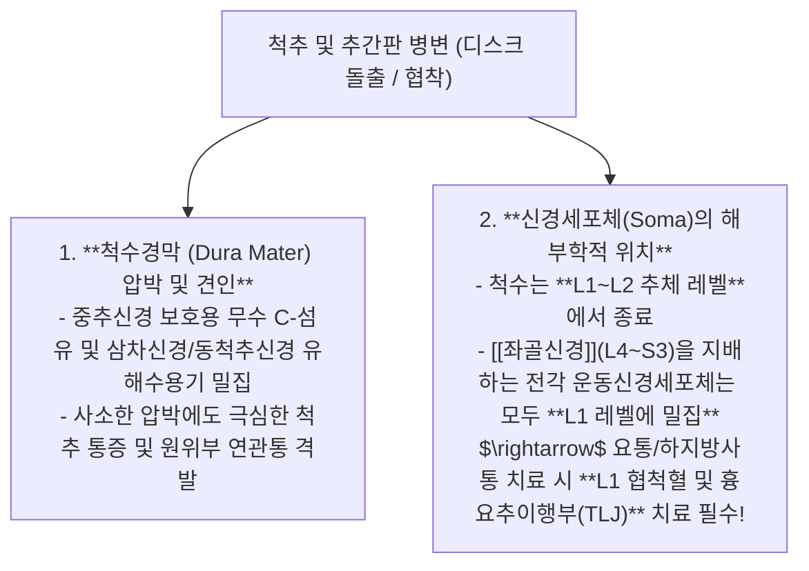
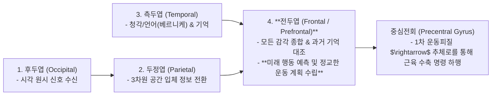

---
aliases:
  - 뇌과학강의
  - 정윤봉뇌과학
  - 척수원추L1신경원
  - 경막견인통증
  - 대뇌기저핵소뇌
---
# 🩺 [[뇌과학]](Neuroanatomy, Cerebral Cortex Integration & Conus Medullaris Dynamics)

> **핵심 요약 (Key Summary)**:
> 척수원추(Conus Medullaris, L1~L2) 내 하지 운동신경원 세포체 집결과 **척수 경막(Dura mater) 유해수용성 긴장(Dural Tension)에 의한 방사통 기전**을 총괄 분석하는 영역입니다.
> 후두엽(시각)·두정엽(공간)·측두엽(청각) $\rightarrow$ 전두엽(운동계획)으로 이어지는 **대뇌피질 감각통합망 및 기저핵(선조체/창백핵)·소뇌의 운동 제어 회로**를 규명합니다.
> 흉요추이행부(TLJ) 증후군, 좌골신경통, 파킨슨/진전 마비, 두개천골계 경막 이완 및 뇌신경계 질환의 임상 표적을 확립합니다.

---

## 1. 척수원추(Conus Medullaris)와 척수경막(Dura Mater)의 신경생리

![[Pasted image 20250508194432.jpg|700x841]]
> [그림 설명: 대뇌피질 엽별 기능 분화와 소뇌-뇌간-척수로 이어지는 신경 경로]

---

## 2. 대뇌피질 4대 엽의 감각 통합 및 전두엽 운동 계획망

![[Pasted image 20250508200446.jpg]]
> [그림 설명: 뇌실(Ventricle)과 기저핵(선조체, 미상핵, 조가비핵, 창백핵, 편도체)의 3차원 심부 해부 구조]

---

## 3. 기저핵(Basal Ganglia)과 소뇌(Cerebellum)의 이중 운동 조절

| 뇌 신경 구조 | 주요 구성 요소 | 핵심 기능 및 조절 역할 | 병변 시 임상 질환 |
| :---: | :--- | :--- | :--- |
| **기저핵 (Basal Ganglia)** | 선조체(미상핵 + 피각), 창백핵, 흑질, 시상하핵 | **운동의 개시와 억제**, 무의식적 자동화 동작(보행, 자전거), 습관 형성 | **파킨슨병(서동/진전)**, 무도병, 틱 장애 |
| **소뇌 (Cerebellum)** | 소뇌반구, 충부(Vermis), 심부소뇌핵 | 뇌교(Pons)를 통한 실시간 대뇌-고유감각 피드백, **운동 오차 정밀 보정** | **소뇌실조증(보행 비틀거림, 협조운동 불능)**, 어지럼증 |
| **편도체 (Amygdala)** | 기저외측핵, 중심핵 | 후각 및 변연계 직결, **공포·불안·분노 본능 정서 처리** | 공황장애, PTSD, 극심한 만성 통증 과민화 |

---

## 4. 진료실 실전 신경계 침구 및 추나 치료 포인트

1. **흉요추이행부(TLJ / L1) 감압의 중요성**:
   * 하지 방사통과 골반 통증 환자 치료 시 L4-L5 환부뿐만 아니라, **신경세포체가 모여있는 L1~L2 협척혈 및 요신경총 기시부 자침**이 필수적임.
2. **두개천골계 경막 릴리즈 (Dural Release)**:
   * 후두골-경추 1번(C1, C2) 후두하삼각과 천골(Sacrum) 기저부를 이완하여 **두개천골 경막의 긴장도를 낮추면 전신 만성 근막통증 및 자율신경실조증이 즉각 완화**.

---

## 🔗 관련 백링크 및 참고 문서
* **독립 임상 꿀팁**: [[ 척수원추(L1 레벨) 신경세포체와 척수경막(Dura) 견인성 통증 기전 & 대뇌-기저핵-소뇌 운동 제어망]]
* **임상 강의록 MOC**: [[00_강의록_MOC]]
* **연계 강의록**: [[말초신경]], [[근골격계 강의]], [[골격근 메커니즘]]