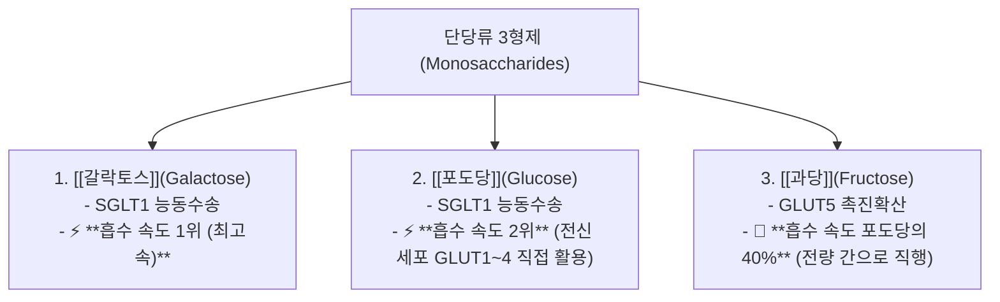
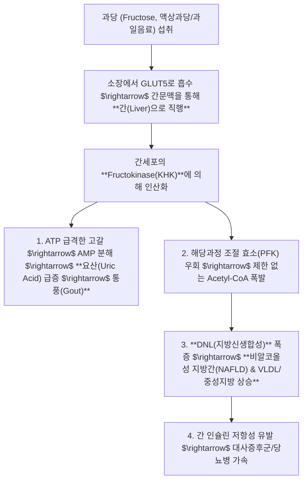

---
aliases:
  - 당류메커니즘
  - 정윤봉당류
  - 과당간대사지방간
  - 교이소건중탕약리
  - 단당류이당류대사
---
# 🩺 [[당류]](Carbohydrate Digestion, Monosaccharide Kinetics & Herbal Sugar Pharmacology)

> **핵심 요약 (Key Summary)**:
> 단당류 3형제(갈락토스 $\rightarrow$ 포도당 $\rightarrow$ 과당)의 장관 흡수 속도 순위 및 **과당(Fructose)의 간 독점 대사(지방간·요산 합성)와 이당류 한약재의 약리**를 총괄 분석하는 영역입니다.
> SGLT1/GLUT5 흡수 기전, 과당 대사의 Fructokinase 인산화 폭주, **맥아당(Maltose) 제제인 [[교이]](膠飴)의 비위 보허·완급지통(緩急止痛) 및 [[소건중탕]](小建中湯)**을 규명합니다.
> 비알코올성 지방간(NAFLD), 통풍(과당성 요산 급증), 소아 허약 복통(소건중탕) 및 태음인 과당 대사(열다한소탕)의 임상 표적을 확립합니다.

---

## 1. 단당류 3형제의 장관 흡수 속도 및 수송체 비교

---

## 2. 과당(Fructose)의 간 대사 위험성: 왜 과당이 더 위험한가?

---

## 3. 한의학의 2대 천연 당류 약재: [[교이]](膠飴)와 [[봉밀]](蜂蜜)

### 💡 1) [[교이]](膠飴, Maltose / 맥아당)
* **기원 및 구조**: 엿기름(맥아)으로 쌀/곡류의 전분을 당화시킨 **이당류(포도당 + 포도당)**.
* **약리 및 효능**:
  * 비위가 허약하고 냉하여 발생하는 복통을 즉각적으로 완화 (**온중보허, 완급지통**).
  * 소장에서 완만하게 포도당으로 분해되어 혈당을 급격히 튀지 않게 하면서 지속적인 글리코겐 공급.
  * **대표 처방: [[소건중탕]](小建中湯), [[대건중탕]](大建中湯)** (소아 야제증, 성장통, 만성 복통의 성약).

### 💡 2) [[봉밀]](蜂蜜, Honey / 벌꿀)
* **구조**: 전화당(과당 약 40% + 포도당 약 35% + 수크로스).
* **약리 및 효능**:
  * **보중윤조(補中潤燥), 윤폐지해(潤肺止咳), 윤장통변(潤腸通便)**.
  * 건조한 마른기침 및 노인/허약자의 변비 치료.

---

## 4. 사상의학적 당류 및 과일 섭취 원칙

| 사상체질 | 당류 및 과일 대사 특성 | 추천 과일 / 처방 | 주의점 |
| :---: | :--- | :--- | :--- |
| **태음인** | 간의 당 저장능력과 대사 용량이 큼. 남방계 열대과일(바나나, 수박 등)과 비교적 친화 | **배, 매실, 오미자** / [[열다한소탕]] | 액상과당 과다 섭취 시 지방간 및 복부비만 직결 |
| **소양인** | 위열(胃熱)이 많아 찬 성질의 당류 적합 | **수박, 참외, 참깨, 딸기** / [[양격산화탕]] | 꿀, 교이 등 따뜻한 당류 과다 시 상열감 유발 |
| 소음인 | 비위가 냉하여 찬 과일 섭취 시 설사 유발 | 사과, 귤, 복숭아, [[교이]], [[봉밀]] / [[소건중탕]] | 차가운 열대과일 및 찬 음료 절대 금기 |

---

## 🔗 관련 백링크 및 참고 문서
* **독립 임상 꿀팁**: [[ 단당류 3형제(갈락토스·포도당·과당) 흡수 대사와 과당의 지방간·요산 병리 & 교이(膠飴)·소건중탕 완급지통 약리]]
* **임상 강의록 MOC**: [[00_강의록_MOC]]
* **연계 강의록**: [[혈당]], [[소화흡수 시나리오]]
* **연관 처방**: [[소건중탕]], [[대건중탕]], [[열다한소탕]]
* **연관 본초**: [[교이]], [[맥아]], [[갈근]]