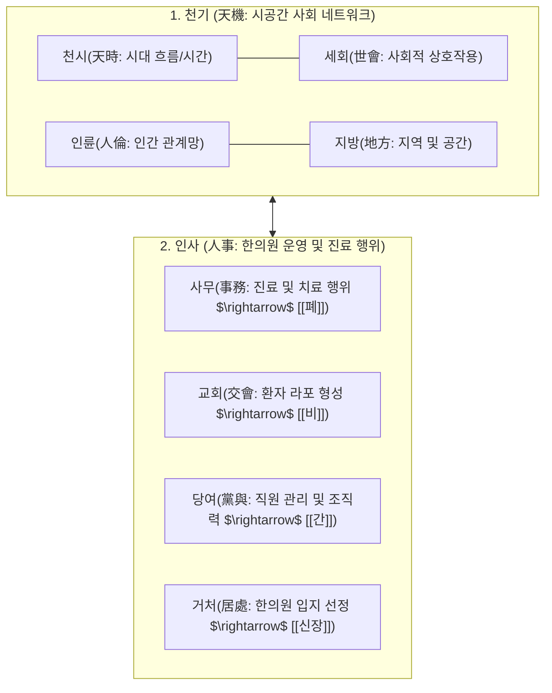
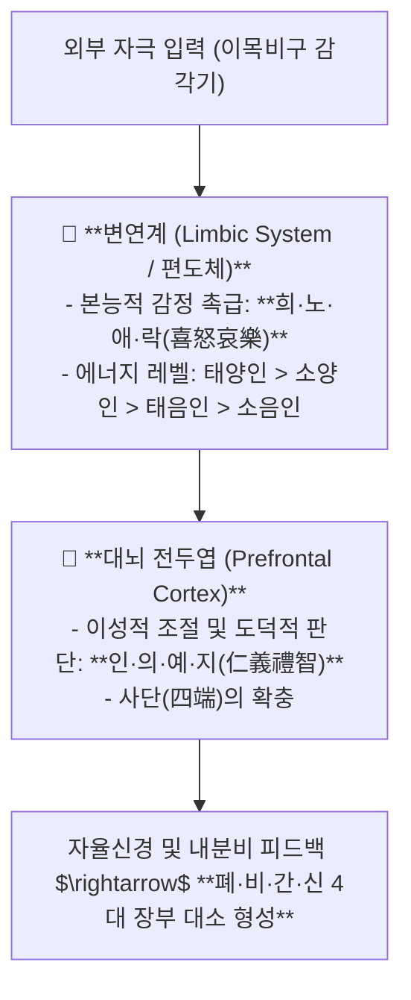
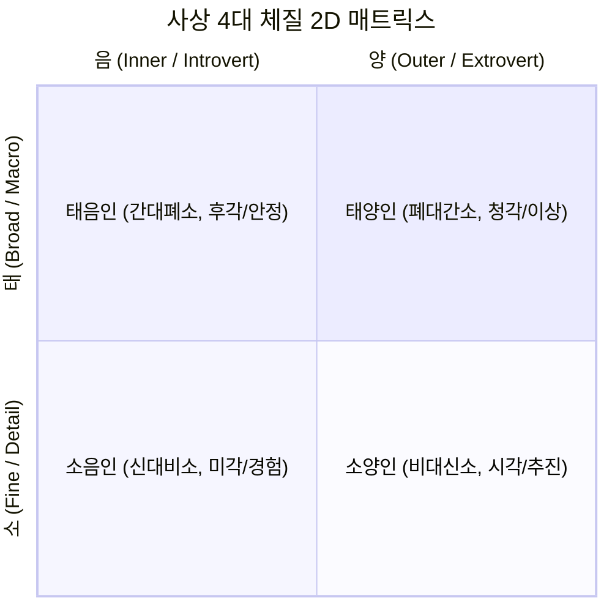

---
aliases:
  - 동의수세보원강의
  - 정윤봉사상의학
  - 성명론사단론
  - 희노애락뇌과학
  - 4사분면체질감별
---
# 🩺 [[동의수세보원]](Sasang Constitutional Medicine, Socio-neurobiology & Four-Quadrant Typology)

> **핵심 요약 (Key Summary)**:
> 이제마의 성명론(性命論: 천기·인사·함억제복·두견요둔)과 **사단론(四端論)을 변연계 본능 감정(희노애락) 및 전두엽 이성 판단(인의예지)으로 재해석**하는 영역입니다.
> 호흡·기액 순환(폐대간소/간대폐소) 및 수곡 흡수·배설(비대신소/신대비소)의 장부 대소와 **4사분면 좌표계 기반 체질 감별 및 대각선 교차 처방 금기 원칙**을 규명합니다.
> 태양인(미후등식장탕), 소양인(양격산화탕/형방지황탕), 태음인(열다한소탕/청심연자탕), 소음인(십이미관중탕/보중익기탕)의 진료실 환자 심리 파악 및 표적 처방을 확립합니다.

---

## 1. 성명론(性命論)의 현대적 사회·진료실 시스템 매핑

### 💡 함억제복(성) vs 두견요둔(명)의 신체 인체역학
* **함억제복(頷臆臍腹 / 마음의 생각과 태도)**:
  * **턱(頷 - 주책)**: 저작·발성·호흡과 연결된 순간적 기지와 꾀.
  * **복장뼈(臆 - 경륜)**: 흉추를 펴고 어깨 힘을 뺀 당당함과 자신감.
  * **배꼽(臍 - 행검)**: 코어를 잡고 차렷 자세를 유지하는 엄격한 절제력.
  * **배(腹 - 도량)**: 가슴과 복부를 내어주며 품어주는 너그러움.
* **두견요둔(頭肩腰臀 / 삶의 축적된 역량과 명)**:
  * **머리(頭 - 식견)**: 오랜 세월 축적된 학문과 지혜.
  * **어깨(肩 - 위의)**: 억지 과시가 아닌 저절로 우러나오는 위엄.
  * **허리(腰 - 재간)**: 오랜 훈련으로 체화된 손재주와 능력.
  * **엉덩이(臀 - 방략)**: 일을 안정적으로 꾀하고 밀고 나가는 추진력.

---

## 2. 사단론(四端論)과 뇌신경과학(변연계-전두엽) 매핑

![[동의수세보원-20241101114821305.jpg]]
> [그림 설명: 음양과 태소의 2D 4사분면 좌표계 및 장부 대소 매핑 구조]

![[동의수세보원-20241101122857105.jpg]]
> [그림 설명: 희노애락 감정의 급성 촉급 상태와 장부 기운의 승강 출입]

![[동의수세보원-20241101122017763.jpg]]
> [그림 설명: 뇌신경계 변연계(감정)와 전두엽(사단 판단)의 상호작용 회로]

![[동의수세보원-20241101122424994.jpg]]
> [그림 설명: 4대 체질별 기본 정서 성향 및 에너지-쾌적함 축 매트릭스]

---

## 3. 사상 4대 체질별 인지·행동 패턴 및 확충론(擴充論)

![[동의수세보원-20241105155927306.jpg]]
> [그림 설명: 확충론에 따른 체질별 지혜와 덕목의 확충 경로]

| 사상체질 | 장부 대소 및 생리 | 핵심 인지·정서 특성 | 진료실 라포 & 대표 처방 |
| :---: | :--- | :--- | :--- |
| **태양인 (太陽人)** | **폐대간소 (肺大肝小)** 호산지기(呼散) 과다, 흡취(吸聚) 부족 | 세상을 '귀(耳)'로 들음. 외부 부조리에 슬퍼하고 무시에 분노. 독창적 개혁가, 안하무인 | **존중과 이상 공감** $\rightarrow$ [[미후등식장탕]], [[오가피장척탕]] |
| **소양인 (少陽人)** | **비대신소 (脾大腎小)** 수곡 흡수 과다, 배설·정액 부족 | 세상을 '눈(目)'으로 봄. 불의에 분노하고 배신에 슬퍼함. 다재다능, 행동파, 뒤끝 없음 | **신속한 일처리 & 칭찬** $\rightarrow$ [[양격산화탕]], [[형방지황탕]] |
| **태음인 (太陰人)** | **간대폐소 (肝大肺小)** 흡취(吸聚) 과다, 호산지기(呼散) 부족 | 세상을 '코(鼻)'로 파악. 조직 안정에 기뻐하고 여유로움. 보수적, 뚝심, 우직함 | **신뢰 형성 & 안정적 환경 제시** $\rightarrow$ [[열다한소탕]], [[청심연자탕]] |
| **소음인 (少陰人)** | **신대비소 (腎大脾小)** 배설 양호, 수곡 소화흡수 부족 | 세상을 '입(口)'으로 경험. 안전한 무리에서 즐겁고 사소한 도움에 기쁨. 장인 정신, 내향적 | **세심한 공감 & 불안 해소** $\rightarrow$ [[십이미관중탕]], [[보중익기탕]] |

---

## 4. 4사분면 체질 처방의 절대 금기 원칙

* **인접 체질 간의 약재 배오 허용**:
  * 소양인 환자에게 상황에 따라 태음인 약재(예: [[갈근]], [[황금]])를 가미하여 열을 내리는 것은 가능함.
* **대각선 정반대 체질의 교차 투여 절대 금기 (CRITICAL)**:
  * **소양인 $\leftrightarrow$ 소음인**: 소양인에게 소음인 온보제([[부자]], [[인삼]], [[육계]]) 투여 시 상화폭발/뇌출혈 위험.
  * **태양인 $\leftrightarrow$ 태음인**: 태양인에게 태음인 수렴제 투여 시 급격한 기체증 유발.

---

## 🔗 관련 백링크 및 참고 문서
* **독립 임상 꿀팁**: [[ 이제마 성명론·사단론의 뇌과학(변연계-전두엽) 매핑 & 4사분면 체질 감별과 대각선 처방 금기 공식]]
* **임상 강의록 MOC**: [[00_강의록_MOC]]
* **연계 강의록**: [[팔체질]], [[뇌의 기능]], [[감정]]
* **연관 처방**: [[양격산화탕]], [[열다한소탕]], [[형방지황탕]], [[보중익기탕]]
