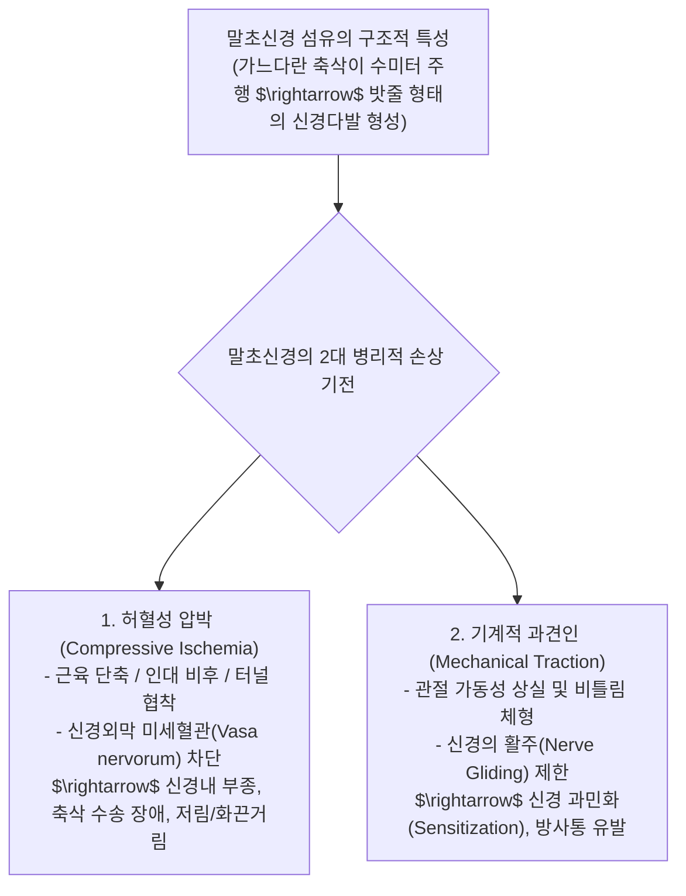
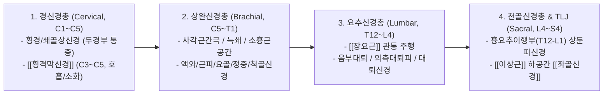

---
aliases:
  - 말초신경
  - 정윤봉말초신경
  - 4대신경총
  - 횡격막신경과소화
  - TLJ증후군
---
# 🩺 [[말초신경]](Peripheral Nervous System, 4 Great Plexuses & Entrapment Neuropathies)

> **핵심 요약 (Key Summary)**:
> 직경은 1~20$\mu$m에 불과하나 길이가 1m에 달하는 말초신경 축삭의 해부학적 취약성과 **미세혈관 압박에 의한 허혈(Ischemia) 및 과도한 기계적 견인 손상**을 총괄 분석하는 영역입니다.
> 경신경총(C1~C5, **횡격막신경의 소화·호흡 연쇄**), 상완신경총(C5~T1, 흉곽출구 3대 포착), 요추신경총(**장요근 단축성 음부대퇴·외측대퇴피신경 포착**) 및 천골신경총/TLJ 증후군을 규명합니다.
> 디스크와 감별해야 할 상둔피신경 포착, 이상근 좌골신경 압박, 사각근간극 침구 치료 및 4대 신경총 약침 주입점의 임상 표적을 확립합니다.

---

## 1. 말초신경의 해부학적 특성 및 2대 손상 기전 (Ischemia vs Traction)

![[말초신경-20240915221858182.png]]
> [그림 설명: 말초신경의 신경내막, 신경주막, 신경외막 구조 및 혈관 주행망]

---

## 2. 4대 주요 신경총(Nerve Plexuses) 임상 총괄 매트릭스

---

## 3. 경신경총 (Cervical Plexus, C1~C5) & [[횡격막신경]]의 소화 연쇄

* **피부 감각가지**:
  * [[대후두신경]], [[소후두신경]], [[대이개신경]], [[횡경신경]], [[쇄골상신경]] $\rightarrow$ 경추성 두통, 후두통, 턱관절 주변 감각 이상.
* **운동가지 & 핵심 임상 포인트: [[횡격막신경]](Phrenic Nerve, C3~C5)**:
  * 경추 C3, C4, C5 신경근에서 기원하여 [[전사각근]] 전면을 타고 흉강으로 하행, 횡격막을 지배함.
  * **경추-소화기 연쇄 메커니즘 (정윤봉 원장님 핵심 팁)**:
    * 일자목, 거북목, [[사각근]] 긴장 환자는 C3~C5 레벨에서 [[횡격막신경]]이 포착/압박됨.
    * 횡격막의 상하 운동 폭이 제한되어 **얕은 흉식호흡**이 유발되고, 식도열공(Esophageal hiatus)을 통과하는 미주신경 및 하부식도괄약근 압력이 교란되어 **만성 체기, 기능성 소화불량, 역류성 식도염**이 발생함.
    * 💡 소화불량 환자 치료 시 복부만 보지 않고 **경추 3~5번 및 [[사각근]] 침구 치료**를 병행해야 하는 이유!

---

## 4. 상완신경총 (Brachial Plexus, C5~T1) & 흉곽출구 3대 포착점

* **신경근 기원**: C5, C6, C7, C8, T1 전지(Ventral rami).
* **3대 흉곽출구 증후군(TOS) 포착 부위**:
  1. **사각근 삼각공간(Interscalene Triangle)**: [[전사각근]]과 [[중사각근]] 사이 $\rightarrow$ C5~T1 신경간(Trunks) 포착.
  2. **늑쇄공간(Costoclavicular Space)**: 쇄골과 제1늑골 사이 $\rightarrow$ 신경속(Cords) 포착.
  3. **소흉근하공간(Subpectoral Space)**: [[소흉근]]과 오훼돌기 하방 $\rightarrow$ 말초 분지 포착.
* **5대 주요 종말 분지**:
  * [[액와신경]](C5-C6): 사각공간(Quadrangular space) 통과 $\rightarrow$ [[삼각근]], [[소원근]] 지배.
  * [[근피신경]](C5-C7): [[오훼완근]] 관통 $\rightarrow$ [[상완이두근]], [[상완근]] 지배.
  * [[요골신경]](C5-T1): 요골신경구/회내근 관통 $\rightarrow$ 상완삼두근, 수근신근(하수수, 손목처짐).
  * [[정중신경]](C6-T1): 원회내근/수근관(Carpal tunnel) 통과 $\rightarrow$ 수근굴근, 무지구근(수근관증후군).
  * [[척골신경]](C8-T1): 주관절 주관(Cubital tunnel)/기용관 통과 $\rightarrow$ 4·5지 저림(갈퀴손).

![[말초신경-20240918004557669.png|393]]
> [그림 설명: 상완신경총의 신경근 $\rightarrow$ 신경간 $\rightarrow$ 신경분지 $\rightarrow$ 신경속 $\rightarrow$ 종말분지 주행도]

---

## 5. 요추신경총 (Lumbar Plexus, T12~L4) & [[장요근]] 단축 증후군

* **요추신경총 주요 분지**:
  * [[장골하복신경]](T12-L1): 하복부 및 둔부 외측 감각.
  * [[장골서혜신경]](L1): 서혜인대 관통 $\rightarrow$ 서혜부 및 음낭/대음순 감각.
  * [[음부대퇴신경]](Genitofemoral, L1-L2)**: [[장요근]] 실질을 수직으로 뚫고 나옴** $\rightarrow$ 음낭/음순 및 대퇴 삼각부 감각.
  * [[외측대퇴피신경]](LFCN, L2-L3): 서혜인대 외측하방 통과 $\rightarrow$ 이상감각성 대퇴신경통(Meralgia Paresthetica, 허벅지 외측 화끈거림).
  * [[대퇴신경]](Femoral, L2-L4): [[대퇴사두근]], [[봉공근]] 지배 (슬개건반사).
  * [[폐쇄신경]](Obturator, L2-L4): 대퇴 내전근군 지배.
* **현대인의 좌식 생활과 [[장요근]] 병리**:
  * 장시간 좌식 생활로 [[장요근]](대요근)이 단축·비후되면, 근육 실질을 뚫고 나오는 [[음부대퇴신경]]과 외측을 지나는 [[외측대퇴피신경]]이 압박받음.
  * 서혜부 통증, 고환통, 허벅지 앞/외측의 찌릿한 저림 발생 $\rightarrow$ 요추 디스크로 오진하기 쉬우므로 [[장요근]] 촉진 및 자침/스트레칭 필수.

![[말초신경-20240918101059063.png|395]]
> [그림 설명: 요추신경총 분지들이 장요근 실질 및 서혜부로 주행하는 경로]

---

## 6. 흉요추 이행부(TLJ) 증후군 & 천골신경총 (Sacral Plexus)

### 💡 1) 흉요추 이행부 증후군 (Thoracolumbar Junction / Maigne's Syndrome)
* **해부학적 기전**:
  * T12-L1 부위의 회전 스트레스로부터 기원하는 [[상둔피신경]](Superior Cluneal Nerve, T12-L3 후지)이 장골능(Iliac crest)을 넘어가며 섬유성 터널에서 포착됨.
* **임상 증상**:
  * 요통, 둔부 통증, 서혜부 통증(L1 전지 연관)이 동반되며, **장골능 외측 7~8cm 지점에 극심한 압통점** 형성.
  * 환자는 엉덩이와 다리가 저리다고 호소하여 요추 4-5번 디스크로 오인되나, **실제 원인은 T12-L1 척추 분절 변위 및 상둔피신경 포착**임.

![[말초신경-20240918102301660.png]]
> [그림 설명: 흉요추 이행부(TLJ)에서 장골능을 넘어 둔부로 주행하는 상둔피신경 포착 기전]

### 💡 2) 천골신경총 (Sacral Plexus, L4~S4) & [[좌골신경]]
* **주요 분지**:
  * [[좌골신경]](Sciatic, L4~S3)**: 대좌골공을 지나 [[이상근]] 하공간**을 통과 $\rightarrow$ 경골신경 + 총비골신경으로 분지.
  * [[상둔신경]](L4-S1): [[중둔근]], [[소둔근]], [[대퇴근막장근]] 지배 (트렌델렌버그 징후).
  * [[하둔신경]](L5-S2): [[대둔근]] 지배.
  * [[음부신경]](Pudendal, S2-S4): 골반저 근육 및 회음부 감각.

---

## 🔗 관련 백링크 및 참고 문서
* **독립 임상 꿀팁**: [[ 4대 신경총(경·상완·요·천골) 포착점 & 장요근·TLJ 증후군과 횡격막신경(C3~C5) 소화불량 감별]]
* **임상 강의록 MOC**: [[00_강의록_MOC]]
* **근육학 임상 지도**: [[00_Simbio_근육학_임상_지도]]
* **연관 근육**: [[장요근]], [[사각근]], [[이상근]], [[소흉근]]