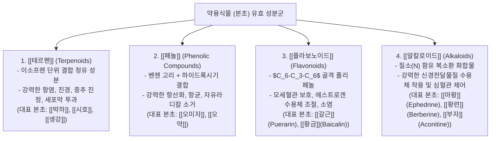
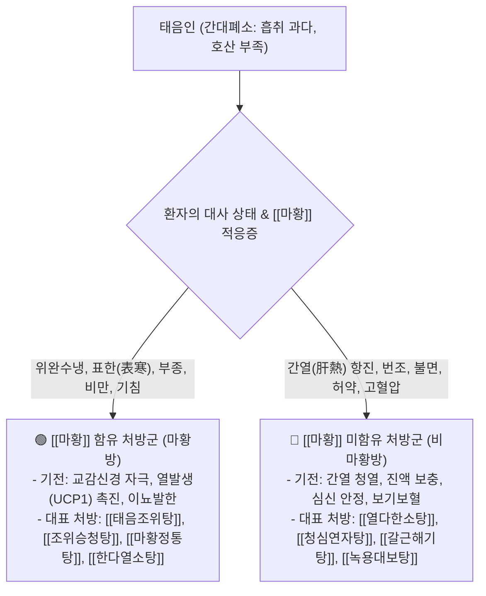

---
aliases:
  - 본초강의
  - 정윤봉본초
  - 이차대사산물분류
  - 사상체질본초매핑
  - 태음인마황공식
---
# 🩺 [[본초 강의]](Secondary Metabolite Phytochemistry, Constitutional Herbal Mapping & Ephedra Matrix)

> **핵심 요약 (Key Summary)**:
> 식물 4대 2차 대사산물([[테르펜]]·[[페놀]]·[[플라보노이드]]·[[알칼로이드]])의 약리 화학 분류와 **사상 4대 체질별 표적 본초 매핑**을 총괄 분석하는 영역입니다.
> 교감신경 흥분 및 대사 촉진성 [[마황]](Ephedrine)의 유무에 따른 태음인 한약 2대 분류 체계(마황방 vs 비마황방)와 소양인 청열사화 본초 및 소음인 온중보기 본초를 규명합니다.
> 비만 다이어트(태음조위탕), 태음인 간열 대사증후군(열다한소탕/청심연자탕), 소양인 상열 번갈(양격산화탕) 및 소음인 비한증(보중익기탕)의 임상 표적을 확립합니다.

---

## 1. 식물 4대 2차 대사산물(Secondary Metabolites) 화학 분류

---

## 2. 태음인(太陰人) 본초 & [[마황]](麻黃) 유무 2대 처방 공식

* **태음인 다용 핵심 본초군**:
  * **호산지기(呼散) 발산**: [[마황]], [[갈근]], [[길경]], [[행인]], [[백지]], [[고본]], [[석창포]]
  * **간열 청열 & 진액 보충**: [[황금]], [[의이인]], [[맥문동]], [[천문동]], [[산약]], [[용안육]], [[연자육]], [[녹용]], [[대황]]

---

## 3. 소양인 & 소음인 핵심 본초 매트릭스

| 사상체질 | 장부 생리 및 치법 | 핵심 대표 본초군 | 주요 임상 처방 |
| :---: | :--- | :--- | :--- |
| **소양인 (少陽人)** | **비대신소(脾大腎小)** 위열(胃熱)을 내리고 신수(腎水)를 보함 | [[석고]], [[지모]], [[형개]], [[방풍]], [[생지황]], [[숙지황]], [[복령]], [[택사]], [[황련]], [[황백]], [[시호]], [[치자]], [[목단피]], [[구기자]] | [[양격산화탕]], [[형방지황탕]], [[독활지황탕]], [[형방패독산]] |
| **소음인 (少陰人)** | **신대비소(腎大脾小)** 비위를 따뜻하게 데우고 기혈을 보양함 | [[인삼]], [[백출]], [[황기]], [[당귀]], [[천궁]], [[계지]], [[작약]], [[감초]], [[진피]], [[생강]], [[대추|대조]], [[부자]] | [[십이미관중탕]], [[보중익기탕]], [[팔물군자탕]], [[관계부자이중탕]] |

---

## 🔗 관련 백링크 및 참고 문서
* **독립 임상 꿀팁**: [[ 식물 4대 2차대사산물(테르펜·페놀·플라보노이드·알칼로이드) 화학분류 & 사상체질별 본초 매핑과 태음인 마황(麻黃) 처방 공식]]
* **임상 강의록 MOC**: [[00_강의록_MOC]]
* **연계 강의록**: [[동의수세보원]], [[팔체질]]
* **연관 본초**: [[마황]], [[갈근]], [[석고]], [[인삼]], [[황금]]
* **연관 처방**: [[태음조위탕]], [[열다한소탕]], [[양격산화탕]], [[보중익기탕]]