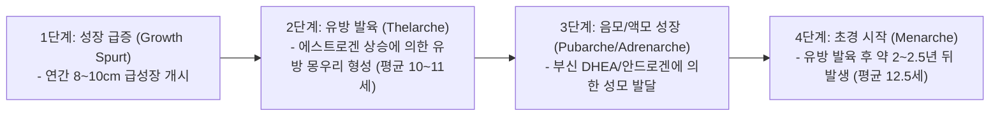
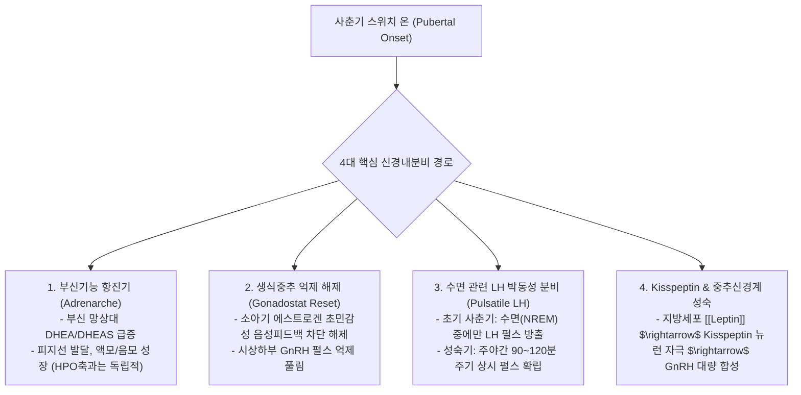
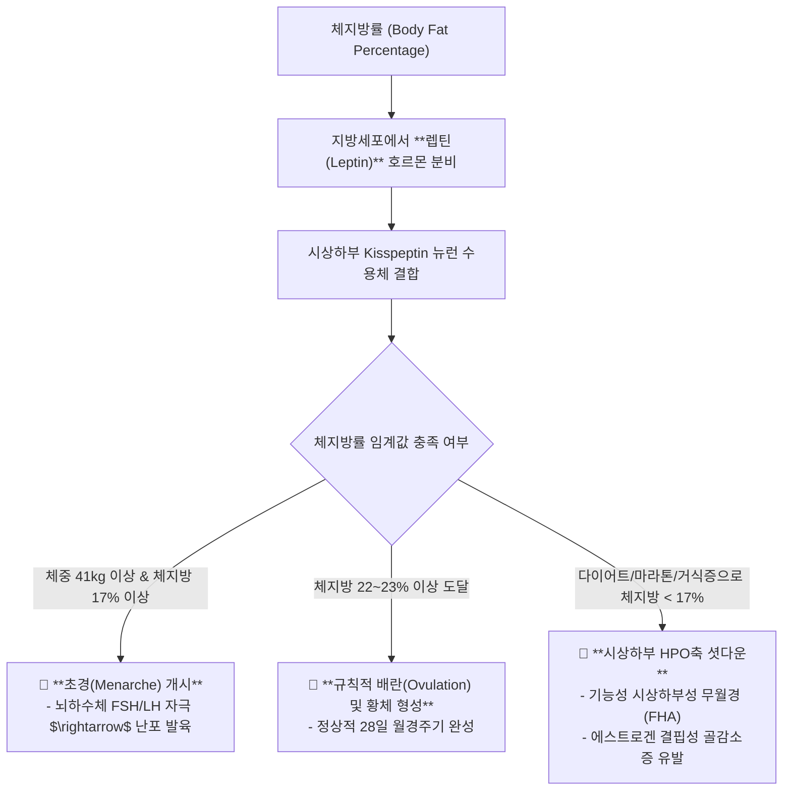

---
aliases:
  - 사춘기메커니즘
  - 정윤봉사춘기
  - HPO축성숙
  - 초경임계체중
  - 렙틴과사춘기
---
# 🩺 [[사춘기]](Pubertal Neuroendocrinology, HPO Axis Maturation & Critical Fat Mass)

> **핵심 요약 (Key Summary)**:
> 뇌 시상하부 GnRH 펄스 제너레이터 활성화와 **성장급증 $\rightarrow$ 유방발육(Thelarche) $\rightarrow$ 음모성장(Pubarche) $\rightarrow$ 초경(Menarche)**으로 이어지는 사춘기 발달 시퀀스를 총괄 분석하는 영역입니다.
> 부신기능항진(DHEA), 수면 중 LH 펄스성 분비, Kisspeptin/렙틴(Leptin) 신호 및 **초경 임계 체중(41kg, 체지방 17%)과 규칙적 배란 유지 체지방률(23%)**을 규명합니다.
> 소아 성조숙증(Precocious Puberty), 청소년 기능성 시상하부성 무월경(FHA), 극단적 다이어트성 월경불순 및 사춘기 감정 기복의 한의학적 치법을 확립합니다.

---

## 1. 사춘기 신체 발달의 4단계 표준 시퀀스 (Tanner Stages Sequence)

---

## 2. 사춘기 개시 4대 신경내분비 가설 및 메커니즘

---

## 3. 체중 및 체지방률과 생식능력의 상관관계 (Frisch 임계 체지방 가설)

### 📌 한국 여성 생식 임계 지표
* **초경 임계 체중**: **약 41~43 kg**
* **초경 필요 최소 체지방률**: **17 %**
* **배란성 월경 유지 최소 체지방률**: **22 ~ 23 %**

---

## 4. 실전 진료실 청소년 월경 장애 감별 및 치료

### 💡 1) 성조숙증 (Precocious Puberty)
* **진단 기준**: 여아 만 8세 미만, 남아 만 9세 미만에 2차 성징 출현.
* **병태생리**: 비만으로 인한 조기 렙틴/아로마타제 상승 및 HPO축 조기 각성 $\rightarrow$ 최종 성인 키 손실.
* **한방 치법**: 간화(肝火)를 식히고 습담을 배출 $\rightarrow$ [[지백지황탕]], [[시호청간탕]].

### 💡 2) 청소년 다이어트성 무월경 (Functional Hypothalamic Amenorrhea)
* **병태생리**: 극단적 굶기 다이어트, 스트레스로 체지방 17% 미만 추락 $\rightarrow$ GnRH 펄스 정지.
* **한방 치법**:
  * 1단계: 체중 복원 및 체지방률 22% 회복 티칭.
  * 2단계: 자궁과 난소 혈류를 데우고 기혈을 보충 $\rightarrow$ [[온경탕]], [[조경종옥탕]], [[귀비탕]].

---

## 🔗 관련 백링크 및 참고 문서
* **독립 임상 꿀팁**: [[ 사춘기 4단계 발달 시퀀스 & 초경 임계체중(41kg·체지방17%)과 시상하부성 무월경 치료 공식]]
* **임상 강의록 MOC**: [[00_강의록_MOC]]
* **연계 강의록**: [[성장]], [[월경]], [[성기 관련 질환]]
* **연관 처방**: [[온경탕]], [[귀비탕]], [[지백지황탕]]