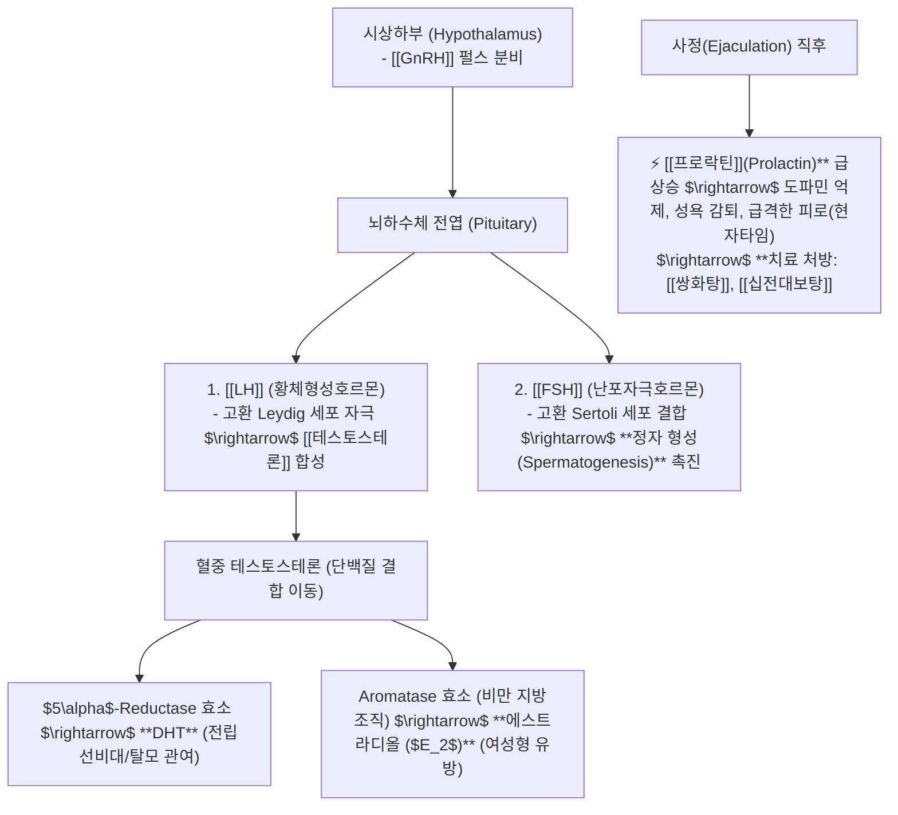
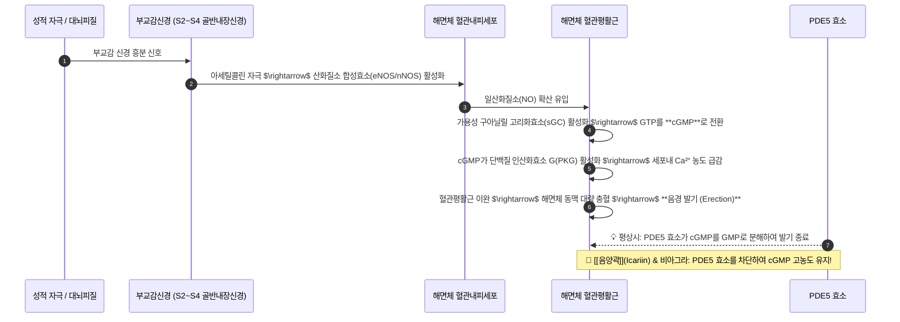
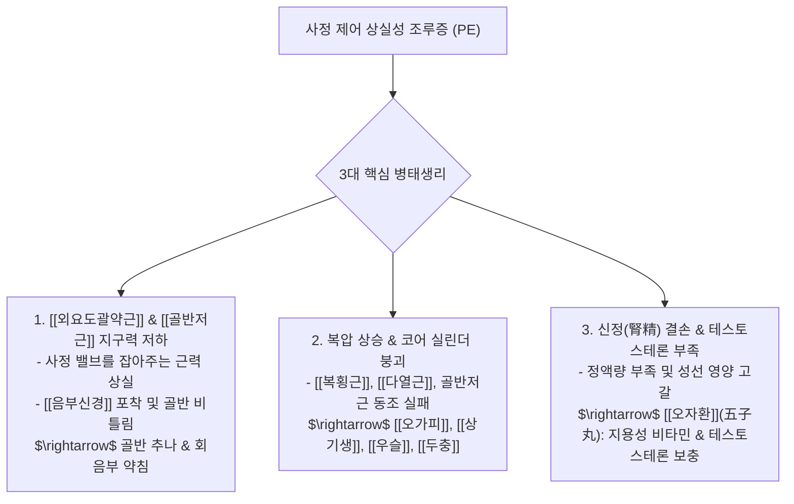

---
aliases:
  - 성기관련질환
  - 정윤봉성기질환
  - HPG축남성생식
  - 발기부전음양곽
  - 조루증골반저근오자환
---
# 🩺 [[성기 관련 질환]](Male Reproductive Endocrinology, Erectile cGMP Pathway & Ejaculatory Control)

> **핵심 요약 (Key Summary)**:
> 시상하부-뇌하수체-성선축(HPG Axis, Leydig세포 [[테스토스테론]] 및 Sertoli세포 정자형성)과 **부교감신경(S2~S4) 유래 NO-cGMP 혈관이완 발기 경로**를 총괄 분석하는 영역입니다.
> 사정 후 프로락틴(Prolactin) 급상승 피로, PDE5 효소를 천연 억제하는 [[음양곽]](Icariin)의 발기부전 분자약리 및 골반저근·[[음부신경]] 이완성 [[조루증]]을 규명합니다.
> 남성 갱년기 성욕저하(쌍화탕/십전대보탕), 발기부전(육미지황탕+우슬/두충/음양곽) 및 정소기능 감퇴성 조루증([[오자환]])의 임상 표적을 확립합니다.

---

## 1. 남성 시상하부-뇌하수체-성선축(HPG Axis) & 호르몬 대사

---

## 2. 음경 발기의 분자 생화학 메커니즘 (NO - cGMP Pathway)

---

## 3. 발기부전(ED)의 4대 한의 임상 치료 전략

1. **PDE5 효소 천연 차단 (cGMP 보존)**:
   * [[음양곽]](淫羊藿)의 지표성분인 이카린(Icariin) 및 노리카린(Noricariin)은 합성 비아그라(Sildenafil)와 동일하게 PDE5 효소를 선택적으로 억제하여 해면체 내 cGMP 농도를 지속시킴.
2. **복강 및 골반강 미세혈류 순환 촉진**:
   * 신장-골반-음경으로 이어지는 동맥 혈류량이 부족하면 cGMP가 생성되어도 충혈되지 않음 $\rightarrow$ [[육미지황탕]] + [[우슬]], [[두충]], [[음양곽]].
3. **일산화질소(NO) 기질 공급**:
   * [[L-아르기닌]](L-Arginine) 및 단백질 전구물질 보충.
4. **시상하부 HPG축 교감신경 긴장 완화**:
   * 만성 스트레스성 교감신경 항진(혈관 수축) 억제 $\rightarrow$ [[시호가용골모려탕]], [[귀비탕]].

---

## 4. 조루증(Premature Ejaculation)의 생체역학 3대 원인 및 [[오자환]] 처방

### 📌 신정 보충의 명방: [[오자환]](五子丸) 5대 약재
1. [[구기자]](枸杞子): Betaine, 지용성 카로티노이드 풍부 $\rightarrow$ 고환 세르톨리 세포 영양 공급.
2. [[토사자]](菟絲子): 플라보노이드 및 테스토스테론 생합성 전구체 활성화.
3. [[복분자]](覆盆子): 항산화 안토시아닌 $\rightarrow$ 정자 운동성 및 활력 증대.
4. [[사상자]](蛇床子): Osthole 성분 $\rightarrow$ 해면체 NO 방출 및 성선 호르몬 자극.
5. [[오미자]](五味子): Schisandrin 성분 $\rightarrow$ 사정 중추 수렴 및 강장 작용.

---

## 🔗 관련 백링크 및 참고 문서
* **독립 임상 꿀팁**: [[ 남성 HPG축·발기 NO-cGMP 경로 & 음양곽(Icariin PDE5 억제)과 오자환(五子丸) 조루·발기부전 치료 공식]]
* **임상 강의록 MOC**: [[00_강의록_MOC]]
* **연관 질환**: [[발기부전]], [[조루증]]
* **연관 본초**: [[음양곽]], [[구기자]], [[토사자]], [[복분자]], [[사상자]]
* **연관 처방**: [[육미지황탕]], [[쌍화탕]], [[십전대보탕]]