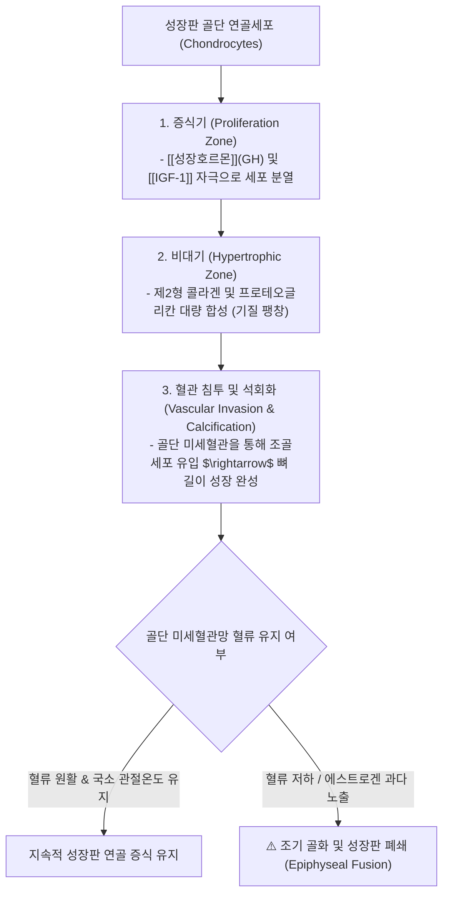
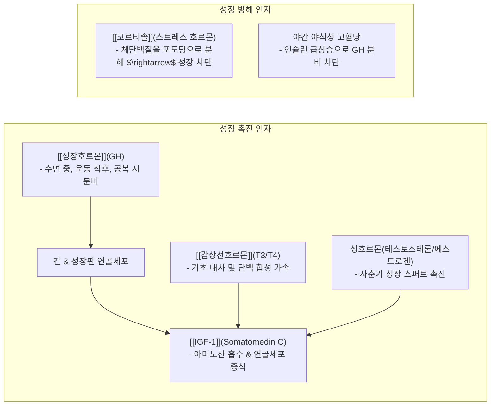

---
aliases:
  - 성장메커니즘
  - 정윤봉성장
  - GH_IGF1축
  - 녹용성장약리
  - 소아성장한약
---
# 🩺 [[성장]](Pediatric Growth Dynamics, GH-IGF-1 Axis & Epiphyseal Chondrogenesis)

> **핵심 요약 (Key Summary)**:
> 성장판 골단연골(Epiphyseal Cartilage)의 연골세포 분화, 콜라겐 합성 및 **골단 미세혈관망(Microvasculature)의 혈류 유지 기전**을 총괄 분석하는 영역입니다.
> 뇌하수체 성장호르몬(GH)과 간·성장판 연골의 [[IGF-1]] 분비 축, [[코르티솔]](단백분해)의 성장 억제 및 [[녹용]](IGF-1 촉진)·[[우슬]](골단 혈류량 증대) 분자약리를 규명합니다.
> 소아 저신장증, 성장판 조기 폐쇄 예방, 비만형(GH 저하·조기골화) vs 마른 허약형(소화흡수·IGF-1 저하) 맞춤 한약 처방 및 야간 공복 수면 티칭 표적을 확립합니다.

---

## 1. 키 성장의 3대 생체역학: 연골세포 분화와 골단 미세혈관

![[Pasted image 20240308023102.png]]
> [그림 설명: 성장판 연골세포의 휴지기 $\rightarrow$ 증식기 $\rightarrow$ 비대기 $\rightarrow$ 석회화 분화 단계]

![[Pasted image 20240308023543.png]]
> [그림 설명: 골단 미세혈관의 혈액 공급과 연골세포 영양 공급망]

---

## 2. 성장 조절 5대 호르몬 네트워크 (GH - IGF-1 Axis)

![[Pasted image 20240308023815.png]]
> [그림 설명: 시상하부 GHRH $\rightarrow$ 뇌하수체 GH $\rightarrow$ 간 IGF-1 분비 및 표적 조직 작용]

![[Pasted image 20240308024038.png]]
> [그림 설명: 영양, 운동, 수면, 호르몬이 상호작용하는 복합 성장 조절 축]

---

## 3. 한의 성장 치료의 2대 분자약리 메커니즘

### 💡 1) [[IGF-1]] 발현 촉진 및 조골세포 활성화: [[녹용]](鹿茸)
* **분자 기전**:
  * [[녹용]] 추출물(Ganglioside, Pantocrine)은 성장판 연골세포막의 IGF-1 수용체 발현을 상향 조절하고, 간 내 IGF-1 mRNA 합성을 촉진함.
  * 조혈 기능을 개선하고 조골세포(Osteoblast)의 알칼라인 포스파타제(ALP) 활성을 높여 뼈 기질 형성을 직접 가속화.

![[Pasted image 20240308025543.png]]
> [그림 설명: 녹용 추출물이 성장판 연골세포 증식 및 IGF-1 분비에 미치는 영향]

### 💡 2) 관절 국소 온도 및 말초 미세혈류 확장: [[우슬]](牛膝)·[[두충]](杜沖)·[[속단]](續斷)
* **분자 기전**:
  * 키 성장과 연골 재생 속도는 **성장판 하부의 모세혈관 혈류량과 비례**함.
  * [[우슬]], [[두충]], [[속단]]은 일산화질소(NO) 생성을 촉진하여 골단 연골판 주위의 미세혈관을 확장하고 관절강 온도를 높여 연골 조기 골화를 방지함.

![[Pasted image 20240308025658.png]]
> [그림 설명: 관절 국소 혈류량 및 온도 상승에 따른 연골 기질 합성 촉진]

---

## 4. 소아 체형별 2대 맞춤 성장 처방 공식

| 소아 체형 | 병태생리 핵심 기전 | 성장 저해 요인 | 1순위 치료 전략 및 대표 처방 |
| :---: | :--- | :--- | :--- |
| **비만형 소아** | 지방세포 과다로 **아로마타제 활성 $\rightarrow$ 에스트로겐 상승** | 성장호르몬(GH) 저하, **성장판 조기 융합 위험** | **체중 감량 및 습담 제거가 1순위** $\rightarrow$ [[육군자탕]] + [[의이인]], [[창출]], [[방풍]] (녹용 단독 투여 금기) |
| **마른 허약형 소아** | 비위 소화흡수 장애로 **단백질 및 IGF-1 합성 저하** | 영양 기질 부족, 잦은 감기, 수면장애 | **비위 보강 & IGF-1 분비 촉진** $\rightarrow$ [[보중익기탕]] / [[귀비탕]] + [[녹용]], [[우슬]], [[두충]] |

---

## 5. 실전 진료실 생활관리 및 운동·수면 티칭

1. **야간 공복 수면 티칭**:
   * 취침 2시간 전 야식 절대 금지 (식후 인슐린이 높으면 수면 중 성장호르몬 피크가 억제됨).
   * 밤 10시~새벽 2시 깊은 서파 수면(NREM) 유지.
2. **낮 시간 고유수용성 점핑 운동**:
   * 줄넘기, 농구, 트램펄린 등 성장판 수직 압박 자극 $\rightarrow$ 미세 손상 후 초과 회복 과정에서 GH/IGF-1 분비 증폭.

---

## 🔗 관련 백링크 및 참고 문서
* **독립 임상 꿀팁**: [[ 소아 성장판 미세혈관망 생리와 GH-IGF-1 축 & 녹용(鹿茸)·우슬(牛膝) 배오 및 비만형 vs 마른형 맞춤 성장 공식]]
* **임상 강의록 MOC**: [[00_강의록_MOC]]
* **연관 질환**: [[사춘기]], [[성장장애]]
* **연관 본초**: [[녹용]], [[우슬]], [[두충]], [[속단]]
* **연관 처방**: [[보중익기탕]], [[육군자탕]], [[귀비탕]]