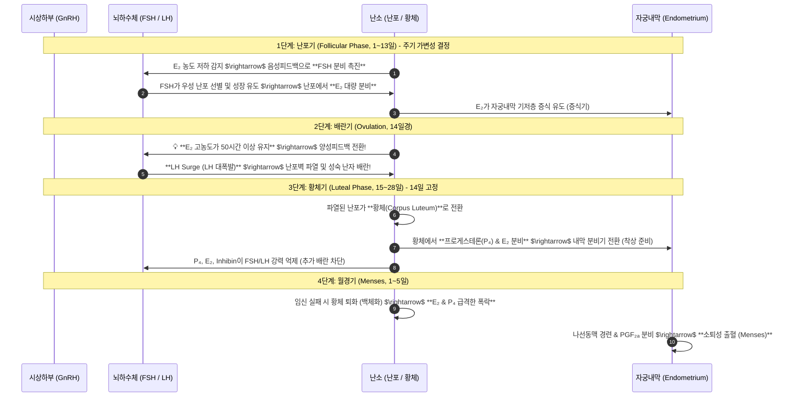
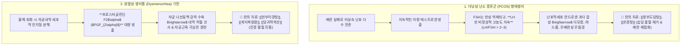

---
aliases:
  - 월경메커니즘
  - 정윤봉월경
  - HPO축월경주기
  - LHSurge조건
  - PCOS와생리통
---
# 🩺 [[월경]](Ovarian Menstrual Cycle, HPO Feedback Dynamics & Endometrial Physiology)

> **핵심 요약 (Key Summary)**:
> 난포기 $\rightarrow$ 배란기 $\rightarrow$ 황체기 $\rightarrow$ 월경기로 이어지는 **여성 HPO축의 에스트라디올($E_2$)-프로게스테론($P_4$)-FSH-LH 4대 호르몬 피드백 동역학**을 총괄 분석하는 영역입니다.
> 배란을 유도하는 **$E_2$ 50시간 유지성 양성피드백(LH Surge), 황체 퇴화성 소퇴성 출혈(Withdrawal bleeding)** 및 $PGF_{2\alpha}$ 자궁 연축성 생리통 기전을 규명합니다.
> 다낭성 난소 증후군(PCOS, LH/FSH 비율 역전), 황체기 결함성 부정출혈, 기능성 월경통 및 무배란성 월경불순의 한의학적 표적 처방을 확립합니다.

---

## 1. 여성 월경주기 4단계 호르몬 동역학 (Menstrual Cycle Timeline)

---

## 2. 월경주기 핵심 3대 생리학적 원칙

1. **월경주기 길이의 결정자: 난포기(Follicular Phase)**:
   * 배란 후 황체의 수명은 **14일로 거의 항상 일정하게 고정**되어 있음.
   * 생리 주기가 35일, 40일로 늘어나는 것은 전부 **난포 성장이 지연되어 난포기가 길어졌기 때문**임 (결국 난포의 $E_2$ 분비 활성도가 핵심).
2. **배란의 방아쇠: LH Surge의 절대 조건**:
   * 에스트로겐($E_2$) 농도가 200 pg/mL 이상의 고농도로 **최소 50시간 이상 지속 유지**되어야만 뇌하수체에서 LH 서지(대폭발)가 격발됨.
3. **월경의 본질**:
   * 수정란 착상이 이루어지지 않아 황체가 퇴화하며 나타나는 **$E_2$와 프로게스테론($P_4$) 결핍성 소퇴성 출혈(Withdrawal Bleeding)**.

---

## 3. 다낭성 난소 증후군(PCOS)과 생리통($PGF_{2\alpha}$) 병태생리

---

## 4. 실전 부인과 진료실 3대 핵심 처방 매핑

| 임상 질환 | 호르몬 및 병태 특성 | 한의 병리 | 대표 처방 및 배오 |
| :--- | :--- | :--- | :--- |
| **다낭성 난소 (PCOS)** | LH/FSH 비율 역전, 고안드로겐혈증 | 습담조체(濕痰阻滯), 자궁냉증 | [[창부도담탕]] + [[향부자]], [[창출]], [[반하]] |
| **원발성 생리통** | $PGF_{2\alpha}$ 과다, 자궁 평활근 경련 | 어혈(瘀血), 기체(氣滯) | [[현부이경탕]], [[계지복령환]] + [[현호색]], [[작약]] |
| **무배란성 월경불순** | 난포기 지연, $E_2$ 합성 저하, 저체중 | 기혈양허(氣血兩虛), 한응(寒凝) | [[온경탕]], [[조경종옥탕]] + [[당귀]], [[오수유]] |

---

## 🔗 관련 백링크 및 참고 문서
* **독립 임상 꿀팁**: [[ 여성 HPO축 4단계 호르몬 동역학(LH Surge 50시간) & PCOS(LH-FSH 불균형)와 생리통(PGF2a) 표적 처방 공식]]
* **임상 강의록 MOC**: [[00_강의록_MOC]]
* **연계 강의록**: [[사춘기]], [[성기 관련 질환]]
* **연관 처방**: [[온경탕]], [[창부도담탕]], [[현부이경탕]], [[계지복령환]]