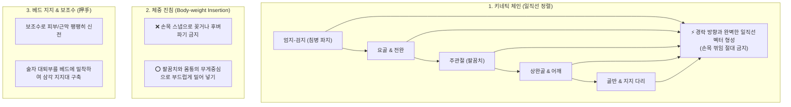

---
aliases:
  - 자침법
  - 정윤봉자침법
  - 무통자침생체역학
  - 압수와침관테크닉
---
# 🩺 [[자침법]](Acupuncture Needling Ergonomics, Kinetic Chain & Painless Insertion)

> **핵심 요약 (Key Summary)**:
> 손목 꺾임을 방지하고 [엄지·검지 $\rightarrow$ 요골 $\rightarrow$ 주관절 $\rightarrow$ 상완골 $\rightarrow$ 지지 다리]로 이어지는 **일직선 키네틱 체인(Kinetic Chain)과 체중 추진 자침 생체역학**을 총괄 분석하는 영역입니다.
> 게이트 컨트롤(Gate Control) 이론 기반의 침관 압박 무통 천침술, 보조수(押手)의 조직 고정과 **베드 허벅지 지지를 통한 술자 피로도 제로화 및 안정성 확보**를 규명합니다.
> 환자의 자침 통증 공포 완화, 근막 통과 감각(Paper-piercing) 감지 및 임상 원장의 일일 다빈도 자침 관절 보호의 표적 술기를 확립합니다.

---

## 1. 실전 자침의 7대 생체역학 원칙 (Needling Ergonomics)

---

## 2. 정윤봉 원장님의 7대 핵심 자침 노하우

### 💡 1) 망치질의 원리: 손목-팔꿈치-다리의 일직선화
* 자침은 망치로 못을 박는 것과 같다.
* **손목이 꺾이는 순간 침 첨단에 전달되는 힘의 벡터가 분산되어 환자에게 통증을 유발하고 침이 휘어버린다.**
* [침끝 $\rightarrow$ 침병 $\rightarrow$ 손가락 $\rightarrow$ 전완 $\rightarrow$ 팔꿈치 $\rightarrow$ 상완 $\rightarrow$ 지탱하는 다리]가 하나의 단단한 축을 이루어야 한다.

### 💡 2) 손목이 아닌 팔꿈치와 체중으로 진침
* 침은 억지로 꽂거나 후벼파는 것이 아니다.
* 손목 힘을 완전히 빼고, **팔꿈치와 어깨를 축으로 삼아 몸통의 무게중심을 살짝 실어주며 들어가는 손맛(Fascia 통과감)**을 느껴야 한다.

### 💡 3) 보조수(押手, Oshite)의 절대적 중요성
* 침을 쥐는 자수(刺手)보다 피부를 고정하고 장력을 조절하는 **보조수(押手)**가 자침의 성패를 90% 결정한다.
* 보조수로 혈자리 주변 근육을 지그시 눌러 고정함으로써 목표 심도까지 흔들림 없이 직진할 수 있다.

### 💡 4) 베드에 허벅지를 기대는 안정성 확보
* 하루 수십 명의 환자를 자침하는 원장의 허리와 손목 관절을 보호하는 최고의 비기.
* **침대(Bed) 측면에 술자의 대퇴부(허벅지)를 안정적으로 기대어 체중을 지지**하면, 상체와 손끝의 미세 떨림이 사라지고 완벽한 안정성을 확보할 수 있다.

### 💡 5) 침관(Guide Tube) 무통 타격의 비밀
* 침병을 때리는 것이 아니라, **침관(플라스틱 튜브)을 피부에 꾹 눌러 통각 신경의 역치를 올린 상태에서 침관 상단을 톡 가볍게 탭(Tap)**해야 한다.
* 게이트 컨트롤(Gate Control) 기전에 의해 환자는 찌르는 통증을 전혀 느끼지 못한다.

### 💡 6) 시즈탱크(Siege Tank) 금지: 동적 포지셔닝
* 한자리에 고정되어 몸을 무리하게 비틀며 침을 놓지 않는다.
* 각 혈자리와 경락 주행 방향에 맞춰 **놓기 가장 편안하고 일직선 벡터가 나오는 위치로 술자가 민첩하게 이동(Footwork)**해야 한다.

### 💡 7) 근막 감각(De-qi) 감지
* 피부를 뚫을 때는 무통, 피하를 지나 근막(Fascia)에 닿을 때는 **'팽팽한 종이를 뚫고 들어가는 느낌(Paper-piercing)'**, 심부 근육층에 도달했을 때는 **'물고기가 낚싯바늘을 무는 듯한 뻐근한 그립감(Fish biting)'**을 정확히 감지한다.

---

## 🔗 관련 백링크 및 참고 문서
* **독립 임상 꿀팁**: [[ 실전 무통 자침의 생체역학(키네틱 체인) & 압수(押手)·침관 타격 및 체중 진침 테크닉]]
* **임상 강의록 MOC**: [[00_강의록_MOC]]
* **연계 강의록**: [[골격근 메커니즘]], [[근골격계 강의]]